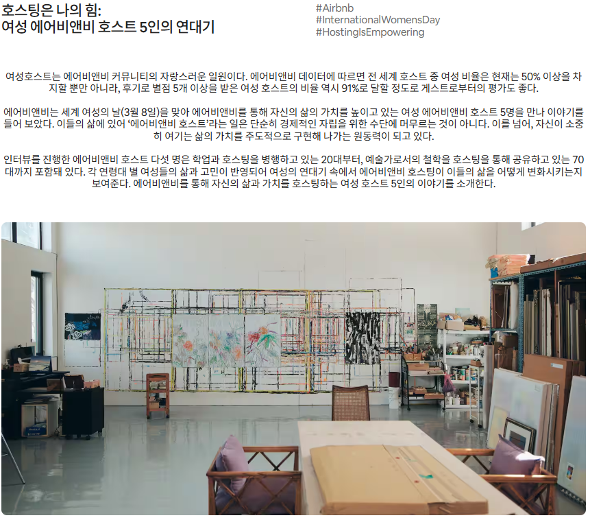
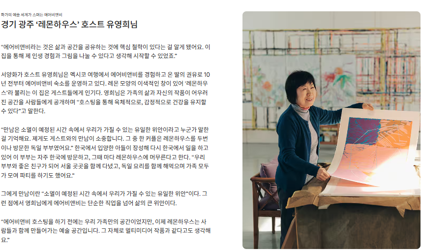
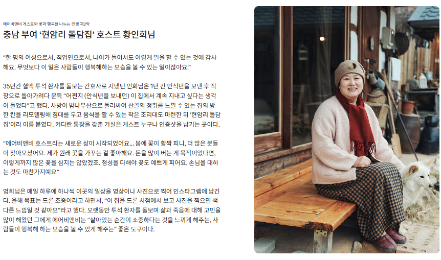
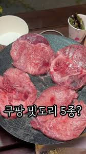
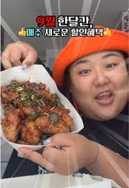

## ✨ 타사 바이럴 마케팅 레퍼런스 서치

2025년에 실제로 성공적인 결과를 이끈 바이럴 마케팅 사례를 유형별로 정리했습니다.  
이 사례들은 1인 창업자 및 스타트업도 **저비용 고효율 전략**으로 활용해 볼 수 있는 **현실적인 모델**입니다.

---

## 💰 실질적인 이득을 제공한 사례

### 1. 🏡 에어비앤비 – ‘호스트 이야기’ 감성 콘텐츠 캠페인

- **전략:** 호스트들의 실제 이야기를 감성 다큐 형식으로 콘텐츠화
- **채널:** 유튜브, 트위터, 인스타그램 등 다채널 확산
- **성과:** 플랫폼 방문자 수 증가, 예약 전환율 상승
- **특징:** 감성 마케팅 + 실제 사용자 중심 스토리텔링

---

### 2. 🧠 펩시 – AI 이미지 챌린지 캠페인

- **전략:** 사용자가 AI로 만든 이미지를 SNS에 공유하도록 유도
- **성과:** 브랜드 인지도 및 사용자 참여율 급상승
- **특징:** 참여형 콘텐츠로 자발적 확산 유도

---

## 😂 순수 재미를 제공한 사례

### 1. 🧑‍🎓 AI 이어북, AI 프로필 필터 유행 캠페인

- **전략:** AI가 자동 생성하는 고품질 콘텐츠 제공 (사진 기반)
- **성과:** 일반 사용자부터 유명인까지 SNS 인증샷 대거 확산
- **특징:** 재미 요소 중심의 콘텐츠 바이럴

---

### 2. 🍔 쿠팡이츠 – ‘쿠하하 챌린지’ 틱톡 바이럴

- **전략:** 배달 상황을 짧은 코미디 영상으로 표현한 챌린지 운영
- **성과:** 70만 건 이상의 영상 업로드, Z세대 중심 입소문 유도
- **특징:** 저비용으로 유저 참여 콘텐츠 확보

---

## 🎁 로열티 제공 사례

### 1. 💚 네이버 x 넷플릭스 제휴 프로그램

- **전략:** 양사 고객 기반 교차 프로모션
- **성과:** 신규 가입자 유입 및 충성도 증가
- **특징:** 브랜드 간 윈윈 협업 마케팅

---

### 2. 🚙 볼보자동차코리아 – ‘Hej, Familj’ 프로그램

- **전략:** 가족 중심 가치 기반 특별 프로그램 제공 (럭셔리 숙소, 체험)
- **성과:** 브랜드 충성도 상승, 고급 이미지 강화
- **특징:** 감성과 프리미엄 경험 결합

---

## 🔥 인싸가 되고 싶은 트렌드 쫓기 사례

### 1. 🧑‍💼 MZ 공무원 유튜브/인스타 채널

- **전략:** 젊고 트렌디한 공무원 콘텐츠 중심 운영
- **성과:** 재미와 소통 중심 콘텐츠로 대중적 관심 유도
- **특징:** 공공 부문도 SNS 브랜딩 시대

---

### 2. 📚 네이버 웹툰 ‘퀸네버크라이’ 밈 바이럴

- **전략:** 웹툰 속 밈을 중심으로 SNS 확산
- **성과:** 신규 가입자 유입 및 광고 수익 증가
- **특징:** 콘텐츠 밈 활용한 글로벌 바이럴

---

## 🏆 베스트 사례: 에어비앤비 ‘호스트 이야기’

 


- **선정 이유:**  
  감성 콘텐츠로 사용자 감정을 자극하며 신뢰 형성과 브랜드 충성도 확보  
  실질적인 예약 증가 등 매출 기여도 탁월  
  단순 광고가 아닌 **'사람 중심 스토리텔링'**의 성공 사례

---

## 💸 가장 저비용 사례: 쿠팡이츠 ‘쿠하하 챌린지’





- **선정 이유:**  
  짧은 영상 콘텐츠 중심으로 제작 부담 ↓  
  유저가 직접 콘텐츠 생산 → 확산력 극대화  
  1인 창업자가 **틱톡 챌린지** 방식으로 쉽게 응용 가능

---

## ✅ 마무리: 1인 창업자를 위한 인사이트

이들 마케팅 사례는 단순히 대기업에만 해당되는 것이 아닙니다.  
**아이디어 + 디지털 도구 + 소통 전략**만 있으면 누구나 바이럴 마케팅에 도전할 수 있습니다.

- 콘텐츠 제작 AI 툴, 이미지 생성기, 무료 영상 편집 도구 활용
- SNS 알고리즘과 유저 심리 이해
- 감성, 재미, 참여, 충성도, 트렌드 중 한 가지 이상 공략하기

---

```toc

```
