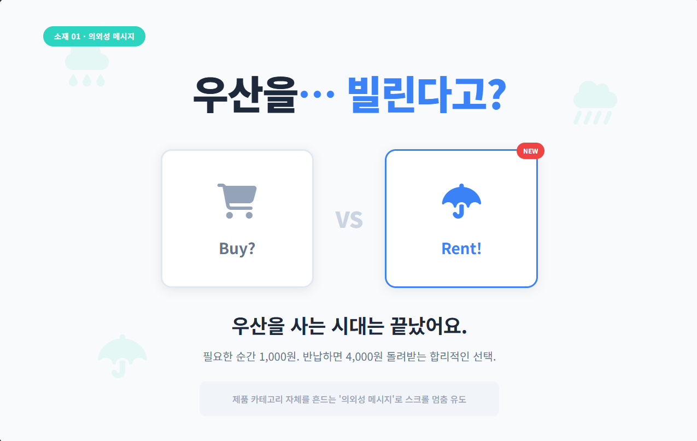
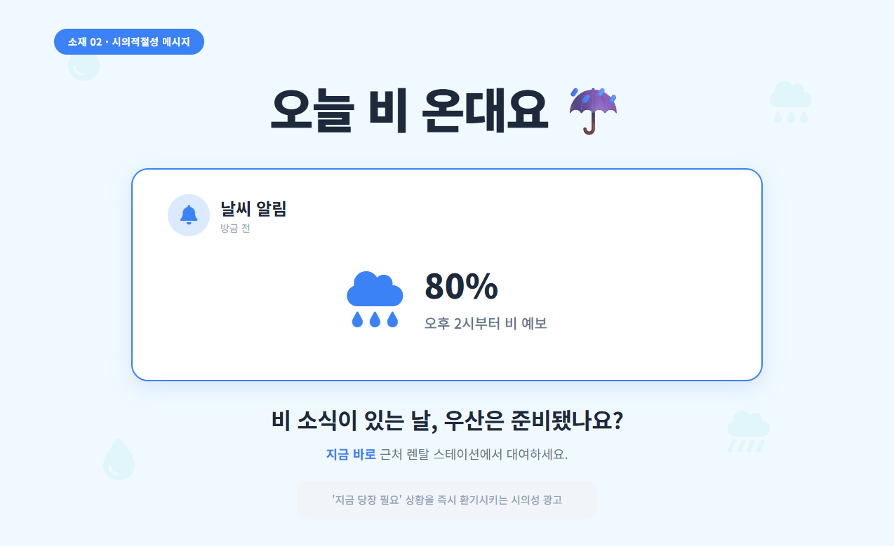
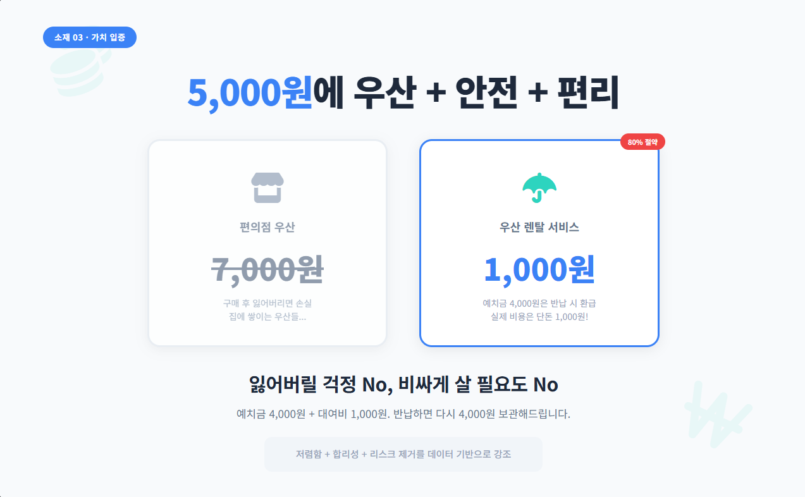
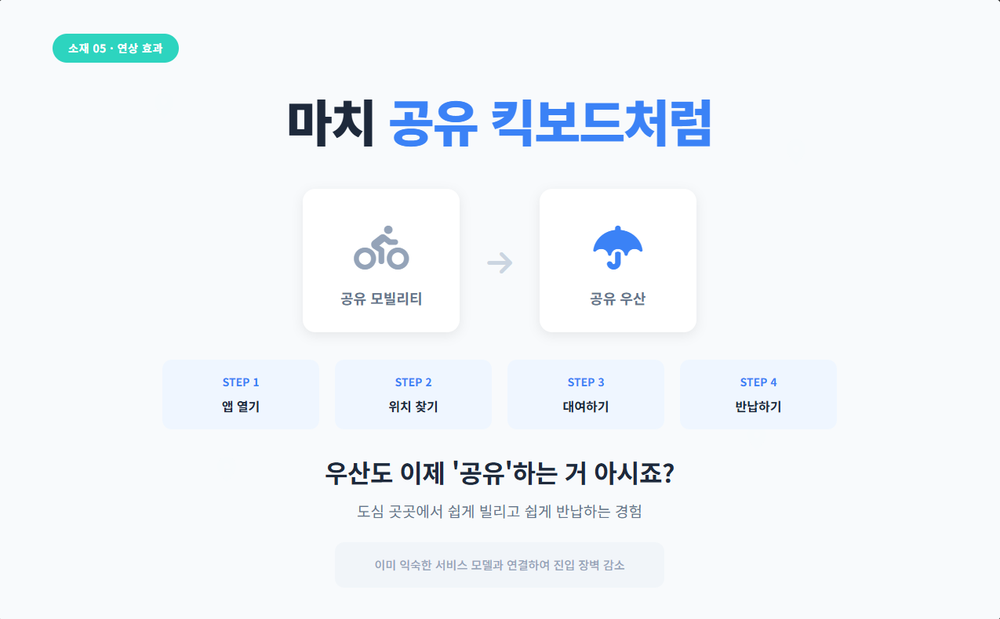
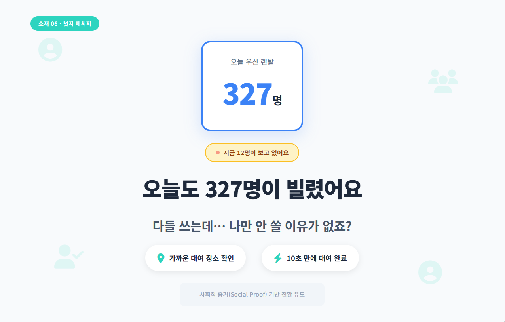
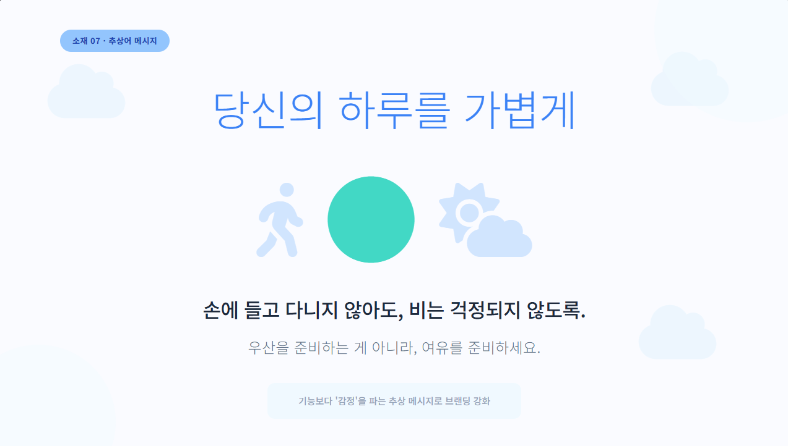

## ✨ 왜 광고 소재 6종이 필요한가?

우산 렌탈 서비스는 **날씨라는 ‘변수’ 위에서 움직이는 비정형 소비**입니다.  
즉, 고객은 평소에는 관심이 없지만, **비가 오는 순간 갑자기 행동하는 특징**을 가지고 있습니다.

이런 서비스에서는 하나의 광고 메시지로는 모든 고객을 설득할 수 없습니다.  
그래서 **의외성 / 시의 적절성 / 가치 입증 / 연상 효과 / 넛지 / 추상적 메시지**  
6가지 원칙에 따라 서로 다른 설득 포인트를 가진 광고 소재가 필요합니다.

아래는 실제 페이스북·인스타그램 광고 포맷을 기준으로 제작한  
**6종 광고 크리에이티브 기획안**입니다.

---

## ☔ 광고 소재 1 : 의외성 — “우산을… 빌린다고?”

### 💬 대표 카피
> “우산을 사는 시대는 끝났어요.”

### 🌧️ 콘셉트
- *구매*가 당연했던 카테고리를 뒤집는 메시지
- ‘우산을 빌린다’는 발상의 전환을 통해 즉각적 관심(스크롤 스톱) 유도

### 🎨 비주얼 아이디어
- Buy? vs Rent? 대비되는 화면
- 편의점 앞에서 망설이는 사람 실루엣
- 미니멀한 블루 톤 감성

### 🎯 전달 포인트
- **새로운 방식**이라는 인지 전환 → 호기심 자극

---

## ☔ 광고 소재 2 : 시의적절성 — “오늘 비 온대요”

### 💬 대표 카피
> “지금 비 소식 있어요. 우산 준비되셨나요?”

### 🌧️ 콘셉트
- 날씨, 즉 **오늘의 상황**에 기반한 즉시성 높은 광고
- 비가 오는 날/오기 직전에 유입률 극대화

### 🎨 비주얼 아이디어
- 레이더 이미지
- 날씨 푸시 알림 UI 디자인
- 파란 비구름 그래픽

### 🎯 전달 포인트
- “지금 필요하다”는 긴급성 → 즉시 행동 촉진

---

## ☔ 광고 소재 3 : 가치 입증 — “5,000원에 우산 + 안전 + 편리”

### 💬 대표 카피
> “예치금 4,000 + 대여비 1,000원.  
반납하면 다시 4,000원이 돌아옵니다.”

### 🌧️ 콘셉트
- 편의점 우산 7,000원 대비 **가성비 최고임을 데이터로 증명**

### 🎨 비주얼 아이디어
- 가격 비교 그래프
- “우산 잃어버리면 0원 손실!” 메시지
- 심플한 테이블 UI

### 🎯 전달 포인트
- **경제성 + 합리성** → 설득 성공률 증가

---

## ☔ 광고 소재 4 : 연상 효과 — “공유 킥보드처럼”

### 💬 대표 카피
> “우산도 이제 ‘공유’하는 거 아시죠?”

### 🌧️ 콘셉트
- 이미 익숙한 공유 킥보드/자전거의 UX를 차용
- 사용법 이해가 빠르게 이뤄짐

### 🎨 비주얼 아이디어
- 지도 기반 반납/대여 UX
- 공유 킥보드 UI를 우산 아이콘으로 대체
- 심플한 일러스트 스타일

### 🎯 전달 포인트
- **새로운 서비스 → 익숙한 느낌**으로 장벽 제거

---

## ☔ 광고 소재 5 : 넛지 — “오늘 327명이 빌렸어요”

### 💬 대표 카피
> “가까운 곳에서 지금 12명이 보고 있어요.”

### 🌧️ 콘셉트
- 사회적 증거(Social Proof)를 활용한 넛지 기반 설득
- “다른 사람도 사용한다”는 정보가 행동으로 이어짐

### 🎨 비주얼 아이디어
- 실시간 카운터
- “지금 인기 급상승!” 라벨
- 붐업 애니메이션 느낌

### 🎯 전달 포인트
- **남들도 쓰는 중**이라는 정보 → 유입률 증가

---

## ☔ 광고 소재 6 : 추상적 감성 — “당신의 하루를 가볍게”

### 💬 대표 카피
> “우산을 준비하는 게 아니라, 여유를 준비하세요.”

### 🌧️ 콘셉트
- 기능보다 ‘감정’에 초점을 맞춘 감성 마케팅
- 브랜드 이미지 향상 + 호감도 상승

### 🎨 비주얼 아이디어
- 흐린 날씨 후 맑아지는 하늘
- 빗방울 애니메이션
- 여백 많은 미니멀한 레이아웃

### 🎯 전달 포인트
- **브랜딩 효과 + 감성 자극**

---

## 🏆 결론: 고객의 상황별 니즈를 해결할 때 전환이 일어난다

6가지 광고 소재는 각각 다른 고객의 심리를 건드립니다.

✔ 의외성 → 스크롤 멈춤  
✔ 시의적절성 → 즉시 행동  
✔ 가치 입증 → 합리적 설득  
✔ 연상 효과 → 이해도 높임  
✔ 넛지 → 사회적 신뢰  
✔ 추상 감성 → 브랜드 호감 상승

우산 렌탈처럼 **‘상황 기반 소비’ 서비스는 다양한 메시지가 필요**합니다.  
하나의 크리에이티브만으로는 모든 고객을 설득할 수 없기 때문입니다.

이 6종 광고 소재는  
앞으로 **페이스북·인스타·틱톡·유튜브 숏폼 광고 제작의 기본 틀**이 될 수 있습니다.

---

## 📌 창업자를 위한 인사이트

- 광고 집행은 **비 소식 기준, D-1~D-Day** 타이밍이 가장 효과가 높음
- 도시는 **지하철역·대학·카페·아파트 단지** 중심으로 타깃 반응 상승
- 예치금 구조는 고객에게 ‘안전한 사용 경험’을 줘 장벽을 낮춤
- 콘텐츠는 **감성·실용·긴급성·공유 경험**을 모두 포함하면 성과가 좋음
- 하나의 메시지보다 **6종 세트 캠페인이 전환률을 더 높임**

---
```toc

```