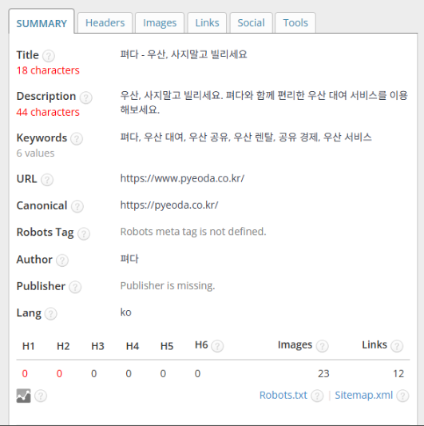
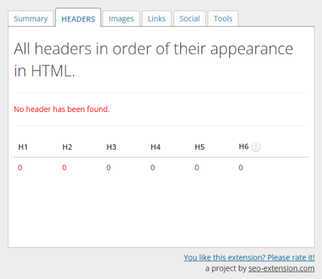
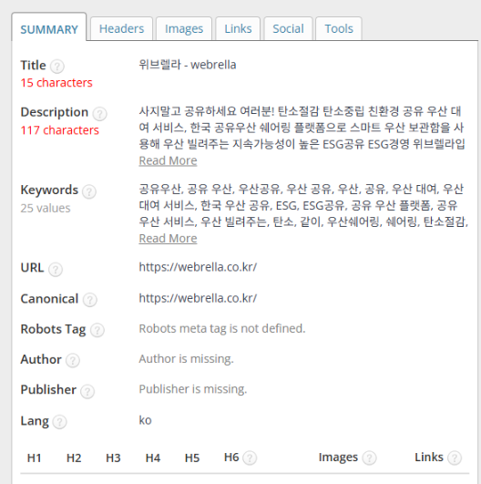
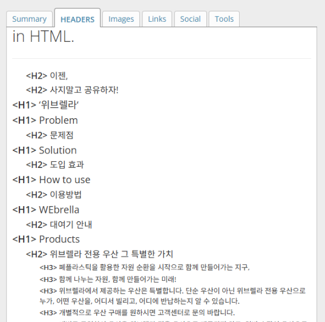
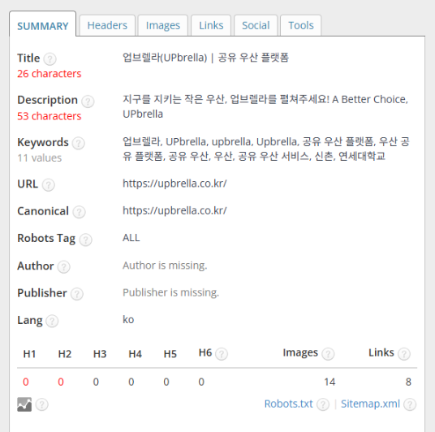
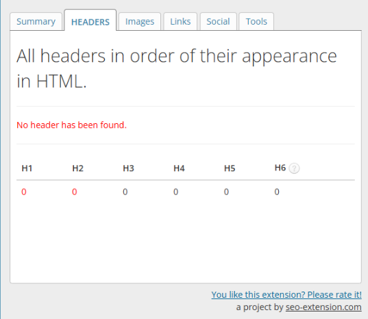

## ✨ 왜 SEO 비교 분석이 필요할까?

공유 우산 플랫폼은 비교적 새로운 시장입니다.  
하지만 경쟁은 이미 치열하며, **검색에서 먼저 보이는 브랜드가 사용자 선택을 독점**할 수 있습니다.

특히 우산은 '비 오는 날 갑자기 필요'하기 때문에  
**검색 노출이 곧 트래픽 → 이용률 → 수익**으로 연결됩니다.

이번 글에서는 세 개의 주요 공유 우산 브랜드인  
**위브렐라, 엄브렐라, 펴다**의 웹사이트 SEO 구조를 분석하여  
**누가 더 노출에 강하고, 무엇을 개선해야 하는지** 비교했습니다.

---

## 🔍 1. 펴다(PYEODA) — 기본은 있지만 구조 부족





### ✅ 요약 분석

| 항목 | 결과 | 평가 |
|------|------|------|
| Title | `"펴다 - 우산, 사지말고 빌리세요"` (18자) | ⚠️ 짧고 브랜드 중심, 키워드 반영 부족 |
| Meta Description | `"펴다와 함께 편리한 우산 대여 서비스"` | ⚠️ 기능성 강조는 OK, 검색 유입력은 낮음 |
| Keywords | 6개 설정 | ✅ 핵심 키워드는 반영됨 |
| Header(H1~H6) | 0개 사용 ❌ | 매우 심각한 구조 부재 |
| Robots/Publisher | 미설정 | ⚠️ 기술적 SEO 미흡 |
| 이미지/링크 | 23개 / 12개 | ✅ 콘텐츠는 시각적으로 풍부함 |

---

## ☂️ 2. 위브렐라(Webrella) — 헤딩은 있으나 중복과 난잡함


### ✅ 요약 분석

| 항목 | 결과 | 평가 |
|------|------|------|
| Title | `"위브렐라 - webrella"` (15자) | ⚠️ 너무 짧음, 검색 유입 설계 부족 |
| Meta Description | `"탄소절감 공유 우산 서비스…" (117자)` | ✅ 친환경 키워드 포함, 다소 장문 |
| Keywords | 25개 설정 | ✅ 풍부하지만 과잉 감 있음 |
| Header(H1~H6) | H1 6개, H2 8개 사용 | ⚠️ **H1 다중 사용은 SEO 측면에서 치명적** |
| Robots/Publisher | 미설정 | ⚠️ 마찬가지로 기술적 세팅 미비 |
| 이미지/링크 | 20개 / 13개 | ✅ 콘텐츠 양호, 정리 필요 |

### 📌 문제점
- H1을 너무 많이 사용해 **검색엔진이 주제를 혼란스러워함**
- 구조는 있으나 **일관성 없는 정보 계층 구조**

---

## 🌱 3. 엄브렐라(UPbrella) — 깔끔하지만 구조 미작성


### ✅ 요약 분석

| 항목 | 결과 | 평가 |
|------|------|------|
| Title | `"엄브렐라(UPbrella) | 공유 우산 플랫폼"` (26자) | ✅ 브랜드 + 키워드 조합 우수 |
| Meta Description | `"지구를 지키는 작은 우산..."` (53자) | ✅ 감성+가치 제안 적절 |
| Keywords | 11개 설정 | ✅ 과하지 않게 명확함 |
| Header(H1~H6) | 없음 ❌ | **구조 전무**, 펴다와 유사한 약점 |
| Robots | 설정됨 (`ALL`) | ✅ SEO 의지 표현은 긍정적 |
| 이미지/링크 | 14개 / 8개 | ⚠️ 콘텐츠는 부족한 편, 구조화 필요

---

## 🧾 세 브랜드 SEO 점수표 (30점 만점)

| 브랜드 | Title (5) | Description (5) | Keywords (5) | Header 구조 (10) | 기술 설정 (5) | 총점 |
|--------|-----------|-----------------|--------------|------------------|----------------|--------|
| **펴다** | 3 | 3 | 4 | **0** | 2 | **12 / 30** |
| **위브렐라** | 2 | 4 | 5 | **5** (구조는 있으나 중복 문제) | 2 | **18 / 30** |
| **엄브렐라** | 5 | 4 | 4 | **0** | 4 | **17 / 30** |

---

## 🧭 개선 전략 요약

| 항목 | 펴다 | 위브렐라 | 엄브렐라 |
|------|------|----------|----------|
| Title/Description | 키워드 포함 필요 | 글자 수 조절 | 잘 구성됨 |
| Header 구조 | **전무 → 반드시 추가** | **H1 중복 제거 필요** | **구조화 필수** |
| 기술 SEO (robots/meta) | 설정 필요 | 설정 필요 | **일부 설정됨 (긍정적)** |
| 콘텐츠 개선 | 시각적 요소 양호 | 풍부하지만 분산됨 | 다소 빈약함 |

---

## 🏁 결론: SEO는 "보여지는 전략"이다

검색에서 안 보이면, 아무리 좋은 서비스도  
**고객은 존재 자체를 모릅니다.**

공유 우산 시장이 이제 막 뜨기 시작하는 지금,  
**검색 최적화는 단순 기술이 아니라 생존 전략**입니다.

- Title과 Description은 키워드+고객 의도 중심 재작성
- H1~H3 태그로 콘텐츠를 **정보 계층화**
- Robots, Canonical, Publisher 등 **기본 메타 설정 마무리**
- 이미지 alt, 링크 구조도 정비하여 UX/SEO 모두 강화

---
```toc

```

