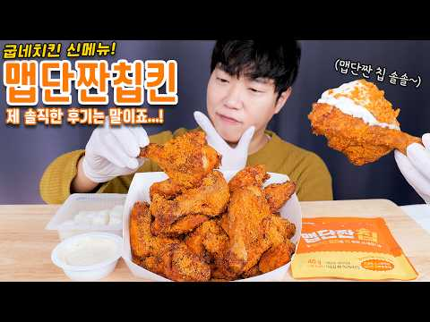
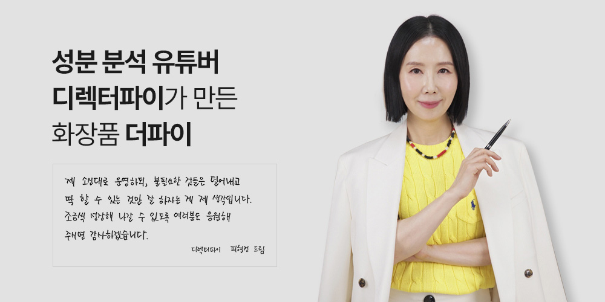
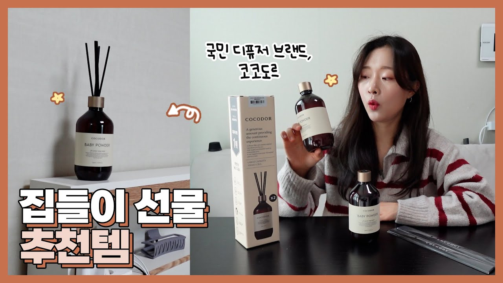
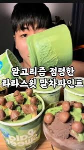
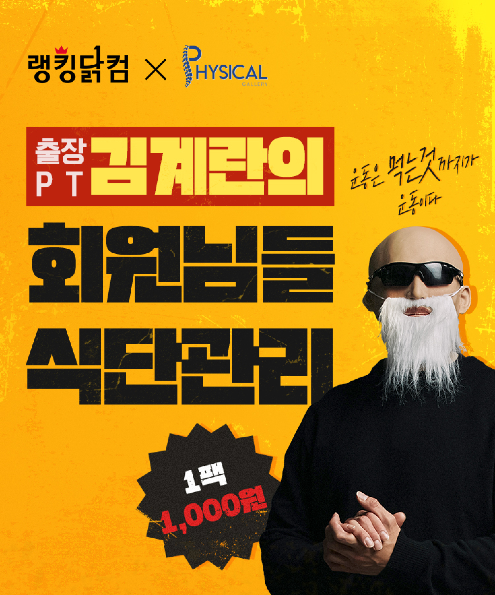

## ✨ 왜 인플루언서와 ‘깊은 협업’이 중요할까?

최근 인플루언서 마케팅은 **단순 홍보(협찬/광고)**를 넘어
제품 기획, 콘텐츠 개발, 판매 운영, 심지어 **지분·수익쉐어까지 포함되는 구조**로 진화하고 있습니다.

특히 스타트업은 수천만 원의 광고비를 지출하기 어려워
**“0원 광고 + 수익쉐어” 모델**이 가장 현실적인 대안이 됩니다.

그래서 이번 글에서는 **단순 홍보가 아닌 깊은 협업으로 성과를 만든 5가지 실제 사례**를 분석합니다.

---

# 🏆 1. 굽네치킨 × 외식업 유튜버 ‘홍사운드’
> “메뉴 공동 개발 → 품절 대란 → 첫 주 10억 매출”


### 🔧 인플루언서 역할
- 신메뉴 개발 참여 (맛·컨셉·비주얼)
- 유튜브 콘텐츠 제작 + 먹방 리뷰
- 개인 브랜드 감성 적용 → MZ 취향 저격

### 🏢 기업 역할
- 메뉴 실 제조 / R&D / 물류
- 오프라인 매장 전개
- 대규모 프로모션 및 광고 지원

### 📈 성과
- **출시 일주일 내 판매량 35만 개**
- **초기 매출 약 10억 규모 추정**
- SNS에서 “홍사운드 메뉴”로 바이럴 확산

### 💰 수익쉐어 추정
- 인플루언서 R&D 기여도 높음  
  → **매출의 1.5~3% 로열티** 가능
- 굽네는 전국 체인망이므로 ‘메뉴 로열티 모델’ 구조와 유사

---

# 🏆 2. 올리브영 × 디렉터 파이(피현정)
> “전문가 신뢰 + 성분 분석 → 제품 단종의 위기에서 매출 역전”


### 🔧 인플루언서 역할
- 제품 성분 재검토
- 개선 포인트 제안
- “피부타입별 추천” 콘텐츠로 신뢰 기반 판매

### 🏢 기업 역할
- 리뉴얼 제품 출시
- 대규모 유통망 제공
- 공식 연동 프로모션 진행

### 📈 성과
- 특정 스킨/클렌징 제품 **판매량 3배 증가**
- 검색량·구매 전환 모두 상승
- 브랜드 신뢰도 강화

### 💰 수익쉐어 추정
- 콘텐츠 직접 제작 + 전문성 기여도 높음  
  → **매출 2~4% 수준 로열티** 추정

---

# 🏆 3. 코코도르 × 집들이 유튜버 ‘혜인’
> “전 제품 공동 패키징 → 월 매출 4억 달성”


### 🔧 인플루언서 역할
- 패키지 디자인 직접 참여
- “집 꾸미기” Vlog에서 자연스럽게 제품 노출
- 팬층 기반 공동 구매 진행

### 🏢 기업 역할
- 제조·패키징·물류
- 올리브영 입점 전략 세팅
- 광고소재 제작 및 공식 협업

### 📈 성과
- 단독 패키지 라인 **초기 매출 4억+ 달성**
- 온라인몰 베스트 랭킹 진입

### 💰 수익쉐어 추정
→ 디자인/브랜딩 기여도 높음  
→ **판매마진 7~10% 수익 분배 가능**

---

# 🏆 4. 라라스윗 × 피트니스 인플루언서 ‘말왕’
> “프로틴 아이스크림 공동 개발 → 헬스 커뮤니티 대히트”


### 🔧 인플루언서 역할
- 칼로리/단백질 스펙 개발 자문
- 유튜브·인스타에서 제품 활용 콘텐츠
- 헬스 커뮤니티 확산 주도

### 🏢 기업 역할
- 레시피 개발 + 맛 조정
- 유통·판매 채널 확보
- 전 제품군 프로모션 연계

### 📈 성과
- 초도물량 **5만 개 완판**
- 단백질 아이스크림 시장 성장 기여

### 💰 수익쉐어 추정
→ 헬스 커뮤니티 파급력 강함  
→ **매출 5% 내외 공동 개발 로열티** 현실적

---

# 🏆 5. 랭킹닭컴 × PT 유튜버 ‘피지컬갤러리’
> “식단·운동 결합형 브랜드 협업 → 먹방형 광고보다 높은 전환”


### 🔧 인플루언서 역할
- 실제 식단 구성 기획
- 운동 루틴과 연계된 콘텐츠 제작
- 팬층 기반 구매 행동 유도

### 🏢 기업 역할
- 상품화 및 패키징
- 공식몰 대규모 할인 운영
- 고객 유지 전략 세팅

### 📈 성과
- 협업 제품군 기준 **월 20억 매출 기여**
- 장기 콜라보로 지속 매출 발생

### 💰 수익쉐어 추정
→ 지속 콜라보 = 높은 팬덤 가치  
→ **판매가 5~8% 수익쉐어** 추정

---

# 🧠 종합 분석: 깊은 협업은 이렇게 작동한다

| 요소 | 설명 |
|------|------|
| **전문성 기반 참여** | 맛·성분·체험 등 실제 개발 협업이 성과 높음 |
| **인플루언서 세계관 반영** | 단순 광고보다 ‘팬들이 좋아할 방식’으로 기획 |
| **지속 가능한 수익 모델** | 1회성 광고보다 로열티 수익쉐어가 양쪽 모두 윈윈 |
| **팬덤의 소비력 활용** | 실구매 전환율이 일반 광고 대비 3~7배 |

---

# 📌 초기 협업 제안하고 싶은 인플루언서 리스트 5명

우산 공유 플랫폼 기준(Pyeoda/Webrella/Upbrella 기준)으로 선정했습니다.

| 인플루언서 | 이유 | 분야 |
|-----------|------|-------|
| **1) 빠더너스 (출근길 브이로그)** | 출근러 타깃 정확 | 라이프스타일 |
| **2) 아무튼출근 PD/브이로거** | 출퇴근 수요와 가장 밀착 | 직장인 |
| **3) 서울버스/지하철 리뷰 운영 채널** | 비 오는 날 조회수 상승 | 로컬 정보 |
| **4) 신사임당(사업가)** | 공유경제·새로운 구독 모델 관심 | 비즈니스 |
| **5) 1일1깡 생활 브이로그러** | 일상 속 작은 솔루션 소개 전문 | Vlog |

---

# 💼 초기 제안서(샘플) — “수익쉐어 기반 0원 협업 모델”

## 1) 제안 구조
- **고정 광고비 0원**
- **매출 또는 대여 횟수 기반 수익쉐어**

## 2) 인플루언서 역할
- 우산 렌탈 사용 후기 콘텐츠 2~4개 제작
- 출근길/퇴근길 활용 브이로그 연출
- “비 오는 날 움직이는 꿀팁” 테마 콘텐츠 고정 노출
- 브랜드 캐릭터/메시지 공동 개발 가능

## 3) 기업 역할
- 우산 렌탈 단가·구독 매출 데이터 제공
- 인플루언서 전용 무료 이용권 제공
- 촬영 지원 + 인포그래픽 제작
- 전용 프로모션 페이지 제공

## 4) 수익쉐어 제안
| 항목 | 제안율 |
|------|---------|
| 신규 가입자 | **1인당 1,500~2,500원** |
| 구독 전환 고객 | **구독료의 10~15%** |
| 기업 제휴 유치 시 | **계약액의 2~3%** |

👉 *일회성 광고보다 **장기 파트너십 수익**이 훨씬 커지는 구조*

---

# 🧾 인플루언서와 기업의 예상 수익 모델

### 인플루언서 수익
- 월 300~1,000명 신규 가입 × 2,000원 = **월 60~200만 원**
- 구독 200명 × 월 10% = **월 20~30만 원**
- 콘텐츠 성과에 따라 **장기 수익화 가능**

### 기업 수익
- 신규 고객 → LTV 증가
- 출퇴근 타깃 확보 → 재사용률 60% 이상
- 구독 고객 확보 → 고정 매출 증가

---

# 🏁 결론: “인플루언서 × 공동개발”은 스타트업의 가장 강력한 성장 전략

단순 홍보는 더 이상 통하지 않습니다.  
제품 개발과 메시지 기획부터 함께 만들 때  
**기획력 × 신뢰 × 팬덤 구매력**이 모두 한 번에 작동합니다.

> 스타트업이라면 “0원 광고 + 수익쉐어”가 반드시 가능한 시대입니다.

---
```toc

```

