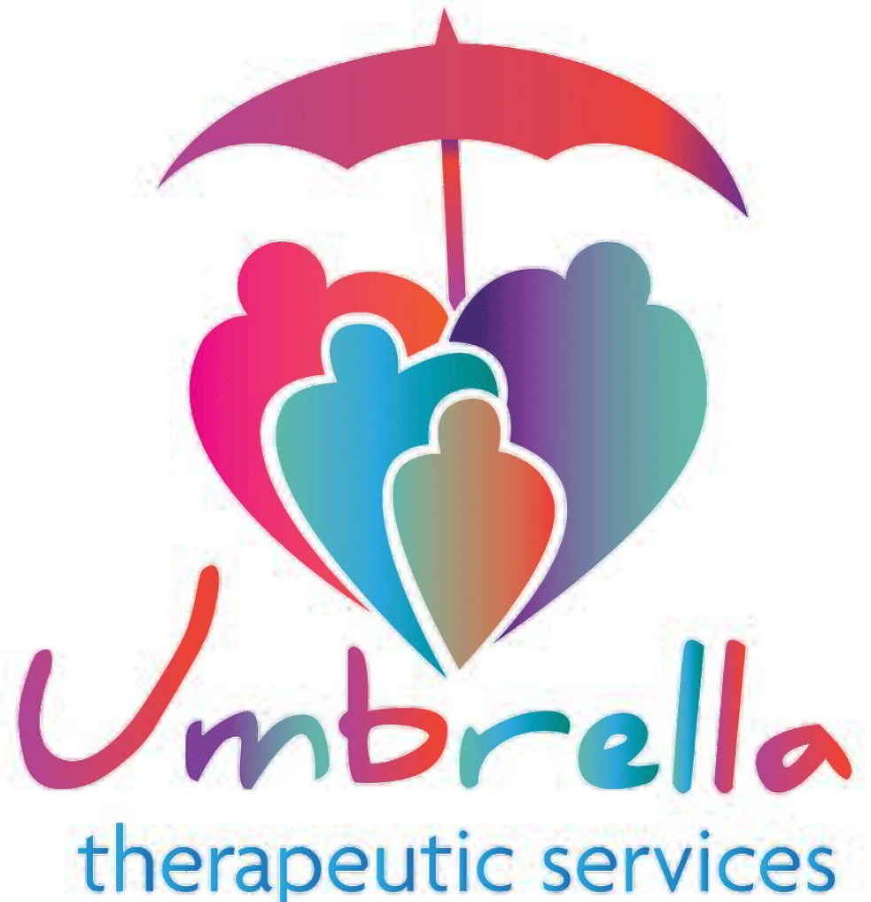
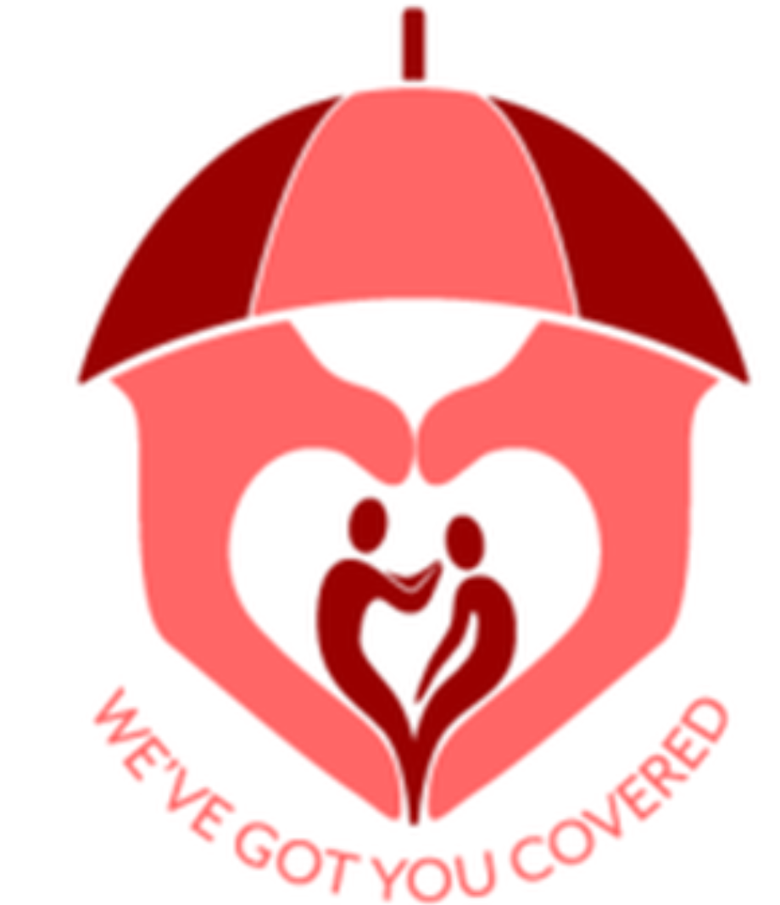
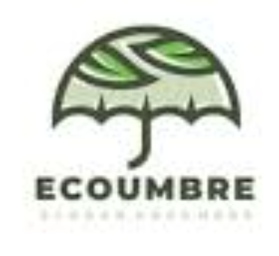
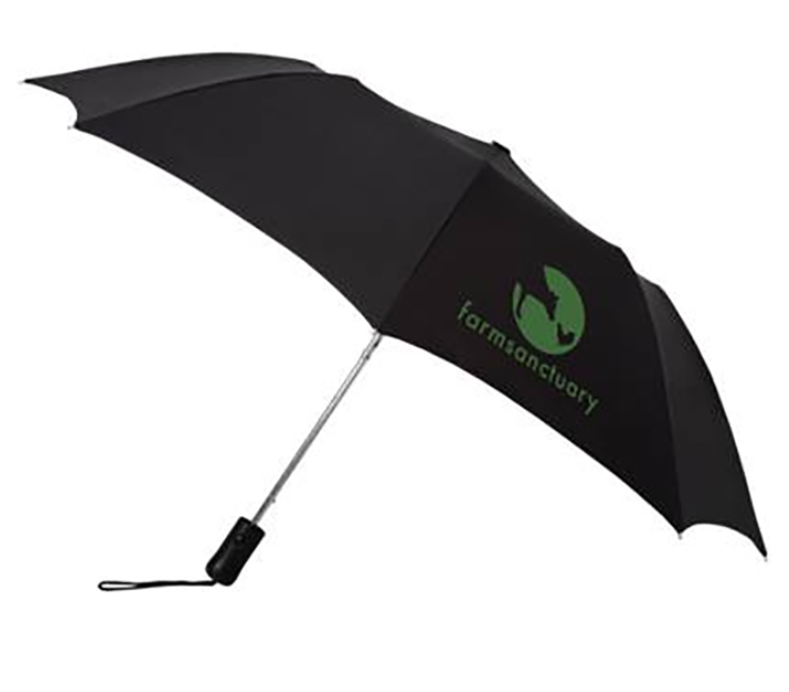
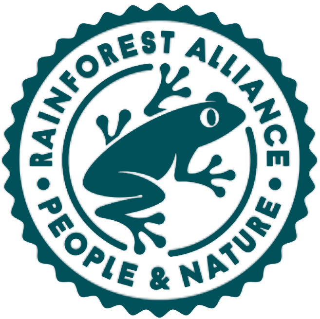
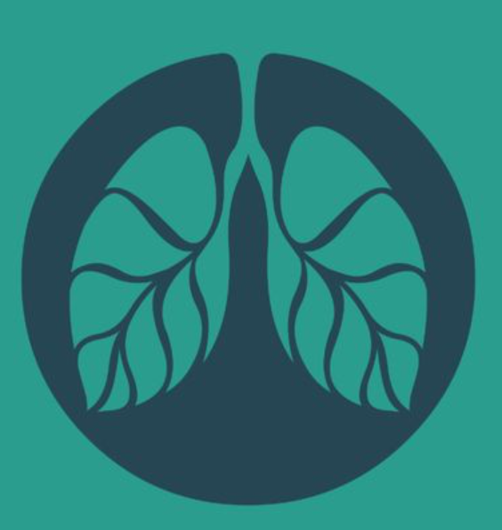
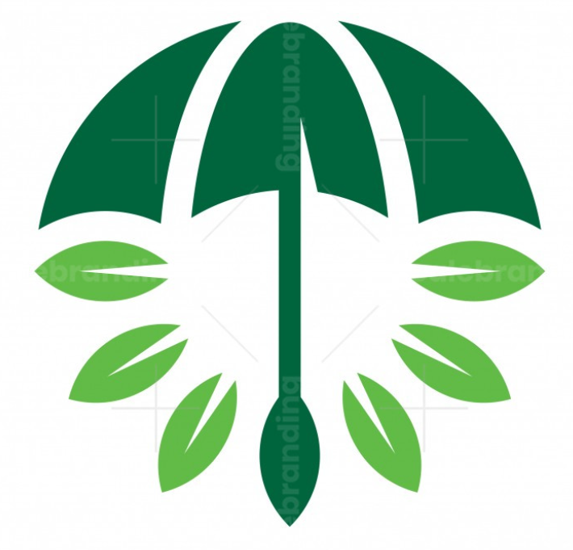
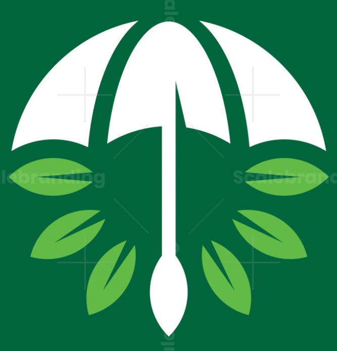
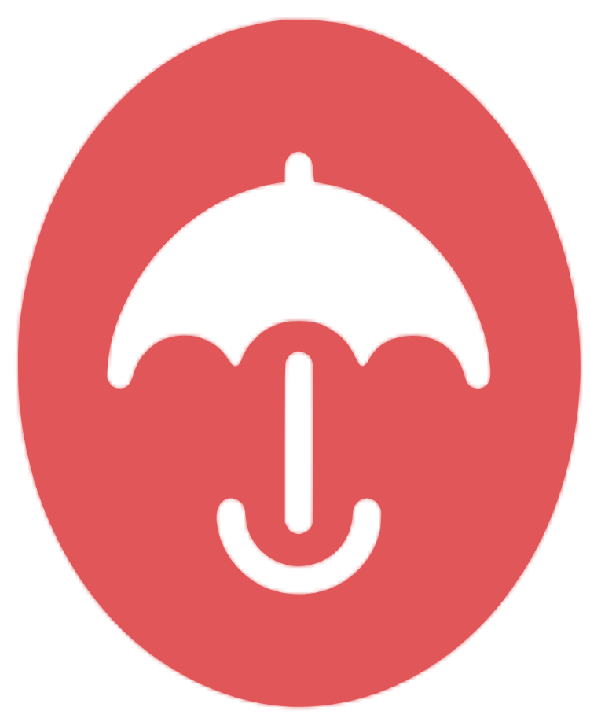
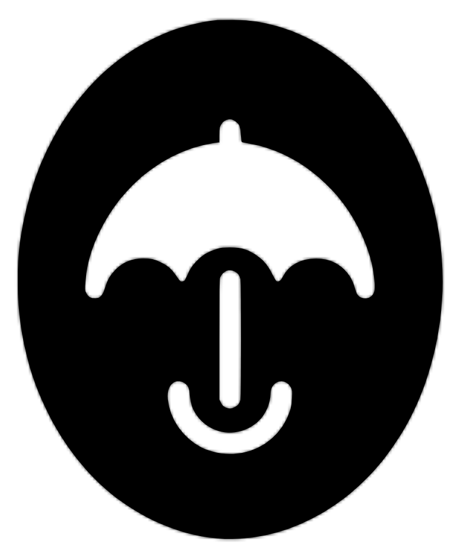

## ✨ 왜 로고 분석이 필요한가?

창업 초기에 가장 많이 저지르는 실수는 **로고를 '예쁘게'만 보려고 하는 것**입니다.  
하지만 로고는 단순한 그림이 아니라 **브랜드 전략과 메시지를 시각적으로 전달하는 핵심 도구**입니다.

특히 우산 공유 플랫폼처럼  
출퇴근길, 역세권, 비 오는 날의 ‘특정 상황’을 해결하는 서비스는  
**보호·안전·친환경·편리함**이라는 핵심 메시지가 로고에 반드시 담겨야 합니다.

그래서 이번 글에서는  
핀터레스트/구글에서 `umbrella sharing logo minimal`, `eco umbrella logo`, `rain hub logo`  
키워드로 찾은 **전략적 로고 5개를 분석**하며,  
왜 이 로고들이 ‘전략 로고’인지 근거 중심으로 설명합니다.

---

# 🏆 1. UMBRELLA WELLNESS CARE 로고
> “우산 + 사람 실루엣 → 보호·안전 메시지 100%”






### 🔍 왜 전략적인가?

### 1) 우산과 ‘사람’의 통합 → 업종 메시지가 즉시 이해됨
곡선 실루엣 두 개가 사람처럼 보이며
> “우산이 사람을 보호한다”  
는 메시지를 직관적으로 전달합니다.

### 2) 보호·케어·안전 브랜드에 완벽한 구조
우산 공유 플랫폼의 본질 = **사람을 비로부터 보호하는 서비스**  
이를 시각적으로 그대로 표현한 형태입니다.

### 3) 블루 톤으로 신뢰·안정감 강화
공유경제/렌탈/모빌리티 산업에서 가장 선호되는 컬러.

### 4) 앱 아이콘·간판·스티커 등 모든 채널에 확장성 높음
실루엣이 매우 단순해 다양한 배경에서 사용 가능.

---

# 🏆 2. NatProtect 로고
> “우산을 ‘잎사귀’로 치환 → 친환경 메시지 극대화”






### 🔍 왜 전략적인가?

### 1) 우산 + 자연(Leaf)을 하나의 그래픽으로 융합
비, 자연, 지속 가능성이라는 셋을 한 장면에 담은 천재적 구성.

### 2) 친환경 우산 렌탈·재활용 시스템과 가장 잘 맞는 로고
우산 공유 서비스는 “일회용 우산 폐기 감소”라는 친환경 메시지와 잘 맞음.  
이 로고는 그 가치를 시각적으로 완벽하게 전달.

### 3) 그린 계열의 듀얼톤으로 신뢰감과 생명력 강조
밝은 그린 = 젊고 친근  
어두운 그린 = 신뢰·안정  
두 색의 밸런스가 좋음.

### 4) 단순한 실루엣 → 작은 사이즈에서도 인식성 유지
앱 아이콘이나 역 내 QR 스티커에도 적합.

---

# 🏆 3. Rain Forest 로고
> “물방울 + 나무 → 자연·비·안전의 이중 상징 디자인”






### 🔍 왜 전략적인가?

### 1) 단일 라인으로 ‘비(물) + 숲(나무)’를 모두 표현
비 오는 날 사용되는 서비스라는 업종과 완벽하게 일치.

### 2) 미니멀한 라인 아트 → 글로벌 감성의 브랜드 이미지
요즘 스타트업들이 선호하는 바로 그 스타일.

### 3) 블루 컬러 → 비 + 기술 + 안전의 완벽한 조합
우산 공유 플랫폼은 ‘안정감’이 매우 중요 → 색 선택이 전략적.

### 4) 확장성 높은 단순 도형
단색 파비콘, 작은 버튼, 지하철 광고 등 어떤 곳에서도 훼손 없음.

---

# 🏆 4. Leaf-Umbrella Shield 로고
> “우산을 보호막처럼 표현한 친환경 기반”






### 🔍 왜 전략적인가?

### 1) 우산 형태 자체가 ‘Shield(보호)’처럼 보임
우산의 기본 메시지인 **보호·안전**을 상징적으로 강화한 디자인.

### 2) 잎사귀 6개 배치로 친환경 이미지 더 강화
지속 가능성(Sustainability) → 우산 공유 플랫폼과 높은 연관성.

### 3) 명확한 실루엣 → 직관적이고 기억에 남음
멀리서 봐도 우산이며, 친환경이라는 것이 곧바로 파악됨.

### 4) 다양한 곳에 확장 가능한 디자인 구조
- 간판
- 앱 아이콘
- 웹/앱 UI
- 택배 박스 또는 패키지

모두 적용 가능.

---

# 🏆 5. Smile Umbrella Insurance Style 로고
> “우산 손잡이를 ‘스마일’로 표현한 감성 브랜딩”





### 🔍 왜 전략적인가?

### 1) 우산 손잡이가 스마일 형태 → 고객 심리 안정
우산 공유 플랫폼은 갑작스러운 비 상황에서 사용됨.  
그 순간 ‘친절하고 긍정적인 이미지’를 전달하면 브랜드 호감도 급상승.

### 2) 스마일 + 우산 = 친절한 고객 경험(UX) 형성
"고마워요, 비 오는 날 살렸어요!"라는 감성에 딱 맞는 방향.

### 3) 단순한 녹색 라인 → 자연·안정·친근함 전달
고객이 빠르게 인식할 수 있는 디자인.

### 4) 브랜드 캐릭터화도 쉬운 구조
우산 공유 플랫폼 앱의 마스코트로 발전 가능.

---

# 🧠 종합 분석: 전략 로고의 공통 요소는 무엇인가?

| 요소 | 설명 |
|------|------|
| **직관성** | 우산·비·사람·잎사귀처럼 업종과 바로 연결되는 심볼 |
| **심플함** | 기하학 기반의 미니멀 구조 → 확장성 뛰어남 |
| **감성적 메시지** | 보호, 안정, 친환경, 긍정적 경험 등 전달 |
| **브랜드 핵심가치 시각화** | 우산 공유 플랫폼의 ‘안전·편리·친환경’이 로고에 포함 |
| **축소해도 인식 가능** | 앱 아이콘·간판·QR에도 문제 없음 |

---

# 📋 셀프 체크리스트

- [x]  전략 로고 디자인이라고 할 수 있는 명확한 이유 제시
- [x]  업종과의 연결성 분석
- [x]  컬러·구성·형태에 대한 디자인 근거 제공
- [x]  실제 우산 공유 플랫폼에 적용 가능한 확장성 설명

---

# 🏁 결론: 좋은 로고는 “브랜드 전략의 시각적 요약본”

이번 실습을 통해 로고는 단순한 ‘이미지’가 아닌  
브랜드의 메시지·가치·전략을 한 장면에 압축한 결과물이라는 것을 확인했습니다.

우산 공유 플랫폼의 핵심 메시지는 아래 3가지입니다.

### ✔ 보호
### ✔ 친환경
### ✔ 편리함

로고가 이 세 가지를 시각적으로 담아내면  
브랜드는 고객의 기억 속에 훨씬 더 깊이 남게 됩니다.

> “좋은 로고는 단순한 디자인이 아니라, 전략이다.”

---

```toc

```

