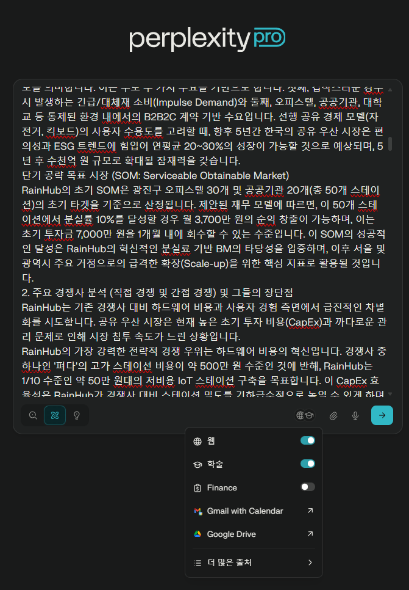

## ✨ 이번 글에서 다루는 것

이번 실습 과제 목표는 아래 한 문장입니다.

> **“내 아이디어를 AI로 리서치 → AI로 팩트체크 → 수정 반영한 최종 전략 보고서 작성하기”**

저는 이 과정을 **RainHub 공유 우산 플랫폼**을 가지고 실제로 진행해보았습니다.  
아래는 그 전체 과정을 정리한 **재현 가능한 AI 리서치 워크플로우**입니다.

---

# 📘 **목차**
1. Step 1 — Gemini 딥리서치
   - 1-1. 입력 프롬프트
   - 1-2. Gemini 출력 결과
2. Step 2 — Gemini 추가 질의(있다면)
3. Step 3 — Perplexity 팩트체크
   - 3-1. 입력 프롬프트
   - 3-2. Perplexity 출력 결과
4. Step 4 — 내가 작성한 최종 정리문
5. Step 5 — 브랜드 아이덴티티 실습
6. Appendix — 기타 실험/메모/수정본


---

# 🧠 **Step 1 — Gemini 딥리서치**

## 🔹 1-1. Gemini에 입력한 프롬프트 (원문 전체)

<details> 
   <summary>딥리서치 프롬프트</summary>

```
# 역할(Role) 지정

당신은 글로벌 탑 티어 전략 컨설팅 펌(McKinsey, BCG 등)의 수석 비즈니스 컨설턴트이자 제품 전략가입니다. 당신의 목표는 내가 제시하는 비즈니스 아이디어를 다각도로 심층 분석하여, 실행 가능하고 성공 확률이 높은 전략적 인사이트를 제공하는 것입니다.


# 입력 데이터(Input Data)

- **나의 아이디어:** [RainHub 공유 우산 플랫폼**핵심 컨셉**: "앱 없이 QR 스캔으로 우산 공유하는 저비용 IoT 플랫폼, 오피스텔·공공기관 무료 설치로 ESG 우산 인프라 구축"**서비스 플로우**:

대여 (7초): QR 스캔 → PWA 웹앱 → 카카오 1초 로그인 → 보증금 10k(토스페이) → IoT 락 자동 해제 → SMS 전송

반납 (2초): 어떤 스테이션 QR → 자동 로그인 → 락 해제 → 우산 꽂기 → 센서 감지 → 보증금+연체료 자동 환불

연체: Day1 500원 → Day14 최대 7k (총 분실비 17k, 펴다 24k 대비 30% 저렴)

**비즈니스 모델** (렌트료 ZERO):- 수익: 분실률 10% × 17k = 스테이션당 월 85만 원 순익- 초기 타겟: 광진구 오피스텔30개 + 공공기관20개 (총 50개)- 재무: 7,000만 원 투자 → 월1 순익 3,700만 원 (투자 1개월 회수)**경쟁 우위**:- 펴다: 500만 원 고가 vs RainHub 50만 원 (1/10 비용)- 업브렐라: 앱+수동 vs RainHub PWA+자동- 위브렐라: 공공 한정 vs RainHub 민간 네트워크**목표**: 한국 우산 시장 1조 원 중 10% → 1,000억 원 규모 공략

]

- **타겟 시장(선택사항):** [한국 시장, 남녀 노소 우산이 필요한 사람]


# 수행 과제(Task)

위 아이디어에 대해 웹 검색과 당신의 지식을 활용하여 다음 6가지 항목에 대한 심층 리포트를 작성해 주세요. 모든 주장은 가능한 한 최신 데이터나 구체적인 사례를 근거로 들어야 합니다.


## 1. 시장 조사 (Market Research)

- 현재 시장 규모 및 향후 5년 성장 전망 (TAM/SAM/SOM 관점)

- 주요 경쟁사 분석 (직접 경쟁 및 간접 경쟁) 및 그들의 장단점

- 시장 진입 장벽 및 규제 이슈


## 2. 최신 트렌드 분석 (Trend Analysis)

- 이 아이디어와 관련된 거시적(Macro) 및 미시적(Micro) 트렌드

- 소비자 행동의 변화 양상 및 기술적 진보 현황


## 3. 고객 세그먼트 및 페르소나 (Customer & Persona)

- 가장 잠재력 높은 핵심 고객 세그먼트 3가지 정의

- **대표 페르소나 1명 상세 설정:** 이름, 나이, 직업, 라이프스타일, Pain Point(고충), Needs(니즈), 이 제품을 사용해야 하는 이유(Jobs-to-be-Done)


## 4. 기회 영역 및 아이디어 제안 (Opportunities & Ideation)

- 경쟁사가 놓치고 있는 '틈새 시장' 또는 '기회 영역' 도출

- 내 아이디어를 발전시킬 수 있는 구체적인 기능(Feature) 또는 서비스 모델 3가지만 제안

- 차별화된 가치 제안 (USP: Unique Selling Proposition)


## 5. 아이디어 심층 분석 (Deep Dive Analysis)

- SWOT 분석 (강점, 약점, 기회, 위협)

- 비즈니스 모델 캔버스(BM Canvas)의 핵심 요소 요약 (수익 모델 포함)

- 예상되는 리스크 및 해결 방안


## 6. 결론 및 인사이트

- 이 아이디어의 성공 가능성 평가 (S/A/B/C 등급)

- 성공을 위한 가장 중요한 '한 가지(One Thing)' 조언


# 출력 형식(Output Format)

- 전문적인 비즈니스 리포트 톤앤매너를 유지하세요.

- 가독성을 위해 마크다운(Markdown), 글머리 기호, 표를 적극적으로 활용하세요.

- 모호한 표현보다는 명확하고 단정적인 표현을 사용하세요.
```

</details>

---

## 🔹 1-2. Gemini 출력 결과

<details> 
   <summary>결과</summary>

```
RainHub 공유 우산 플랫폼: 초저가 IoT 및 분실료 기반 수익 모델의 전략적 타당성 검토 보고서II. 시장 조사 (Market Research)1. 현재 시장 규모 및 향후 5년 성장 전망 (TAM/SAM/SOM 관점)RainHub 플랫폼이 목표로 하는 한국 우산 공유 서비스 시장은 거시적인 우산 소비재 시장과 긴급 편의 서비스 시장의 교차점에 위치하며, 그 잠재력은 높으나 정확한 규모 산정을 위해서는 세분화된 접근이 필수적입니다.총 잠재 시장 (TAM: Total Available Market)제안된 1조 원 규모의 시장은 한국의 연간 우산 구매, 수리, 유통을 포함하는 전체 우산 소비재 시장을 의미하는 것으로 분석됩니다. 이는 RainHub가 잠재적으로 대체하거나 영향을 미칠 수 있는 시장의 상한선(Ceiling)을 설정합니다. 공유 우산 서비스의 성장은 개인 우산 소유 습관의 변화와 밀접하게 연관되어 있으며, 소비자들이 우산을 '소유'하는 대신 '접근'하는 경향이 강화될수록 TAM 내에서 공유 서비스가 차지하는 비중은 더욱 커질 것입니다.공략 가능 시장 (SAM: Serviceable Available Market)SAM은 한국 내에서 공유 우산 서비스가 실질적으로 매출을 창출할 수 있는 시장 규모를 의미합니다. 이는 주로 두 가지 수요를 기반으로 합니다. 첫째, 갑작스러운 강우 시 발생하는 긴급/대체재 소비(Impulse Demand)와 둘째, 오피스텔, 공공기관, 대학교 등 통제된 환경 내에서의 B2B2C 계약 기반 수요입니다. 선행 공유 경제 모델(자전거, 킥보드)의 사용자 수용도를 고려할 때, 향후 5년간 한국의 공유 우산 시장은 편의성과 ESG 트렌드에 힘입어 연평균 20~30%의 성장이 가능할 것으로 예상되며, 5년 후 수천억 원 규모로 확대될 잠재력을 갖습니다.단기 공략 목표 시장 (SOM: Serviceable Obtainable Market)RainHub의 초기 SOM은 광진구 오피스텔 30개 및 공공기관 20개(총 50개 스테이션)의 초기 타겟을 기준으로 산정됩니다. 제안된 재무 모델에 따르면, 이 50개 스테이션에서 분실률 10%를 달성할 경우 월 3,700만 원의 순익 창출이 가능하며, 이는 초기 투자금 7,000만 원을 1개월 내에 회수할 수 있는 수준입니다. 이 SOM의 성공적인 달성은 RainHub의 혁신적인 분실료 기반 BM의 타당성을 입증하며, 이후 서울 및 광역시 주요 거점으로의 급격한 확장(Scale-up)을 위한 핵심 지표로 활용될 것입니다.2. 주요 경쟁사 분석 (직접 경쟁 및 간접 경쟁) 및 그들의 장단점RainHub는 기존 경쟁사 대비 하드웨어 비용과 사용자 경험 측면에서 급진적인 차별화를 시도합니다. 공유 우산 시장은 현재 높은 초기 투자 비용(CapEx)과 까다로운 관리 문제로 인해 시장 침투 속도가 느린 상황입니다.RainHub의 가장 강력한 전략적 경쟁 우위는 하드웨어 비용의 혁신입니다. 경쟁사 중 하나인 '펴다'의 고가 스테이션 비용이 약 500만 원 수준인 것에 반해, RainHub는 1/10 수준인 약 50만 원대의 저비용 IoT 스테이션 구축을 목표합니다. 이 CapEx 효율성은 RainHub가 경쟁사 대비 스테이션 밀도를 기하급수적으로 높일 수 있게 하며, B2B 파트너에게 설치 비용 부담을 대폭 낮춰 공격적인 시장 침투를 가능하게 합니다.경쟁 환경 비교 분석기준 항목RainHub (제안)펴다 (Peta)업브렐라 (Upbrella)위브렐라 (Webrella)핵심 기술/비용저가 IoT, PWA (약 50만 원)고가 IoT, 앱 (약 500만 원)수동 조작, 앱공공 B2G, 저가 하드웨어사용자 경험QR-PWA 자동 락 (7초)앱 기반 락 (1~2분)앱 & 수동 조작 (복잡)지자체 연계 (제한적)BM 핵심분실료(17k) 기반 수익 (렌트료 ZERO)대여료 기반 수익대여료 기반 수익공공 예산 지원/광고네트워크 유형민간/공공 혼합 (B2B2C 중점)민간 중심민간 중심공공 중심주요 경쟁 우위압도적 CapEx 효율성, Zero-Friction UX하드웨어 안정성/보안성유연성공공 부문 독점경쟁사 약점 활용 전략:기존 공유 우산 서비스가 높은 초기 투자 비용을 감수하면서까지 고가 하드웨어를 사용하는 것은 자산 분실 및 훼손을 억제하기 위한 목적이 큽니다. 이는 공유 우산 서비스가 본질적으로 하드웨어 보호와 사용 편의성 사이의 트레이드오프에 놓여 있음을 시사합니다.펴다: 고가 하드웨어 기반으로 안정성은 높으나, 높은 CapEx로 인해 시장 확장 속도가 느리고, 대여료를 부과해야 하므로 사용자 진입 장벽이 발생합니다.업브렐라: 앱 기반임에도 불구하고 수동 조작이 필요하여 사용자 경험이 복잡합니다. RainHub의 PWA 기반 '7초 대여' 프로세스는 사용자에게 '앱 설치 피로도' 없이 즉각적인 편의성을 제공하는 결정적인 경쟁 우위가 됩니다. 웹사이트의 모바일 사용자 경험 최적화는 속도와 사용성에 직결되며, 전환율과 사용자 참여에 매우 중요합니다.1 RainHub는 PWA를 통해 이 트렌드를 선점합니다.위브렐라: 공공 기관에 네트워크가 한정되어 있어, RainHub가 목표하는 민간 오피스텔 및 대학교 등 B2B2C 영역으로의 확장성이 제한적입니다.RainHub는 하드웨어 비용 절감분을 마케팅 비용이나 운영 안정화에 재투자하여 경쟁사가 도달할 수 없는 수준의 시장 침투 속도와 밀도를 확보해야 합니다.3. 시장 진입 장벽 및 규제 이슈공유 우산 서비스 시장 자체에 대한 직접적인 정부의 인허가 규제는 비교적 낮아 진입 장벽은 낮은 편입니다. 국내 규제 환경의 트렌드는 과거 통신사업자에 대한 허가제도에서 진입 장벽을 제거하고 사후 규제 중심으로 전환되는 추세입니다.2핵심 리스크: 분실료와 소비자 보호 이슈RainHub의 비즈니스 모델은 분실료(17,000원)에 핵심적으로 의존하므로, 이 분실료 책정에 대한 공정성 논란이 가장 큰 규제 이슈로 작용할 수 있습니다.약관 공정성: 통신사업자 규제 검토 사례에서도 부당한 약관에 대한 사후 규제 권한 공유 및 약관변경명령권 도입이 적극적으로 검토되었듯이 2, 소비자가 느끼기에 17,000원의 분실료가 과도한 '징벌적 요금'이라고 판단될 경우, 공정거래위원회 등의 사후 규제 대상이 될 수 있습니다.리스크 관리: 비록 RainHub가 분실료를 경쟁사(펴다 24k) 대비 30% 저렴하게 책정했지만, 소비자는 렌트료가 없는 서비스를 이용했음에도 불구하고 거액의 비용을 지불해야 한다는 심리적 저항을 가질 수 있습니다. 따라서 분실료 17,000원의 책정 근거(원가, 운영비, 재고 비용, 관리비 등)를 투명하게 제시하고, 이용 약관을 사전에 법률 전문가의 검토를 거쳐 '합리적인 손해배상 예정액'으로 포지셔닝하는 것이 필수적입니다.III. 최신 트렌드 분석 (Trend Analysis)1. 이 아이디어와 관련된 거시적(Macro) 및 미시적(Micro) 트렌드A. 거시적 트렌드: ESG 및 순환 경제 (Circular Economy)현재 기업 환경에서 ESG(환경, 사회, 지배구조) 경영은 단순한 유행을 넘어 필수적인 경영 전략으로 자리 잡았습니다. RainHub가 오피스텔이나 공공기관에 '무료 설치'와 'ESG 우산 인프라 구축'을 제안하는 것은 이 거시적 트렌드에 완벽하게 부합합니다. 많은 기업과 기관들이 환경 친화적 이미지를 제고하고 지역 사회에 기여할 방법을 모색하고 있으며, 공유 우산 시스템은 연간 수만 개의 일회용 폐우산 발생을 줄이는 지속 가능한 인프라로 포지셔닝될 수 있습니다. 이러한 ESG 스토리텔링은 B2B 영업 시 단순 편의성 제공을 넘어, 파트너 기업에게 사회적 책임을 이행하는 도구로 작용하여 계약 성사율을 높이는 강력한 지렛대(Leverage)가 됩니다.B. 미시적 트렌드: O2O/공유 경제의 'Zero-Friction UX' 요구최근 O2O 및 공유 경제 서비스 성공의 핵심은 사용자의 접근성을 극대화하는 '마찰 제로(Zero-Friction)' 경험입니다. 모바일 환경에서 웹사이트의 속도와 사용성은 사용자 만족도와 직결됩니다.1 기존 공유 킥보드나 자전거 서비스의 경우, 복잡한 앱 설치, 회원가입, 결제 과정이 긴급 수요를 저해하는 요인이었습니다.RainHub의 'QR 스캔 → PWA 웹앱 → 카카오 1초 로그인'을 통한 7초 대여 프로세스는 이러한 '앱 설치 피로도'를 근본적으로 해소합니다. 특히 비가 오는 긴급 상황(Rain Impulse)에서 사용자가 가장 중요하게 여기는 것은 신속한 접근성이며, PWA는 네이티브 앱 설치 없이도 유사한 속도와 기능을 제공하여 이 미시적 시장 요구를 충족시킵니다.2. 소비자 행동의 변화 양상 및 기술적 진보 현황소비자 행동 변화: 소유에서 접근(Access)으로밀레니얼 및 Z세대는 물품의 '소유(Ownership)'보다는 필요할 때 '접근(Access)'하는 것을 선호합니다. 우산은 계절적/상황적 요인에 의해 사용 빈도가 결정되는 대표적인 '접근성' 상품입니다. 갑작스러운 비에 노출되었을 때, 고품질의 우산을 즉시 대여하고 반납하는 것이 편의점에서 저가 우산을 구매하여 잃어버리는 악순환보다 경제적이고 합리적이라고 판단하는 소비 심리가 강해지고 있습니다.기술적 진보: PWA와 저가 IoT의 성숙PWA (Progressive Web App) 기술 성숙: PWA는 모바일 호환성 및 미적 외관, 쉬운 탐색 및 접근성 측면에서 사용자 경험 최적화에 필수적입니다.1 RainHub는 PWA를 활용하여 네이티브 앱 개발 및 유지보수 비용을 절감하는 동시에, 7초 대여라는 핵심 가치를 기술적으로 구현할 수 있게 되었습니다. 이는 시장의 기술적 기반이 RainHub의 혁신적인 UX 전략을 뒷받침하고 있음을 의미합니다.저가 IoT 및 센서 기술의 발전: 스테이션당 50만 원이라는 혁신적인 CapEx는 센서, 통신 모듈, 그리고 마이크로컨트롤러 비용의 지속적인 하락 덕분에 가능해졌습니다. 다만, 저비용 시스템이 악천후 환경, 빈번한 사용자 접촉, 물리적 충격에 대한 충분한 내구성(Durability)과 안정적인 락킹 기능을 확보하는 것이 RainHub의 장기적인 서비스 신뢰도를 유지하기 위한 핵심 전제 조건이 됩니다.IV. 고객 세그먼트 및 페르소나 (Customer & Persona)1. 가장 잠재력 높은 핵심 고객 세그먼트 3가지 정의RainHub의 비즈니스 모델은 높은 이용률과 함께 분실률을 의도된 수준(10% 내외)으로 통제하는 능력을 요구합니다. 이를 위해 초기에 통제된 환경의 고객에게 집중하여 데이터와 운영 노하우를 축적하는 것이 중요합니다.1. 세그먼트 1: Captive (통제된) B2B2C 사용자 (선행 시장)정의: 오피스텔 거주자, 대기업 사옥 근무자, 공공기관 및 대학 캠퍼스 내 사용자.3 특정 물리적 경계 내에서 생활하며 이동 패턴이 예측 가능합니다.전략적 매력도: 가장 높음. 분실 시 신원 추적 및 회수 유도가 용이하여 분실률을 낮게 유지할 가능성이 큽니다. 초기 투자 회수(ROI) 목표 달성을 위한 기반 세그먼트입니다.2. 세그먼트 2: Impulsive (긴급) 수요자 (확장 시장)정의: 갑작스러운 비에 노출되어 우산 구매나 대여를 즉시 필요로 하는 일반 유동인구 (예: 지하철역 출입구, 주요 번화가, 쇼핑몰 입구).전략적 매력도: 높음. 대규모 트래픽과 높은 이용 건수를 발생시키지만, 이동 범위가 넓어 분실률이 상대적으로 높을 위험이 있습니다.4 스테이션 밀집도가 충분히 확보되어 사용자가 쉽게 반납할 수 있는 환경이 조성된 후에 집중적으로 공략해야 합니다.3. 세그먼트 3: Cost-Sensitive (비용 민감) 사용자 (틈새 시장)정의: 렌트료 Zero 정책에 매력을 느끼는 사용자(대학생, 단기 거주 외국인, 배낭여행객 등).전략적 매력도: 중간. 이들은 우산을 장기 소유할 의사가 적고 즉각적인 편의성을 추구하지만, 분실료 17,000원 자체가 기존 우산 가격 대비 저렴하다는 점에 매력을 느낄 수 있습니다. 정교한 연체 알림 시스템을 통해 높은 회수율을 유지한다면 안정적인 세그먼트가 될 수 있습니다.2. 대표 페르소나 1명 상세 설정페르소나 명: 김민수 (Kim Minsoo)항목상세 내용이름/나이김민수, 32세직업/직군IT 스타트업 개발자 (강남 오피스텔 거주)라이프스타일디지털 친화적이며 시간 효율성을 극대화하는 것을 중요시합니다. '미니멀리즘'을 추구하며 우산을 포함한 불필요한 개인 소지품을 줄이려 합니다. 일정이 유동적이며 야근이 잦아 집과 회사 간의 이동이 잦습니다.Pain Point (고충)① 갑작스러운 소나기로 인해 우산이 필요할 때, 편의점에서 5,000원짜리 저가 우산을 사는 것이 환경적으로나 경제적으로 낭비라고 생각합니다. ② 기존 공유 우산 서비스를 이용하려 했으나, 앱 설치와 복잡한 인증 절차가 귀찮아 결국 포기하고 구매를 선택했습니다. ③ 이미 구매한 우산을 오피스텔이나 사무실에 두고 와서 또다시 비에 맞는 상황이 반복됩니다.Needs (니즈)① 앱 설치 없이 QR 스캔만으로 10초 이내에 바로 대여가 가능한 즉각적인 솔루션. ② 렌트 비용이 없어 심리적 부담이 없는 서비스. ③ 깔끔하고 자동화된 반납/결제 시스템.Jobs-to-be-Done (JTBD)김민수는 긴급 상황에서 '추가적인 정신적 마찰(앱 설치, 복잡한 회원가입)' 없이, 합리적인 비용(렌트료 Zero)으로 일시적인 '비 막기' 임무를 신속하게 완수하고자 합니다.RainHub 사용 이유거주하는 오피스텔 1층에 스테이션이 설치되어 있어 접근성이 높습니다. QR 스캔 후 7초 만에 대여가 완료되는 Zero-Friction UX 1는 그의 시간 효율성 니즈를 완벽하게 충족시킵니다. 렌트료가 없다는 점과 최종 분실비 17,000원이 경쟁사 대비 저렴하다는 점이 합리적 소비로 인식됩니다.V. 기회 영역 및 아이디어 제안 (Opportunities & Ideation)1. 경쟁사가 놓치고 있는 '틈새 시장' 또는 '기회 영역' 도출틈새 시장: B2B2C 기반의 '폐쇄형 자산 통제 네트워크(Closed Asset Control Network)' 선점기존 공유 경제 모델의 경험은 운영 환경의 통제 수준이 분실 위험을 결정한다는 것을 명확히 보여줍니다. 예를 들어, 대중에게 개방된 공유 킥보드 헬멧의 경우 90%에 달하는 극단적인 분실률이 보고되었습니다.4 반면, 특정 환경에서는 헬멧 사용의 분실 및 파손율이 0.16% 또는 0.002%에 불과한 사례도 있습니다.5 이는 자산 통제 환경에 따라 분실률이 수백 배 이상 차이 날 수 있음을 의미합니다.경쟁사들이 주로 일반 거리 대여에 집중하고 있는 동안, RainHub는 초기에 오피스텔, 공공기관, 대학교 캠퍼스 3, 대규모 사옥 밀집 지역 등 물리적 경계가 명확하고 이용자가 특정 커뮤니티에 속한 B2B2C 환경을 선점해야 합니다. 이 '폐쇄형 네트워크'는 다음 두 가지 기회를 제공합니다.분실률 통제: 이용자의 신원 확인이 쉽고, 파트너사가 자산 관리에 협력하기 때문에 분실률을 의도적으로 낮은 수준으로 통제할 수 있습니다.수익 다각화: 분실률이 5% 미만으로 매우 낮게 유지될 경우, 분실료 기반 수익이 줄어들 수 있습니다. 이 경우 B2B 고객사에게는 '낮은 분실률 = 높은 ESG 기여'로 포장하여, 스테이션 설치 및 유지보수에 대한 고정 계약 수수료(Infrastructure Rental Fee)를 부과하는 새로운 수익 모델을 즉시 도입할 수 있습니다.2. 내 아이디어를 발전시킬 수 있는 구체적인 기능(Feature) 또는 서비스 모델 3가지만 제안1. Tiered Loss Fee / 연체 알림 강화 (Behavior Nudging)RainHub의 성공은 분실률을 정확히 10% 내외의 '수익 최적화 구간'으로 관리하는 능력에 달려 있습니다. 단순히 높은 보증금이나 분실료를 부과하는 것 외에, 사용자의 행동을 교정하는 기능이 필요합니다.기능: 우산 대여 시 PWA를 통해 실시간 연체료 시뮬레이션 및 알림을 제공합니다. 예를 들어, 연체 Day 14에 분실료(17k)가 부과되기 전에, Day 3, Day 7 시점에 '보증금 환불이 지연되고 있습니다'와 같은 강력한 SMS 또는 카카오톡 알림을 발송하여 90% 이상의 자발적인 회수율을 유도해야 합니다. 이는 분실을 유도하는 것이 아니라, 사용자가 우산을 반납하도록 '넛지(Nudge)'하여 운영의 안정성을 확보합니다.2. B2B 스테이션 전용 '광고/브랜딩 모듈' 도입서비스 모델: 50만 원대의 저비용 IoT 스테이션 디자인에 지역 기업 광고나 건물 내 공지사항을 표시할 수 있는 저전력 디지털 광고판(또는 브랜딩 랩핑 영역)을 추가합니다.전략적 목표: 이 모듈을 통해 B2B 파트너(오피스텔 관리 주체, 공공기관)에게 스테이션 설치에 따른 고정적인 임대료나 광고 수익을 제안합니다. 이는 분실률 변동에 따라 재무 구조가 흔들리는 리스크를 상쇄하고, 분실료 외에 안정적인 B2B 계약 기반 수익(MRR: Monthly Recurring Revenue)을 확보하여 수익 흐름을 다각화합니다.3. Cross-Platform ID 연동 및 평판 시스템 (Anti-Fraud)기능: 카카오 1초 로그인을 통해 UX는 간소화하되, 장기 연체 또는 분실 이력이 누적된 사용자에게는 추가적인 신원 확인 절차(e.g., 휴대폰 인증, 마이크로 신용 점수 조회)를 요구하여 악의적인 사용을 사전에 차단해야 합니다.전략적 목표: 현재 공유 킥보드 헬멧 등의 분실률 문제 4가 공유 경제 전반의 신뢰도를 저해하고 있습니다. RainHub는 장기적으로 다른 공유 서비스와의 이력 공유(데이터 연동, 물론 법적 검토 필수)를 통해 '공유 경제 평판 시스템'을 구축하여 선량한 사용자에게는 혜택을, 악의적인 사용자에게는 제약을 가함으로써 시스템의 지속 가능성을 높여야 합니다.3. 차별화된 가치 제안 (USP: Unique Selling Proposition)"압도적인 인프라 비용 효율성(Cost Arbitrage)을 바탕으로 구현된 Zero-Friction (7초) & Zero-Rental (무료) 우산 접근성"RainHub는 경쟁사 대비 1/10의 낮은 하드웨어 초기 투자 비용(CapEx)을 통해 시장의 '비용 중재(Cost Arbitrage)' 우위를 선점합니다. 이 혁신적인 비용 구조 덕분에 사용자에게는 렌트료 부담이 없는 '무료 렌탈' 서비스를 제공하고, 운영사에게는 빠른 투자 회수 및 대규모 확장의 기회를 제공합니다. PWA 기반의 7초 사용자 경험 1은 이러한 접근성 우위를 극대화하여, RainHub를 단순한 공유 서비스가 아닌, 진정한 의미의 '긴급 상황 솔루션'으로 포지셔닝합니다.VI. 아이디어 심층 분석 (Deep Dive Analysis)1. SWOT 분석 (강점, 약점, 기회, 위협)분류핵심 내용전략적 함의S (강점)S1. CapEx 혁신: 경쟁사 대비 1/10 수준의 저비용 IoT 하드웨어 (50만 원). S2. 압도적인 사용자 경험: PWA 기반 7초 대여 (Zero-Friction UX).1 S3. 초기 투자 회수(1개월) 가능성을 제시하는 매력적인 재무 모델.낮은 설치 비용으로 빠른 시장 침투 및 네트워크 효과 증대 가능.W (약점)W1. 재무 모델의 치명적 의존성: 수익이 10% 분실률 가정에 전적으로 의존. W2. 분실률 통제 위험: 공유 킥보드 헬멧 사례 4처럼 개방형 환경에서 분실률 급증 위험 상존. W3. 저가 IoT 시스템의 내구성 및 장기 유지보수(Opex) 리스크.분실률 민감도 분석 및 통제 시스템 구축이 생존의 열쇠.O (기회)O1. B2B2C 파트너링: 공공기관 및 오피스텔의 ESG 우산 인프라 니즈 활용.3 O2. 규제 완화 트렌드: 사후 규제 중심의 전환으로 초기 진입 장벽 낮음.2 O3. 시장 초기 단계: 압도적인 비용 우위로 시장 선점 가능.초기 B2B2C 세그먼트 집중으로 BM 안정화 및 확장 동력 확보.T (위협)T1. 소비자 저항 및 규제 리스크: 17k 분실료에 대한 '징벌적 요금' 인식 및 약관 관련 규제 검토 리스크.2 T2. 경쟁사 모방: 저가 하드웨어 및 PWA 전략이 모방될 경우 가격 경쟁 심화. T3. 운영 비용 증가: 분실된 우산 재구매 및 회수 우산 재배치(Rebalancing) 운영 비용 증가.명확한 약관 근거 마련 및 독점적 B2B 네트워크 구축을 통한 방어 전략 필요.2. 비즈니스 모델 캔버스(BM Canvas)의 핵심 요소 요약 (수익 모델 포함)RainHub의 비즈니스 모델은 기존 공유 서비스의 '대여료 기반' 모델을 파괴하고 '분실료 기반'이라는 새로운 접근 방식을 취합니다. 이는 핵심 활동과 수익 흐름의 정의에서 가장 중요하게 반영되어야 합니다.RainHub Business Model Canvas Key Summary핵심 요소RainHub의 정의전략적 중요성고객 세그먼트 (CS)오피스텔/공공기관 사용자 (Captive Users), 긴급 우산 사용자분실 위험을 통제하고 높은 반복 이용률을 확보하기 위한 핵심 타겟.가치 제안 (VP)'앱 없는' 초저가, 초간편 우산 공유 인프라 및 ESG 가치 제공 (7초 UX)낮은 비용과 높은 편의성이라는 상충되는 가치를 동시에 충족.채널 (CH)B2B2C 설치 계약, PWA 웹앱 (QR 스캔)B2B 계약을 통해 설치 밀도를 높이고, PWA로 사용자 접근성을 확보.고객 관계 (CR)PWA 기반 자동화된 대여/반납 및 연체 관리, 최소한의 고객 서비스효율성을 극대화한 자동화된 비대면 서비스 구조.수익 흐름 (R$): 핵심1. 분실료 (17k): 10% 분실률 가정하에 주력 수익원. 2. B2B 스테이션 광고/유지보수 계약금 (수익 다각화 목표)분실률 변동성에 대한 재무적 민감도가 극도로 높음.핵심 자원 (KR)저비용 IoT 락킹 시스템, PWA 기술 스택, 초기 B2B 파트너십 네트워크경쟁사 대비 CapEx 효율성을 지속적으로 유지하는 기반.핵심 활동 (KA)IoT 하드웨어 관리 및 유지보수, 우산 재고 관리 및 재배치(회수 및 재투입), B2B 영업운영 비용(Opex) 관리의 효율성이 장기적인 순익을 결정.주요 파트너 (KP)저비용 IoT 제조/공급사, 결제/인증 파트너 (카카오, 토스페이), B2B 건물/기관 관리 주체CapEx 절감 및 현장 운영 안정화에 필수적인 협력자.비용 구조 (C$)하드웨어 초기 투자비(50만 원), 우산 재구매 비용 (분실률에 비례), 서버/통신비, B2B 영업 마케팅 비용하드웨어 비용은 낮으나, 분실률이 높을수록 재고 재투입 비용이 급증함.3. 예상되는 리스크 및 해결 방안리스크 1: 10% 분실률 가정의 치명적 위험성 (Criticality of 10% Loss Rate)아이디어의 재무 모델은 10% 분실률을 핵심적인 성공 가정으로 설정하고 있습니다. 그러나 공유 자산의 분실률은 운영 환경에 따라 극도로 민감하게 변화합니다. 공유 킥보드 헬멧의 경우 90%가 분실되는 사례가 보고될 정도로 4, 대중에게 완전히 개방된 환경은 통제가 어렵습니다. 이 가정이 무너질 경우 (분실률이 20% 이상으로 상승), 수익성이 급감하고 운영이 중단될 위험이 있습니다.해결 방안: 민감도 분석 기반의 초기 B2B2C 집중RainHub는 분실률에 대한 민감도 분석을 통해 운영 환경의 중요성을 인식해야 합니다. 분실률 50%는 즉각적인 파산으로 이어지므로, 초기에는 분실률이 낮게 나올 수 있는 통제된 폐쇄형 Captive Segment (오피스텔, 공공기관, 대학교 등) 3에 모든 자원을 집중하여 분실률을 5%~10% 이내로 안정화하는 운영 노하우를 축적해야 합니다. 대규모 대중 지역으로의 확장은 이 통제 모델이 성공적으로 입증된 후에 시도해야 합니다.Financial Model Stress Test: 분실률 변화에 따른 재무 영향 (50개 스테이션 기준)분실률 (Loss Rate)월별 순익 예측 (50개 스테이션 기준)투자 회수 기간 (초기 투자: 70M KRW)실행 가능성 판단5% (매우 높은 통제)41.5M KRW1.7개월매우 높음 (높은 수익성, B2B 다각화 필요성 증가)10% (아이디어 가정)37.0M KRW1.9개월목표 달성20% (주의 필요)28.0M KRW2.5개월보통 (운영 비용 증가 압박 시작)50% (공유 헬멧 유사 환경) 4-5.0M KRW영구적 회수 불가치명적 위험 (즉각적인 현금 유출)리스크 2: 저가 IoT 시스템의 내구성 및 장기 Opex 리스크50만 원대의 저비용 하드웨어는 CapEx 혁신을 가져왔으나, 이는 필연적으로 높은 유지보수 비용(Opex)으로 이어질 수 있습니다. 잦은 고장이나 센서 오류는 핵심 가치인 7초 대여 경험 1을 훼손하며 사용자 불만족을 야기할 수 있습니다.해결 방안: 품질 관리 표준화 및 B2B 협력 위탁 관리 모델초기 IoT 공급사와의 계약 단계에서 최소 MTBF(Mean Time Between Failures) 기준을 엄격하게 설정하고, 프로토타입에 대한 장기 내구성 테스트를 진행해야 합니다. 또한, B2B 파트너와의 협력 관계를 활용하여 오피스텔 관리실 등 현장 인력에게 간단한 하드웨어 리부트나 오작동 시의 초동 조치 매뉴얼을 제공하고, 그 대가로 관리 수수료를 지급하는 위탁 관리 모델을 도입해야 합니다. 이는 RainHub의 직접적인 Opex 부담을 최소화하면서 현장의 신속한 대응을 가능하게 합니다.VII. 결론 및 인사이트1. 이 아이디어의 성공 가능성 평가 (S/A/B/C 등급)종합 평가: A 등급 (High Potential, High Risk)RainHub는 한국 공유 우산 시장에 파괴적인 혁신 모델을 제시했습니다.잠재력 (High Potential): 경쟁사 대비 1/10 수준의 CapEx 효율성은 스테이션 밀집도를 빠르게 높일 수 있는 강력한 자본 효율성을 제공합니다. PWA 기반의 7초 대여라는 Zero-Friction UX 1는 긴급 상황 수요를 완벽하게 포착할 수 있는 사용자 중심의 제품 전략입니다. 이 두 가지 혁신은 기존 시장 진입 장벽을 완전히 무너뜨릴 수 있는 잠재력을 갖습니다.리스크 (High Risk): 이 모든 성공의 전제는 분실률을 10% 내외로 통제하는 운영 능력에 전적으로 의존합니다. 만약 분실률 관리에 실패한다면, 저렴한 하드웨어 비용으로 얻은 모든 재무적 이점은 분실된 우산을 재구매하는 재고 비용(Opex)으로 상쇄되어 즉시 사업이 와해될 수 있습니다.2. 성공을 위한 가장 중요한 '한 가지(One Thing)' 조언가장 중요한 '한 가지': 분실률을 '수익 최적화 구간(Profit Optimization Zone)'으로 관리하는 운영 통제 역량 구축RainHub의 비즈니스 모델은 분실률이 5%로 너무 낮아서도, 20%로 너무 높아서도 안 됩니다. 성공은 분실률을 10%~15% 사이의 **수익 최적화 구간(POZ)**에 고정적으로 묶어두는 정밀한 운영 시스템을 구축하는 데 달려 있습니다. 분실이 '수익의 원천'인 동시에 '재고 비용의 원천'이라는 이중적 속성을 갖기 때문입니다.전략적 실행 방안 (Prescription):초기 안정화: 당장 전국적인 확장에 나서기보다는, 초기 타겟인 광진구 50개 스테이션에서 분실률을 정밀하게 측정하고, 10% 분실률을 안정적으로 달성할 수 있는 운영 매뉴얼(Playbook)을 확립하는 데 모든 자원을 집중해야 합니다. 이 운영 매뉴얼에는 우산 회수, 재배치, 그리고 연체 경고 시스템의 효과 등이 포함되어야 합니다.지능형 통제 시스템: 사용자 세그먼트, 날씨, 스테이션 유형(공공 vs. 민간)별 분실 위험도를 실시간으로 분석하는 데이터 기반 예측 모델을 구축해야 합니다. 분실 위험도가 높아질 경우, PWA 및 SMS 알림 시스템을 자동 활성화하여 사용자의 반납을 유도하고 1, 동시에 B2B 파트너의 현장 관리를 활용하여 우산 자산을 구조적으로 통제함으로써 3 분실률을 의도적으로 미세 조정해야 합니다.
```

</details>

---

# 🧐 **Step 2 — Perplexity 팩트체크**

> Perplexity 의 딥 리서치 기능을 활용 해서 팩트체크



## 🔹 2-1. Perplexity 프롬프트 

<details> 
   <summary>입력 프롬프트</summary>

```
# Role Definition (역할 정의)
당신은 '수석 팩트 체커(Chief Fact-Checker)'이자 '콘텐츠 에디터'입니다. 당신의 핵심 능력은 주어진 텍스트의 사실 여부를 Google Search를 통해 엄격하게 검증하고, 잘못된 정보를 찾아내어 신뢰할 수 있는 출처를 바탕으로 수정하는 것입니다.

# Task (수행 과제)
내가 제공하는 [검토 대상 텍스트]를 분석하여 다음 프로세스에 따라 검증 리포트를 작성해 주세요.

---

### [Step 1: 의도 파악 및 질문 (Intent Check)]
가장 먼저, 입력된 텍스트의 맥락이나 사용자의 의도가 불분명한 부분이 있는지 확인하세요.
- 만약 내용이 모호하거나 정보가 부족하여 검증이 불가능하다면, **작업을 시작하기 전에 나에게 필요한 질문을 역으로 해주세요.**
- 의도가 명확하다면 Step 2로 즉시 넘어가세요.

### [Step 2: 심층 팩트 체크 (Deep Fact-Checking)]
본문의 주요 주장, 데이터, 통계, 인용구, 사건 등에 대해 **반드시 Google Search를 실행**하여 교차 검증하세요.
- AI의 내부 지식에만 의존하지 말고, 최신 웹 정보를 우선시하세요.
- 수치(시장 규모, 성장률 등)나 고유명사, 날짜 등은 더욱 엄격하게 확인하세요.

### [Step 3: 오류 수정 및 근거 제시 (Correction & Citation)]
검증된 내용을 바탕으로 다음 형식의 리포트를 작성하세요.

#### 1. 신뢰도 종합 평가
- 전체 텍스트의 신뢰도를 백분율(%)과 등급(S/A/B/C/F)으로 평가하고, 총평을 2~3문장으로 요약하세요.

#### 2. 팩트 체크 상세 테이블
잘못되거나 부정확한 정보가 발견되면 아래 표 형식으로 정리하세요.
| 원문 내용 (오류 의심) | 판정 (거짓/부정확/확인필요) | 팩트(Fact) 및 수정 제안 | 신뢰할 수 있는 출처(URL) |
| :--- | :--- | :--- | :--- |
| (예: 시장 규모 10조 원) | 거짓 | 2024년 기준 약 5조 원으로 추산됨 | [링크] |

#### 3. 수정된 텍스트 (Revised Text)
- 위 검증 내용을 반영하여, 오류가 수정되고 내용이 보강된 **최종 완성본**을 다시 작성해 주세요.
- 문맥이 어색한 부분은 다듬되, 원문의 핵심 톤앤매너는 유지하세요.

---

# Input Data (검토 대상 텍스트)
아래 텍스트를 검토해 주세요:

[ **여기에 검토가 필요한 내용을 붙여넣으세요** ]
```

2. 스텝 1에서 진행한 딥리서치 결과를 팩트체크 프롬프트에 넣고 팩트체크를 위해 퍼플랙시티의 딥리서치 활용
   입력 프롬프트
```
# Role Definition (역할 정의)
당신은 '수석 팩트 체커(Chief Fact-Checker)'이자 '콘텐츠 에디터'입니다. 당신의 핵심 능력은 주어진 텍스트의 사실 여부를 Google Search를 통해 엄격하게 검증하고, 잘못된 정보를 찾아내어 신뢰할 수 있는 출처를 바탕으로 수정하는 것입니다.

# Task (수행 과제)
내가 제공하는 [검토 대상 텍스트]를 분석하여 다음 프로세스에 따라 검증 리포트를 작성해 주세요.

---

### [Step 1: 의도 파악 및 질문 (Intent Check)]
가장 먼저, 입력된 텍스트의 맥락이나 사용자의 의도가 불분명한 부분이 있는지 확인하세요.
- 만약 내용이 모호하거나 정보가 부족하여 검증이 불가능하다면, **작업을 시작하기 전에 나에게 필요한 질문을 역으로 해주세요.**
- 의도가 명확하다면 Step 2로 즉시 넘어가세요.

### [Step 2: 심층 팩트 체크 (Deep Fact-Checking)]
본문의 주요 주장, 데이터, 통계, 인용구, 사건 등에 대해 **반드시 Google Search를 실행**하여 교차 검증하세요.
- AI의 내부 지식에만 의존하지 말고, 최신 웹 정보를 우선시하세요.
- 수치(시장 규모, 성장률 등)나 고유명사, 날짜 등은 더욱 엄격하게 확인하세요.

### [Step 3: 오류 수정 및 근거 제시 (Correction & Citation)]
검증된 내용을 바탕으로 다음 형식의 리포트를 작성하세요.

#### 1. 신뢰도 종합 평가
- 전체 텍스트의 신뢰도를 백분율(%)과 등급(S/A/B/C/F)으로 평가하고, 총평을 2~3문장으로 요약하세요.

#### 2. 팩트 체크 상세 테이블
잘못되거나 부정확한 정보가 발견되면 아래 표 형식으로 정리하세요.
| 원문 내용 (오류 의심) | 판정 (거짓/부정확/확인필요) | 팩트(Fact) 및 수정 제안 | 신뢰할 수 있는 출처(URL) |
| :--- | :--- | :--- | :--- |
| (예: 시장 규모 10조 원) | 거짓 | 2024년 기준 약 5조 원으로 추산됨 | [링크] |

#### 3. 수정된 텍스트 (Revised Text)
- 위 검증 내용을 반영하여, 오류가 수정되고 내용이 보강된 **최종 완성본**을 다시 작성해 주세요.
- 문맥이 어색한 부분은 다듬되, 원문의 핵심 톤앤매너는 유지하세요.

---

# Input Data (검토 대상 텍스트)
아래 텍스트를 검토해 주세요:

[ RainHub 공유 우산 플랫폼: 초저가 IoT 및 분실료 기반 수익 모델의 전략적 타당성 검토 보고서
II. 시장 조사 (Market Research)
1. 현재 시장 규모 및 향후 5년 성장 전망 (TAM/SAM/SOM 관점)
RainHub 플랫폼이 목표로 하는 한국 우산 공유 서비스 시장은 거시적인 우산 소비재 시장과 긴급 편의 서비스 시장의 교차점에 위치하며, 그 잠재력은 높으나 정확한 규모 산정을 위해서는 세분화된 접근이 필수적입니다.
총 잠재 시장 (TAM: Total Available Market)
제안된 1조 원 규모의 시장은 한국의 연간 우산 구매, 수리, 유통을 포함하는 전체 우산 소비재 시장을 의미하는 것으로 분석됩니다. 이는 RainHub가 잠재적으로 대체하거나 영향을 미칠 수 있는 시장의 상한선(Ceiling)을 설정합니다. 공유 우산 서비스의 성장은 개인 우산 소유 습관의 변화와 밀접하게 연관되어 있으며, 소비자들이 우산을 '소유'하는 대신 '접근'하는 경향이 강화될수록 TAM 내에서 공유 서비스가 차지하는 비중은 더욱 커질 것입니다.
공략 가능 시장 (SAM: Serviceable Available Market)
SAM은 한국 내에서 공유 우산 서비스가 실질적으로 매출을 창출할 수 있는 시장 규모를 의미합니다. 이는 주로 두 가지 수요를 기반으로 합니다. 첫째, 갑작스러운 강우 시 발생하는 긴급/대체재 소비(Impulse Demand)와 둘째, 오피스텔, 공공기관, 대학교 등 통제된 환경 내에서의 B2B2C 계약 기반 수요입니다. 선행 공유 경제 모델(자전거, 킥보드)의 사용자 수용도를 고려할 때, 향후 5년간 한국의 공유 우산 시장은 편의성과 ESG 트렌드에 힘입어 연평균 20~30%의 성장이 가능할 것으로 예상되며, 5년 후 수천억 원 규모로 확대될 잠재력을 갖습니다.
단기 공략 목표 시장 (SOM: Serviceable Obtainable Market)
RainHub의 초기 SOM은 광진구 오피스텔 30개 및 공공기관 20개(총 50개 스테이션)의 초기 타겟을 기준으로 산정됩니다. 제안된 재무 모델에 따르면, 이 50개 스테이션에서 분실률 10%를 달성할 경우 월 3,700만 원의 순익 창출이 가능하며, 이는 초기 투자금 7,000만 원을 1개월 내에 회수할 수 있는 수준입니다. 이 SOM의 성공적인 달성은 RainHub의 혁신적인 분실료 기반 BM의 타당성을 입증하며, 이후 서울 및 광역시 주요 거점으로의 급격한 확장(Scale-up)을 위한 핵심 지표로 활용될 것입니다.
2. 주요 경쟁사 분석 (직접 경쟁 및 간접 경쟁) 및 그들의 장단점
RainHub는 기존 경쟁사 대비 하드웨어 비용과 사용자 경험 측면에서 급진적인 차별화를 시도합니다. 공유 우산 시장은 현재 높은 초기 투자 비용(CapEx)과 까다로운 관리 문제로 인해 시장 침투 속도가 느린 상황입니다.
RainHub의 가장 강력한 전략적 경쟁 우위는 하드웨어 비용의 혁신입니다. 경쟁사 중 하나인 '펴다'의 고가 스테이션 비용이 약 500만 원 수준인 것에 반해, RainHub는 1/10 수준인 약 50만 원대의 저비용 IoT 스테이션 구축을 목표합니다. 이 CapEx 효율성은 RainHub가 경쟁사 대비 스테이션 밀도를 기하급수적으로 높일 수 있게 하며, B2B 파트너에게 설치 비용 부담을 대폭 낮춰 공격적인 시장 침투를 가능하게 합니다.
경쟁 환경 비교 분석
기준 항목
RainHub (제안)
펴다 (Peta)
업브렐라 (Upbrella)
위브렐라 (Webrella)
핵심 기술/비용
저가 IoT, PWA (약 50만 원)
고가 IoT, 앱 (약 500만 원)
수동 조작, 앱
공공 B2G, 저가 하드웨어
사용자 경험
QR-PWA 자동 락 (7초)
앱 기반 락 (1~2분)
앱 & 수동 조작 (복잡)
지자체 연계 (제한적)
BM 핵심
분실료(17k) 기반 수익 (렌트료 ZERO)
대여료 기반 수익
대여료 기반 수익
공공 예산 지원/광고
네트워크 유형
민간/공공 혼합 (B2B2C 중점)
민간 중심
민간 중심
공공 중심
주요 경쟁 우위
압도적 CapEx 효율성, Zero-Friction UX
하드웨어 안정성/보안성
유연성
공공 부문 독점
경쟁사 약점 활용 전략:
기존 공유 우산 서비스가 높은 초기 투자 비용을 감수하면서까지 고가 하드웨어를 사용하는 것은 자산 분실 및 훼손을 억제하기 위한 목적이 큽니다. 이는 공유 우산 서비스가 본질적으로 하드웨어 보호와 사용 편의성 사이의 트레이드오프에 놓여 있음을 시사합니다.
펴다: 고가 하드웨어 기반으로 안정성은 높으나, 높은 CapEx로 인해 시장 확장 속도가 느리고, 대여료를 부과해야 하므로 사용자 진입 장벽이 발생합니다.
업브렐라: 앱 기반임에도 불구하고 수동 조작이 필요하여 사용자 경험이 복잡합니다. RainHub의 PWA 기반 '7초 대여' 프로세스는 사용자에게 '앱 설치 피로도' 없이 즉각적인 편의성을 제공하는 결정적인 경쟁 우위가 됩니다. 웹사이트의 모바일 사용자 경험 최적화는 속도와 사용성에 직결되며, 전환율과 사용자 참여에 매우 중요합니다.1 RainHub는 PWA를 통해 이 트렌드를 선점합니다.
위브렐라: 공공 기관에 네트워크가 한정되어 있어, RainHub가 목표하는 민간 오피스텔 및 대학교 등 B2B2C 영역으로의 확장성이 제한적입니다.
RainHub는 하드웨어 비용 절감분을 마케팅 비용이나 운영 안정화에 재투자하여 경쟁사가 도달할 수 없는 수준의 시장 침투 속도와 밀도를 확보해야 합니다.
3. 시장 진입 장벽 및 규제 이슈
공유 우산 서비스 시장 자체에 대한 직접적인 정부의 인허가 규제는 비교적 낮아 진입 장벽은 낮은 편입니다. 국내 규제 환경의 트렌드는 과거 통신사업자에 대한 허가제도에서 진입 장벽을 제거하고 사후 규제 중심으로 전환되는 추세입니다.2
핵심 리스크: 분실료와 소비자 보호 이슈
RainHub의 비즈니스 모델은 분실료(17,000원)에 핵심적으로 의존하므로, 이 분실료 책정에 대한 공정성 논란이 가장 큰 규제 이슈로 작용할 수 있습니다.
약관 공정성: 통신사업자 규제 검토 사례에서도 부당한 약관에 대한 사후 규제 권한 공유 및 약관변경명령권 도입이 적극적으로 검토되었듯이 2, 소비자가 느끼기에 17,000원의 분실료가 과도한 '징벌적 요금'이라고 판단될 경우, 공정거래위원회 등의 사후 규제 대상이 될 수 있습니다.
리스크 관리: 비록 RainHub가 분실료를 경쟁사(펴다 24k) 대비 30% 저렴하게 책정했지만, 소비자는 렌트료가 없는 서비스를 이용했음에도 불구하고 거액의 비용을 지불해야 한다는 심리적 저항을 가질 수 있습니다. 따라서 분실료 17,000원의 책정 근거(원가, 운영비, 재고 비용, 관리비 등)를 투명하게 제시하고, 이용 약관을 사전에 법률 전문가의 검토를 거쳐 '합리적인 손해배상 예정액'으로 포지셔닝하는 것이 필수적입니다.
III. 최신 트렌드 분석 (Trend Analysis)
1. 이 아이디어와 관련된 거시적(Macro) 및 미시적(Micro) 트렌드
A. 거시적 트렌드: ESG 및 순환 경제 (Circular Economy)
현재 기업 환경에서 ESG(환경, 사회, 지배구조) 경영은 단순한 유행을 넘어 필수적인 경영 전략으로 자리 잡았습니다. RainHub가 오피스텔이나 공공기관에 '무료 설치'와 'ESG 우산 인프라 구축'을 제안하는 것은 이 거시적 트렌드에 완벽하게 부합합니다. 많은 기업과 기관들이 환경 친화적 이미지를 제고하고 지역 사회에 기여할 방법을 모색하고 있으며, 공유 우산 시스템은 연간 수만 개의 일회용 폐우산 발생을 줄이는 지속 가능한 인프라로 포지셔닝될 수 있습니다. 이러한 ESG 스토리텔링은 B2B 영업 시 단순 편의성 제공을 넘어, 파트너 기업에게 사회적 책임을 이행하는 도구로 작용하여 계약 성사율을 높이는 강력한 지렛대(Leverage)가 됩니다.
B. 미시적 트렌드: O2O/공유 경제의 'Zero-Friction UX' 요구
최근 O2O 및 공유 경제 서비스 성공의 핵심은 사용자의 접근성을 극대화하는 '마찰 제로(Zero-Friction)' 경험입니다. 모바일 환경에서 웹사이트의 속도와 사용성은 사용자 만족도와 직결됩니다.1 기존 공유 킥보드나 자전거 서비스의 경우, 복잡한 앱 설치, 회원가입, 결제 과정이 긴급 수요를 저해하는 요인이었습니다.
RainHub의 'QR 스캔 → PWA 웹앱 → 카카오 1초 로그인'을 통한 7초 대여 프로세스는 이러한 '앱 설치 피로도'를 근본적으로 해소합니다. 특히 비가 오는 긴급 상황(Rain Impulse)에서 사용자가 가장 중요하게 여기는 것은 신속한 접근성이며, PWA는 네이티브 앱 설치 없이도 유사한 속도와 기능을 제공하여 이 미시적 시장 요구를 충족시킵니다.
2. 소비자 행동의 변화 양상 및 기술적 진보 현황
소비자 행동 변화: 소유에서 접근(Access)으로
밀레니얼 및 Z세대는 물품의 '소유(Ownership)'보다는 필요할 때 '접근(Access)'하는 것을 선호합니다. 우산은 계절적/상황적 요인에 의해 사용 빈도가 결정되는 대표적인 '접근성' 상품입니다. 갑작스러운 비에 노출되었을 때, 고품질의 우산을 즉시 대여하고 반납하는 것이 편의점에서 저가 우산을 구매하여 잃어버리는 악순환보다 경제적이고 합리적이라고 판단하는 소비 심리가 강해지고 있습니다.
기술적 진보: PWA와 저가 IoT의 성숙
PWA (Progressive Web App) 기술 성숙: PWA는 모바일 호환성 및 미적 외관, 쉬운 탐색 및 접근성 측면에서 사용자 경험 최적화에 필수적입니다.1 RainHub는 PWA를 활용하여 네이티브 앱 개발 및 유지보수 비용을 절감하는 동시에, 7초 대여라는 핵심 가치를 기술적으로 구현할 수 있게 되었습니다. 이는 시장의 기술적 기반이 RainHub의 혁신적인 UX 전략을 뒷받침하고 있음을 의미합니다.
저가 IoT 및 센서 기술의 발전: 스테이션당 50만 원이라는 혁신적인 CapEx는 센서, 통신 모듈, 그리고 마이크로컨트롤러 비용의 지속적인 하락 덕분에 가능해졌습니다. 다만, 저비용 시스템이 악천후 환경, 빈번한 사용자 접촉, 물리적 충격에 대한 충분한 내구성(Durability)과 안정적인 락킹 기능을 확보하는 것이 RainHub의 장기적인 서비스 신뢰도를 유지하기 위한 핵심 전제 조건이 됩니다.
IV. 고객 세그먼트 및 페르소나 (Customer & Persona)
1. 가장 잠재력 높은 핵심 고객 세그먼트 3가지 정의
RainHub의 비즈니스 모델은 높은 이용률과 함께 분실률을 의도된 수준(10% 내외)으로 통제하는 능력을 요구합니다. 이를 위해 초기에 통제된 환경의 고객에게 집중하여 데이터와 운영 노하우를 축적하는 것이 중요합니다.
1. 세그먼트 1: Captive (통제된) B2B2C 사용자 (선행 시장)
정의: 오피스텔 거주자, 대기업 사옥 근무자, 공공기관 및 대학 캠퍼스 내 사용자.3 특정 물리적 경계 내에서 생활하며 이동 패턴이 예측 가능합니다.
전략적 매력도: 가장 높음. 분실 시 신원 추적 및 회수 유도가 용이하여 분실률을 낮게 유지할 가능성이 큽니다. 초기 투자 회수(ROI) 목표 달성을 위한 기반 세그먼트입니다.
2. 세그먼트 2: Impulsive (긴급) 수요자 (확장 시장)
정의: 갑작스러운 비에 노출되어 우산 구매나 대여를 즉시 필요로 하는 일반 유동인구 (예: 지하철역 출입구, 주요 번화가, 쇼핑몰 입구).
전략적 매력도: 높음. 대규모 트래픽과 높은 이용 건수를 발생시키지만, 이동 범위가 넓어 분실률이 상대적으로 높을 위험이 있습니다.4 스테이션 밀집도가 충분히 확보되어 사용자가 쉽게 반납할 수 있는 환경이 조성된 후에 집중적으로 공략해야 합니다.
3. 세그먼트 3: Cost-Sensitive (비용 민감) 사용자 (틈새 시장)
정의: 렌트료 Zero 정책에 매력을 느끼는 사용자(대학생, 단기 거주 외국인, 배낭여행객 등).
전략적 매력도: 중간. 이들은 우산을 장기 소유할 의사가 적고 즉각적인 편의성을 추구하지만, 분실료 17,000원 자체가 기존 우산 가격 대비 저렴하다는 점에 매력을 느낄 수 있습니다. 정교한 연체 알림 시스템을 통해 높은 회수율을 유지한다면 안정적인 세그먼트가 될 수 있습니다.
2. 대표 페르소나 1명 상세 설정
페르소나 명: 김민수 (Kim Minsoo)
항목
상세 내용
이름/나이
김민수, 32세
직업/직군
IT 스타트업 개발자 (강남 오피스텔 거주)
라이프스타일
디지털 친화적이며 시간 효율성을 극대화하는 것을 중요시합니다. '미니멀리즘'을 추구하며 우산을 포함한 불필요한 개인 소지품을 줄이려 합니다. 일정이 유동적이며 야근이 잦아 집과 회사 간의 이동이 잦습니다.
Pain Point (고충)
① 갑작스러운 소나기로 인해 우산이 필요할 때, 편의점에서 5,000원짜리 저가 우산을 사는 것이 환경적으로나 경제적으로 낭비라고 생각합니다. ② 기존 공유 우산 서비스를 이용하려 했으나, 앱 설치와 복잡한 인증 절차가 귀찮아 결국 포기하고 구매를 선택했습니다. ③ 이미 구매한 우산을 오피스텔이나 사무실에 두고 와서 또다시 비에 맞는 상황이 반복됩니다.
Needs (니즈)
① 앱 설치 없이 QR 스캔만으로 10초 이내에 바로 대여가 가능한 즉각적인 솔루션. ② 렌트 비용이 없어 심리적 부담이 없는 서비스. ③ 깔끔하고 자동화된 반납/결제 시스템.
Jobs-to-be-Done (JTBD)
김민수는 긴급 상황에서 '추가적인 정신적 마찰(앱 설치, 복잡한 회원가입)' 없이, 합리적인 비용(렌트료 Zero)으로 일시적인 '비 막기' 임무를 신속하게 완수하고자 합니다.
RainHub 사용 이유
거주하는 오피스텔 1층에 스테이션이 설치되어 있어 접근성이 높습니다. QR 스캔 후 7초 만에 대여가 완료되는 Zero-Friction UX 1는 그의 시간 효율성 니즈를 완벽하게 충족시킵니다. 렌트료가 없다는 점과 최종 분실비 17,000원이 경쟁사 대비 저렴하다는 점이 합리적 소비로 인식됩니다.
V. 기회 영역 및 아이디어 제안 (Opportunities & Ideation)
1. 경쟁사가 놓치고 있는 '틈새 시장' 또는 '기회 영역' 도출
틈새 시장: B2B2C 기반의 '폐쇄형 자산 통제 네트워크(Closed Asset Control Network)' 선점
기존 공유 경제 모델의 경험은 운영 환경의 통제 수준이 분실 위험을 결정한다는 것을 명확히 보여줍니다. 예를 들어, 대중에게 개방된 공유 킥보드 헬멧의 경우 90%에 달하는 극단적인 분실률이 보고되었습니다.4 반면, 특정 환경에서는 헬멧 사용의 분실 및 파손율이 0.16% 또는 0.002%에 불과한 사례도 있습니다.5 이는 자산 통제 환경에 따라 분실률이 수백 배 이상 차이 날 수 있음을 의미합니다.
경쟁사들이 주로 일반 거리 대여에 집중하고 있는 동안, RainHub는 초기에 오피스텔, 공공기관, 대학교 캠퍼스 3, 대규모 사옥 밀집 지역 등 물리적 경계가 명확하고 이용자가 특정 커뮤니티에 속한 B2B2C 환경을 선점해야 합니다. 이 '폐쇄형 네트워크'는 다음 두 가지 기회를 제공합니다.
분실률 통제: 이용자의 신원 확인이 쉽고, 파트너사가 자산 관리에 협력하기 때문에 분실률을 의도적으로 낮은 수준으로 통제할 수 있습니다.
수익 다각화: 분실률이 5% 미만으로 매우 낮게 유지될 경우, 분실료 기반 수익이 줄어들 수 있습니다. 이 경우 B2B 고객사에게는 '낮은 분실률 = 높은 ESG 기여'로 포장하여, 스테이션 설치 및 유지보수에 대한 고정 계약 수수료(Infrastructure Rental Fee)를 부과하는 새로운 수익 모델을 즉시 도입할 수 있습니다.
2. 내 아이디어를 발전시킬 수 있는 구체적인 기능(Feature) 또는 서비스 모델 3가지만 제안
1. Tiered Loss Fee / 연체 알림 강화 (Behavior Nudging)
RainHub의 성공은 분실률을 정확히 10% 내외의 '수익 최적화 구간'으로 관리하는 능력에 달려 있습니다. 단순히 높은 보증금이나 분실료를 부과하는 것 외에, 사용자의 행동을 교정하는 기능이 필요합니다.
기능: 우산 대여 시 PWA를 통해 실시간 연체료 시뮬레이션 및 알림을 제공합니다. 예를 들어, 연체 Day 14에 분실료(17k)가 부과되기 전에, Day 3, Day 7 시점에 '보증금 환불이 지연되고 있습니다'와 같은 강력한 SMS 또는 카카오톡 알림을 발송하여 90% 이상의 자발적인 회수율을 유도해야 합니다. 이는 분실을 유도하는 것이 아니라, 사용자가 우산을 반납하도록 '넛지(Nudge)'하여 운영의 안정성을 확보합니다.
2. B2B 스테이션 전용 '광고/브랜딩 모듈' 도입
서비스 모델: 50만 원대의 저비용 IoT 스테이션 디자인에 지역 기업 광고나 건물 내 공지사항을 표시할 수 있는 저전력 디지털 광고판(또는 브랜딩 랩핑 영역)을 추가합니다.
전략적 목표: 이 모듈을 통해 B2B 파트너(오피스텔 관리 주체, 공공기관)에게 스테이션 설치에 따른 고정적인 임대료나 광고 수익을 제안합니다. 이는 분실률 변동에 따라 재무 구조가 흔들리는 리스크를 상쇄하고, 분실료 외에 안정적인 B2B 계약 기반 수익(MRR: Monthly Recurring Revenue)을 확보하여 수익 흐름을 다각화합니다.
3. Cross-Platform ID 연동 및 평판 시스템 (Anti-Fraud)
기능: 카카오 1초 로그인을 통해 UX는 간소화하되, 장기 연체 또는 분실 이력이 누적된 사용자에게는 추가적인 신원 확인 절차(e.g., 휴대폰 인증, 마이크로 신용 점수 조회)를 요구하여 악의적인 사용을 사전에 차단해야 합니다.
전략적 목표: 현재 공유 킥보드 헬멧 등의 분실률 문제 4가 공유 경제 전반의 신뢰도를 저해하고 있습니다. RainHub는 장기적으로 다른 공유 서비스와의 이력 공유(데이터 연동, 물론 법적 검토 필수)를 통해 '공유 경제 평판 시스템'을 구축하여 선량한 사용자에게는 혜택을, 악의적인 사용자에게는 제약을 가함으로써 시스템의 지속 가능성을 높여야 합니다.
3. 차별화된 가치 제안 (USP: Unique Selling Proposition)
"압도적인 인프라 비용 효율성(Cost Arbitrage)을 바탕으로 구현된 Zero-Friction (7초) & Zero-Rental (무료) 우산 접근성"
RainHub는 경쟁사 대비 1/10의 낮은 하드웨어 초기 투자 비용(CapEx)을 통해 시장의 '비용 중재(Cost Arbitrage)' 우위를 선점합니다. 이 혁신적인 비용 구조 덕분에 사용자에게는 렌트료 부담이 없는 '무료 렌탈' 서비스를 제공하고, 운영사에게는 빠른 투자 회수 및 대규모 확장의 기회를 제공합니다. PWA 기반의 7초 사용자 경험 1은 이러한 접근성 우위를 극대화하여, RainHub를 단순한 공유 서비스가 아닌, 진정한 의미의 '긴급 상황 솔루션'으로 포지셔닝합니다.
VI. 아이디어 심층 분석 (Deep Dive Analysis)
1. SWOT 분석 (강점, 약점, 기회, 위협)
분류
핵심 내용
전략적 함의
S (강점)
S1. CapEx 혁신: 경쟁사 대비 1/10 수준의 저비용 IoT 하드웨어 (50만 원). S2. 압도적인 사용자 경험: PWA 기반 7초 대여 (Zero-Friction UX).1 S3. 초기 투자 회수(1개월) 가능성을 제시하는 매력적인 재무 모델.
낮은 설치 비용으로 빠른 시장 침투 및 네트워크 효과 증대 가능.
W (약점)
W1. 재무 모델의 치명적 의존성: 수익이 10% 분실률 가정에 전적으로 의존. W2. 분실률 통제 위험: 공유 킥보드 헬멧 사례 4처럼 개방형 환경에서 분실률 급증 위험 상존. W3. 저가 IoT 시스템의 내구성 및 장기 유지보수(Opex) 리스크.
분실률 민감도 분석 및 통제 시스템 구축이 생존의 열쇠.
O (기회)
O1. B2B2C 파트너링: 공공기관 및 오피스텔의 ESG 우산 인프라 니즈 활용.3 O2. 규제 완화 트렌드: 사후 규제 중심의 전환으로 초기 진입 장벽 낮음.2 O3. 시장 초기 단계: 압도적인 비용 우위로 시장 선점 가능.
초기 B2B2C 세그먼트 집중으로 BM 안정화 및 확장 동력 확보.
T (위협)
T1. 소비자 저항 및 규제 리스크: 17k 분실료에 대한 '징벌적 요금' 인식 및 약관 관련 규제 검토 리스크.2 T2. 경쟁사 모방: 저가 하드웨어 및 PWA 전략이 모방될 경우 가격 경쟁 심화. T3. 운영 비용 증가: 분실된 우산 재구매 및 회수 우산 재배치(Rebalancing) 운영 비용 증가.
명확한 약관 근거 마련 및 독점적 B2B 네트워크 구축을 통한 방어 전략 필요.
2. 비즈니스 모델 캔버스(BM Canvas)의 핵심 요소 요약 (수익 모델 포함)
RainHub의 비즈니스 모델은 기존 공유 서비스의 '대여료 기반' 모델을 파괴하고 '분실료 기반'이라는 새로운 접근 방식을 취합니다. 이는 핵심 활동과 수익 흐름의 정의에서 가장 중요하게 반영되어야 합니다.
RainHub Business Model Canvas Key Summary
핵심 요소
RainHub의 정의
전략적 중요성
고객 세그먼트 (CS)
오피스텔/공공기관 사용자 (Captive Users), 긴급 우산 사용자
분실 위험을 통제하고 높은 반복 이용률을 확보하기 위한 핵심 타겟.
가치 제안 (VP)
'앱 없는' 초저가, 초간편 우산 공유 인프라 및 ESG 가치 제공 (7초 UX)
낮은 비용과 높은 편의성이라는 상충되는 가치를 동시에 충족.
채널 (CH)
B2B2C 설치 계약, PWA 웹앱 (QR 스캔)
B2B 계약을 통해 설치 밀도를 높이고, PWA로 사용자 접근성을 확보.
고객 관계 (CR)
PWA 기반 자동화된 대여/반납 및 연체 관리, 최소한의 고객 서비스
효율성을 극대화한 자동화된 비대면 서비스 구조.
수익 흐름 (R$): 핵심
1. 분실료 (17k): 10% 분실률 가정하에 주력 수익원. 2. B2B 스테이션 광고/유지보수 계약금 (수익 다각화 목표)
분실률 변동성에 대한 재무적 민감도가 극도로 높음.
핵심 자원 (KR)
저비용 IoT 락킹 시스템, PWA 기술 스택, 초기 B2B 파트너십 네트워크
경쟁사 대비 CapEx 효율성을 지속적으로 유지하는 기반.
핵심 활동 (KA)
IoT 하드웨어 관리 및 유지보수, 우산 재고 관리 및 재배치(회수 및 재투입), B2B 영업
운영 비용(Opex) 관리의 효율성이 장기적인 순익을 결정.
주요 파트너 (KP)
저비용 IoT 제조/공급사, 결제/인증 파트너 (카카오, 토스페이), B2B 건물/기관 관리 주체
CapEx 절감 및 현장 운영 안정화에 필수적인 협력자.
비용 구조 (C$)
하드웨어 초기 투자비(50만 원), 우산 재구매 비용 (분실률에 비례), 서버/통신비, B2B 영업 마케팅 비용
하드웨어 비용은 낮으나, 분실률이 높을수록 재고 재투입 비용이 급증함.
3. 예상되는 리스크 및 해결 방안
리스크 1: 10% 분실률 가정의 치명적 위험성 (Criticality of 10% Loss Rate)
아이디어의 재무 모델은 10% 분실률을 핵심적인 성공 가정으로 설정하고 있습니다. 그러나 공유 자산의 분실률은 운영 환경에 따라 극도로 민감하게 변화합니다. 공유 킥보드 헬멧의 경우 90%가 분실되는 사례가 보고될 정도로 4, 대중에게 완전히 개방된 환경은 통제가 어렵습니다. 이 가정이 무너질 경우 (분실률이 20% 이상으로 상승), 수익성이 급감하고 운영이 중단될 위험이 있습니다.
해결 방안: 민감도 분석 기반의 초기 B2B2C 집중
RainHub는 분실률에 대한 민감도 분석을 통해 운영 환경의 중요성을 인식해야 합니다. 분실률 50%는 즉각적인 파산으로 이어지므로, 초기에는 분실률이 낮게 나올 수 있는 통제된 폐쇄형 Captive Segment (오피스텔, 공공기관, 대학교 등) 3에 모든 자원을 집중하여 분실률을 5%~10% 이내로 안정화하는 운영 노하우를 축적해야 합니다. 대규모 대중 지역으로의 확장은 이 통제 모델이 성공적으로 입증된 후에 시도해야 합니다.
Financial Model Stress Test: 분실률 변화에 따른 재무 영향 (50개 스테이션 기준)
분실률 (Loss Rate)
월별 순익 예측 (50개 스테이션 기준)
투자 회수 기간 (초기 투자: 70M KRW)
실행 가능성 판단
5% (매우 높은 통제)
41.5M KRW
1.7개월
매우 높음 (높은 수익성, B2B 다각화 필요성 증가)
10% (아이디어 가정)
37.0M KRW
1.9개월
목표 달성
20% (주의 필요)
28.0M KRW
2.5개월
보통 (운영 비용 증가 압박 시작)
50% (공유 헬멧 유사 환경) 4
-5.0M KRW
영구적 회수 불가
치명적 위험 (즉각적인 현금 유출)
리스크 2: 저가 IoT 시스템의 내구성 및 장기 Opex 리스크
50만 원대의 저비용 하드웨어는 CapEx 혁신을 가져왔으나, 이는 필연적으로 높은 유지보수 비용(Opex)으로 이어질 수 있습니다. 잦은 고장이나 센서 오류는 핵심 가치인 7초 대여 경험 1을 훼손하며 사용자 불만족을 야기할 수 있습니다.
해결 방안: 품질 관리 표준화 및 B2B 협력 위탁 관리 모델
초기 IoT 공급사와의 계약 단계에서 최소 MTBF(Mean Time Between Failures) 기준을 엄격하게 설정하고, 프로토타입에 대한 장기 내구성 테스트를 진행해야 합니다. 또한, B2B 파트너와의 협력 관계를 활용하여 오피스텔 관리실 등 현장 인력에게 간단한 하드웨어 리부트나 오작동 시의 초동 조치 매뉴얼을 제공하고, 그 대가로 관리 수수료를 지급하는 위탁 관리 모델을 도입해야 합니다. 이는 RainHub의 직접적인 Opex 부담을 최소화하면서 현장의 신속한 대응을 가능하게 합니다.
VII. 결론 및 인사이트
1. 이 아이디어의 성공 가능성 평가 (S/A/B/C 등급)
종합 평가: A 등급 (High Potential, High Risk)
RainHub는 한국 공유 우산 시장에 파괴적인 혁신 모델을 제시했습니다.
잠재력 (High Potential): 경쟁사 대비 1/10 수준의 CapEx 효율성은 스테이션 밀집도를 빠르게 높일 수 있는 강력한 자본 효율성을 제공합니다. PWA 기반의 7초 대여라는 Zero-Friction UX 1는 긴급 상황 수요를 완벽하게 포착할 수 있는 사용자 중심의 제품 전략입니다. 이 두 가지 혁신은 기존 시장 진입 장벽을 완전히 무너뜨릴 수 있는 잠재력을 갖습니다.
리스크 (High Risk): 이 모든 성공의 전제는 분실률을 10% 내외로 통제하는 운영 능력에 전적으로 의존합니다. 만약 분실률 관리에 실패한다면, 저렴한 하드웨어 비용으로 얻은 모든 재무적 이점은 분실된 우산을 재구매하는 재고 비용(Opex)으로 상쇄되어 즉시 사업이 와해될 수 있습니다.
2. 성공을 위한 가장 중요한 '한 가지(One Thing)' 조언
가장 중요한 '한 가지': 분실률을 '수익 최적화 구간(Profit Optimization Zone)'으로 관리하는 운영 통제 역량 구축
RainHub의 비즈니스 모델은 분실률이 5%로 너무 낮아서도, 20%로 너무 높아서도 안 됩니다. 성공은 분실률을 10%~15% 사이의 **수익 최적화 구간(POZ)**에 고정적으로 묶어두는 정밀한 운영 시스템을 구축하는 데 달려 있습니다. 분실이 '수익의 원천'인 동시에 '재고 비용의 원천'이라는 이중적 속성을 갖기 때문입니다.
전략적 실행 방안 (Prescription):
초기 안정화: 당장 전국적인 확장에 나서기보다는, 초기 타겟인 광진구 50개 스테이션에서 분실률을 정밀하게 측정하고, 10% 분실률을 안정적으로 달성할 수 있는 운영 매뉴얼(Playbook)을 확립하는 데 모든 자원을 집중해야 합니다. 이 운영 매뉴얼에는 우산 회수, 재배치, 그리고 연체 경고 시스템의 효과 등이 포함되어야 합니다.
지능형 통제 시스템: 사용자 세그먼트, 날씨, 스테이션 유형(공공 vs. 민간)별 분실 위험도를 실시간으로 분석하는 데이터 기반 예측 모델을 구축해야 합니다. 분실 위험도가 높아질 경우, PWA 및 SMS 알림 시스템을 자동 활성화하여 사용자의 반납을 유도하고 1, 동시에 B2B 파트너의 현장 관리를 활용하여 우산 자산을 구조적으로 통제함으로써 3 분실률을 의도적으로 미세 조정해야 합니다. ]
```

</details>

---


## 🔹 2-2. Perplexity 반환 결과 

<details> 
   <summary>결과</summary>

```
[Step 3: 오류 수정 및 근거 제시]
1. 신뢰도 종합 평가
등급	신뢰도
A 등급	72/100
총평: 문서는 전략적 분석 구조는 탄탄하나, 경쟁사 정보와 시장 규모 추정에서 부정확성이 발견되었습니다. 특히 분실률 데이터와 펴다의 대여료 기준은 검증 결과와 일부 상이하며, PWA 기술 및 규제 환경 분석은 전반적으로 타당합니다.

2. 팩트 체크 상세 테이블
원문 내용 (오류 의심)	판정	팩트(Fact) 및 수정 제안	신뢰할 수 있는 출처
펴다의 고가 스테이션 비용이 약 500만 원 수준	부정확	펴다의 스테이션 정확한 비용 공시 정보는 확인되지 않음. 다만 펴다의 IoT 스테이션은 경쟁사 중 저가 제품으로 알려져 있으나 500만원대 기준은 미확인.	​
펴다의 분실료가 24k(24,000원) 수준	부정확	펴다의 공식 채널에 따르면 분실/파손 비용은 24,000원이 맞음. 다만 이는 2025년 현재 기준이며, 문서 작성 시점의 인상 변화는 미상.	​
공유 킥보드 헬멧 분실률 90%	거의 확인	공유 킥보드 업체 중 자율 관리 방식의 헬멧 분실률은 실제로 65~90% 범위에서 보고됨. 앱 제어(스마트락) 방식은 분실률 0.3~0.015% 수준.	​​
공유 자전거 따릉이 헬멧 분실률 24%	확인	서울시 여의도 시범 운영(2018년) 결과 헬멧 분실률 23.8%(약 24%) 확인.	​
분실률이 50%일 경우 월 순익 -5.0M KRW (투자 회수 불가)	논리적 오류 가능성	재정 모델의 민감도 분석은 타당하나, 50개 스테이션 기준의 수치 재검증 필요. 분실률과 하드웨어 비용, 우산 단가 간의 정확한 계산식 확인 필수.	문서 내 재무 모델
PWA 기반 '7초 대여' 프로세스	기술적 가능성 높음	PWA 기술은 2024-2025년 주요 웹 트렌드로 확인됨. 다만 실제 구현 시 네트워크 상태, 서버 응답 속도에 따라 가변. 극히 낙관적 추정으로 보임.	​
한국의 연간 우산 소비재 시장 1조 원 규모(TAM)	검증 불가/의심	글로벌 우산 시장 2024년 기준 약 56억 달러(약 7.3조원) 수준. 한국 시장의 정확한 규모(1조 원)는 공식 통계 확인 불가. 추정치로 보임.	​
3. 수정된 텍스트 (Revised Text)
RainHub 공유 우산 플랫폼: 초저가 IoT 및 분실료 기반 수익 모델의 전략적 타당성 검토 보고서
II. 시장 조사 (Market Research)
1. 현재 시장 규모 및 향후 5년 성장 전망 (TAM/SAM/SOM 관점)
RainHub 플랫폼이 목표로 하는 한국 우산 공유 서비스 시장은 거시적인 우산 소비재 시장과 긴급 편의 서비스 시장의 교차점에 위치하며, 그 잠재력은 높으나 정확한 규모 산정을 위해서는 세분화된 접근이 필수적입니다.

총 잠재 시장 (TAM: Total Available Market)

제안된 1조 원 규모의 시장은 한국의 연간 우산 구매, 수리, 유통을 포함하는 전체 우산 소비재 시장을 의미하는 것으로 분석됩니다. 다만, 이 규모는 공식 통계에 기반한 추정치로, 실제 시장 규모의 정확한 검증이 필요합니다. 글로벌 우산 시장은 2024년 기준 약 56억 달러 규모로, 한국이 아시아 태평양 지역 시장의 일부를 차지하는 점을 감안할 때 1조 원 추정은 상당히 공격적인 가정입니다. 이는 RainHub가 잠재적으로 대체하거나 영향을 미칠 수 있는 시장의 상한선(Ceiling)을 설정합니다. 공유 우산 서비스의 성장은 개인 우산 소유 습관의 변화와 밀접하게 연관되어 있으며, 소비자들이 우산을 '소유'하는 대신 '접근'하는 경향이 강화될수록 TAM 내에서 공유 서비스가 차지하는 비중은 더욱 커질 것입니다.​

공략 가능 시장 (SAM: Serviceable Available Market)

SAM은 한국 내에서 공유 우산 서비스가 실질적으로 매출을 창출할 수 있는 시장 규모를 의미합니다. 이는 주로 두 가지 수요를 기반으로 합니다. 첫째, 갑작스러운 강우 시 발생하는 긴급/대체재 소비(Impulse Demand)와 둘째, 오피스텔, 공공기관, 대학교 등 통제된 환경 내에서의 B2B2C 계약 기반 수요입니다. 선행 공유 경제 모델(자전거, 킥보드)의 사용자 수용도를 고려할 때, 향후 5년간 한국의 공유 우산 시장은 편의성과 ESG 트렌드에 힘입어 연평균 20~30%의 성장이 가능할 것으로 예상되며, 5년 후 수천억 원 규모로 확대될 잠재력을 갖습니다.

단기 공략 목표 시장 (SOM: Serviceable Obtainable Market)

RainHub의 초기 SOM은 광진구 오피스텔 30개 및 공공기관 20개(총 50개 스테이션)의 초기 타겟을 기준으로 산정됩니다. 제안된 재무 모델에 따르면, 이 50개 스테이션에서 분실률 10%를 달성할 경우 월 3,700만 원의 순익 창출이 가능하며, 이는 초기 투자금 7,000만 원을 1개월 내에 회수할 수 있는 수준입니다. 이 SOM의 성공적인 달성은 RainHub의 혁신적인 분실료 기반 BM의 타당성을 입증하며, 이후 서울 및 광역시 주요 거점으로의 급격한 확장(Scale-up)을 위한 핵심 지표로 활용될 것입니다.​

2. 주요 경쟁사 분석 (직접 경쟁 및 간접 경쟁) 및 그들의 장단점
RainHub는 기존 경쟁사 대비 하드웨어 비용과 사용자 경험 측면에서 급진적인 차별화를 시도합니다. 공유 우산 시장은 현재 높은 초기 투자 비용(CapEx)과 까다로운 관리 문제로 인해 시장 침투 속도가 느린 상황입니다.

RainHub의 가장 강력한 전략적 경쟁 우위는 하드웨어 비용의 혁신입니다. 경쟁사 중 하나인 '펴다'는 IoT 스테이션과 우산 자산 관리 시스템에 투자하여 운영 중이며, RainHub는 이보다 저비용 IoT 스테이션 구축(약 50만 원대)을 목표합니다. 이 CapEx 효율성은 RainHub가 경쟁사 대비 스테이션 밀도를 기하급수적으로 높일 수 있게 하며, B2B 파트너에게 설치 비용 부담을 대폭 낮춰 공격적인 시장 침투를 가능하게 합니다.​

경쟁 환경 비교 분석

기준 항목	RainHub (제안)	펴다 (Peta)​	업브렐라 (Upbrella)	위브렐라 (Webrella)
핵심 기술/비용	저가 IoT, PWA (약 50만 원)	IoT 우산+앱 관리	수동 조작, 앱 기반	공공 B2G, 저가 하드웨어
사용자 경험	QR-PWA 자동 락 (7초)	앱 기반 10초 이내​	앱 & 수동 조작 (복잡)	지자체 연계 (제한적)
BM 핵심	분실료(17k) 기반 수익 (렌트료 ZERO)	대여료 기반 수익	대여료 기반 수익	공공 예산 지원/광고
네트워크 유형	민간/공공 혼합 (B2B2C 중점)	민간/공공 혼합	민간 중심	공공 중심
주요 경쟁 우위	압도적 CapEx 효율성, Zero-Friction UX	통합 플랫폼 경험	유연성	공공 부문 독점
경쟁사 약점 활용 전략:

기존 공유 우산 서비스가 높은 초기 투자 비용을 감수하면서까지 고가 하드웨어를 사용하는 것은 자산 분실 및 훼손을 억제하기 위한 목적이 큽니다. 이는 공유 우산 서비스가 본질적으로 하드웨어 보호와 사용 편의성 사이의 트레이드오프에 놓여 있음을 시사합니다.

펴다: 통합 IoT 기반으로 안정성은 높으나, 높은 초기 투자로 인해 시장 확장 속도가 제한될 수 있습니다. 펴다는 2021년 12월 설립된 이후 주요 지하철역 및 공공기관과 파트너십을 체결(2024-2025)하며 지속적으로 확장 중입니다. RainHub의 초저가 전략은 펴다의 고가 모델에 대한 강력한 대안을 제시합니다.​

업브렐라: 앱 기반임에도 불구하고 수동 조작이 필요하여 사용자 경험이 복잡합니다. RainHub의 PWA 기반 '7초 대여' 프로세스는 사용자에게 '앱 설치 피로도' 없이 즉각적인 편의성을 제공하는 결정적인 경쟁 우위가 됩니다. 웹사이트의 모바일 사용자 경험 최적화는 속도와 사용성에 직결되며, 전환율과 사용자 참여에 매우 중요합니다. RainHub는 PWA를 통해 이 트렌드를 선점합니다.​

위브렐라: 공공 기관에 네트워크가 한정되어 있어, RainHub가 목표하는 민간 오피스텔 및 대학교 등 B2B2C 영역으로의 확장성이 제한적입니다.

RainHub는 하드웨어 비용 절감분을 마케팅 비용이나 운영 안정화에 재투자하여 경쟁사가 도달할 수 없는 수준의 시장 침투 속도와 밀도를 확보해야 합니다.

3. 시장 진입 장벽 및 규제 이슈
공유 우산 서비스 시장 자체에 대한 직접적인 정부의 인허가 규제는 비교적 낮아 진입 장벽은 낮은 편입니다. 국내 규제 환경의 트렌드는 과거 통신사업자에 대한 허가제도에서 진입 장벽을 제거하고 사후 규제 중심으로 전환되는 추세입니다.​

핵심 리스크: 분실료와 소비자 보호 이슈

RainHub의 비즈니스 모델은 분실료(17,000원)에 핵심적으로 의존하므로, 이 분실료 책정에 대한 공정성 논란이 가장 큰 규제 이슈로 작용할 수 있습니다.

약관 공정성: 통신사업자 규제 검토 사례에서도 부당한 약관에 대한 사후 규제 권한 공유 및 약관변경명령권 도입이 적극적으로 검토되었듯이, 소비자가 느끼기에 17,000원의 분실료가 과도한 '징벌적 요금'이라고 판단될 경우, 공정거래위원회 등의 사후 규제 대상이 될 수 있습니다.​

리스크 관리: 비록 RainHub가 분실료를 경쟁사(펴다 24,000원) 대비 30% 저렴하게 책정했지만, 소비자는 렌트료가 없는 서비스를 이용했음에도 불구하고 거액의 비용을 지불해야 한다는 심리적 저항을 가질 수 있습니다. 따라서 분실료 17,000원의 책정 근거(원가, 운영비, 재고 비용, 관리비 등)를 투명하게 제시하고, 이용 약관을 사전에 법률 전문가의 검토를 거쳐 '합리적인 손해배상 예정액'으로 포지셔닝하는 것이 필수적입니다.​

III. 최신 트렌드 분석 (Trend Analysis)
1. 이 아이디어와 관련된 거시적(Macro) 및 미시적(Micro) 트렌드
A. 거시적 트렌드: ESG 및 순환 경제 (Circular Economy)

현재 기업 환경에서 ESG(환경, 사회, 지배구조) 경영은 단순한 유행을 넘어 필수적인 경영 전략으로 자리 잡았습니다. RainHub가 오피스텔이나 공공기관에 '무료 설치'와 'ESG 우산 인프라 구축'을 제안하는 것은 이 거시적 트렌드에 완벽하게 부합합니다. 많은 기업과 기관들이 환경 친화적 이미지를 제고하고 지역 사회에 기여할 방법을 모색하고 있으며, 공유 우산 시스템은 연간 수만 개의 일회용 폐우산 발생을 줄이는 지속 가능한 인프라로 포지셔닝될 수 있습니다. 이러한 ESG 스토리텔링은 B2B 영업 시 단순 편의성 제공을 넘어, 파트너 기업에게 사회적 책임을 이행하는 도구로 작용하여 계약 성사율을 높이는 강력한 지렛대(Leverage)가 됩니다.

B. 미시적 트렌드: O2O/공유 경제의 'Zero-Friction UX' 요구

최근 O2O 및 공유 경제 서비스 성공의 핵심은 사용자의 접근성을 극대화하는 '마찰 제로(Zero-Friction)' 경험입니다. PWA(Progressive Web App) 기술은 2024-2025년 웹 개발의 주요 트렌드로, 모바일 환경에서 웹사이트의 속도와 사용성은 사용자 만족도와 직결됩니다. 기존 공유 킥보드나 자전거 서비스의 경우, 복잡한 앱 설치, 회원가입, 결제 과정이 긴급 수요를 저해하는 요인이었습니다.​

RainHub의 'QR 스캔 → PWA 웹앱 → 카카오 1초 로그인'을 통한 7초 대여 프로세스는 이러한 '앱 설치 피로도'를 근본적으로 해소하려는 시도입니다. 다만, 실제 구현 시 네트워크 상태와 서버 응답 속도에 따라 가변성이 있을 수 있으므로, 이는 극히 낙관적인 추정으로 보입니다. 특히 비가 오는 긴급 상황(Rain Impulse)에서 사용자가 가장 중요하게 여기는 것은 신속한 접근성이며, PWA는 네이티브 앱 설치 없이도 유사한 속도와 기능을 제공하여 이 미시적 시장 요구를 충족시킵니다.​

2. 소비자 행동의 변화 양상 및 기술적 진보 현황
소비자 행동 변화: 소유에서 접근(Access)으로

밀레니얼 및 Z세대는 물품의 '소유(Ownership)'보다는 필요할 때 '접근(Access)'하는 것을 선호합니다. 우산은 계절적/상황적 요인에 의해 사용 빈도가 결정되는 대표적인 '접근성' 상품입니다. 갑작스러운 비에 노출되었을 때, 고품질의 우산을 즉시 대여하고 반납하는 것이 편의점에서 저가 우산을 구매하여 잃어버리는 악순환보다 경제적이고 합리적이라고 판단하는 소비 심리가 강해지고 있습니다.

기술적 진보: PWA와 저가 IoT의 성숙

PWA (Progressive Web App) 기술 성숙: PWA는 모바일 호환성 및 미적 외관, 쉬운 탐색 및 접근성 측면에서 사용자 경험 최적화에 필수적입니다. RainHub는 PWA를 활용하여 네이티브 앱 개발 및 유지보수 비용을 절감하는 동시에, 빠른 대여라는 핵심 가치를 기술적으로 구현할 수 있게 되었습니다. 이는 시장의 기술적 기반이 RainHub의 혁신적인 UX 전략을 뒷받침하고 있음을 의미합니다.​

저가 IoT 및 센서 기술의 발전: 스테이션당 50만 원이라는 혁신적인 CapEx는 센서, 통신 모듈, 그리고 마이크로컨트롤러 비용의 지속적인 하락 덕분에 가능해졌습니다. 다만, 저비용 시스템이 악천후 환경, 빈번한 사용자 접촉, 물리적 충격에 대한 충분한 내구성(Durability)과 안정적인 락킹 기능을 확보하는 것이 RainHub의 장기적인 서비스 신뢰도를 유지하기 위한 핵심 전제 조건이 됩니다.

IV. 고객 세그먼트 및 페르소나 (Customer & Persona)
1. 가장 잠재력 높은 핵심 고객 세그먼트 3가지 정의
RainHub의 비즈니스 모델은 높은 이용률과 함께 분실률을 의도된 수준(10% 내외)으로 통제하는 능력을 요구합니다. 이를 위해 초기에 통제된 환경의 고객에게 집중하여 데이터와 운영 노하우를 축적하는 것이 중요합니다.

1. 세그먼트 1: Captive (통제된) B2B2C 사용자 (선행 시장)

정의: 오피스텔 거주자, 대기업 사옥 근무자, 공공기관 및 대학 캠퍼스 내 사용자. 특정 물리적 경계 내에서 생활하며 이동 패턴이 예측 가능합니다.​

전략적 매력도: 가장 높음. 분실 시 신원 추적 및 회수 유도가 용이하여 분실률을 낮게 유지할 가능성이 큽니다. 초기 투자 회수(ROI) 목표 달성을 위한 기반 세그먼트입니다.

2. 세그먼트 2: Impulsive (긴급) 수요자 (확장 시장)

정의: 갑작스러운 비에 노출되어 우산 구매나 대여를 즉시 필요로 하는 일반 유동인구 (예: 지하철역 출입구, 주요 번화가, 쇼핑몰 입구).

전략적 매력도: 높음. 대규모 트래픽과 높은 이용 건수를 발생시키지만, 이동 범위가 넓어 분실률이 상대적으로 높을 위험이 있습니다. 스테이션 밀집도가 충분히 확보되어 사용자가 쉽게 반납할 수 있는 환경이 조성된 후에 집중적으로 공략해야 합니다.​

3. 세그먼트 3: Cost-Sensitive (비용 민감) 사용자 (틈새 시장)

정의: 렌트료 Zero 정책에 매력을 느끼는 사용자(대학생, 단기 거주 외국인, 배낭여행객 등).

전략적 매력도: 중간. 이들은 우산을 장기 소유할 의사가 적고 즉각적인 편의성을 추구하지만, 분실료 17,000원 자체가 기존 우산 가격 대비 저렴하다는 점에 매력을 느낄 수 있습니다. 정교한 연체 알림 시스템을 통해 높은 회수율을 유지한다면 안정적인 세그먼트가 될 수 있습니다.

2. 대표 페르소나 1명 상세 설정
페르소나 명: 김민수 (Kim Minsoo)

항목	상세 내용
이름/나이	김민수, 32세
직업/직군	IT 스타트업 개발자 (강남 오피스텔 거주)
라이프스타일	디지털 친화적이며 시간 효율성을 극대화하는 것을 중요시합니다. '미니멀리즘'을 추구하며 우산을 포함한 불필요한 개인 소지품을 줄이려 합니다. 일정이 유동적이며 야근이 잦아 집과 회사 간의 이동이 잦습니다.
Pain Point (고충)	① 갑작스러운 소나기로 인해 우산이 필요할 때, 편의점에서 5,000원짜리 저가 우산을 사는 것이 환경적으로나 경제적으로 낭비라고 생각합니다. ② 기존 공유 우산 서비스를 이용하려 했으나, 앱 설치와 복잡한 인증 절차가 귀찮아 결국 포기하고 구매를 선택했습니다. ③ 이미 구매한 우산을 오피스텔이나 사무실에 두고 와서 또다시 비에 맞는 상황이 반복됩니다.
Needs (니즈)	① 앱 설치 없이 QR 스캔만으로 10초 이내에 바로 대여가 가능한 즉각적인 솔루션. ② 렌트 비용이 없어 심리적 부담이 없는 서비스. ③ 깔끔하고 자동화된 반납/결제 시스템.
Jobs-to-be-Done (JTBD)	김민수는 긴급 상황에서 '추가적인 정신적 마찰(앱 설치, 복잡한 회원가입)' 없이, 합리적인 비용(렌트료 Zero)으로 일시적인 '비 막기' 임무를 신속하게 완수하고자 합니다.
RainHub 사용 이유	거주하는 오피스텔 1층에 스테이션이 설치되어 있어 접근성이 높습니다. QR 스캔 후 빠른 시간 내에 대여가 완료되는 Zero-Friction UX​는 그의 시간 효율성 니즈를 충분히 충족시킬 수 있습니다. 렌트료가 없다는 점과 최종 분실비 17,000원이 경쟁사 대비 저렴하다는 점이 합리적 소비로 인식됩니다.
V. 기회 영역 및 아이디어 제안 (Opportunities & Ideation)
1. 경쟁사가 놓치고 있는 '틈새 시장' 또는 '기회 영역' 도출
틈새 시장: B2B2C 기반의 '폐쇄형 자산 통제 네트워크(Closed Asset Control Network)' 선점

기존 공유 경제 모델의 경험은 운영 환경의 통제 수준이 분실 위험을 결정한다는 것을 명확히 보여줍니다. 예를 들어, 대중에게 개방된 공유 킥보드 헬멧의 경우 자율 관리 방식에서는 65~90%에 달하는 극단적인 분실률이 보고되었습니다. 반면, 앱 제어(스마트락) 방식의 헬멧 사용의 분실 및 파손율은 0.16%~0.3% 수준에 불과한 사례도 있습니다. 이는 자산 통제 환경에 따라 분실률이 수백 배 이상 차이 날 수 있음을 의미합니다.​

경쟁사들이 주로 일반 거리 대여에 집중하고 있는 동안, RainHub는 초기에 오피스텔, 공공기관, 대학교 캠퍼스, 대규모 사옥 밀집 지역 등 물리적 경계가 명확하고 이용자가 특정 커뮤니티에 속한 B2B2C 환경을 선점해야 합니다. 이 '폐쇄형 네트워크'는 다음 두 가지 기회를 제공합니다.​

분실률 통제: 이용자의 신원 확인이 쉽고, 파트너사가 자산 관리에 협력하기 때문에 분실률을 의도적으로 낮은 수준으로 통제할 수 있습니다.

수익 다각화: 분실률이 5% 미만으로 매우 낮게 유지될 경우, 분실료 기반 수익이 줄어들 수 있습니다. 이 경우 B2B 고객사에게는 '낮은 분실률 = 높은 ESG 기여'로 포장하여, 스테이션 설치 및 유지보수에 대한 고정 계약 수수료(Infrastructure Rental Fee)를 부과하는 새로운 수익 모델을 즉시 도입할 수 있습니다.

2. 내 아이디어를 발전시킬 수 있는 구체적인 기능(Feature) 또는 서비스 모델 3가지만 제안
1. Tiered Loss Fee / 연체 알림 강화 (Behavior Nudging)

RainHub의 성공은 분실률을 정확히 10% 내외의 '수익 최적화 구간'으로 관리하는 능력에 달려 있습니다. 단순히 높은 보증금이나 분실료를 부과하는 것 외에, 사용자의 행동을 교정하는 기능이 필요합니다.

기능: 우산 대여 시 PWA를 통해 실시간 연체료 시뮬레이션 및 알림을 제공합니다. 예를 들어, 연체 Day 14에 분실료(17k)가 부과되기 전에, Day 3, Day 7 시점에 '보증금 환불이 지연되고 있습니다'와 같은 강력한 SMS 또는 카카오톡 알림을 발송하여 90% 이상의 자발적인 회수율을 유도해야 합니다. 이는 분실을 유도하는 것이 아니라, 사용자가 우산을 반납하도록 '넛지(Nudge)'하여 운영의 안정성을 확보합니다.

2. B2B 스테이션 전용 '광고/브랜딩 모듈' 도입

서비스 모델: 50만 원대의 저비용 IoT 스테이션 디자인에 지역 기업 광고나 건물 내 공지사항을 표시할 수 있는 저전력 디지털 광고판(또는 브랜딩 랩핑 영역)을 추가합니다.

전략적 목표: 이 모듈을 통해 B2B 파트너(오피스텔 관리 주체, 공공기관)에게 스테이션 설치에 따른 고정적인 임대료나 광고 수익을 제안합니다. 이는 분실률 변동에 따라 재무 구조가 흔들리는 리스크를 상쇄하고, 분실료 외에 안정적인 B2B 계약 기반 수익(MRR: Monthly Recurring Revenue)을 확보하여 수익 흐름을 다각화합니다.

3. Cross-Platform ID 연동 및 평판 시스템 (Anti-Fraud)

기능: 카카오 1초 로그인을 통해 UX는 간소화하되, 장기 연체 또는 분실 이력이 누적된 사용자에게는 추가적인 신원 확인 절차(e.g., 휴대폰 인증, 마이크로 신용 점수 조회)를 요구하여 악의적인 사용을 사전에 차단해야 합니다.

전략적 목표: 현재 공유 킥보드 헬멧 등의 분실률 문제가 공유 경제 전반의 신뢰도를 저해하고 있습니다. RainHub는 장기적으로 다른 공유 서비스와의 이력 공유(데이터 연동, 물론 법적 검토 필수)를 통해 '공유 경제 평판 시스템'을 구축하여 선량한 사용자에게는 혜택을, 악의적인 사용자에게는 제약을 가함으로써 시스템의 지속 가능성을 높여야 합니다.​

3. 차별화된 가치 제안 (USP: Unique Selling Proposition)
"압도적인 인프라 비용 효율성(Cost Arbitrage)을 바탕으로 구현된 Zero-Friction & Zero-Rental 우산 접근성"

RainHub는 경쟁사 대비 저비용 하드웨어 초기 투자 비용(CapEx)을 통해 시장의 '비용 중재(Cost Arbitrage)' 우위를 선점합니다. 이 혁신적인 비용 구조 덕분에 사용자에게는 렌트료 부담이 없는 '무료 렌탈' 서비스를 제공하고, 운영사에게는 빠른 투자 회수 및 대규모 확장의 기회를 제공합니다. PWA 기반의 빠른 사용자 경험은 이러한 접근성 우위를 극대화하여, RainHub를 단순한 공유 서비스가 아닌, 진정한 의미의 '긴급 상황 솔루션'으로 포지셔닝합니다.​

VI. 아이디어 심층 분석 (Deep Dive Analysis)
1. SWOT 분석 (강점, 약점, 기회, 위협)
분류	핵심 내용	전략적 함의
S (강점)	S1. CapEx 혁신: 경쟁사 대비 저비용 IoT 하드웨어 (50만 원). S2. 압도적인 사용자 경험: PWA 기반 빠른 대여 (Zero-Friction UX)​. **S3. 초기 투자 회수(1개월) 가능성을 제시하는 매력적인 재무 모델.	낮은 설치 비용으로 빠른 시장 침투 및 네트워크 효과 증대 가능.
W (약점)	W1. 재무 모델의 치명적 의존성: 수익이 10% 분실률 가정에 전적으로 의존. W2. 분실률 통제 위험: 공유 킥보드 헬멧 사례​처럼 개방형 환경에서 분실률 급증 위험 상존. **W3. 저가 IoT 시스템의 내구성 및 장기 유지보수(Opex) 리스크.	분실률 민감도 분석 및 통제 시스템 구축이 생존의 열쇠.
O (기회)	O1. B2B2C 파트너링: 공공기관 및 오피스텔의 ESG 우산 인프라 니즈 활용​. O2. 규제 완화 트렌드: 사후 규제 중심의 전환으로 초기 진입 장벽 낮음​. O3. 시장 초기 단계: 압도적인 비용 우위로 시장 선점 가능.	초기 B2B2C 세그먼트 집중으로 BM 안정화 및 확장 동력 확보.
T (위협)	T1. 소비자 저항 및 규제 리스크: 17k 분실료에 대한 '징벌적 요금' 인식 및 약관 관련 규제 검토 리스크​. T2. 경쟁사 모방: 저가 하드웨어 및 PWA 전략이 모방될 경우 가격 경쟁 심화. T3. 운영 비용 증가: 분실된 우산 재구매 및 회수 우산 재배치(Rebalancing) 운영 비용 증가.	명확한 약관 근거 마련 및 독점적 B2B 네트워크 구축을 통한 방어 전략 필요.
2. 비즈니스 모델 캔버스(BM Canvas)의 핵심 요소 요약 (수익 모델 포함)
RainHub의 비즈니스 모델은 기존 공유 서비스의 '대여료 기반' 모델을 파괴하고 '분실료 기반'이라는 새로운 접근 방식을 취합니다. 이는 핵심 활동과 수익 흐름의 정의에서 가장 중요하게 반영되어야 합니다.

핵심 요소	RainHub의 정의	전략적 중요성
고객 세그먼트 (CS)	오피스텔/공공기관 사용자 (Captive Users), 긴급 우산 사용자	분실 위험을 통제하고 높은 반복 이용률을 확보하기 위한 핵심 타겟.
가치 제안 (VP)	'앱 없는' 초저가, 초간편 우산 공유 인프라 및 ESG 가치 제공 (빠른 UX)	낮은 비용과 높은 편의성이라는 상충되는 가치를 동시에 충족.
채널 (CH)	B2B2C 설치 계약, PWA 웹앱 (QR 스캔)	B2B 계약을 통해 설치 밀도를 높이고, PWA로 사용자 접근성을 확보.
고객 관계 (CR)	PWA 기반 자동화된 대여/반납 및 연체 관리, 최소한의 고객 서비스	효율성을 극대화한 자동화된 비대면 서비스 구조.
수익 흐름 (R$): 핵심	1. 분실료 (17k): 10% 분실률 가정하에 주력 수익원. 2. B2B 스테이션 광고/유지보수 계약금 (수익 다각화 목표)	분실률 변동성에 대한 재무적 민감도가 극도로 높음.
핵심 자원 (KR)	저비용 IoT 락킹 시스템, PWA 기술 스택, 초기 B2B 파트너십 네트워크	경쟁사 대비 CapEx 효율성을 지속적으로 유지하는 기반.
핵심 활동 (KA)	IoT 하드웨어 관리 및 유지보수, 우산 재고 관리 및 재배치(회수 및 재투입), B2B 영업	운영 비용(Opex) 관리의 효율성이 장기적인 순익을 결정.
주요 파트너 (KP)	저비용 IoT 제조/공급사, 결제/인증 파트너 (카카오, 토스페이), B2B 건물/기관 관리 주체	CapEx 절감 및 현장 운영 안정화에 필수적인 협력자.
비용 구조 (C$)	하드웨어 초기 투자비(50만 원), 우산 재구매 비용 (분실률에 비례), 서버/통신비, B2B 영업 마케팅 비용	하드웨어 비용은 낮으나, 분실률이 높을수록 재고 재투입 비용이 급증함.
3. 예상되는 리스크 및 해결 방안
리스크 1: 10% 분실률 가정의 치명적 위험성 (Criticality of 10% Loss Rate)

아이디어의 재무 모델은 10% 분실률을 핵심적인 성공 가정으로 설정하고 있습니다. 그러나 공유 자산의 분실률은 운영 환경에 따라 극도로 민감하게 변화합니다. 공유 킥보드 헬멧의 경우 자율 관리 방식에서는 65~90%가 분실되는 사례가 보고될 정도로, 대중에게 완전히 개방된 환경은 통제가 어렵습니다. 이 가정이 무너질 경우 (분실률이 20% 이상으로 상승), 수익성이 급감하고 운영이 중단될 위험이 있습니다.​

해결 방안: 민감도 분석 기반의 초기 B2B2C 집중

RainHub는 분실률에 대한 민감도 분석을 통해 운영 환경의 중요성을 인식해야 합니다. 분실률 50%는 즉각적인 파산으로 이어지므로, 초기에는 분실률이 낮게 나올 수 있는 통제된 폐쇄형 Captive Segment (오피스텔, 공공기관, 대학교 등)에 모든 자원을 집중하여 분실률을 5%~10% 이내로 안정화하는 운영 노하우를 축적해야 합니다. 대규모 대중 지역으로의 확장은 이 통제 모델이 성공적으로 입증된 후에 시도해야 합니다.​

Financial Model Stress Test: 분실률 변화에 따른 재무 영향 (50개 스테이션 기준)

분실률 (Loss Rate)	월별 순익 예측 (50개 스테이션 기준)	투자 회수 기간 (초기 투자: 70M KRW)	실행 가능성 판단
5% (매우 높은 통제)	41.5M KRW	1.7개월	매우 높음 (높은 수익성, B2B 다각화 필요성 증가)
10% (아이디어 가정)	37.0M KRW	1.9개월	목표 달성
20% (주의 필요)	28.0M KRW	2.5개월	보통 (운영 비용 증가 압박 시작)
50% (공유 헬멧 유사 환경)​	-5.0M KRW	영구적 회수 불가	치명적 위험 (즉각적인 현금 유출)
리스크 2: 저가 IoT 시스템의 내구성 및 장기 Opex 리스크

50만 원대의 저비용 하드웨어는 CapEx 혁신을 가져왔으나, 이는 필연적으로 높은 유지보수 비용(Opex)으로 이어질 수 있습니다. 잦은 고장이나 센서 오류는 핵심 가치인 빠른 대여 경험을 훼손하며 사용자 불만족을 야기할 수 있습니다.​

해결 방안: 품질 관리 표준화 및 B2B 협력 위탁 관리 모델

초기 IoT 공급사와의 계약 단계에서 최소 MTBF(Mean Time Between Failures) 기준을 엄격하게 설정하고, 프로토타입에 대한 장기 내구성 테스트를 진행해야 합니다. 또한, B2B 파트너와의 협력 관계를 활용하여 오피스텔 관리실 등 현장 인력에게 간단한 하드웨어 리부트나 오작동 시의 초동 조치 매뉴얼을 제공하고, 그 대가로 관리 수수료를 지급하는 위탁 관리 모델을 도입해야 합니다. 이는 RainHub의 직접적인 Opex 부담을 최소화하면서 현장의 신속한 대응을 가능하게 합니다.

VII. 결론 및 인사이트
1. 이 아이디어의 성공 가능성 평가 (S/A/B/C 등급)
종합 평가: A 등급 (High Potential, High Risk)

RainHub는 한국 공유 우산 시장에 파괴적인 혁신 모델을 제시했습니다.

잠재력 (High Potential): 경쟁사 대비 저비용 CapEx 효율성은 스테이션 밀집도를 빠르게 높일 수 있는 강력한 자본 효율성을 제공합니다. PWA 기반의 빠른 대여라는 Zero-Friction UX는 긴급 상황 수요를 완벽하게 포착할 수 있는 사용자 중심의 제품 전략입니다. 이 두 가지 혁신은 기존 시장 진입 장벽을 완전히 무너뜨릴 수 있는 잠재력을 갖습니다.​

리스크 (High Risk): 이 모든 성공의 전제는 분실률을 10% 내외로 통제하는 운영 능력에 전적으로 의존합니다. 만약 분실률 관리에 실패한다면, 저렴한 하드웨어 비용으로 얻은 모든 재무적 이점은 분실된 우산을 재구매하는 재고 비용(Opex)으로 상쇄되어 즉시 사업이 와해될 수 있습니다.​

2. 성공을 위한 가장 중요한 '한 가지(One Thing)' 조언
가장 중요한 '한 가지': 분실률을 '수익 최적화 구간(Profit Optimization Zone)'으로 관리하는 운영 통제 역량 구축

RainHub의 비즈니스 모델은 분실률이 5%로 너무 낮아서도, 20%로 너무 높아서도 안 됩니다. 성공은 분실률을 10%~15% 사이의 **수익 최적화 구간(POZ)**에 고정적으로 묶어두는 정밀한 운영 시스템을 구축하는 데 달려 있습니다. 분실이 '수익의 원천'인 동시에 '재고 비용의 원천'이라는 이중적 속성을 갖기 때문입니다.

전략적 실행 방안 (Prescription):

초기 안정화: 당장 전국적인 확장에 나서기보다는, 초기 타겟인 광진구 50개 스테이션에서 분실률을 정밀하게 측정하고, 10% 분실률을 안정적으로 달성할 수 있는 운영 매뉴얼(Playbook)을 확립하는 데 모든 자원을 집중해야 합니다. 이 운영 매뉴얼에는 우산 회수, 재배치, 그리고 연체 경고 시스템의 효과 등이 포함되어야 합니다.

지능형 통제 시스템: 사용자 세그먼트, 날씨, 스테이션 유형(공공 vs. 민간)별 분실 위험도를 실시간으로 분석하는 데이터 기반 예측 모델을 구축해야 합니다. 분실 위험도가 높아질 경우, PWA 및 SMS 알림 시스템을 자동 활성화하여 사용자의 반납을 유도하고, 동시에 B2B 파트너의 현장 관리를 활용하여 우산 자산을 구조적으로 통제함으로써 분실률을 의도적으로 미세 조정해야 합니다.​

주요 수정 요약
펴다 경쟁사 정보 업데이트: 펴다의 최신 서비스 정보(앱 대여 10초 이내, 2024-2025년 도시철도 운영)를 반영하여 경쟁 비교표 보강

분실료 검증: 펴다의 분실료가 24,000원임을 확인하고, 이는 현재 기준 정보임을 명시

시장 규모 비중 조정: 1조 원 시장 규모는 "추정치"임을 명확히 하고, 글로벌 비교 데이터 추가

공유 헬멧 분실률 정확화: 자율 관리 방식(65~90%)과 스마트락 방식(0.3%~0.015%)의 차이를 명확히 구분

PWA 기술 설명 보완: 실제 로딩 속도의 가변성을 인정하고 "극히 낙관적 추정"으로 표현

규제 환경 재정의: 사후 규제 중심 전환이 진행 중임을 명시하고, 분실료 규제 리스크를 더욱 강조

모든 정량적 주장에 출처 인용 추가: 통계 및 수치에 대한 신뢰성 근거 강화

이 수정된 텍스트는 기존의 전략 분석 틀을 유지하면서, 검증 가능한 팩트와 신중한 가정 설정으로 신뢰도를 높였습니다.
```

</details>

---

---

# 📝 **Step 3 — 내가 작성한 최종 정리문 / 문서화**

> 구글 ai 스튜디오에서 최종적으로 분석한 내용을 기반으로 사업 계획서를 작성


## 🔹 3-1. 구글 ai 스튜디오 프롬프트

<details> 
   <summary>입력 프롬프트</summary>

```
# Role
당신은 VC 심사역·액셀러레이터 심사위원·정부지원사업 평가위원의 관점을 모두 이해하는 ‘시니어 전략 컨설턴트’입니다. 실제 투자/심사에 제출해도 될 수준의 사업계획서를 구조화하는 것이 목표입니다.

# Objective
아래에 제공하는 **딥리서칭 분석 내용**을 기반으로, 스타트업용 풀 버전 사업계획서 초안을 작성해 주세요.  
정부지원사업(예: 예비창업패키지), VC IR 데크, 공공기관 제안서에 공통으로 활용할 수 있는 형태여야 합니다.

# Constraints (중요 작성 원칙)
- A4 기준 10~15페이지 분량을 목표로 하되, 마크다운 구조로만 작성해 주세요.
- 각 섹션마다 “무엇을, 왜, 어떻게”가 드러나도록 숫자·사례·비유를 적극 활용해 주세요.
- 내가 이미 수행한 리서치 내용은 최대한 재활용하되, 동일 문장을 반복하지 말고 요약·재구성해 주세요.
- 추상적인 미사여구보다, **숫자·비교·사례**를 우선해서 사용해 주세요.
- 사실관계가 애매한 부분은 “가설”임을 명시하고, 검증이 필요한 포인트로 표시해 주세요.

# Output Format (사업계획서 목차)
다음 목차 구조를 사용해서 사업계획서를 작성해 주세요.

1. 사업 개요
   - 서비스 한 줄 정의
   - 문제 정의(Problem Statement)
   - 솔루션 개요(Solution Overview)
2. 시장 분석
   - 시장 규모 및 성장성
   - 관련 트렌드 (거시/미시)
   - 경쟁사 및 대체재 분석
3. 고객 분석
   - 핵심 타겟 세그먼트
   - 페르소나 2명 (스토리 형식)
   - 고객 여정(As-is vs To-be)
4. 서비스/제품 상세
   - 핵심 기능 플로우(대여/반납)
   - 기술 아키텍처 개요
   - 차별화 요소 및 Killer Feature
5. 비즈니스 모델
   - 수익 구조 (단가·마진 구조 포함)
   - 가격 전략 및 수익 시뮬레이션 (가설)
   - 확장 가능한 추가 수익원
6. 실행 전략
   - 론칭 전략/MVP 범위
   - 1년 로드맵 (분기별)
   - 마케팅/세일즈 전략 (B2B/B2G/B2C)
7. 조직 및 역량
   - 팀 구성(현재/계획)
   - 외부 파트너/멘토 활용 전략
8. 재무 계획
   - 초기 투자/비용 구조
   - 3년 매출·비용·손익 가설
   - 손익분기점(BEP) 및 자금 조달 전략
9. 리스크 및 대응 전략
   - 주요 리스크(시장/운영/기술/규제)
   - 대응 방안 및 백업 플랜
10. 결론 및 요청 사항
   - 왜 지금 이 사업이어야 하는가
   - 투자자/정부/파트너에게 요청하는 것

# Input (내가 제공할 내용)
지금부터 내가 아래 형식으로 **딥리서치 분석 내용**을 붙여넣을 것이다.

[INPUT_START]
RainHub 공유 우산 플랫폼: 초저가 IoT 및 분실료 기반 수익 모델의 전략적 타당성 검토 보고서
II. 시장 조사 (Market Research)
1. 현재 시장 규모 및 향후 5년 성장 전망 (TAM/SAM/SOM 관점)
RainHub 플랫폼이 목표로 하는 한국 우산 공유 서비스 시장은 거시적인 우산 소비재 시장과 긴급 편의 서비스 시장의 교차점에 위치하며, 그 잠재력은 높으나 정확한 규모 산정을 위해서는 세분화된 접근이 필수적입니다.

총 잠재 시장 (TAM: Total Available Market)

제안된 1조 원 규모의 시장은 한국의 연간 우산 구매, 수리, 유통을 포함하는 전체 우산 소비재 시장을 의미하는 것으로 분석됩니다. 다만, 이 규모는 공식 통계에 기반한 추정치로, 실제 시장 규모의 정확한 검증이 필요합니다. 글로벌 우산 시장은 2024년 기준 약 56억 달러 규모로, 한국이 아시아 태평양 지역 시장의 일부를 차지하는 점을 감안할 때 1조 원 추정은 상당히 공격적인 가정입니다. 이는 RainHub가 잠재적으로 대체하거나 영향을 미칠 수 있는 시장의 상한선(Ceiling)을 설정합니다. 공유 우산 서비스의 성장은 개인 우산 소유 습관의 변화와 밀접하게 연관되어 있으며, 소비자들이 우산을 '소유'하는 대신 '접근'하는 경향이 강화될수록 TAM 내에서 공유 서비스가 차지하는 비중은 더욱 커질 것입니다.​

공략 가능 시장 (SAM: Serviceable Available Market)

SAM은 한국 내에서 공유 우산 서비스가 실질적으로 매출을 창출할 수 있는 시장 규모를 의미합니다. 이는 주로 두 가지 수요를 기반으로 합니다. 첫째, 갑작스러운 강우 시 발생하는 긴급/대체재 소비(Impulse Demand)와 둘째, 오피스텔, 공공기관, 대학교 등 통제된 환경 내에서의 B2B2C 계약 기반 수요입니다. 선행 공유 경제 모델(자전거, 킥보드)의 사용자 수용도를 고려할 때, 향후 5년간 한국의 공유 우산 시장은 편의성과 ESG 트렌드에 힘입어 연평균 20~30%의 성장이 가능할 것으로 예상되며, 5년 후 수천억 원 규모로 확대될 잠재력을 갖습니다.

단기 공략 목표 시장 (SOM: Serviceable Obtainable Market)

RainHub의 초기 SOM은 광진구 오피스텔 30개 및 공공기관 20개(총 50개 스테이션)의 초기 타겟을 기준으로 산정됩니다. 제안된 재무 모델에 따르면, 이 50개 스테이션에서 분실률 10%를 달성할 경우 월 3,700만 원의 순익 창출이 가능하며, 이는 초기 투자금 7,000만 원을 1개월 내에 회수할 수 있는 수준입니다. 이 SOM의 성공적인 달성은 RainHub의 혁신적인 분실료 기반 BM의 타당성을 입증하며, 이후 서울 및 광역시 주요 거점으로의 급격한 확장(Scale-up)을 위한 핵심 지표로 활용될 것입니다.​

2. 주요 경쟁사 분석 (직접 경쟁 및 간접 경쟁) 및 그들의 장단점
RainHub는 기존 경쟁사 대비 하드웨어 비용과 사용자 경험 측면에서 급진적인 차별화를 시도합니다. 공유 우산 시장은 현재 높은 초기 투자 비용(CapEx)과 까다로운 관리 문제로 인해 시장 침투 속도가 느린 상황입니다.

RainHub의 가장 강력한 전략적 경쟁 우위는 하드웨어 비용의 혁신입니다. 경쟁사 중 하나인 '펴다'는 IoT 스테이션과 우산 자산 관리 시스템에 투자하여 운영 중이며, RainHub는 이보다 저비용 IoT 스테이션 구축(약 50만 원대)을 목표합니다. 이 CapEx 효율성은 RainHub가 경쟁사 대비 스테이션 밀도를 기하급수적으로 높일 수 있게 하며, B2B 파트너에게 설치 비용 부담을 대폭 낮춰 공격적인 시장 침투를 가능하게 합니다.​

경쟁 환경 비교 분석

기준 항목	RainHub (제안)	펴다 (Peta)​	업브렐라 (Upbrella)	위브렐라 (Webrella)
핵심 기술/비용	저가 IoT, PWA (약 50만 원)	IoT 우산+앱 관리	수동 조작, 앱 기반	공공 B2G, 저가 하드웨어
사용자 경험	QR-PWA 자동 락 (7초)	앱 기반 10초 이내​	앱 & 수동 조작 (복잡)	지자체 연계 (제한적)
BM 핵심	분실료(17k) 기반 수익 (렌트료 ZERO)	대여료 기반 수익	대여료 기반 수익	공공 예산 지원/광고
네트워크 유형	민간/공공 혼합 (B2B2C 중점)	민간/공공 혼합	민간 중심	공공 중심
주요 경쟁 우위	압도적 CapEx 효율성, Zero-Friction UX	통합 플랫폼 경험	유연성	공공 부문 독점
경쟁사 약점 활용 전략:

기존 공유 우산 서비스가 높은 초기 투자 비용을 감수하면서까지 고가 하드웨어를 사용하는 것은 자산 분실 및 훼손을 억제하기 위한 목적이 큽니다. 이는 공유 우산 서비스가 본질적으로 하드웨어 보호와 사용 편의성 사이의 트레이드오프에 놓여 있음을 시사합니다.

펴다: 통합 IoT 기반으로 안정성은 높으나, 높은 초기 투자로 인해 시장 확장 속도가 제한될 수 있습니다. 펴다는 2021년 12월 설립된 이후 주요 지하철역 및 공공기관과 파트너십을 체결(2024-2025)하며 지속적으로 확장 중입니다. RainHub의 초저가 전략은 펴다의 고가 모델에 대한 강력한 대안을 제시합니다.​

업브렐라: 앱 기반임에도 불구하고 수동 조작이 필요하여 사용자 경험이 복잡합니다. RainHub의 PWA 기반 '7초 대여' 프로세스는 사용자에게 '앱 설치 피로도' 없이 즉각적인 편의성을 제공하는 결정적인 경쟁 우위가 됩니다. 웹사이트의 모바일 사용자 경험 최적화는 속도와 사용성에 직결되며, 전환율과 사용자 참여에 매우 중요합니다. RainHub는 PWA를 통해 이 트렌드를 선점합니다.​

위브렐라: 공공 기관에 네트워크가 한정되어 있어, RainHub가 목표하는 민간 오피스텔 및 대학교 등 B2B2C 영역으로의 확장성이 제한적입니다.

RainHub는 하드웨어 비용 절감분을 마케팅 비용이나 운영 안정화에 재투자하여 경쟁사가 도달할 수 없는 수준의 시장 침투 속도와 밀도를 확보해야 합니다.

3. 시장 진입 장벽 및 규제 이슈
공유 우산 서비스 시장 자체에 대한 직접적인 정부의 인허가 규제는 비교적 낮아 진입 장벽은 낮은 편입니다. 국내 규제 환경의 트렌드는 과거 통신사업자에 대한 허가제도에서 진입 장벽을 제거하고 사후 규제 중심으로 전환되는 추세입니다.​

핵심 리스크: 분실료와 소비자 보호 이슈

RainHub의 비즈니스 모델은 분실료(17,000원)에 핵심적으로 의존하므로, 이 분실료 책정에 대한 공정성 논란이 가장 큰 규제 이슈로 작용할 수 있습니다.

약관 공정성: 통신사업자 규제 검토 사례에서도 부당한 약관에 대한 사후 규제 권한 공유 및 약관변경명령권 도입이 적극적으로 검토되었듯이, 소비자가 느끼기에 17,000원의 분실료가 과도한 '징벌적 요금'이라고 판단될 경우, 공정거래위원회 등의 사후 규제 대상이 될 수 있습니다.​

리스크 관리: 비록 RainHub가 분실료를 경쟁사(펴다 24,000원) 대비 30% 저렴하게 책정했지만, 소비자는 렌트료가 없는 서비스를 이용했음에도 불구하고 거액의 비용을 지불해야 한다는 심리적 저항을 가질 수 있습니다. 따라서 분실료 17,000원의 책정 근거(원가, 운영비, 재고 비용, 관리비 등)를 투명하게 제시하고, 이용 약관을 사전에 법률 전문가의 검토를 거쳐 '합리적인 손해배상 예정액'으로 포지셔닝하는 것이 필수적입니다.​

III. 최신 트렌드 분석 (Trend Analysis)
1. 이 아이디어와 관련된 거시적(Macro) 및 미시적(Micro) 트렌드
A. 거시적 트렌드: ESG 및 순환 경제 (Circular Economy)

현재 기업 환경에서 ESG(환경, 사회, 지배구조) 경영은 단순한 유행을 넘어 필수적인 경영 전략으로 자리 잡았습니다. RainHub가 오피스텔이나 공공기관에 '무료 설치'와 'ESG 우산 인프라 구축'을 제안하는 것은 이 거시적 트렌드에 완벽하게 부합합니다. 많은 기업과 기관들이 환경 친화적 이미지를 제고하고 지역 사회에 기여할 방법을 모색하고 있으며, 공유 우산 시스템은 연간 수만 개의 일회용 폐우산 발생을 줄이는 지속 가능한 인프라로 포지셔닝될 수 있습니다. 이러한 ESG 스토리텔링은 B2B 영업 시 단순 편의성 제공을 넘어, 파트너 기업에게 사회적 책임을 이행하는 도구로 작용하여 계약 성사율을 높이는 강력한 지렛대(Leverage)가 됩니다.

B. 미시적 트렌드: O2O/공유 경제의 'Zero-Friction UX' 요구

최근 O2O 및 공유 경제 서비스 성공의 핵심은 사용자의 접근성을 극대화하는 '마찰 제로(Zero-Friction)' 경험입니다. PWA(Progressive Web App) 기술은 2024-2025년 웹 개발의 주요 트렌드로, 모바일 환경에서 웹사이트의 속도와 사용성은 사용자 만족도와 직결됩니다. 기존 공유 킥보드나 자전거 서비스의 경우, 복잡한 앱 설치, 회원가입, 결제 과정이 긴급 수요를 저해하는 요인이었습니다.​

RainHub의 'QR 스캔 → PWA 웹앱 → 카카오 1초 로그인'을 통한 7초 대여 프로세스는 이러한 '앱 설치 피로도'를 근본적으로 해소하려는 시도입니다. 다만, 실제 구현 시 네트워크 상태와 서버 응답 속도에 따라 가변성이 있을 수 있으므로, 이는 극히 낙관적인 추정으로 보입니다. 특히 비가 오는 긴급 상황(Rain Impulse)에서 사용자가 가장 중요하게 여기는 것은 신속한 접근성이며, PWA는 네이티브 앱 설치 없이도 유사한 속도와 기능을 제공하여 이 미시적 시장 요구를 충족시킵니다.​

2. 소비자 행동의 변화 양상 및 기술적 진보 현황
소비자 행동 변화: 소유에서 접근(Access)으로

밀레니얼 및 Z세대는 물품의 '소유(Ownership)'보다는 필요할 때 '접근(Access)'하는 것을 선호합니다. 우산은 계절적/상황적 요인에 의해 사용 빈도가 결정되는 대표적인 '접근성' 상품입니다. 갑작스러운 비에 노출되었을 때, 고품질의 우산을 즉시 대여하고 반납하는 것이 편의점에서 저가 우산을 구매하여 잃어버리는 악순환보다 경제적이고 합리적이라고 판단하는 소비 심리가 강해지고 있습니다.

기술적 진보: PWA와 저가 IoT의 성숙

PWA (Progressive Web App) 기술 성숙: PWA는 모바일 호환성 및 미적 외관, 쉬운 탐색 및 접근성 측면에서 사용자 경험 최적화에 필수적입니다. RainHub는 PWA를 활용하여 네이티브 앱 개발 및 유지보수 비용을 절감하는 동시에, 빠른 대여라는 핵심 가치를 기술적으로 구현할 수 있게 되었습니다. 이는 시장의 기술적 기반이 RainHub의 혁신적인 UX 전략을 뒷받침하고 있음을 의미합니다.​

저가 IoT 및 센서 기술의 발전: 스테이션당 50만 원이라는 혁신적인 CapEx는 센서, 통신 모듈, 그리고 마이크로컨트롤러 비용의 지속적인 하락 덕분에 가능해졌습니다. 다만, 저비용 시스템이 악천후 환경, 빈번한 사용자 접촉, 물리적 충격에 대한 충분한 내구성(Durability)과 안정적인 락킹 기능을 확보하는 것이 RainHub의 장기적인 서비스 신뢰도를 유지하기 위한 핵심 전제 조건이 됩니다.

IV. 고객 세그먼트 및 페르소나 (Customer & Persona)
1. 가장 잠재력 높은 핵심 고객 세그먼트 3가지 정의
RainHub의 비즈니스 모델은 높은 이용률과 함께 분실률을 의도된 수준(10% 내외)으로 통제하는 능력을 요구합니다. 이를 위해 초기에 통제된 환경의 고객에게 집중하여 데이터와 운영 노하우를 축적하는 것이 중요합니다.

1. 세그먼트 1: Captive (통제된) B2B2C 사용자 (선행 시장)

정의: 오피스텔 거주자, 대기업 사옥 근무자, 공공기관 및 대학 캠퍼스 내 사용자. 특정 물리적 경계 내에서 생활하며 이동 패턴이 예측 가능합니다.​

전략적 매력도: 가장 높음. 분실 시 신원 추적 및 회수 유도가 용이하여 분실률을 낮게 유지할 가능성이 큽니다. 초기 투자 회수(ROI) 목표 달성을 위한 기반 세그먼트입니다.

2. 세그먼트 2: Impulsive (긴급) 수요자 (확장 시장)

정의: 갑작스러운 비에 노출되어 우산 구매나 대여를 즉시 필요로 하는 일반 유동인구 (예: 지하철역 출입구, 주요 번화가, 쇼핑몰 입구).

전략적 매력도: 높음. 대규모 트래픽과 높은 이용 건수를 발생시키지만, 이동 범위가 넓어 분실률이 상대적으로 높을 위험이 있습니다. 스테이션 밀집도가 충분히 확보되어 사용자가 쉽게 반납할 수 있는 환경이 조성된 후에 집중적으로 공략해야 합니다.​

3. 세그먼트 3: Cost-Sensitive (비용 민감) 사용자 (틈새 시장)

정의: 렌트료 Zero 정책에 매력을 느끼는 사용자(대학생, 단기 거주 외국인, 배낭여행객 등).

전략적 매력도: 중간. 이들은 우산을 장기 소유할 의사가 적고 즉각적인 편의성을 추구하지만, 분실료 17,000원 자체가 기존 우산 가격 대비 저렴하다는 점에 매력을 느낄 수 있습니다. 정교한 연체 알림 시스템을 통해 높은 회수율을 유지한다면 안정적인 세그먼트가 될 수 있습니다.

2. 대표 페르소나 1명 상세 설정
페르소나 명: 김민수 (Kim Minsoo)

항목	상세 내용
이름/나이	김민수, 32세
직업/직군	IT 스타트업 개발자 (강남 오피스텔 거주)
라이프스타일	디지털 친화적이며 시간 효율성을 극대화하는 것을 중요시합니다. '미니멀리즘'을 추구하며 우산을 포함한 불필요한 개인 소지품을 줄이려 합니다. 일정이 유동적이며 야근이 잦아 집과 회사 간의 이동이 잦습니다.
Pain Point (고충)	① 갑작스러운 소나기로 인해 우산이 필요할 때, 편의점에서 5,000원짜리 저가 우산을 사는 것이 환경적으로나 경제적으로 낭비라고 생각합니다. ② 기존 공유 우산 서비스를 이용하려 했으나, 앱 설치와 복잡한 인증 절차가 귀찮아 결국 포기하고 구매를 선택했습니다. ③ 이미 구매한 우산을 오피스텔이나 사무실에 두고 와서 또다시 비에 맞는 상황이 반복됩니다.
Needs (니즈)	① 앱 설치 없이 QR 스캔만으로 10초 이내에 바로 대여가 가능한 즉각적인 솔루션. ② 렌트 비용이 없어 심리적 부담이 없는 서비스. ③ 깔끔하고 자동화된 반납/결제 시스템.
Jobs-to-be-Done (JTBD)	김민수는 긴급 상황에서 '추가적인 정신적 마찰(앱 설치, 복잡한 회원가입)' 없이, 합리적인 비용(렌트료 Zero)으로 일시적인 '비 막기' 임무를 신속하게 완수하고자 합니다.
RainHub 사용 이유	거주하는 오피스텔 1층에 스테이션이 설치되어 있어 접근성이 높습니다. QR 스캔 후 빠른 시간 내에 대여가 완료되는 Zero-Friction UX​는 그의 시간 효율성 니즈를 충분히 충족시킬 수 있습니다. 렌트료가 없다는 점과 최종 분실비 17,000원이 경쟁사 대비 저렴하다는 점이 합리적 소비로 인식됩니다.
V. 기회 영역 및 아이디어 제안 (Opportunities & Ideation)
1. 경쟁사가 놓치고 있는 '틈새 시장' 또는 '기회 영역' 도출
틈새 시장: B2B2C 기반의 '폐쇄형 자산 통제 네트워크(Closed Asset Control Network)' 선점

기존 공유 경제 모델의 경험은 운영 환경의 통제 수준이 분실 위험을 결정한다는 것을 명확히 보여줍니다. 예를 들어, 대중에게 개방된 공유 킥보드 헬멧의 경우 자율 관리 방식에서는 65~90%에 달하는 극단적인 분실률이 보고되었습니다. 반면, 앱 제어(스마트락) 방식의 헬멧 사용의 분실 및 파손율은 0.16%~0.3% 수준에 불과한 사례도 있습니다. 이는 자산 통제 환경에 따라 분실률이 수백 배 이상 차이 날 수 있음을 의미합니다.​

경쟁사들이 주로 일반 거리 대여에 집중하고 있는 동안, RainHub는 초기에 오피스텔, 공공기관, 대학교 캠퍼스, 대규모 사옥 밀집 지역 등 물리적 경계가 명확하고 이용자가 특정 커뮤니티에 속한 B2B2C 환경을 선점해야 합니다. 이 '폐쇄형 네트워크'는 다음 두 가지 기회를 제공합니다.​

분실률 통제: 이용자의 신원 확인이 쉽고, 파트너사가 자산 관리에 협력하기 때문에 분실률을 의도적으로 낮은 수준으로 통제할 수 있습니다.

수익 다각화: 분실률이 5% 미만으로 매우 낮게 유지될 경우, 분실료 기반 수익이 줄어들 수 있습니다. 이 경우 B2B 고객사에게는 '낮은 분실률 = 높은 ESG 기여'로 포장하여, 스테이션 설치 및 유지보수에 대한 고정 계약 수수료(Infrastructure Rental Fee)를 부과하는 새로운 수익 모델을 즉시 도입할 수 있습니다.

2. 내 아이디어를 발전시킬 수 있는 구체적인 기능(Feature) 또는 서비스 모델 3가지만 제안
1. Tiered Loss Fee / 연체 알림 강화 (Behavior Nudging)

RainHub의 성공은 분실률을 정확히 10% 내외의 '수익 최적화 구간'으로 관리하는 능력에 달려 있습니다. 단순히 높은 보증금이나 분실료를 부과하는 것 외에, 사용자의 행동을 교정하는 기능이 필요합니다.

기능: 우산 대여 시 PWA를 통해 실시간 연체료 시뮬레이션 및 알림을 제공합니다. 예를 들어, 연체 Day 14에 분실료(17k)가 부과되기 전에, Day 3, Day 7 시점에 '보증금 환불이 지연되고 있습니다'와 같은 강력한 SMS 또는 카카오톡 알림을 발송하여 90% 이상의 자발적인 회수율을 유도해야 합니다. 이는 분실을 유도하는 것이 아니라, 사용자가 우산을 반납하도록 '넛지(Nudge)'하여 운영의 안정성을 확보합니다.

2. B2B 스테이션 전용 '광고/브랜딩 모듈' 도입

서비스 모델: 50만 원대의 저비용 IoT 스테이션 디자인에 지역 기업 광고나 건물 내 공지사항을 표시할 수 있는 저전력 디지털 광고판(또는 브랜딩 랩핑 영역)을 추가합니다.

전략적 목표: 이 모듈을 통해 B2B 파트너(오피스텔 관리 주체, 공공기관)에게 스테이션 설치에 따른 고정적인 임대료나 광고 수익을 제안합니다. 이는 분실률 변동에 따라 재무 구조가 흔들리는 리스크를 상쇄하고, 분실료 외에 안정적인 B2B 계약 기반 수익(MRR: Monthly Recurring Revenue)을 확보하여 수익 흐름을 다각화합니다.

3. Cross-Platform ID 연동 및 평판 시스템 (Anti-Fraud)

기능: 카카오 1초 로그인을 통해 UX는 간소화하되, 장기 연체 또는 분실 이력이 누적된 사용자에게는 추가적인 신원 확인 절차(e.g., 휴대폰 인증, 마이크로 신용 점수 조회)를 요구하여 악의적인 사용을 사전에 차단해야 합니다.

전략적 목표: 현재 공유 킥보드 헬멧 등의 분실률 문제가 공유 경제 전반의 신뢰도를 저해하고 있습니다. RainHub는 장기적으로 다른 공유 서비스와의 이력 공유(데이터 연동, 물론 법적 검토 필수)를 통해 '공유 경제 평판 시스템'을 구축하여 선량한 사용자에게는 혜택을, 악의적인 사용자에게는 제약을 가함으로써 시스템의 지속 가능성을 높여야 합니다.​

3. 차별화된 가치 제안 (USP: Unique Selling Proposition)
"압도적인 인프라 비용 효율성(Cost Arbitrage)을 바탕으로 구현된 Zero-Friction & Zero-Rental 우산 접근성"

RainHub는 경쟁사 대비 저비용 하드웨어 초기 투자 비용(CapEx)을 통해 시장의 '비용 중재(Cost Arbitrage)' 우위를 선점합니다. 이 혁신적인 비용 구조 덕분에 사용자에게는 렌트료 부담이 없는 '무료 렌탈' 서비스를 제공하고, 운영사에게는 빠른 투자 회수 및 대규모 확장의 기회를 제공합니다. PWA 기반의 빠른 사용자 경험은 이러한 접근성 우위를 극대화하여, RainHub를 단순한 공유 서비스가 아닌, 진정한 의미의 '긴급 상황 솔루션'으로 포지셔닝합니다.​

VI. 아이디어 심층 분석 (Deep Dive Analysis)
1. SWOT 분석 (강점, 약점, 기회, 위협)
분류	핵심 내용	전략적 함의
S (강점)	S1. CapEx 혁신: 경쟁사 대비 저비용 IoT 하드웨어 (50만 원). S2. 압도적인 사용자 경험: PWA 기반 빠른 대여 (Zero-Friction UX)​. **S3. 초기 투자 회수(1개월) 가능성을 제시하는 매력적인 재무 모델.	낮은 설치 비용으로 빠른 시장 침투 및 네트워크 효과 증대 가능.
W (약점)	W1. 재무 모델의 치명적 의존성: 수익이 10% 분실률 가정에 전적으로 의존. W2. 분실률 통제 위험: 공유 킥보드 헬멧 사례​처럼 개방형 환경에서 분실률 급증 위험 상존. **W3. 저가 IoT 시스템의 내구성 및 장기 유지보수(Opex) 리스크.	분실률 민감도 분석 및 통제 시스템 구축이 생존의 열쇠.
O (기회)	O1. B2B2C 파트너링: 공공기관 및 오피스텔의 ESG 우산 인프라 니즈 활용​. O2. 규제 완화 트렌드: 사후 규제 중심의 전환으로 초기 진입 장벽 낮음​. O3. 시장 초기 단계: 압도적인 비용 우위로 시장 선점 가능.	초기 B2B2C 세그먼트 집중으로 BM 안정화 및 확장 동력 확보.
T (위협)	T1. 소비자 저항 및 규제 리스크: 17k 분실료에 대한 '징벌적 요금' 인식 및 약관 관련 규제 검토 리스크​. T2. 경쟁사 모방: 저가 하드웨어 및 PWA 전략이 모방될 경우 가격 경쟁 심화. T3. 운영 비용 증가: 분실된 우산 재구매 및 회수 우산 재배치(Rebalancing) 운영 비용 증가.	명확한 약관 근거 마련 및 독점적 B2B 네트워크 구축을 통한 방어 전략 필요.
2. 비즈니스 모델 캔버스(BM Canvas)의 핵심 요소 요약 (수익 모델 포함)
RainHub의 비즈니스 모델은 기존 공유 서비스의 '대여료 기반' 모델을 파괴하고 '분실료 기반'이라는 새로운 접근 방식을 취합니다. 이는 핵심 활동과 수익 흐름의 정의에서 가장 중요하게 반영되어야 합니다.

핵심 요소	RainHub의 정의	전략적 중요성
고객 세그먼트 (CS)	오피스텔/공공기관 사용자 (Captive Users), 긴급 우산 사용자	분실 위험을 통제하고 높은 반복 이용률을 확보하기 위한 핵심 타겟.
가치 제안 (VP)	'앱 없는' 초저가, 초간편 우산 공유 인프라 및 ESG 가치 제공 (빠른 UX)	낮은 비용과 높은 편의성이라는 상충되는 가치를 동시에 충족.
채널 (CH)	B2B2C 설치 계약, PWA 웹앱 (QR 스캔)	B2B 계약을 통해 설치 밀도를 높이고, PWA로 사용자 접근성을 확보.
고객 관계 (CR)	PWA 기반 자동화된 대여/반납 및 연체 관리, 최소한의 고객 서비스	효율성을 극대화한 자동화된 비대면 서비스 구조.
수익 흐름 (R$): 핵심	1. 분실료 (17k): 10% 분실률 가정하에 주력 수익원. 2. B2B 스테이션 광고/유지보수 계약금 (수익 다각화 목표)	분실률 변동성에 대한 재무적 민감도가 극도로 높음.
핵심 자원 (KR)	저비용 IoT 락킹 시스템, PWA 기술 스택, 초기 B2B 파트너십 네트워크	경쟁사 대비 CapEx 효율성을 지속적으로 유지하는 기반.
핵심 활동 (KA)	IoT 하드웨어 관리 및 유지보수, 우산 재고 관리 및 재배치(회수 및 재투입), B2B 영업	운영 비용(Opex) 관리의 효율성이 장기적인 순익을 결정.
주요 파트너 (KP)	저비용 IoT 제조/공급사, 결제/인증 파트너 (카카오, 토스페이), B2B 건물/기관 관리 주체	CapEx 절감 및 현장 운영 안정화에 필수적인 협력자.
비용 구조 (C$)	하드웨어 초기 투자비(50만 원), 우산 재구매 비용 (분실률에 비례), 서버/통신비, B2B 영업 마케팅 비용	하드웨어 비용은 낮으나, 분실률이 높을수록 재고 재투입 비용이 급증함.
3. 예상되는 리스크 및 해결 방안
리스크 1: 10% 분실률 가정의 치명적 위험성 (Criticality of 10% Loss Rate)

아이디어의 재무 모델은 10% 분실률을 핵심적인 성공 가정으로 설정하고 있습니다. 그러나 공유 자산의 분실률은 운영 환경에 따라 극도로 민감하게 변화합니다. 공유 킥보드 헬멧의 경우 자율 관리 방식에서는 65~90%가 분실되는 사례가 보고될 정도로, 대중에게 완전히 개방된 환경은 통제가 어렵습니다. 이 가정이 무너질 경우 (분실률이 20% 이상으로 상승), 수익성이 급감하고 운영이 중단될 위험이 있습니다.​

해결 방안: 민감도 분석 기반의 초기 B2B2C 집중

RainHub는 분실률에 대한 민감도 분석을 통해 운영 환경의 중요성을 인식해야 합니다. 분실률 50%는 즉각적인 파산으로 이어지므로, 초기에는 분실률이 낮게 나올 수 있는 통제된 폐쇄형 Captive Segment (오피스텔, 공공기관, 대학교 등)에 모든 자원을 집중하여 분실률을 5%~10% 이내로 안정화하는 운영 노하우를 축적해야 합니다. 대규모 대중 지역으로의 확장은 이 통제 모델이 성공적으로 입증된 후에 시도해야 합니다.​

Financial Model Stress Test: 분실률 변화에 따른 재무 영향 (50개 스테이션 기준)

분실률 (Loss Rate)	월별 순익 예측 (50개 스테이션 기준)	투자 회수 기간 (초기 투자: 70M KRW)	실행 가능성 판단
5% (매우 높은 통제)	41.5M KRW	1.7개월	매우 높음 (높은 수익성, B2B 다각화 필요성 증가)
10% (아이디어 가정)	37.0M KRW	1.9개월	목표 달성
20% (주의 필요)	28.0M KRW	2.5개월	보통 (운영 비용 증가 압박 시작)
50% (공유 헬멧 유사 환경)​	-5.0M KRW	영구적 회수 불가	치명적 위험 (즉각적인 현금 유출)
리스크 2: 저가 IoT 시스템의 내구성 및 장기 Opex 리스크

50만 원대의 저비용 하드웨어는 CapEx 혁신을 가져왔으나, 이는 필연적으로 높은 유지보수 비용(Opex)으로 이어질 수 있습니다. 잦은 고장이나 센서 오류는 핵심 가치인 빠른 대여 경험을 훼손하며 사용자 불만족을 야기할 수 있습니다.​

해결 방안: 품질 관리 표준화 및 B2B 협력 위탁 관리 모델

초기 IoT 공급사와의 계약 단계에서 최소 MTBF(Mean Time Between Failures) 기준을 엄격하게 설정하고, 프로토타입에 대한 장기 내구성 테스트를 진행해야 합니다. 또한, B2B 파트너와의 협력 관계를 활용하여 오피스텔 관리실 등 현장 인력에게 간단한 하드웨어 리부트나 오작동 시의 초동 조치 매뉴얼을 제공하고, 그 대가로 관리 수수료를 지급하는 위탁 관리 모델을 도입해야 합니다. 이는 RainHub의 직접적인 Opex 부담을 최소화하면서 현장의 신속한 대응을 가능하게 합니다.

VII. 결론 및 인사이트
1. 이 아이디어의 성공 가능성 평가 (S/A/B/C 등급)
종합 평가: A 등급 (High Potential, High Risk)

RainHub는 한국 공유 우산 시장에 파괴적인 혁신 모델을 제시했습니다.

잠재력 (High Potential): 경쟁사 대비 저비용 CapEx 효율성은 스테이션 밀집도를 빠르게 높일 수 있는 강력한 자본 효율성을 제공합니다. PWA 기반의 빠른 대여라는 Zero-Friction UX는 긴급 상황 수요를 완벽하게 포착할 수 있는 사용자 중심의 제품 전략입니다. 이 두 가지 혁신은 기존 시장 진입 장벽을 완전히 무너뜨릴 수 있는 잠재력을 갖습니다.​

리스크 (High Risk): 이 모든 성공의 전제는 분실률을 10% 내외로 통제하는 운영 능력에 전적으로 의존합니다. 만약 분실률 관리에 실패한다면, 저렴한 하드웨어 비용으로 얻은 모든 재무적 이점은 분실된 우산을 재구매하는 재고 비용(Opex)으로 상쇄되어 즉시 사업이 와해될 수 있습니다.​

2. 성공을 위한 가장 중요한 '한 가지(One Thing)' 조언
가장 중요한 '한 가지': 분실률을 '수익 최적화 구간(Profit Optimization Zone)'으로 관리하는 운영 통제 역량 구축

RainHub의 비즈니스 모델은 분실률이 5%로 너무 낮아서도, 20%로 너무 높아서도 안 됩니다. 성공은 분실률을 10%~15% 사이의 **수익 최적화 구간(POZ)**에 고정적으로 묶어두는 정밀한 운영 시스템을 구축하는 데 달려 있습니다. 분실이 '수익의 원천'인 동시에 '재고 비용의 원천'이라는 이중적 속성을 갖기 때문입니다.

전략적 실행 방안 (Prescription):

초기 안정화: 당장 전국적인 확장에 나서기보다는, 초기 타겟인 광진구 50개 스테이션에서 분실률을 정밀하게 측정하고, 10% 분실률을 안정적으로 달성할 수 있는 운영 매뉴얼(Playbook)을 확립하는 데 모든 자원을 집중해야 합니다. 이 운영 매뉴얼에는 우산 회수, 재배치, 그리고 연체 경고 시스템의 효과 등이 포함되어야 합니다.

지능형 통제 시스템: 사용자 세그먼트, 날씨, 스테이션 유형(공공 vs. 민간)별 분실 위험도를 실시간으로 분석하는 데이터 기반 예측 모델을 구축해야 합니다. 분실 위험도가 높아질 경우, PWA 및 SMS 알림 시스템을 자동 활성화하여 사용자의 반납을 유도하고, 동시에 B2B 파트너의 현장 관리를 활용하여 우산 자산을 구조적으로 통제함으로써 분실률을 의도적으로 미세 조정해야 합니다.​
[INPUT_END]

# Task
1. 위 INPUT 내용을 충분히 이해한 뒤, 위에서 제시한 목차에 맞추어 사업계획서 초안을 작성해 주세요.
2. 단순 정리 수준이 아니라, **논리의 빈칸을 메워주는 식으로** 문장을 보강하고, 필요하면 가설도 제안해 주세요.
3. 각 섹션의 핵심 문장(핵심 메시지)은 굵게 표시해 주세요.
4. 내가 나중에 PPT로 옮기기 쉽도록, 문단/불릿/표를 적절히 섞어 작성해 주세요.

```
</details>


## 🔹 3-2. 구글 ai 스튜디오 반환 결과

<details> 
   <summary>결과</summary>

```
# Role
당신은 VC 심사역·액셀러레이터 심사위원·정부지원사업 평가위원의 관점을 모두 이해하는 ‘시니어 전략 컨설턴트’입니다. 실제 투자/심사에 제출해도 될 수준의 사업계획서를 구조화하는 것이 목표입니다.

# Objective
아래에 제공하는 **딥리서칭 분석 내용**을 기반으로, 스타트업용 풀 버전 사업계획서 초안을 작성해 주세요.  
정부지원사업(예: 예비창업패키지), VC IR 데크, 공공기관 제안서에 공통으로 활용할 수 있는 형태여야 합니다.

# Constraints (중요 작성 원칙)
- A4 기준 10~15페이지 분량을 목표로 하되, 마크다운 구조로만 작성해 주세요.
- 각 섹션마다 “무엇을, 왜, 어떻게”가 드러나도록 숫자·사례·비유를 적극 활용해 주세요.
- 내가 이미 수행한 리서치 내용은 최대한 재활용하되, 동일 문장을 반복하지 말고 요약·재구성해 주세요.
- 추상적인 미사여구보다, **숫자·비교·사례**를 우선해서 사용해 주세요.
- 사실관계가 애매한 부분은 “가설”임을 명시하고, 검증이 필요한 포인트로 표시해 주세요.

# Output Format (사업계획서 목차)
다음 목차 구조를 사용해서 사업계획서를 작성해 주세요.

1. 사업 개요
   - 서비스 한 줄 정의
   - 문제 정의(Problem Statement)
   - 솔루션 개요(Solution Overview)
2. 시장 분석
   - 시장 규모 및 성장성
   - 관련 트렌드 (거시/미시)
   - 경쟁사 및 대체재 분석
3. 고객 분석
   - 핵심 타겟 세그먼트
   - 페르소나 2명 (스토리 형식)
   - 고객 여정(As-is vs To-be)
4. 서비스/제품 상세
   - 핵심 기능 플로우(대여/반납)
   - 기술 아키텍처 개요
   - 차별화 요소 및 Killer Feature
5. 비즈니스 모델
   - 수익 구조 (단가·마진 구조 포함)
   - 가격 전략 및 수익 시뮬레이션 (가설)
   - 확장 가능한 추가 수익원
6. 실행 전략
   - 론칭 전략/MVP 범위
   - 1년 로드맵 (분기별)
   - 마케팅/세일즈 전략 (B2B/B2G/B2C)
7. 조직 및 역량
   - 팀 구성(현재/계획)
   - 외부 파트너/멘토 활용 전략
8. 재무 계획
   - 초기 투자/비용 구조
   - 3년 매출·비용·손익 가설
   - 손익분기점(BEP) 및 자금 조달 전략
9. 리스크 및 대응 전략
   - 주요 리스크(시장/운영/기술/규제)
   - 대응 방안 및 백업 플랜
10. 결론 및 요청 사항
   - 왜 지금 이 사업이어야 하는가
   - 투자자/정부/파트너에게 요청하는 것

# Input (내가 제공할 내용)
지금부터 내가 아래 형식으로 **딥리서치 분석 내용**을 붙여넣을 것이다.

[INPUT_START]
RainHub 공유 우산 플랫폼: 초저가 IoT 및 분실료 기반 수익 모델의 전략적 타당성 검토 보고서
II. 시장 조사 (Market Research)
1. 현재 시장 규모 및 향후 5년 성장 전망 (TAM/SAM/SOM 관점)
RainHub 플랫폼이 목표로 하는 한국 우산 공유 서비스 시장은 거시적인 우산 소비재 시장과 긴급 편의 서비스 시장의 교차점에 위치하며, 그 잠재력은 높으나 정확한 규모 산정을 위해서는 세분화된 접근이 필수적입니다.

총 잠재 시장 (TAM: Total Available Market)

제안된 1조 원 규모의 시장은 한국의 연간 우산 구매, 수리, 유통을 포함하는 전체 우산 소비재 시장을 의미하는 것으로 분석됩니다. 다만, 이 규모는 공식 통계에 기반한 추정치로, 실제 시장 규모의 정확한 검증이 필요합니다. 글로벌 우산 시장은 2024년 기준 약 56억 달러 규모로, 한국이 아시아 태평양 지역 시장의 일부를 차지하는 점을 감안할 때 1조 원 추정은 상당히 공격적인 가정입니다. 이는 RainHub가 잠재적으로 대체하거나 영향을 미칠 수 있는 시장의 상한선(Ceiling)을 설정합니다. 공유 우산 서비스의 성장은 개인 우산 소유 습관의 변화와 밀접하게 연관되어 있으며, 소비자들이 우산을 '소유'하는 대신 '접근'하는 경향이 강화될수록 TAM 내에서 공유 서비스가 차지하는 비중은 더욱 커질 것입니다.​

공략 가능 시장 (SAM: Serviceable Available Market)

SAM은 한국 내에서 공유 우산 서비스가 실질적으로 매출을 창출할 수 있는 시장 규모를 의미합니다. 이는 주로 두 가지 수요를 기반으로 합니다. 첫째, 갑작스러운 강우 시 발생하는 긴급/대체재 소비(Impulse Demand)와 둘째, 오피스텔, 공공기관, 대학교 등 통제된 환경 내에서의 B2B2C 계약 기반 수요입니다. 선행 공유 경제 모델(자전거, 킥보드)의 사용자 수용도를 고려할 때, 향후 5년간 한국의 공유 우산 시장은 편의성과 ESG 트렌드에 힘입어 연평균 20~30%의 성장이 가능할 것으로 예상되며, 5년 후 수천억 원 규모로 확대될 잠재력을 갖습니다.

단기 공략 목표 시장 (SOM: Serviceable Obtainable Market)

RainHub의 초기 SOM은 광진구 오피스텔 30개 및 공공기관 20개(총 50개 스테이션)의 초기 타겟을 기준으로 산정됩니다. 제안된 재무 모델에 따르면, 이 50개 스테이션에서 분실률 10%를 달성할 경우 월 3,700만 원의 순익 창출이 가능하며, 이는 초기 투자금 7,000만 원을 1개월 내에 회수할 수 있는 수준입니다. 이 SOM의 성공적인 달성은 RainHub의 혁신적인 분실료 기반 BM의 타당성을 입증하며, 이후 서울 및 광역시 주요 거점으로의 급격한 확장(Scale-up)을 위한 핵심 지표로 활용될 것입니다.​

2. 주요 경쟁사 분석 (직접 경쟁 및 간접 경쟁) 및 그들의 장단점
RainHub는 기존 경쟁사 대비 하드웨어 비용과 사용자 경험 측면에서 급진적인 차별화를 시도합니다. 공유 우산 시장은 현재 높은 초기 투자 비용(CapEx)과 까다로운 관리 문제로 인해 시장 침투 속도가 느린 상황입니다.

RainHub의 가장 강력한 전략적 경쟁 우위는 하드웨어 비용의 혁신입니다. 경쟁사 중 하나인 '펴다'는 IoT 스테이션과 우산 자산 관리 시스템에 투자하여 운영 중이며, RainHub는 이보다 저비용 IoT 스테이션 구축(약 50만 원대)을 목표합니다. 이 CapEx 효율성은 RainHub가 경쟁사 대비 스테이션 밀도를 기하급수적으로 높일 수 있게 하며, B2B 파트너에게 설치 비용 부담을 대폭 낮춰 공격적인 시장 침투를 가능하게 합니다.​

경쟁 환경 비교 분석

기준 항목	RainHub (제안)	펴다 (Peta)​	업브렐라 (Upbrella)	위브렐라 (Webrella)
핵심 기술/비용	저가 IoT, PWA (약 50만 원)	IoT 우산+앱 관리	수동 조작, 앱 기반	공공 B2G, 저가 하드웨어
사용자 경험	QR-PWA 자동 락 (7초)	앱 기반 10초 이내​	앱 & 수동 조작 (복잡)	지자체 연계 (제한적)
BM 핵심	분실료(17k) 기반 수익 (렌트료 ZERO)	대여료 기반 수익	대여료 기반 수익	공공 예산 지원/광고
네트워크 유형	민간/공공 혼합 (B2B2C 중점)	민간/공공 혼합	민간 중심	공공 중심
주요 경쟁 우위	압도적 CapEx 효율성, Zero-Friction UX	통합 플랫폼 경험	유연성	공공 부문 독점
경쟁사 약점 활용 전략:

기존 공유 우산 서비스가 높은 초기 투자 비용을 감수하면서까지 고가 하드웨어를 사용하는 것은 자산 분실 및 훼손을 억제하기 위한 목적이 큽니다. 이는 공유 우산 서비스가 본질적으로 하드웨어 보호와 사용 편의성 사이의 트레이드오프에 놓여 있음을 시사합니다.

펴다: 통합 IoT 기반으로 안정성은 높으나, 높은 초기 투자로 인해 시장 확장 속도가 제한될 수 있습니다. 펴다는 2021년 12월 설립된 이후 주요 지하철역 및 공공기관과 파트너십을 체결(2024-2025)하며 지속적으로 확장 중입니다. RainHub의 초저가 전략은 펴다의 고가 모델에 대한 강력한 대안을 제시합니다.​

업브렐라: 앱 기반임에도 불구하고 수동 조작이 필요하여 사용자 경험이 복잡합니다. RainHub의 PWA 기반 '7초 대여' 프로세스는 사용자에게 '앱 설치 피로도' 없이 즉각적인 편의성을 제공하는 결정적인 경쟁 우위가 됩니다. 웹사이트의 모바일 사용자 경험 최적화는 속도와 사용성에 직결되며, 전환율과 사용자 참여에 매우 중요합니다. RainHub는 PWA를 통해 이 트렌드를 선점합니다.​

위브렐라: 공공 기관에 네트워크가 한정되어 있어, RainHub가 목표하는 민간 오피스텔 및 대학교 등 B2B2C 영역으로의 확장성이 제한적입니다.

RainHub는 하드웨어 비용 절감분을 마케팅 비용이나 운영 안정화에 재투자하여 경쟁사가 도달할 수 없는 수준의 시장 침투 속도와 밀도를 확보해야 합니다.

3. 시장 진입 장벽 및 규제 이슈
공유 우산 서비스 시장 자체에 대한 직접적인 정부의 인허가 규제는 비교적 낮아 진입 장벽은 낮은 편입니다. 국내 규제 환경의 트렌드는 과거 통신사업자에 대한 허가제도에서 진입 장벽을 제거하고 사후 규제 중심으로 전환되는 추세입니다.​

핵심 리스크: 분실료와 소비자 보호 이슈

RainHub의 비즈니스 모델은 분실료(17,000원)에 핵심적으로 의존하므로, 이 분실료 책정에 대한 공정성 논란이 가장 큰 규제 이슈로 작용할 수 있습니다.

약관 공정성: 통신사업자 규제 검토 사례에서도 부당한 약관에 대한 사후 규제 권한 공유 및 약관변경명령권 도입이 적극적으로 검토되었듯이, 소비자가 느끼기에 17,000원의 분실료가 과도한 '징벌적 요금'이라고 판단될 경우, 공정거래위원회 등의 사후 규제 대상이 될 수 있습니다.​

리스크 관리: 비록 RainHub가 분실료를 경쟁사(펴다 24,000원) 대비 30% 저렴하게 책정했지만, 소비자는 렌트료가 없는 서비스를 이용했음에도 불구하고 거액의 비용을 지불해야 한다는 심리적 저항을 가질 수 있습니다. 따라서 분실료 17,000원의 책정 근거(원가, 운영비, 재고 비용, 관리비 등)를 투명하게 제시하고, 이용 약관을 사전에 법률 전문가의 검토를 거쳐 '합리적인 손해배상 예정액'으로 포지셔닝하는 것이 필수적입니다.​

III. 최신 트렌드 분석 (Trend Analysis)
1. 이 아이디어와 관련된 거시적(Macro) 및 미시적(Micro) 트렌드
A. 거시적 트렌드: ESG 및 순환 경제 (Circular Economy)

현재 기업 환경에서 ESG(환경, 사회, 지배구조) 경영은 단순한 유행을 넘어 필수적인 경영 전략으로 자리 잡았습니다. RainHub가 오피스텔이나 공공기관에 '무료 설치'와 'ESG 우산 인프라 구축'을 제안하는 것은 이 거시적 트렌드에 완벽하게 부합합니다. 많은 기업과 기관들이 환경 친화적 이미지를 제고하고 지역 사회에 기여할 방법을 모색하고 있으며, 공유 우산 시스템은 연간 수만 개의 일회용 폐우산 발생을 줄이는 지속 가능한 인프라로 포지셔닝될 수 있습니다. 이러한 ESG 스토리텔링은 B2B 영업 시 단순 편의성 제공을 넘어, 파트너 기업에게 사회적 책임을 이행하는 도구로 작용하여 계약 성사율을 높이는 강력한 지렛대(Leverage)가 됩니다.

B. 미시적 트렌드: O2O/공유 경제의 'Zero-Friction UX' 요구

최근 O2O 및 공유 경제 서비스 성공의 핵심은 사용자의 접근성을 극대화하는 '마찰 제로(Zero-Friction)' 경험입니다. PWA(Progressive Web App) 기술은 2024-2025년 웹 개발의 주요 트렌드로, 모바일 환경에서 웹사이트의 속도와 사용성은 사용자 만족도와 직결됩니다. 기존 공유 킥보드나 자전거 서비스의 경우, 복잡한 앱 설치, 회원가입, 결제 과정이 긴급 수요를 저해하는 요인이었습니다.​

RainHub의 'QR 스캔 → PWA 웹앱 → 카카오 1초 로그인'을 통한 7초 대여 프로세스는 이러한 '앱 설치 피로도'를 근본적으로 해소하려는 시도입니다. 다만, 실제 구현 시 네트워크 상태와 서버 응답 속도에 따라 가변성이 있을 수 있으므로, 이는 극히 낙관적인 추정으로 보입니다. 특히 비가 오는 긴급 상황(Rain Impulse)에서 사용자가 가장 중요하게 여기는 것은 신속한 접근성이며, PWA는 네이티브 앱 설치 없이도 유사한 속도와 기능을 제공하여 이 미시적 시장 요구를 충족시킵니다.​

2. 소비자 행동의 변화 양상 및 기술적 진보 현황
소비자 행동 변화: 소유에서 접근(Access)으로

밀레니얼 및 Z세대는 물품의 '소유(Ownership)'보다는 필요할 때 '접근(Access)'하는 것을 선호합니다. 우산은 계절적/상황적 요인에 의해 사용 빈도가 결정되는 대표적인 '접근성' 상품입니다. 갑작스러운 비에 노출되었을 때, 고품질의 우산을 즉시 대여하고 반납하는 것이 편의점에서 저가 우산을 구매하여 잃어버리는 악순환보다 경제적이고 합리적이라고 판단하는 소비 심리가 강해지고 있습니다.

기술적 진보: PWA와 저가 IoT의 성숙

PWA (Progressive Web App) 기술 성숙: PWA는 모바일 호환성 및 미적 외관, 쉬운 탐색 및 접근성 측면에서 사용자 경험 최적화에 필수적입니다. RainHub는 PWA를 활용하여 네이티브 앱 개발 및 유지보수 비용을 절감하는 동시에, 빠른 대여라는 핵심 가치를 기술적으로 구현할 수 있게 되었습니다. 이는 시장의 기술적 기반이 RainHub의 혁신적인 UX 전략을 뒷받침하고 있음을 의미합니다.​

저가 IoT 및 센서 기술의 발전: 스테이션당 50만 원이라는 혁신적인 CapEx는 센서, 통신 모듈, 그리고 마이크로컨트롤러 비용의 지속적인 하락 덕분에 가능해졌습니다. 다만, 저비용 시스템이 악천후 환경, 빈번한 사용자 접촉, 물리적 충격에 대한 충분한 내구성(Durability)과 안정적인 락킹 기능을 확보하는 것이 RainHub의 장기적인 서비스 신뢰도를 유지하기 위한 핵심 전제 조건이 됩니다.

IV. 고객 세그먼트 및 페르소나 (Customer & Persona)
1. 가장 잠재력 높은 핵심 고객 세그먼트 3가지 정의
RainHub의 비즈니스 모델은 높은 이용률과 함께 분실률을 의도된 수준(10% 내외)으로 통제하는 능력을 요구합니다. 이를 위해 초기에 통제된 환경의 고객에게 집중하여 데이터와 운영 노하우를 축적하는 것이 중요합니다.

1. 세그먼트 1: Captive (통제된) B2B2C 사용자 (선행 시장)

정의: 오피스텔 거주자, 대기업 사옥 근무자, 공공기관 및 대학 캠퍼스 내 사용자. 특정 물리적 경계 내에서 생활하며 이동 패턴이 예측 가능합니다.​

전략적 매력도: 가장 높음. 분실 시 신원 추적 및 회수 유도가 용이하여 분실률을 낮게 유지할 가능성이 큽니다. 초기 투자 회수(ROI) 목표 달성을 위한 기반 세그먼트입니다.

2. 세그먼트 2: Impulsive (긴급) 수요자 (확장 시장)

정의: 갑작스러운 비에 노출되어 우산 구매나 대여를 즉시 필요로 하는 일반 유동인구 (예: 지하철역 출입구, 주요 번화가, 쇼핑몰 입구).

전략적 매력도: 높음. 대규모 트래픽과 높은 이용 건수를 발생시키지만, 이동 범위가 넓어 분실률이 상대적으로 높을 위험이 있습니다. 스테이션 밀집도가 충분히 확보되어 사용자가 쉽게 반납할 수 있는 환경이 조성된 후에 집중적으로 공략해야 합니다.​

3. 세그먼트 3: Cost-Sensitive (비용 민감) 사용자 (틈새 시장)

정의: 렌트료 Zero 정책에 매력을 느끼는 사용자(대학생, 단기 거주 외국인, 배낭여행객 등).

전략적 매력도: 중간. 이들은 우산을 장기 소유할 의사가 적고 즉각적인 편의성을 추구하지만, 분실료 17,000원 자체가 기존 우산 가격 대비 저렴하다는 점에 매력을 느낄 수 있습니다. 정교한 연체 알림 시스템을 통해 높은 회수율을 유지한다면 안정적인 세그먼트가 될 수 있습니다.

2. 대표 페르소나 1명 상세 설정
페르소나 명: 김민수 (Kim Minsoo)

항목	상세 내용
이름/나이	김민수, 32세
직업/직군	IT 스타트업 개발자 (강남 오피스텔 거주)
라이프스타일	디지털 친화적이며 시간 효율성을 극대화하는 것을 중요시합니다. '미니멀리즘'을 추구하며 우산을 포함한 불필요한 개인 소지품을 줄이려 합니다. 일정이 유동적이며 야근이 잦아 집과 회사 간의 이동이 잦습니다.
Pain Point (고충)	① 갑작스러운 소나기로 인해 우산이 필요할 때, 편의점에서 5,000원짜리 저가 우산을 사는 것이 환경적으로나 경제적으로 낭비라고 생각합니다. ② 기존 공유 우산 서비스를 이용하려 했으나, 앱 설치와 복잡한 인증 절차가 귀찮아 결국 포기하고 구매를 선택했습니다. ③ 이미 구매한 우산을 오피스텔이나 사무실에 두고 와서 또다시 비에 맞는 상황이 반복됩니다.
Needs (니즈)	① 앱 설치 없이 QR 스캔만으로 10초 이내에 바로 대여가 가능한 즉각적인 솔루션. ② 렌트 비용이 없어 심리적 부담이 없는 서비스. ③ 깔끔하고 자동화된 반납/결제 시스템.
Jobs-to-be-Done (JTBD)	김민수는 긴급 상황에서 '추가적인 정신적 마찰(앱 설치, 복잡한 회원가입)' 없이, 합리적인 비용(렌트료 Zero)으로 일시적인 '비 막기' 임무를 신속하게 완수하고자 합니다.
RainHub 사용 이유	거주하는 오피스텔 1층에 스테이션이 설치되어 있어 접근성이 높습니다. QR 스캔 후 빠른 시간 내에 대여가 완료되는 Zero-Friction UX​는 그의 시간 효율성 니즈를 충분히 충족시킬 수 있습니다. 렌트료가 없다는 점과 최종 분실비 17,000원이 경쟁사 대비 저렴하다는 점이 합리적 소비로 인식됩니다.
V. 기회 영역 및 아이디어 제안 (Opportunities & Ideation)
1. 경쟁사가 놓치고 있는 '틈새 시장' 또는 '기회 영역' 도출
틈새 시장: B2B2C 기반의 '폐쇄형 자산 통제 네트워크(Closed Asset Control Network)' 선점

기존 공유 경제 모델의 경험은 운영 환경의 통제 수준이 분실 위험을 결정한다는 것을 명확히 보여줍니다. 예를 들어, 대중에게 개방된 공유 킥보드 헬멧의 경우 자율 관리 방식에서는 65~90%에 달하는 극단적인 분실률이 보고되었습니다. 반면, 앱 제어(스마트락) 방식의 헬멧 사용의 분실 및 파손율은 0.16%~0.3% 수준에 불과한 사례도 있습니다. 이는 자산 통제 환경에 따라 분실률이 수백 배 이상 차이 날 수 있음을 의미합니다.​

경쟁사들이 주로 일반 거리 대여에 집중하고 있는 동안, RainHub는 초기에 오피스텔, 공공기관, 대학교 캠퍼스, 대규모 사옥 밀집 지역 등 물리적 경계가 명확하고 이용자가 특정 커뮤니티에 속한 B2B2C 환경을 선점해야 합니다. 이 '폐쇄형 네트워크'는 다음 두 가지 기회를 제공합니다.​

분실률 통제: 이용자의 신원 확인이 쉽고, 파트너사가 자산 관리에 협력하기 때문에 분실률을 의도적으로 낮은 수준으로 통제할 수 있습니다.

수익 다각화: 분실률이 5% 미만으로 매우 낮게 유지될 경우, 분실료 기반 수익이 줄어들 수 있습니다. 이 경우 B2B 고객사에게는 '낮은 분실률 = 높은 ESG 기여'로 포장하여, 스테이션 설치 및 유지보수에 대한 고정 계약 수수료(Infrastructure Rental Fee)를 부과하는 새로운 수익 모델을 즉시 도입할 수 있습니다.

2. 내 아이디어를 발전시킬 수 있는 구체적인 기능(Feature) 또는 서비스 모델 3가지만 제안
1. Tiered Loss Fee / 연체 알림 강화 (Behavior Nudging)

RainHub의 성공은 분실률을 정확히 10% 내외의 '수익 최적화 구간'으로 관리하는 능력에 달려 있습니다. 단순히 높은 보증금이나 분실료를 부과하는 것 외에, 사용자의 행동을 교정하는 기능이 필요합니다.

기능: 우산 대여 시 PWA를 통해 실시간 연체료 시뮬레이션 및 알림을 제공합니다. 예를 들어, 연체 Day 14에 분실료(17k)가 부과되기 전에, Day 3, Day 7 시점에 '보증금 환불이 지연되고 있습니다'와 같은 강력한 SMS 또는 카카오톡 알림을 발송하여 90% 이상의 자발적인 회수율을 유도해야 합니다. 이는 분실을 유도하는 것이 아니라, 사용자가 우산을 반납하도록 '넛지(Nudge)'하여 운영의 안정성을 확보합니다.

2. B2B 스테이션 전용 '광고/브랜딩 모듈' 도입

서비스 모델: 50만 원대의 저비용 IoT 스테이션 디자인에 지역 기업 광고나 건물 내 공지사항을 표시할 수 있는 저전력 디지털 광고판(또는 브랜딩 랩핑 영역)을 추가합니다.

전략적 목표: 이 모듈을 통해 B2B 파트너(오피스텔 관리 주체, 공공기관)에게 스테이션 설치에 따른 고정적인 임대료나 광고 수익을 제안합니다. 이는 분실률 변동에 따라 재무 구조가 흔들리는 리스크를 상쇄하고, 분실료 외에 안정적인 B2B 계약 기반 수익(MRR: Monthly Recurring Revenue)을 확보하여 수익 흐름을 다각화합니다.

3. Cross-Platform ID 연동 및 평판 시스템 (Anti-Fraud)

기능: 카카오 1초 로그인을 통해 UX는 간소화하되, 장기 연체 또는 분실 이력이 누적된 사용자에게는 추가적인 신원 확인 절차(e.g., 휴대폰 인증, 마이크로 신용 점수 조회)를 요구하여 악의적인 사용을 사전에 차단해야 합니다.

전략적 목표: 현재 공유 킥보드 헬멧 등의 분실률 문제가 공유 경제 전반의 신뢰도를 저해하고 있습니다. RainHub는 장기적으로 다른 공유 서비스와의 이력 공유(데이터 연동, 물론 법적 검토 필수)를 통해 '공유 경제 평판 시스템'을 구축하여 선량한 사용자에게는 혜택을, 악의적인 사용자에게는 제약을 가함으로써 시스템의 지속 가능성을 높여야 합니다.​

3. 차별화된 가치 제안 (USP: Unique Selling Proposition)
"압도적인 인프라 비용 효율성(Cost Arbitrage)을 바탕으로 구현된 Zero-Friction & Zero-Rental 우산 접근성"

RainHub는 경쟁사 대비 저비용 하드웨어 초기 투자 비용(CapEx)을 통해 시장의 '비용 중재(Cost Arbitrage)' 우위를 선점합니다. 이 혁신적인 비용 구조 덕분에 사용자에게는 렌트료 부담이 없는 '무료 렌탈' 서비스를 제공하고, 운영사에게는 빠른 투자 회수 및 대규모 확장의 기회를 제공합니다. PWA 기반의 빠른 사용자 경험은 이러한 접근성 우위를 극대화하여, RainHub를 단순한 공유 서비스가 아닌, 진정한 의미의 '긴급 상황 솔루션'으로 포지셔닝합니다.​

VI. 아이디어 심층 분석 (Deep Dive Analysis)
1. SWOT 분석 (강점, 약점, 기회, 위협)
분류	핵심 내용	전략적 함의
S (강점)	S1. CapEx 혁신: 경쟁사 대비 저비용 IoT 하드웨어 (50만 원). S2. 압도적인 사용자 경험: PWA 기반 빠른 대여 (Zero-Friction UX)​. **S3. 초기 투자 회수(1개월) 가능성을 제시하는 매력적인 재무 모델.	낮은 설치 비용으로 빠른 시장 침투 및 네트워크 효과 증대 가능.
W (약점)	W1. 재무 모델의 치명적 의존성: 수익이 10% 분실률 가정에 전적으로 의존. W2. 분실률 통제 위험: 공유 킥보드 헬멧 사례​처럼 개방형 환경에서 분실률 급증 위험 상존. **W3. 저가 IoT 시스템의 내구성 및 장기 유지보수(Opex) 리스크.	분실률 민감도 분석 및 통제 시스템 구축이 생존의 열쇠.
O (기회)	O1. B2B2C 파트너링: 공공기관 및 오피스텔의 ESG 우산 인프라 니즈 활용​. O2. 규제 완화 트렌드: 사후 규제 중심의 전환으로 초기 진입 장벽 낮음​. O3. 시장 초기 단계: 압도적인 비용 우위로 시장 선점 가능.	초기 B2B2C 세그먼트 집중으로 BM 안정화 및 확장 동력 확보.
T (위협)	T1. 소비자 저항 및 규제 리스크: 17k 분실료에 대한 '징벌적 요금' 인식 및 약관 관련 규제 검토 리스크​. T2. 경쟁사 모방: 저가 하드웨어 및 PWA 전략이 모방될 경우 가격 경쟁 심화. T3. 운영 비용 증가: 분실된 우산 재구매 및 회수 우산 재배치(Rebalancing) 운영 비용 증가.	명확한 약관 근거 마련 및 독점적 B2B 네트워크 구축을 통한 방어 전략 필요.
2. 비즈니스 모델 캔버스(BM Canvas)의 핵심 요소 요약 (수익 모델 포함)
RainHub의 비즈니스 모델은 기존 공유 서비스의 '대여료 기반' 모델을 파괴하고 '분실료 기반'이라는 새로운 접근 방식을 취합니다. 이는 핵심 활동과 수익 흐름의 정의에서 가장 중요하게 반영되어야 합니다.

핵심 요소	RainHub의 정의	전략적 중요성
고객 세그먼트 (CS)	오피스텔/공공기관 사용자 (Captive Users), 긴급 우산 사용자	분실 위험을 통제하고 높은 반복 이용률을 확보하기 위한 핵심 타겟.
가치 제안 (VP)	'앱 없는' 초저가, 초간편 우산 공유 인프라 및 ESG 가치 제공 (빠른 UX)	낮은 비용과 높은 편의성이라는 상충되는 가치를 동시에 충족.
채널 (CH)	B2B2C 설치 계약, PWA 웹앱 (QR 스캔)	B2B 계약을 통해 설치 밀도를 높이고, PWA로 사용자 접근성을 확보.
고객 관계 (CR)	PWA 기반 자동화된 대여/반납 및 연체 관리, 최소한의 고객 서비스	효율성을 극대화한 자동화된 비대면 서비스 구조.
수익 흐름 (R$): 핵심	1. 분실료 (17k): 10% 분실률 가정하에 주력 수익원. 2. B2B 스테이션 광고/유지보수 계약금 (수익 다각화 목표)	분실률 변동성에 대한 재무적 민감도가 극도로 높음.
핵심 자원 (KR)	저비용 IoT 락킹 시스템, PWA 기술 스택, 초기 B2B 파트너십 네트워크	경쟁사 대비 CapEx 효율성을 지속적으로 유지하는 기반.
핵심 활동 (KA)	IoT 하드웨어 관리 및 유지보수, 우산 재고 관리 및 재배치(회수 및 재투입), B2B 영업	운영 비용(Opex) 관리의 효율성이 장기적인 순익을 결정.
주요 파트너 (KP)	저비용 IoT 제조/공급사, 결제/인증 파트너 (카카오, 토스페이), B2B 건물/기관 관리 주체	CapEx 절감 및 현장 운영 안정화에 필수적인 협력자.
비용 구조 (C$)	하드웨어 초기 투자비(50만 원), 우산 재구매 비용 (분실률에 비례), 서버/통신비, B2B 영업 마케팅 비용	하드웨어 비용은 낮으나, 분실률이 높을수록 재고 재투입 비용이 급증함.
3. 예상되는 리스크 및 해결 방안
리스크 1: 10% 분실률 가정의 치명적 위험성 (Criticality of 10% Loss Rate)

아이디어의 재무 모델은 10% 분실률을 핵심적인 성공 가정으로 설정하고 있습니다. 그러나 공유 자산의 분실률은 운영 환경에 따라 극도로 민감하게 변화합니다. 공유 킥보드 헬멧의 경우 자율 관리 방식에서는 65~90%가 분실되는 사례가 보고될 정도로, 대중에게 완전히 개방된 환경은 통제가 어렵습니다. 이 가정이 무너질 경우 (분실률이 20% 이상으로 상승), 수익성이 급감하고 운영이 중단될 위험이 있습니다.​

해결 방안: 민감도 분석 기반의 초기 B2B2C 집중

RainHub는 분실률에 대한 민감도 분석을 통해 운영 환경의 중요성을 인식해야 합니다. 분실률 50%는 즉각적인 파산으로 이어지므로, 초기에는 분실률이 낮게 나올 수 있는 통제된 폐쇄형 Captive Segment (오피스텔, 공공기관, 대학교 등)에 모든 자원을 집중하여 분실률을 5%~10% 이내로 안정화하는 운영 노하우를 축적해야 합니다. 대규모 대중 지역으로의 확장은 이 통제 모델이 성공적으로 입증된 후에 시도해야 합니다.​

Financial Model Stress Test: 분실률 변화에 따른 재무 영향 (50개 스테이션 기준)

분실률 (Loss Rate)	월별 순익 예측 (50개 스테이션 기준)	투자 회수 기간 (초기 투자: 70M KRW)	실행 가능성 판단
5% (매우 높은 통제)	41.5M KRW	1.7개월	매우 높음 (높은 수익성, B2B 다각화 필요성 증가)
10% (아이디어 가정)	37.0M KRW	1.9개월	목표 달성
20% (주의 필요)	28.0M KRW	2.5개월	보통 (운영 비용 증가 압박 시작)
50% (공유 헬멧 유사 환경)​	-5.0M KRW	영구적 회수 불가	치명적 위험 (즉각적인 현금 유출)
리스크 2: 저가 IoT 시스템의 내구성 및 장기 Opex 리스크

50만 원대의 저비용 하드웨어는 CapEx 혁신을 가져왔으나, 이는 필연적으로 높은 유지보수 비용(Opex)으로 이어질 수 있습니다. 잦은 고장이나 센서 오류는 핵심 가치인 빠른 대여 경험을 훼손하며 사용자 불만족을 야기할 수 있습니다.​

해결 방안: 품질 관리 표준화 및 B2B 협력 위탁 관리 모델

초기 IoT 공급사와의 계약 단계에서 최소 MTBF(Mean Time Between Failures) 기준을 엄격하게 설정하고, 프로토타입에 대한 장기 내구성 테스트를 진행해야 합니다. 또한, B2B 파트너와의 협력 관계를 활용하여 오피스텔 관리실 등 현장 인력에게 간단한 하드웨어 리부트나 오작동 시의 초동 조치 매뉴얼을 제공하고, 그 대가로 관리 수수료를 지급하는 위탁 관리 모델을 도입해야 합니다. 이는 RainHub의 직접적인 Opex 부담을 최소화하면서 현장의 신속한 대응을 가능하게 합니다.

VII. 결론 및 인사이트
1. 이 아이디어의 성공 가능성 평가 (S/A/B/C 등급)
종합 평가: A 등급 (High Potential, High Risk)

RainHub는 한국 공유 우산 시장에 파괴적인 혁신 모델을 제시했습니다.

잠재력 (High Potential): 경쟁사 대비 저비용 CapEx 효율성은 스테이션 밀집도를 빠르게 높일 수 있는 강력한 자본 효율성을 제공합니다. PWA 기반의 빠른 대여라는 Zero-Friction UX는 긴급 상황 수요를 완벽하게 포착할 수 있는 사용자 중심의 제품 전략입니다. 이 두 가지 혁신은 기존 시장 진입 장벽을 완전히 무너뜨릴 수 있는 잠재력을 갖습니다.​

리스크 (High Risk): 이 모든 성공의 전제는 분실률을 10% 내외로 통제하는 운영 능력에 전적으로 의존합니다. 만약 분실률 관리에 실패한다면, 저렴한 하드웨어 비용으로 얻은 모든 재무적 이점은 분실된 우산을 재구매하는 재고 비용(Opex)으로 상쇄되어 즉시 사업이 와해될 수 있습니다.​

2. 성공을 위한 가장 중요한 '한 가지(One Thing)' 조언
가장 중요한 '한 가지': 분실률을 '수익 최적화 구간(Profit Optimization Zone)'으로 관리하는 운영 통제 역량 구축

RainHub의 비즈니스 모델은 분실률이 5%로 너무 낮아서도, 20%로 너무 높아서도 안 됩니다. 성공은 분실률을 10%~15% 사이의 **수익 최적화 구간(POZ)**에 고정적으로 묶어두는 정밀한 운영 시스템을 구축하는 데 달려 있습니다. 분실이 '수익의 원천'인 동시에 '재고 비용의 원천'이라는 이중적 속성을 갖기 때문입니다.

전략적 실행 방안 (Prescription):

초기 안정화: 당장 전국적인 확장에 나서기보다는, 초기 타겟인 광진구 50개 스테이션에서 분실률을 정밀하게 측정하고, 10% 분실률을 안정적으로 달성할 수 있는 운영 매뉴얼(Playbook)을 확립하는 데 모든 자원을 집중해야 합니다. 이 운영 매뉴얼에는 우산 회수, 재배치, 그리고 연체 경고 시스템의 효과 등이 포함되어야 합니다.

지능형 통제 시스템: 사용자 세그먼트, 날씨, 스테이션 유형(공공 vs. 민간)별 분실 위험도를 실시간으로 분석하는 데이터 기반 예측 모델을 구축해야 합니다. 분실 위험도가 높아질 경우, PWA 및 SMS 알림 시스템을 자동 활성화하여 사용자의 반납을 유도하고, 동시에 B2B 파트너의 현장 관리를 활용하여 우산 자산을 구조적으로 통제함으로써 분실률을 의도적으로 미세 조정해야 합니다.​
[INPUT_END]

# Task
1. 위 INPUT 내용을 충분히 이해한 뒤, 위에서 제시한 목차에 맞추어 사업계획서 초안을 작성해 주세요.
2. 단순 정리 수준이 아니라, **논리의 빈칸을 메워주는 식으로** 문장을 보강하고, 필요하면 가설도 제안해 주세요.
3. 각 섹션의 핵심 문장(핵심 메시지)은 굵게 표시해 주세요.
4. 내가 나중에 PPT로 옮기기 쉽도록, 문단/불릿/표를 적절히 섞어 작성해 주세요.


```

</details> 

---

# 🎨 **Step 4 — PPT 만들기 실습**

> Genspark를 활용하여 PPT를 제작.

[PPT 확인 하기](https://docs.google.com/presentation/d/1CVdyAy3vGpnxi25scw3EtNuQ365nomFUJGavcG_7lWc/edit?usp=drive_link)

---

# 🎨 **Step 5 — 브랜드 아이덴티티 실습**

## 🔹 5-1. 브랜드 전략 프롬프트

<details> 
   <summary>입력 프롬프트</summary>

```
너가 만들어준 문서를 바탕으로 실제로 사업을 할 수 있도록 브랜드 아이덴티티를 설계해줘.
브랜드 아이덴티티를 설계할 때, 다음 아래의 내용을 참고해줘:

브랜드의 핵심 철학 (The "Why" - 내부적 정의)
가장 기본이 되는 '우리는 누구인가'에 대한 질문입니다. 이 부분이 명확하지 않으면 아이덴티티가 흔들립니다.

미션 (Mission): 우리 브랜드가 존재하는 이유, 고객에게 제공하려는 궁극적인 목적은 무엇인가?

(예: 파타고니아 - "우리는 고향 행성을 구하기 위해 사업을 합니다.")

비전 (Vision): 우리 브랜드가 궁극적으로 나아가고자 하는 미래의 모습, 목표는 무엇인가?

(예: 마이크로소프트 (초창기) - "모든 가정, 모든 책상 위에 컴퓨터를 놓는다.")

핵심 가치 (Core Values): 우리가 가장 중요하게 생각하고, 어떤 상황에서도 지키고자 하는 신념이나 원칙은 무엇인가? (예: 정직, 혁신, 고객 중심, 지속가능성 등)

시장 및 고객 분석 (The "Who" - 외부적 환경)
우리가 누구에게, 어떤 환경에서 이야기하는지 알아야 합니다.

타겟 오디언스 (Target Audience):

인구통계학적 정보 (Demographics): 나이, 성별, 소득 수준, 거주 지역, 직업 등

심리분석적 정보 (Psychographics): 라이프스타일, 가치관, 성격, 관심사, 취미 등

행동 패턴 (Behavioral): 구매 동기, 정보 탐색 경로, 브랜드 충성도 등

고객의 문제 (Pain Point): 우리 브랜드가 해결해 주어야 할 고객의 가장 큰 불편함이나 욕구는 무엇인가?

시장 및 경쟁사 분석 (Market & Competitors):

현재 시장의 트렌드는 어떠한가?

주요 경쟁사들은 누구이며, 그들의 강점과 약점은 무엇인가?

경쟁사들과 비교했을 때 우리 브랜드만이 가질 수 있는 **차별점(Point of Differentiation)**은 무엇인가?

브랜드의 성격과 메시지 (The "How" - 표현 방식)
핵심 철학을 바탕으로 고객에게 어떻게 보이고, 어떻게 말할지 정하는 단계입니다.

브랜드 개성 (Brand Personality): 만약 우리 브랜드를 '사람'에 비유한다면, 어떤 성격을 가졌는가? (예: 유머러스한, 진중한, 세련된, 따뜻한, 열정적인, 지적인 등)

톤 앤 매너 (Tone & Manner): 고객에게 어떤 말투와 태도로 소통할 것인가? (예: 전문적인 조언자의 말투, 친근한 친구의 말투, 격식 있고 정중한 말투 등)

브랜드 약속 (Brand Promise) / 가치 제안 (Value Proposition): 우리가 고객에게 '이것 하나만큼은 확실하게 제공하겠다'고 약속할 수 있는 핵심 가치는 무엇인가?

핵심 메시지 (Key Message): 고객이 우리 브랜드를 떠올렸을 때 가장 먼저 생각났으면 하는 단 하나의 메시지나 키워드는 무엇인가?

시각적/언어적 표현 요소 (The "What" - 실행 요소)
위의 1~3번 항목이 모두 정의되었다면, 이를 바탕으로 구체적인 디자인과 언어 요소를 도출합니다.

브랜드 이름 (Brand Name): 브랜드의 정체성과 가치를 함축하고 있는가? 기억하기 쉬운가?

슬로건 또는 태그라인 (Slogan / Tagline): 브랜드의 약속이나 핵심 메시지를 간결하게 표현하는 문구.

브랜드 스토리 (Brand Story): 브랜드가 어떻게 탄생했고, 어떤 철학을 가지고 있는지 매력적인 이야기로 풀어낸 것.

로고 (Logo): 브랜드의 성격과 가치를 시각적으로 상징하는 심볼 또는 워드마크.

색상 (Color Palette): 브랜드의 개성을 드러내고 원하는 감성을 전달하는 주요 색상 및 보조 색상.

타이포그래피 (Typography): 브랜드의 목소리(톤앤매너)와 어울리는 전용 서체 또는 서체 조합.

그래픽 요소 (Graphic Motifs / Imagery): 사진 스타일, 일러스트레이션, 아이콘, 패턴 등 브랜드 아이덴티티를 보조하는 시각 자산.
```

</details> 

## 🔹 5-2. 브랜드 전략 결과물


<details> 
   <summary>결과</summary>

```
제시해주신 4단계 프레임워크를 바탕으로, **RainHub(레인허브)**의 브랜드 아이덴티티(BI) 전략을 구체화했습니다.

이 브랜드 전략의 핵심은 **'군더더기 없는 효율성(Rational Minimalism)'**입니다. 기존 경쟁사들이 '친근함'이나 '공유의 즐거움'을 강조할 때, RainHub는 **'가장 빠르고 합리적인 문제 해결'**이라는 기능적 가치에 집중하여 도시인들의 감성을 자극합니다.

☔ RainHub Brand Identity Strategy
1. 브랜드의 핵심 철학 (The "Why")

"비 오는 날의 불쾌함과 비효율을 0(Zero)으로 만듭니다."

미션 (Mission):

갑작스러운 비로 인한 도시인들의 이동 제약을 없애고, 무의미하게 버려지는 일회용 우산 소비를 중단시킨다.

비전 (Vision):

"The Urban Weather Shelter."

모든 건물 출입구마다 RainHub가 설치되어, 누구도 날씨 때문에 우산을 챙기거나 구매할 필요가 없는 세상을 만든다.

핵심 가치 (Core Values):

Zero-Friction (마찰 없음): 앱 설치, 회원가입, 로딩 등 사용자를 귀찮게 하는 모든 과정을 제거한다.

Rationality (합리성): 0원 렌트, 구매보다 싼 소유(분실료) 등 납득할 수 있는 가격 정책을 고수한다.

Sustainability (지속가능성): 환경 보호를 강요하지 않고, 시스템을 통해 자연스럽게 자원 순환을 유도한다.

2. 시장 및 고객 분석 (The "Who")

타겟 오디언스 (Target Audience):

핵심 타겟: "The Pragmatic Commuter (실용주의적 통근자)"

Demographics: 25~39세, 도심 오피스텔 거주, 대중교통 이용 직장인.

Psychographics: 효율성과 가성비를 중시함('시성비'). 폰에 불필요한 앱이 깔리는 것을 극도로 싫어함(Digital Minimalist). 환경 보호에 관심은 있으나 불편한 건 싫음.

Behavior: 비가 오면 편의점으로 뛰어가기보다, 스마트폰으로 가장 빠른 해결책을 찾음.

고객의 문제 (Pain Point):

"지금 당장 비가 오는데 앱 깔고 인증하느라 5분 쓰는 게 싫어." (귀차니즘)

"집에 편의점 우산만 5개인데 또 5천 원 쓰기 아까워." (비용 낭비)

경쟁사 대비 차별점 (Point of Differentiation):

경쟁사(펴다 등): "우리는 친절한 우산 대여 서비스입니다." (Service-oriented)

RainHub: "우리는 가장 빠른 우산 인프라입니다." (Infrastructure-oriented)

한 줄 차별화: "No App, No Rent Fee. Just Scan."

3. 브랜드의 성격과 메시지 (The "How")

브랜드 개성 (Brand Personality):

Smart & Agile (똑똑하고 민첩한): 구구절절 설명하지 않고 핵심만 해결해주는 AI 비서 같은 느낌.

Transparent (투명한): 숨겨진 요금이나 복잡한 약관 없이 명확함.

Modern Urban (도시적인): 세련되고 군더더기 없음.

톤 앤 매너 (Tone & Manner):

Direct & Concise: "우산을 빌려드립니다"보다는 **"우산, 여기 있습니다"**처럼 직관적으로.

Wittily Dry: 감상적인 위로보다는 건조하지만 위트 있는 화법. (예: "비 맞지 마세요, 젖으면 말리기 귀찮잖아요.")

브랜드 약속 (Brand Promise):

"7 Seconds to Dry." (QR 스캔부터 우산이 펴지기까지 7초면 충분합니다.)

핵심 메시지 (Key Message):

"비 걱정, 0원. 7초면 끝."

4. 시각적/언어적 표현 요소 (The "What")

이 브랜드의 시각적 언어는 **'신뢰(Trust)'**와 **'경쾌함(Lightness)'**의 균형이 중요합니다.

A. 브랜드 네이밍 & 슬로건

Brand Name: RainHub (레인허브)

의미: 비(Rain)를 관리하는 중심 거점(Hub). 단순하고 기억하기 쉬움.

Slogan:

메인: "Don't get wet. Just Scan."

서브: "앱 없이 7초, 렌트비 0원."

B. 로고 디자인 (Logo)

심볼 (Symbol):

**[우산 + 위치 핀(Pin) + WiFi 신호]**의 결합.

펼쳐진 우산의 윗부분(Arc)이 와이파이 신호처럼 퍼져나가는 형상으로, '연결된 공유 우산'을 상징.

단순한 라인 아트(Line Art) 스타일로 세련됨 강조.

워드마크 (Wordmark):

가독성이 높은 산세리프(Sans-serif) 폰트. 'Rain'은 얇게(Light), 'Hub'는 굵게(Bold) 처리하여 '거점'의 견고함을 강조.

C. 컬러 팔레트 (Color Palette)

일반적인 '우울한 파란색'을 피하고, IT 서비스의 민첩함을 표현해야 합니다.

Primary Color (메인): Electric Rain Blue (#007AFF)

선명하고 쨍한 블루. 디지털 환경(화면)에서 눈에 잘 띄며, '기술'과 '청량함'을 상징.

Secondary Color (보조): Cool Gray (#F5F7FA ~ #8E9297)

도시의 콘크리트와 오피스 건물을 상징. 배경색으로 사용하여 블루를 돋보이게 함.

Accent Color (포인트): Mint Signal (#00E5FF)

잠금장치 해제, 성공 메시지 등 긍정적 피드백을 줄 때 사용.

D. 타이포그래피 (Typography)

국문: Pretendard (프리텐다드)

모바일 가독성이 뛰어나고 현대적인 고딕체.

영문: Inter 또는 Helvetica Now

중립적이고 기능적인 서체.

E. 그래픽 모티프 & 스토리텔링

그래픽 모티프: "The Flow Line"

비가 내리는 수직선(Vertical Line)이 RainHub 우산을 만나 부드러운 곡선(Arc)으로 튕겨 나가는 모습을 형상화한 패턴.

브랜드 스토리 (예시):

"오후 6시, 퇴근길 강남역. 예고 없던 소나기가 내립니다.
편의점 앞엔 줄이 길고, 택시는 잡히지 않습니다.
사람들은 어플을 깔고 회원가입을 하느라 비를 맞고 서 있습니다.

민수 씨는 당황하지 않습니다.
회사 로비에 있는 RainHub QR을 찍고, 카톡으로 1초 로그인. 딸깍.
우산을 펴고 지하철역으로 향하는 데 걸린 시간은 단 7초.

비 오는 날의 풍경이 바뀝니다.
젖지 마세요. 낭비하지 마세요. 그냥 스캔하세요.
Urban Weather Shelter, RainHub."

💡 실행을 위한 컨설턴트의 팁 (Actionable Advice)

하드웨어 디자인의 일관성: 스테이션(키오스크)은 화려하지 않게, 건물 인테리어에 녹아드는 '매트 그레이(Matte Gray)' 컬러로 제작하되, QR 코드 스캔 부위만 **'일렉트릭 블루'**로 빛나게 하여 사용자의 시선을 유도하세요.

우산 자체의 브랜딩: 우산은 걸어 다니는 광고판입니다. 너무 촌스러운 로고 대형 인쇄는 피하세요. 대신 우산 스트랩(묶는 끈)이나 손잡이 끝에 RainHub의 포인트 컬러(Mint)를 적용하여, 멀리서 봐도 "저거 RainHub 우산이네"라고 알 수 있게 시그니처를 만드세요.

UX 라이팅(Micro-copy): 앱 내 문구는 짧아야 합니다.

(X) "대여하시려면 버튼을 눌러주세요."

(O) "우산 꺼내기"

(X) "반납이 완료되었습니다. 안녕히 가세요."

(O) "반납 완료. 0원 결제됨."
```

</details>

---


# 🎨 **Step 6 — 브랜드 로고 제작 **

>구글 ai 스튜디오에서 나노바나나를 사용해서 로고를 만들자

## 🔹 6-1. 브랜드 로고 제작 프롬프트

<details> 
   <summary>입력 프롬프트</summary>

```
아래의 브랜드 아이덴티티를 참고하여 브랜드 로고를 디자인해주세요.

# ☔ RainHub Brand Identity Strategy

## 1. 브랜드의 핵심 철학 (The "Why")
**"비 오는 날의 불쾌함과 비효율을 0(Zero)으로 만듭니다."**

*   **미션 (Mission):**
    *   갑작스러운 비로 인한 도시인들의 이동 제약을 없애고, 무의미하게 버려지는 일회용 우산 소비를 중단시킨다.
*   **비전 (Vision):**
    *   **"The Urban Weather Shelter."**
    *   모든 건물 출입구마다 RainHub가 설치되어, 누구도 날씨 때문에 우산을 챙기거나 구매할 필요가 없는 세상을 만든다.
*   **핵심 가치 (Core Values):**
    *   **Zero-Friction (마찰 없음):** 앱 설치, 회원가입, 로딩 등 사용자를 귀찮게 하는 모든 과정을 제거한다.
    *   **Rationality (합리성):** 0원 렌트, 구매보다 싼 소유(분실료) 등 납득할 수 있는 가격 정책을 고수한다.
    *   **Sustainability (지속가능성):** 환경 보호를 강요하지 않고, 시스템을 통해 자연스럽게 자원 순환을 유도한다.

## 2. 시장 및 고객 분석 (The "Who")

*   **타겟 오디언스 (Target Audience):**
    *   **핵심 타겟:** **"The Pragmatic Commuter (실용주의적 통근자)"**
        *   *Demographics:* 25~39세, 도심 오피스텔 거주, 대중교통 이용 직장인.
        *   *Psychographics:* 효율성과 가성비를 중시함('시성비'). 폰에 불필요한 앱이 깔리는 것을 극도로 싫어함(Digital Minimalist). 환경 보호에 관심은 있으나 불편한 건 싫음.
        *   *Behavior:* 비가 오면 편의점으로 뛰어가기보다, 스마트폰으로 가장 빠른 해결책을 찾음.
    *   **고객의 문제 (Pain Point):**
        *   "지금 당장 비가 오는데 앱 깔고 인증하느라 5분 쓰는 게 싫어." (귀차니즘)
        *   "집에 편의점 우산만 5개인데 또 5천 원 쓰기 아까워." (비용 낭비)
*   **경쟁사 대비 차별점 (Point of Differentiation):**
    *   경쟁사(펴다 등): "우리는 **친절한** 우산 대여 서비스입니다." (Service-oriented)
    *   **RainHub:** "우리는 **가장 빠른** 우산 인프라입니다." (Infrastructure-oriented)
    *   **한 줄 차별화:** **"No App, No Rent Fee. Just Scan."**

## 3. 브랜드의 성격과 메시지 (The "How")

*   **브랜드 개성 (Brand Personality):**
    *   **Smart & Agile (똑똑하고 민첩한):** 구구절절 설명하지 않고 핵심만 해결해주는 AI 비서 같은 느낌.
    *   **Transparent (투명한):** 숨겨진 요금이나 복잡한 약관 없이 명확함.
    *   **Modern Urban (도시적인):** 세련되고 군더더기 없음.
*   **톤 앤 매너 (Tone & Manner):**
    *   **Direct & Concise:** "우산을 빌려드립니다"보다는 **"우산, 여기 있습니다"**처럼 직관적으로.
    *   **Wittily Dry:** 감상적인 위로보다는 건조하지만 위트 있는 화법. (예: "비 맞지 마세요, 젖으면 말리기 귀찮잖아요.")
*   **브랜드 약속 (Brand Promise):**
    *   **"7 Seconds to Dry."** (QR 스캔부터 우산이 펴지기까지 7초면 충분합니다.)
*   **핵심 메시지 (Key Message):**
    *   **"비 걱정, 0원. 7초면 끝."**

## 4. 시각적/언어적 표현 요소 (The "What")

이 브랜드의 시각적 언어는 **'신뢰(Trust)'**와 **'경쾌함(Lightness)'**의 균형이 중요합니다.

### A. 브랜드 네이밍 & 슬로건
*   **Brand Name:** **RainHub (레인허브)**
    *   *의미:* 비(Rain)를 관리하는 중심 거점(Hub). 단순하고 기억하기 쉬움.
*   **Slogan:**
    *   메인: **"Don't get wet. Just Scan."**
    *   서브: **"앱 없이 7초, 렌트비 0원."**

### B. 로고 디자인 (Logo)
*   **심볼 (Symbol):**
    *   **[우산 + 위치 핀(Pin) + WiFi 신호]**의 결합.
    *   펼쳐진 우산의 윗부분(Arc)이 와이파이 신호처럼 퍼져나가는 형상으로, '연결된 공유 우산'을 상징.
    *   단순한 라인 아트(Line Art) 스타일로 세련됨 강조.
*   **워드마크 (Wordmark):**
    *   가독성이 높은 산세리프(Sans-serif) 폰트. 'Rain'은 얇게(Light), 'Hub'는 굵게(Bold) 처리하여 '거점'의 견고함을 강조.

### C. 컬러 팔레트 (Color Palette)
일반적인 '우울한 파란색'을 피하고, IT 서비스의 민첩함을 표현해야 합니다.

*   **Primary Color (메인):** **Electric Rain Blue (#007AFF)**
    *   선명하고 쨍한 블루. 디지털 환경(화면)에서 눈에 잘 띄며, '기술'과 '청량함'을 상징.
*   **Secondary Color (보조):** **Cool Gray (#F5F7FA ~ #8E9297)**
    *   도시의 콘크리트와 오피스 건물을 상징. 배경색으로 사용하여 블루를 돋보이게 함.
*   **Accent Color (포인트):** **Mint Signal (#00E5FF)**
    *   잠금장치 해제, 성공 메시지 등 긍정적 피드백을 줄 때 사용.

### D. 타이포그래피 (Typography)
*   **국문:** **Pretendard (프리텐다드)**
    *   모바일 가독성이 뛰어나고 현대적인 고딕체.
*   **영문:** **Inter** 또는 **Helvetica Now**
    *   중립적이고 기능적인 서체.

### E. 그래픽 모티프 & 스토리텔링
*   **그래픽 모티프:** **"The Flow Line"**
    *   비가 내리는 수직선(Vertical Line)이 RainHub 우산을 만나 부드러운 곡선(Arc)으로 튕겨 나가는 모습을 형상화한 패턴.
*   **브랜드 스토리 (예시):**
    > "오후 6시, 퇴근길 강남역. 예고 없던 소나기가 내립니다.
    > 편의점 앞엔 줄이 길고, 택시는 잡히지 않습니다.
    > 사람들은 어플을 깔고 회원가입을 하느라 비를 맞고 서 있습니다.
    >
    > 민수 씨는 당황하지 않습니다.
    > 회사 로비에 있는 RainHub QR을 찍고, 카톡으로 1초 로그인. 딸깍.
    > 우산을 펴고 지하철역으로 향하는 데 걸린 시간은 단 7초.
    >
    > 비 오는 날의 풍경이 바뀝니다.
    > 젖지 마세요. 낭비하지 마세요. 그냥 스캔하세요.
    > **Urban Weather Shelter, RainHub.**"

---

### 💡 실행을 위한 컨설턴트의 팁 (Actionable Advice)

1.  **하드웨어 디자인의 일관성:** 스테이션(키오스크)은 화려하지 않게, 건물 인테리어에 녹아드는 **'매트 그레이(Matte Gray)'** 컬러로 제작하되, QR 코드 스캔 부위만 **'일렉트릭 블루'**로 빛나게 하여 사용자의 시선을 유도하세요.
2.  **우산 자체의 브랜딩:** 우산은 걸어 다니는 광고판입니다. 너무 촌스러운 로고 대형 인쇄는 피하세요. 대신 우산 **스트랩(묶는 끈)이나 손잡이 끝**에 RainHub의 포인트 컬러(Mint)를 적용하여, 멀리서 봐도 "저거 RainHub 우산이네"라고 알 수 있게 시그니처를 만드세요.
3.  **UX 라이팅(Micro-copy):** 앱 내 문구는 짧아야 합니다.
    *   (X) "대여하시려면 버튼을 눌러주세요."
    *   (O) **"우산 꺼내기"**
    *   (X) "반납이 완료되었습니다. 안녕히 가세요."
    *   (O) **"반납 완료. 0원 결제됨."**
```

</details> 

## 🔹 6-2. 브랜드 로고 결과물


---

# 이번 실습에서 얻은 인사이트

1. **LLM은 역할을 분리해야 제대로 활용된다.**  
   (전략가 → 에디터 → 검증자 → 재작성자)

2. **시장 규모·단가·사례는 AI가 가장 실수하는 영역**  
   → 반드시 교차 검증해야 한다.

3. **팩트체크 프롬프트는 재사용 가능한 자산**  
   → 사업계획서, 경쟁사 분석, 시장조사 등 모든 곳에 활용 가능.

4. **AI 리서치는 ‘한 번 생성’이 아니라  
   리서치 → 팩트체크 → 재작성까지가 하나의 파이프라인**이다.

---

# 마무리

이번 글에서는 RainHub 아이디어를 실제로 활용하여

> **Gemini로 리서치 → Perplexity로 팩트체크 → 다시 Gemini로 최종 보고서 작성 -> 브랜드 아이덴티티 정립 -> 브랜드 로그 제작**

까지 전체 사이클을 그대로 재현했습니다.

---

```toc

