## 🎈 Amazon SQS 시작하기

이 섹션에서는 Amazon SQS를 익숙하게 사용할 수 있도록 Amazon SQS 콘솔을 사용하여 대기열과 메시지를 관리하는 방법을 설명합니다.

### 🍕 1단계: 대기열 생성
가장 먼저 이루어지고 가장 흔한 Amazon SQS 태스크는 대기열을 생성하는 것입니다. 이 절차는 FIFO 대기열을 생성 및 구성하는 방법을 보여줍니다.

1. 에서 Amazon SQS 콘솔을 엽니다. https://console.aws.amazon.com/sqs/

2. 대기열 생성을 선택합니다.
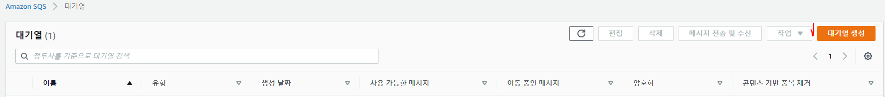

3. 이표준대기열 유형이 기본적으로 선택됩니다. 선택FIFO.

4. 대기열을 생성한 후에는 대기열 유형을 변경할 수 없습니다.

5. 대기열을 입력합니다. FIFO 대기열의 이름은 로 끝나야 합니다..fifo접미사.

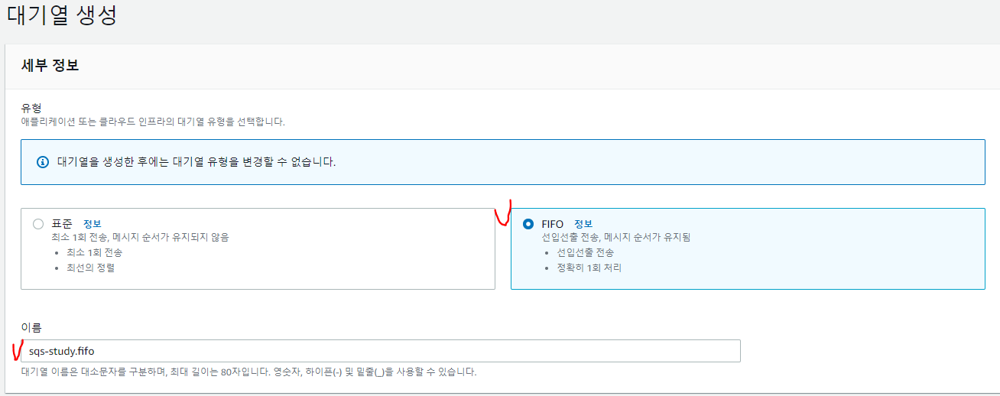

6. 나머지 기본설정 그대로 나두고 대기열 생성 클릭

### 🍔 2단계: 메시지 전송
대기열을 생성한 후 그 대기열에 메시지를 보낼 수 있습니다. 

1. 왼쪽 탐색 창에서Queues. 대기열 목록에서 자신이 생성한 대기열을 선택합니다.

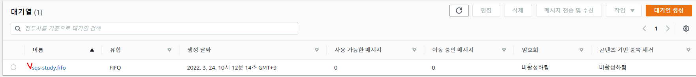

2. 택메시지 전송 및 수신 클릭

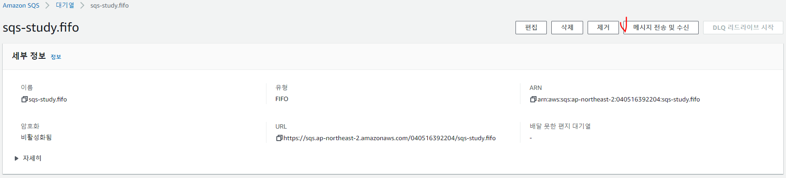

3. 아래와 같이 입력 (콘텐츠 기반 중복 제거가 활성화되어 있으면 메시지 중복 제거 ID가 필요하지 않습니다.)

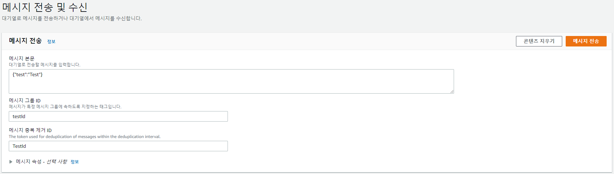

4. 메시지 전송을 선택합니다.
메시지가 전송되고 콘솔이 성공 메시지를 표시합니다. 선택세부 정보 보기을 눌러 보낸 메시지에 대한 정보를 표시합니다.
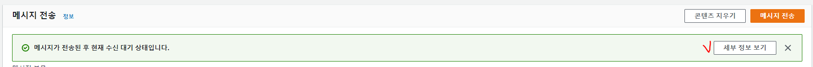

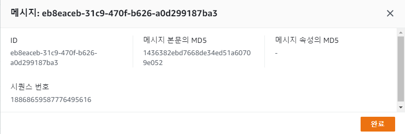

### 🥟 3단계: 메시지 수신 및 삭제
대기열로 메시지를 전송한 후 대기열에서 메시지를 검색할 수 있습니다. 대기열에서 메시지를 요청할 때 검색할 메시지를 지정할 수 없습니다. 검색할 메시지의 최대 개수 (최대 10개) 는 지정할 수 있습니다.

1. 메시지 폴링 클릭.
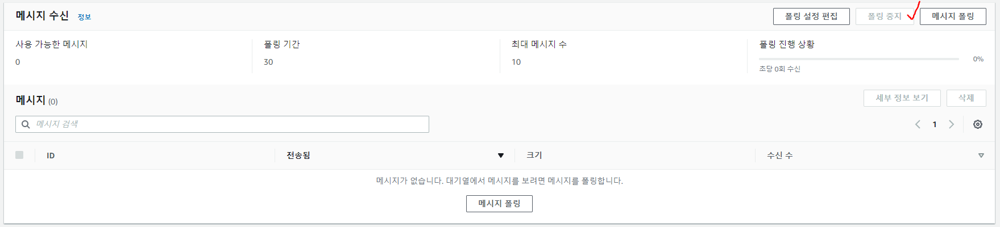


2. Amazon SQS 대기열에서 메시지를 찾기 위해 서버를 폴링하기 시작합니다. 오른쪽의 진행률 표시줄메시지 수신섹션에는 폴링 지속 시간이 표시됩니다.

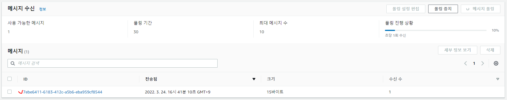

3. 이메시지섹션에 수신된 메시지 목록이 표시됩니다. 각 메시지의 목록에는 메시지 ID, 보낸 날짜, 크기 및 수신 수가 표시됩니다.

4. ID 클릭시 본문 확인가능.

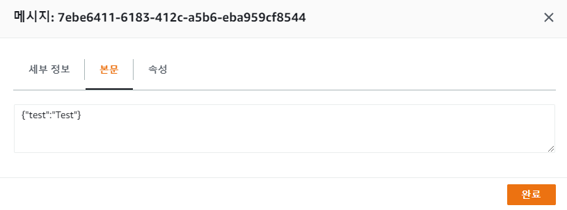

5. 메시지를 삭제하려면 삭제할 메시지를 선택한 다음삭제.

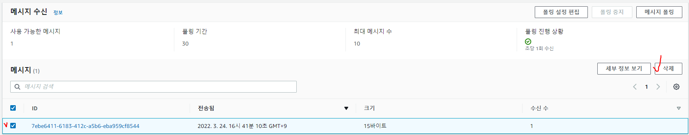


### 🍘 4단계: 대기열 삭제

1. 대기열 목록에서 자신이 생성한 대기열을 선택합니다.

2. 에서Queues페이지에서 삭제할 대기열을 선택합니다.

3. 선택대기열 삭제.

## 🌭 마무리
AWS 콘솔 만으로 SQS대기열 생성하여 큐를 수신 송신 하는 간단한 사용법을 실습해봤다.

이제 실제 프로젝트에서 사용하는 방법을 알아보자.

<br> 
<br>

```toc

```
