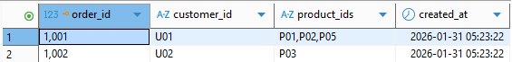
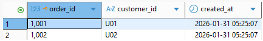
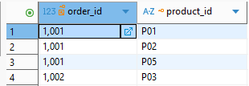
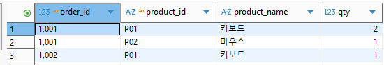
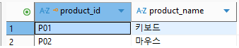
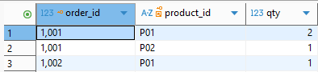
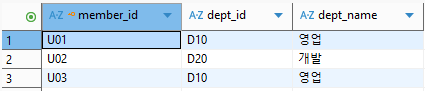
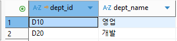
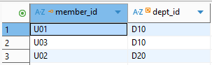

# 정규화

## 1) 데이터 이상(Anomaly)

- **갱신 이상(Update)**: 회원 주소/이름 변경 시, 관련된 모든 행을 찾아 수정 → 누락되면 불일치 발생
- **삽입 이상(Insertion)**: 주문이 없으면 회원/상품 정보를 넣기 어려운 구조가 됨
- **삭제 이상(Deletion)**: 주문을 삭제했는데 그게 유일한 주문이면 회원 정보까지 같이 날아갈 수 있음

---
## 2) 함수 종속성(Functional Dependency)

- 테이블을 올바르게 분리함
- X가 Y를 **유일하게 결정**하면 **X(결정자) → Y(종속자)**

---
## 3) 1정규형(1NF)
- **내용**
  ## 설명

    - 한 칸(속성/컬럼)에 값이 “**원자값(Atomic)**”만 들어가야 함
    - 반복되는 그룹(예: `전화번호1`, `전화번호2` / `상품목록` 같은 배열 느낌)을 컬럼 하나에 묶어서 저장하면 안됨
    - 즉, 테이블의 모든 컬럼은 쪼갤 수 없는 단일 값이어야 함

  **1NF 규칙**: 모든 컬럼은 더 이상 쪼갤 수 없는 **원자값**만 가져야 함.

  ## 예시

  **1NF 위반 (한 칸에 여러 값)**

  `주문` 테이블이 아래와 같이 저장됨

  

    - `product_ids` 한 칸에 여러 개가 들어가서 원자값이 아님.

  ### **1NF 적용 (반복 값 분리)**

  **주문 / 주문상품**으로 분리

  **주문(order)**

  

  **주문상품(order_items)**

  

  ## 장점 / 단점

  ### **장점**

    - 검색/정렬/필터가 쉬워짐 (`상품ID목록 LIKE ‘%P02%’` 필요 없음)
    - 데이터 의미가 명확해지고, 중복/오류 가능성이 줄어듦

  ### **단점**

    - 테이블이 분리되면서 **조인(Join)** 이 늘어날 수 있음
    - 단순 조회 화면에서는 구조가 복잡해 보일 수 있음
  

---
## 4) 2NF: 부분 함수 종속(Partial FD) 제거
- **내용**

  ## 설명

    - **1NF를 만족하면서 “부분 함수 종속(Partial Dependency)” 제거**
    - **복합키(Composite PK)**를 쓰는 테이블에서, 어떤 일반 컬럼이 **PK의 일부에만 의존**하면 2NF 위반
    - 2NF는 특히 **PK가 (A, B)처럼 2개 이상인 테이블**에서 문제가 많이 생김

  ## 예시

  상황 : 주문상품 테이블 (복합 PK: 주문ID + 상품ID)

  주문상품(주문ID, 상품ID) 를 PK로 하고 이런 컬럼이 있다고 가정

  

    - `product_name` 은 사실 `product_id` 만 알면 결정 됨(`order_id` 는 상품명 결정에 필요 없음)
    - 즉, `product_name` 이 **복합키 전체(주문ID+상품ID)가 아니라 상품ID 일부에만 의존** **→ 부분 종속 → 2NF 위반**

  **2NF 적용 (부분 종속 제거)**

    - `product_name` 은 상품 테이블로 뺌
    - `order_product` 에는 주문-상품 관계에 필요한 값만 둠

  **상품(product)**

  

  **주문_상품(order_product)**

  

  ## 장점 / 단점

  ### 장점

    - 같은 상품명 같은 데이터가 주문상품에 반복 저장되는 문제 해결
    - 상품명 변경 시 한 곳만 수정하면 됨 (갱신 이상 Update Anomaly 방지)

  ### 단점

    - 조회 시 조인이 더 필요 (주문상품 + 상품)
    - 초보자 입장에서는 “왜 굳이 나눠?”처럼  느껴질 수 있음

---
## 5) 3정규형(3NF): 이행적 함수 종속(Transitive FD) 제거
- **내용**

  ## 설명

  - **2NF를 만족하면서 “이행적 함수 종속(Transitive Dependency)” 제거**
  - 핵심 : PK가 아닌 일반 컬럼이 **또 다른 일반 컬럼을 결정**하면 3NF 위반

  ## 예시
  3NF 위반 `회원` 테이블에 아래처럼 있다고 가정

  

  - `member_id → dept_id` (회원이 어느 부서인지)
  - `dept_id → dept_name` (부서ID가 부서명을 결정)
  - 결과적으로 `member_id → dept_name` 은 dept_id를 거쳐서 결정됨 → 이행적 종속 → 3NF 위반

  **3NF 적용 (이행 종속 제거)**


  - `dept` 테이블로 분리
  
    

    
  

  ## 장점 / 단점

  ### 장점

  - 부서명 변경 같은 “마스터 데이터” 변경이 부서 테이블 한 번이면 끝
  - 데이터 중복/불일치 방지 (삽입/삭제/갱신 이상 줄어듦)

  ### 단점

  - 조회할 때 테이블이 더 많이 나뉘어 조인 증가
  - 너무 정규화하면 조회 성능/쿼리 복잡도가 올라가서(상황에 따라) 반정규화를 고려하기도 함


---

 ### 정리
- 1NF: 한 칸에 값 하나(원자값), 반복/배열 금지

- 2NF: 복합키에서 “키 일부에만 의존”하는 컬럼 제거

- 3NF: “일반 컬럼이 일반 컬럼을 결정”하는 구조 제거 (PK → A → B)

```toc

```