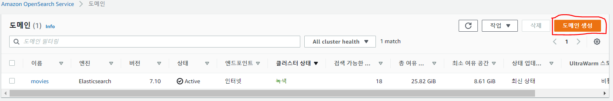
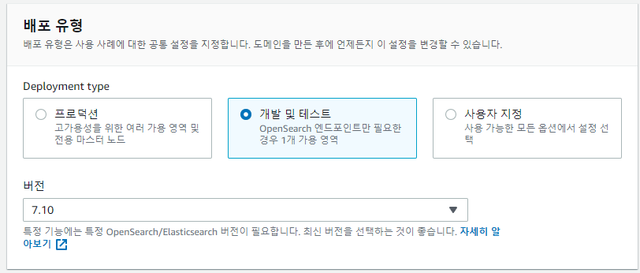
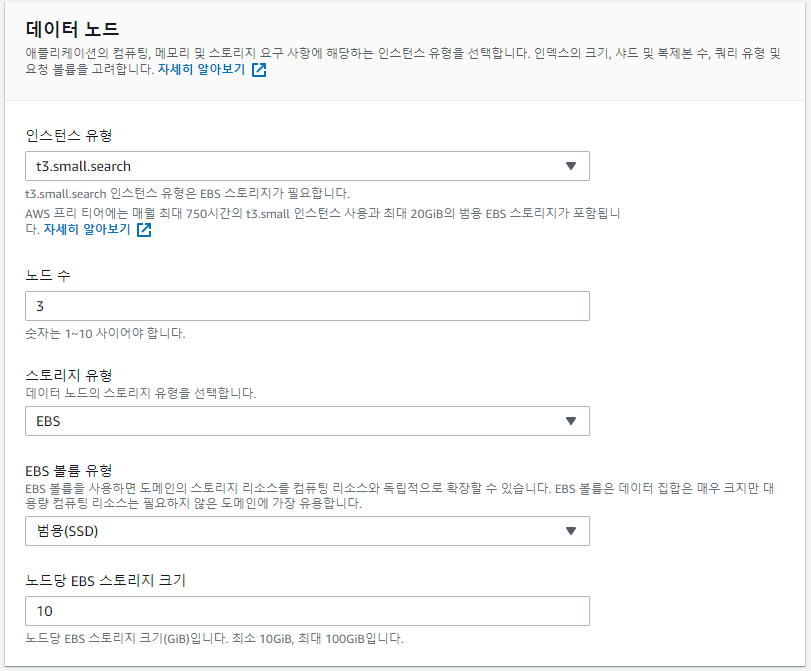
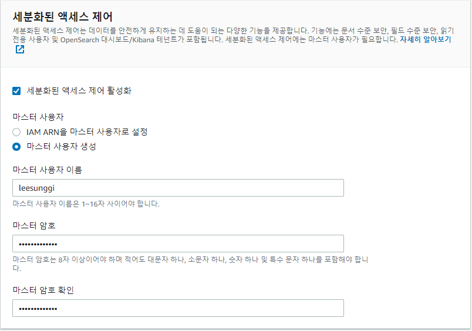
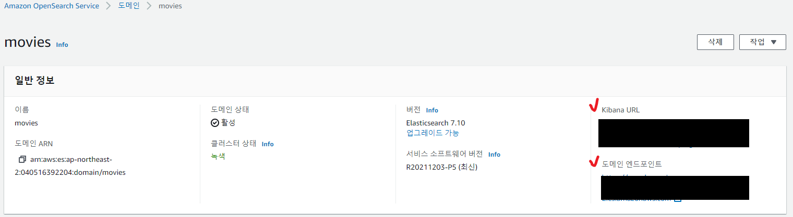
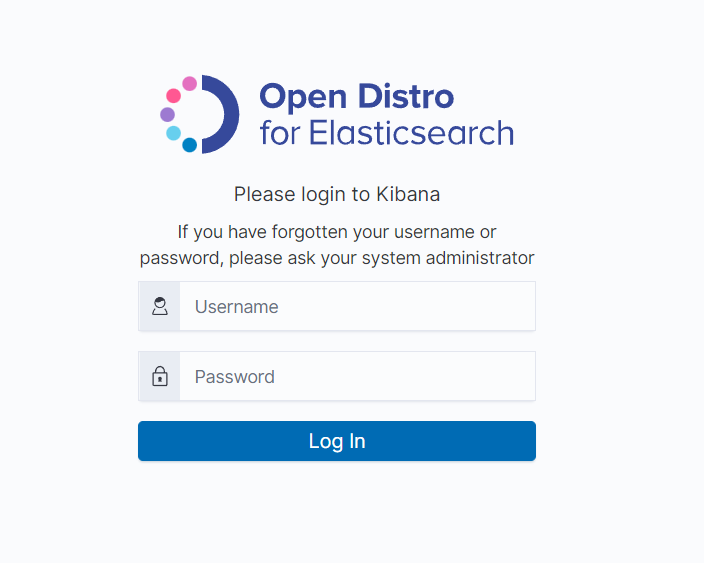
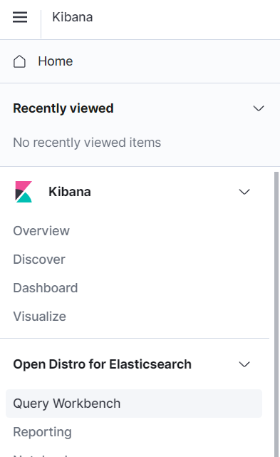
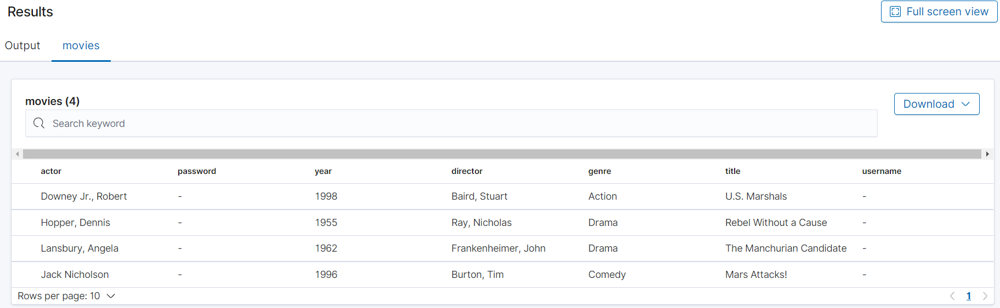

## 🎈 개요
내가 진행한 프로젝트 에서 검색 엔진으로 오픈서치를 선택하여 사용해야하는 상황이 있었다.
해당 부분은 사실 인프라에서 진행하였지만 진행중 공부한 내용들을 기재 하려한다.
이번 글에서는 간단하게 도메인 생성과 키바나접속등 기본적인 내용만 다룰 예정이다.

## 🚀 Amazon OpenSearch Service 시작하기
Amazon OpenSearch Service를 사용하여 테스트 도메인을 만들고 구성하는 방법을 진행해 보자

OpenSearch Service 도메인은 OpenSearch 클러스터와 동의어입니다. 

도메인은 설정, 인스턴스 유형, 인스턴스 수, 스토리지 리소스를 지정한 설정입니다.

### 🦖 1단계: OpenSearch Service 도메인 생성

**콘솔을 사용하여 OpenSearch Service 도메인을 만들려면**

1. https://aws.amazon.com으로 이동하여 콘솔에 로그인(Sign In to the Console)을 선택합니다.

2. 분석(Analytics)에서 Amazon OpenSearch Service를 선택합니다.

3. [도메인 생성(Create domain)]을 선택합니다.



4. 도메인의 이름을 입력합니다. 나는 movies라는 이름을 사용


5. 사용자 지정 엔드포인트(Custom endpoint) 설정을 무시합니다.

6. 배포 유형은 개발 및 테스트(Development and testing)를 선택합니다. 



7. 버전(Version)에서 최신 버전을 선택합니다.

8. 데이터 노드(Data nodes)에서 인스턴스 유형을 t3.small.search로 변경하고 세 개의 노드 기본값을 유지합니다.



9. 간단한 확인을 위해 퍼블릭 액세스 도메인을 사용합니다. [네트워크(Network)]에서 [퍼블릭 액세스(Public access)]를 선택합니다.


10. 세분화된 액세스 제어 설정에서 마스터 사용자 생성(Create master user)을 선택합니다. 사용자 이름과 암호를 입력합니다.



11. 지금은SAML 인증 및 Amazon Cognito 인증 섹션을 무시합니다.

12. [액세스 정책(Access policy)]에서 [세분화된 액세스 제어만 사용(Only use fine-grained access control)]을 선택합니다. 이 자습서에서는 세분화된 액세스 제어를 통해 도메인 액세스 정책이 아닌 인증을 처리합니다.


13. 나머지 설정은 무시하고 [생성(Create)]을 선택합니다. 새 도메인은 일반적으로 초기화하는 데 15~30분 정도 걸리지만 구성에 따라 시간이 더 오래 걸릴 수 있습니다. 도메인이 초기화된 후 엔드포인트를 기록해 둡니다.



14. Kibana URL 을 통해 키바나 접속가능




### 🐻 2단계: 인덱싱을 위해 데이터 업로드

**옵션 1: 단일 문서 업로드**

```
curl -X PUT -u '접근유저명:패스워드' '앤드포인트/movies/_doc/1' -d "{\"director\": \"Burton, Tim\", \"genre\": [\"Comedy\",\"Sci-Fi\"], \"year\": 1996, \"actor\": [\"Jack Nicholson\",\"Pierce Brosnan\",\"Sarah Jessica Parker\"], \"title\": \"Mars Attacks!\"}" -H Content-Type:application/json
```

**옵션 2: 여러 문서 업로드**

bulk_movies.json 이라는 로컬 파일을 생성합니다. 다음 내용을 파일에 복사하여 붙여넣고, 후행 줄바꿈을 추가합니다.

```json
{ "index" : { "_index": "movies", "_id" : "2" } }
{"director": "Frankenheimer, John", "genre": ["Drama", "Mystery", "Thriller", "Crime"], "year": 1962, "actor": ["Lansbury, Angela", "Sinatra, Frank", "Leigh, Janet", "Harvey, Laurence", "Silva, Henry", "Frees, Paul", "Gregory, James", "Bissell, Whit", "McGiver, John", "Parrish, Leslie", "Edwards, James", "Flowers, Bess", "Dhiegh, Khigh", "Payne, Julie", "Kleeb, Helen", "Gray, Joe", "Nalder, Reggie", "Stevens, Bert", "Masters, Michael", "Lowell, Tom"], "title": "The Manchurian Candidate"}
{ "index" : { "_index": "movies", "_id" : "3" } }
{"director": "Baird, Stuart", "genre": ["Action", "Crime", "Thriller"], "year": 1998, "actor": ["Downey Jr., Robert", "Jones, Tommy Lee", "Snipes, Wesley", "Pantoliano, Joe", "Jacob, Ir\u00e8ne", "Nelligan, Kate", "Roebuck, Daniel", "Malahide, Patrick", "Richardson, LaTanya", "Wood, Tom", "Kosik, Thomas", "Stellate, Nick", "Minkoff, Robert", "Brown, Spitfire", "Foster, Reese", "Spielbauer, Bruce", "Mukherji, Kevin", "Cray, Ed", "Fordham, David", "Jett, Charlie"], "title": "U.S. Marshals"}
{ "index" : { "_index": "movies", "_id" : "4" } }
{"director": "Ray, Nicholas", "genre": ["Drama", "Romance"], "year": 1955, "actor": ["Hopper, Dennis", "Wood, Natalie", "Dean, James", "Mineo, Sal", "Backus, Jim", "Platt, Edward", "Ray, Nicholas", "Hopper, William", "Allen, Corey", "Birch, Paul", "Hudson, Rochelle", "Doran, Ann", "Hicks, Chuck", "Leigh, Nelson", "Williams, Robert", "Wessel, Dick", "Bryar, Paul", "Sessions, Almira", "McMahon, David", "Peters Jr., House"], "title": "Rebel Without a Cause"}

```

파일이 저장되는 로컬 디렉터리에서 다음 명령을 실행하여 movies 도메인에 파일을 업로드합니다.
```
curl -XPOST -u master-user:master-user-password domain-endpoint/_bulk --data-binary @bulk_movies.json -H Content-Type:application/json
```


### 💻 3단계: OpenSearch Service에서 문서 검색

Amazon OpenSearch Service 도메인에서 문서를 검색하려면 OpenSearch 검색 API를 사용합니다. 

**명령줄에서 문서 검색**

다음 명령을 실행하여 movies 도메인에서 mars를 검색합니다.

```
curl -XGET -u master-user:master-user-password domain-endpoint/movies/_search?q=mars
```

**Kibana에서 검색**

Query Workbench 클릭
 


Query editor 에 아래의 쿼리 RUN

```sql
select * from movies;
```

데이터 확인




### ⚱ 4단계: OpenSearch Service 도메인 삭제

**콘솔에서 OpenSearch Service 도메인을 삭제하려면**

Amazon OpenSearch Service 콘솔에 로그인합니다.

[도메인(Domains)]에서 movies 도메인을 선택합니다.

[삭제(Delete)]를 선택하고 삭제 의사를 확인합니다.


## 🎢 느낀점

아마 오픈서치를 사용하는 사람이라면 키바나의 기능을 제공하는것에 감사함을 느끼며 키바나를 활용을 많이 할듯싶다..

콘솔로도 가능한 기능들이 맞지만 확실히 쿼리에 익숙한 사람이라면 키바나를 사용하는걸 추천한다.

그리고 요번 튜토리얼에는 퍼블릭으로 도메인을 생성하여서 간단하게 테스트 했지만 실제 프로젝트에서 vpc 엑세스를 권장한다

다음에는 스프링 부트에서 오픈서치를 사용하는 방법을 포스팅할 예정이다.

```toc

```
