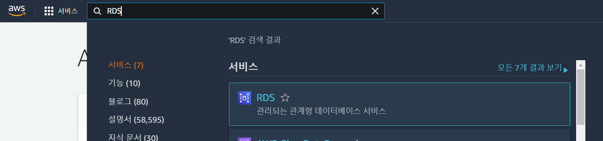
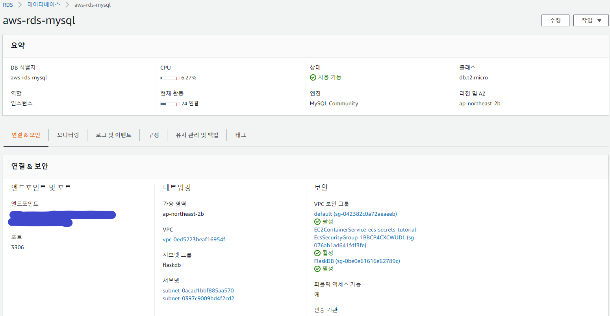
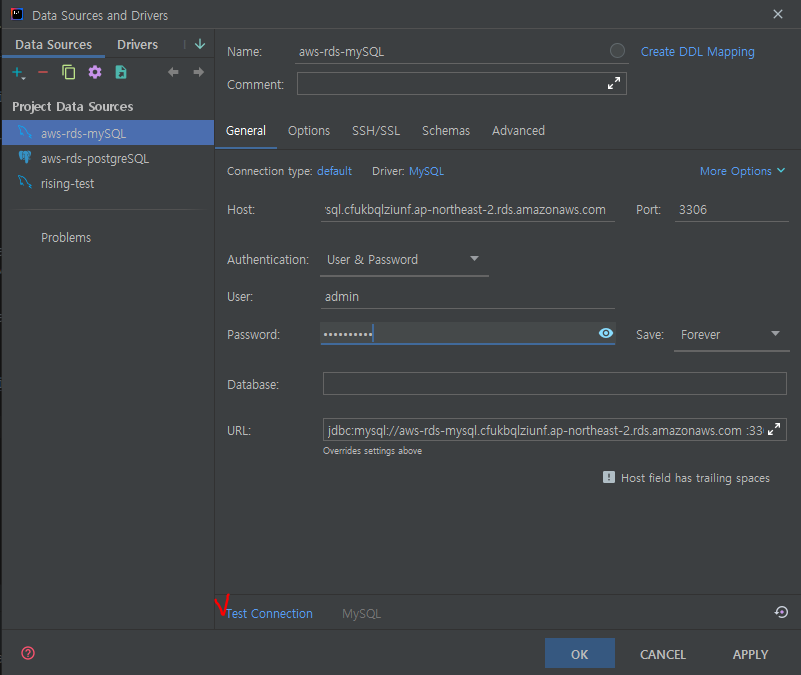
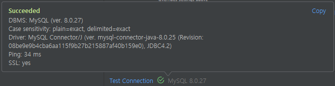
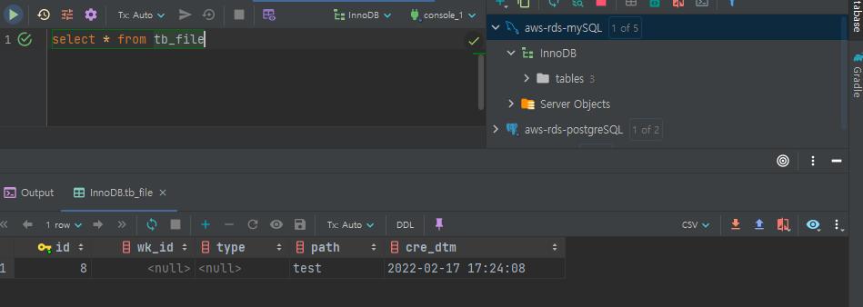
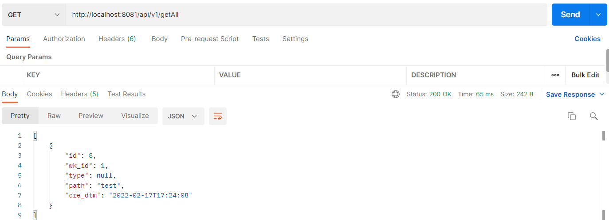

## 📌 AWS RDS(mySQL) 연동

**간단한 RDS 연동 실습**

> ✅ DB 엔진은 mySQL로 실습

### 🎰 인텔리제이 연동 실습

1. AWS RDS 콘솔 접근 



2. 데이터베이스 클릭.


생성 되어있는 DB 인스턴스를 확인할수 있다.

3. mySQL로 생성된 식별자 클릭하여 들어간다.



우리가 필요한 정보를 확인한다. 
- DB 식별자
- 엔드포인트
- 포트
- 엔진

4. 인텔리제이 에서 database텝에서 datasource를 mySQL로 선택해준다.


5. Name을 지정하고 Host에 위에서 확인한 엔드포인트를 넣고 rds생성시 지정한 User,Password 값을넣고 Test Connection클릭





위와같이 test가 되었으면 인텔리제이 에서 확인가능하다.




### 🔮 서비스 연동 실습

1. build.gradle 의존성 추가

```
implementation group: 'mysql', name: 'mysql-connector-java', version: '8.0.27'
implementation 'org.springframework.boot:spring-boot-starter-data-jpa'
```

2. 데이터 소스 정의 application.yml
```yml
spring:
    datasource:
        driver-class-name: com.mysql.jdbc.Driver
        url: jdbc:mysql://자신의 엔드포인트:포트/InnoDB
        username: 접근이름
        password: 접근비밀번호
```

3. 엔티티,리포지토리 생성

```java
@Entity
@Getter
@Table(name = "tb_file")
@NoArgsConstructor
public class TbFile {
	
	@Id
	@GeneratedValue(strategy = GenerationType.IDENTITY)
	private int id;
	
	private int wk_id;
	private String type;
	private String path;
	private LocalDateTime cre_dtm = LocalDateTime.now();
	
	@Builder
	public TbFile(int wk_id, String type, String path) {
		this.wk_id = wk_id;
		this.type = type;
		this.path = path;
	}
}
```
```java
@Repository
public interface TbFileRepository extends JpaRepository<TbFile, Integer>{
}
```

4. 테스트 컨트롤러 생성

```java
@RestController
@RequestMapping("/api/v1")
public class DBTestController {
    @Autowired
    private TbFileRepository tbFileRepository;

    @GetMapping("/getAll")
    public ResponseEntity getAll(){
        List<TbFile> List = new ArrayList<>();
        List = tbFileRepository.findAll();
        return new ResponseEntity<>(List, HttpStatus.OK);
    }
}
```

5. 포스트맨 테스트




### 🎲 마무리
위의 실습과 같이 mySQL 엔진으로 생성된 RDS에 연동하고 기본적인 데이터까지 조회를 해보았다.
다른 엔진도 다른점이 거의 없으며 이로써 개발시 RDS에 연동하여 작업이 가능한걸 확인 할수있다.

<br>
<br>

```toc

```
