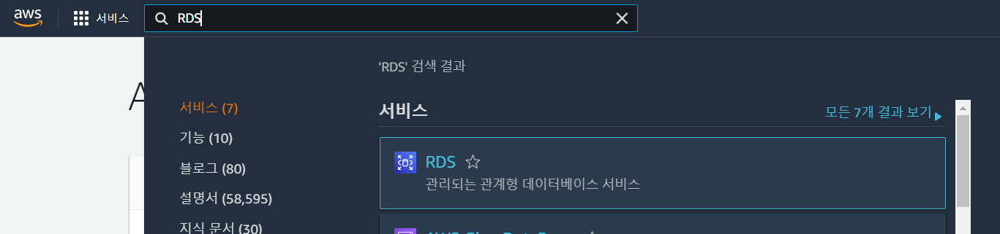
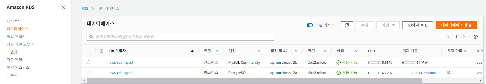
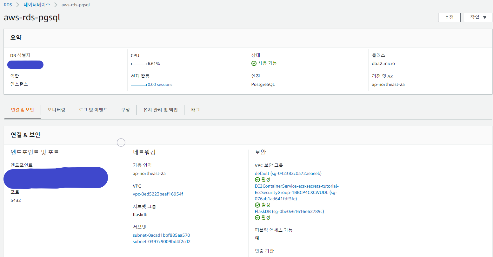
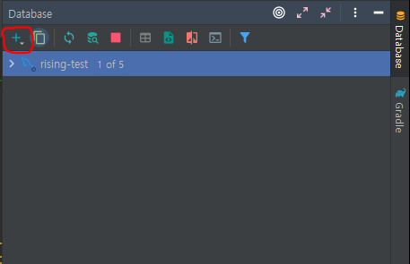
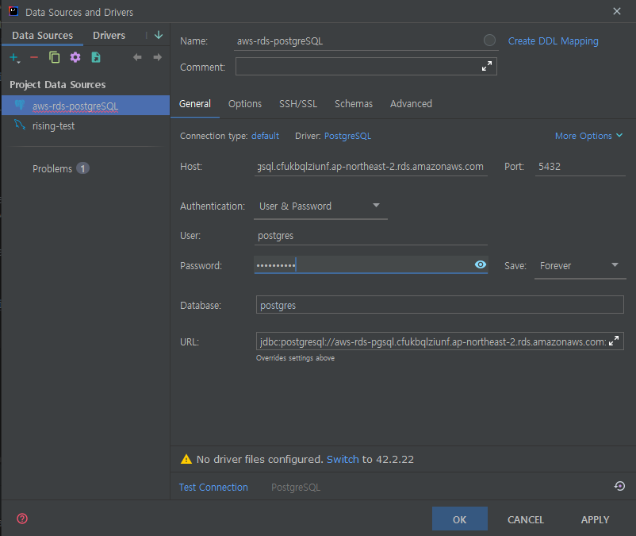
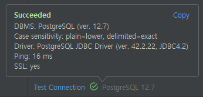
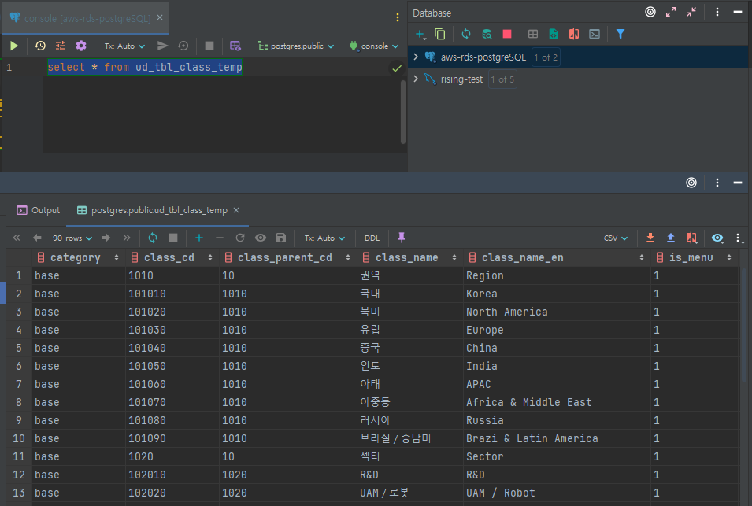
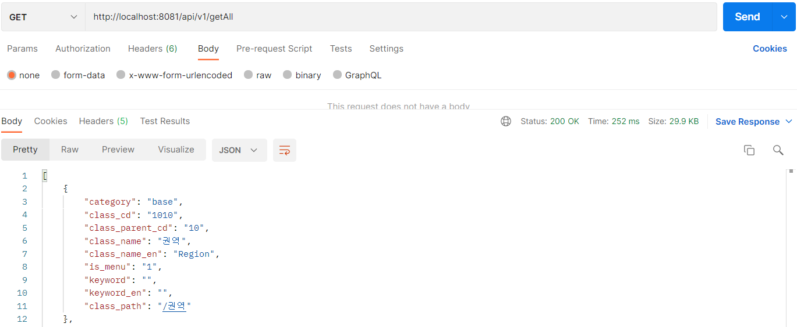

## 📌 AWS RDS(postgreSQL) 연동

**간단한 RDS 연동 실습**

> ✅ DB 엔진은 postgreSQL로 실습

### 🎰 인텔리제이 연동 실습

1. AWS RDS 콘솔 접근 



2. 데이터베이스 클릭.



생성 되어있는 DB 인스턴스를 확인할수 있다.

3. postgreSQL로 생성된 식별자 클릭하여 들어간다.



우리가 필요한 정보를 확인한다. 
- DB 식별자
- 엔드포인트
- 포트
- 엔진

4. 인텔리제이 에서 database텝에서 datasource를 postgreSQL로 선택해준다.



5. Name을 지정하고 Host에 위에서 확인한 엔드포인트를 넣고 rds생성시 지정한 User,Password 값을넣고 Test Connection클릭





위와같이 test가 되었으면 인텔리제이 에서 확인가능하다.




### 🔮 서비스 연동 실습

1. build.gradle 의존성 추가

```
implementation group: 'org.postgresql', name: 'postgresql', version: '42.3.1'
implementation 'org.springframework.boot:spring-boot-starter-data-jpa'
```

2. 데이터 소스 정의 application.yml
```yml
spring:
    datasource:
        driver-class-name: org.postgresql.Driver
        url: jdbc:postgresql://자신의 엔드포인트:포트/postgres
        username: postgres
        password: 접근비밀번호
```

3. 엔티티,리포지토리 생성

```java
@Getter
@NoArgsConstructor
@Entity
@Table(name = "ud_tbl_class_temp")
public class UdTblClassTemp {

	private String category;
	@Id
	private String class_cd;
	private String class_parent_cd;
	private String class_name;
	private String class_name_en;
	private String is_menu;
	private String keyword;
	private String keyword_en;
	private String class_path;

	@Builder
	public UdTblClassTemp(String category, String class_cd, String class_parent_cd, String class_name,
			String class_name_en, String is_menu, String keyword, String keyword_en, String class_path) {
		super();
		this.category = category;
		this.class_cd = class_cd;
		this.class_parent_cd = class_parent_cd;
		this.class_name = class_name;
		this.class_name_en = class_name_en;
		this.is_menu = is_menu;
		this.keyword = keyword;
		this.keyword_en = keyword_en;
		this.class_path = class_path;
	}
```
```java
public interface UdTblClassTempRepository extends JpaRepository<UdTblClassTemp, String>{

}
```

4. 테스트 컨트롤러 생성

```java
@RestController
@RequestMapping("/api/v1")
public class DBTestController {
    @Autowired
    private UdTblClassTempRepository udTblClassTempRepository;

    @GetMapping("/getAll")
    public ResponseEntity getAll(){
        List<UdTblClassTemp> categoryList = new ArrayList<UdTblClassTemp>();
        categoryList = udTblClassTempRepository.findAll();
        return new ResponseEntity<>(categoryList, HttpStatus.OK);
    }
}
```

5. 포스트맨 테스트




### 🎲 마무리
위의 실습과 같이 postgreSQL 엔진으로 생성된 RDS에 연동하고 기본적인 데이터까지 조회를 해보았다.
다른 엔진도 다른점이 거의 없으며 이로써 개발시 RDS에 연동하여 작업이 가능한걸 확인 할수있다.

<br>
<br>

```toc

```
