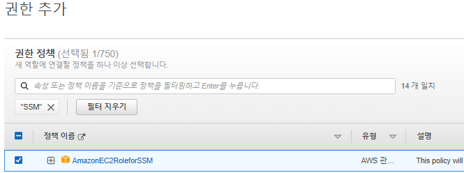

## 🎈 EC2 인스턴스 생성하기
먼저 테스트를 위해 인스턴스를 하나 생성 합니다.

> 🙏 ec2 생성방법은 [링크](https://leesungki.github.io/gatsby-aws-study-ec2-tuto/)를 참고해주세요! 해주세요~!


나는 이렇게 conect라는 이름으로 생성해주었다

### 💪 프라이빗 키 파일을 통한 접속

인스턴스를 생서할때 다운받은 key 파일이 있을것이다.

나는 C:\Users\leesu 해당 경로에 옮겨주었다.

윈도우 사용자의 경우 해당 pem 파일의 권한을 수정해 줘야한다.

권한 수정은 👉 [참고](https://chinsun9.github.io/2020/10/26/aws-ec2-keypair-%EC%84%A4%EC%A0%95/)

1. 생성한 인스턴스를 체크하고 연결버튼 클릭


2. SSH 클라이언트 클릭


맨아래 예시의 명령어를 복사하여 커멘드 창에서 실행


접속이 완료된걸 확인할수 있다.

### 💪 Session Manager 활용하여 접속하기
EC2를 사용하다 보면 SSH Key 파일이 없는데 급하게 서버에 붙어야 하는 상황이 생기게 된다. AWS에서는 session manager 라는 기능을 제공하여 key 파일 없이 AWS console에서 EC2에 접속할 수 있도록 한다.

[session manager란?](https://docs.aws.amazon.com/ko_kr/systems-manager/latest/userguide/session-manager.html) 참고 바란다

EC2의 우측 상단에 있는 연결 버튼을 클릭하여 인스턴스에 연결 화면으로 이동한다. Session Manager 탭을 클릭하면 연결 버튼이 활성화 되어 있는 경우 바로 연결 하면 되지만, 대부분의 경우 아래와 같이 비활성화가 되어있다.


1. Session Manager(SSM) 사전 조건

session manager 를 사용하기 위해서는 아래 조건을 만족해야 한다.

- EC2 Role에 session manager 를 사용할 수 있는 권한이 포함되어야 한다.

- EC2에 session manager agent 가 설치되어야 한다. (AMI 사용시 session manage agent가 포함된 경우도 있지만, 아닌경우 수동으로 설치해야 한다.)

- EC2의 outbound에 443 포트가 any로 오픈 되어 있어야 한다. SSM은 443으로 EC2와 통신하기 때문에 443을 any로 열어주어야 접속 가능하다.


2. EC2 Role에 Session Manager 권한(정책) 추가하기


인스턴스 선택 후 작업 – 보안 – IAM 역할 수정을 선택한다.


새IAM 역할 생성을 클릭한다.


역할 만들기 클릭한다.


ec2에 체크후 다음 클릭



해당 롤 검색하여 체크후 다음 클릭


역할이름을 작성후 역할 생성해준다.


그다음 다시 인스턴스 선택 후 작업 -> 보안 -> IAM 역할 수정을 클릭해서 

방금 생성한 IAM 역할을 인스턴스에 붙인다. AmazonEC2RoleforSSM 정책은 SSM을 사용하기 위해 AWS에서 관리하는 관리형 정책이다.

저장 클릭

3. EC2 에 SSM Agent 설치하기

ssh터널링을 통해 인스턴스에 접근하여

[가이드 문서](https://docs.aws.amazon.com/ko_kr/systems-manager/latest/userguide/sysman-manual-agent-install.html)를 참고하여 각자의 OS에 맞는 명령어를 수행한다.

나의 경우 아래와 같이 설치를 하였다.


아래 명령어를 수행하여 ssm agent가 실행중인지 확인한다.

```
sudo systemctl status amazon-ssm-agent
```


상태가 active가 아닌 stoppted, inactive, disabled로 나오는 경우 아래 명령어를 실행하여 서비스를 시작한다.

```
sudo systemctl enable amazon-ssm-agent
```

4. EC2의 outbound rule에 443 추가하기

EC2의 보안 그룹에 443 any Rule을 추가한다.


5. SSM을 활용하여 EC2에 연결하기

위의 조건을 전부 만족하면 연결 버튼이 활성화 된다. 연결 버튼을 클릭하여 인스턴스에 접속한다.


Role을 먼저 추가한 후 agent를 설치해야 agent 서비스가 실행되면서 role 의 정책을 확인한다.

위의 과정을 다 수행했는데도 제대로 연결이 되지 않는 경우 agnet를 재실행한다.

```
sudo systemctl restart amazon-ssm-agent
```

key 파일 없이도 EC2에 연결이 가능해졌다.


아래 명령어를 수행하여 SSH 접속과 동일하게 원하는 사용자로 변경하여 사용가능하다.

```
sudo su - {user명}
```
 
이렇게 연결되는 세션은 AWS의 System Manager 서비스에서 조회 및 관리가 가능하다.

## 🌭마무리
이상으로 EC2 인스턴스에 접속하는 방법에 대해 알아보았습니다.
개발할때 세션 메니저를 통한 접속이 편하니 인프라팀에게 무조건 해달라고해라...

```toc

```
