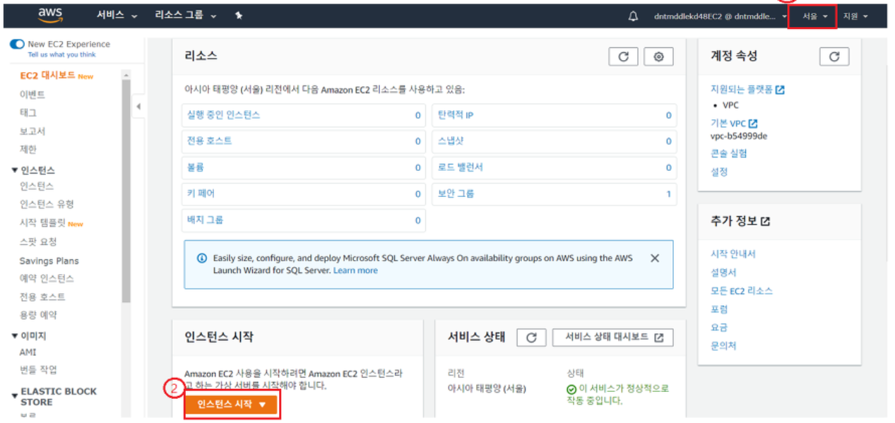
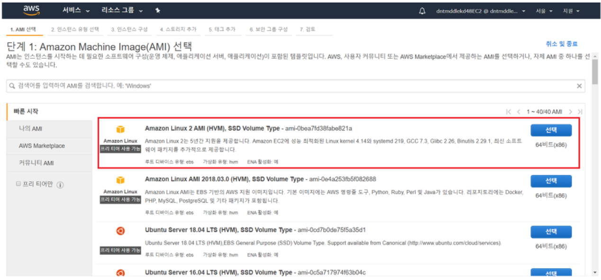
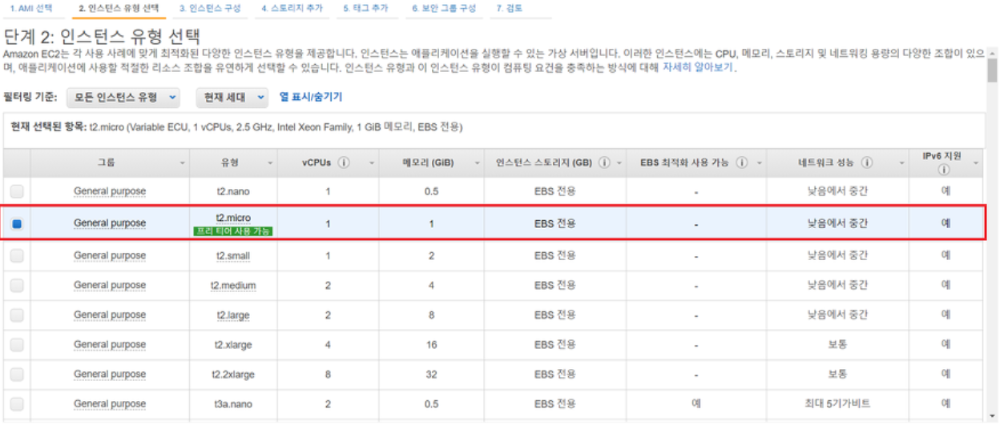
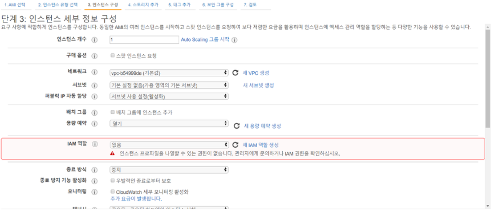
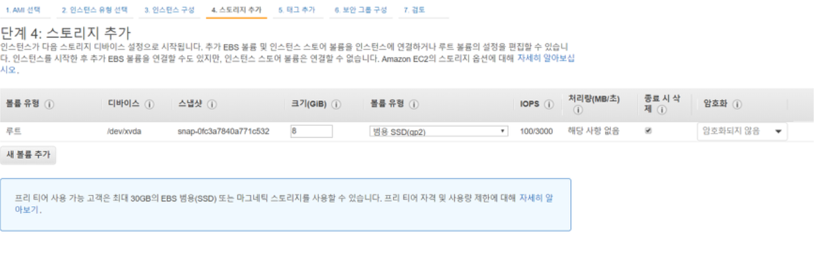
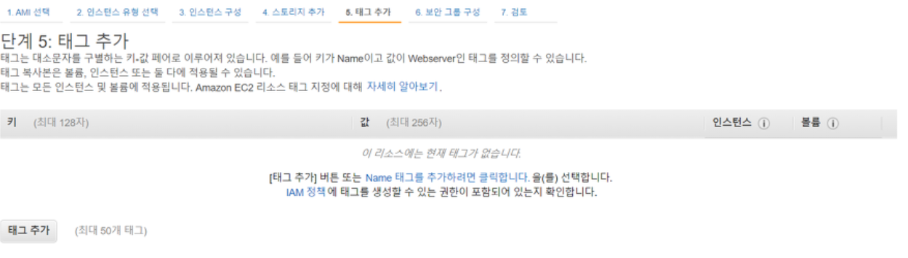
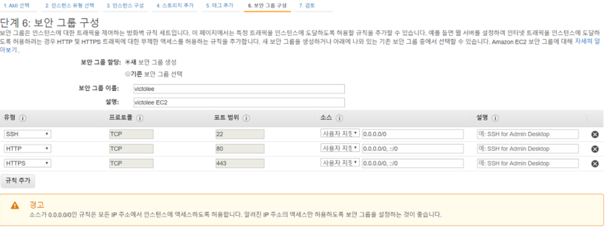
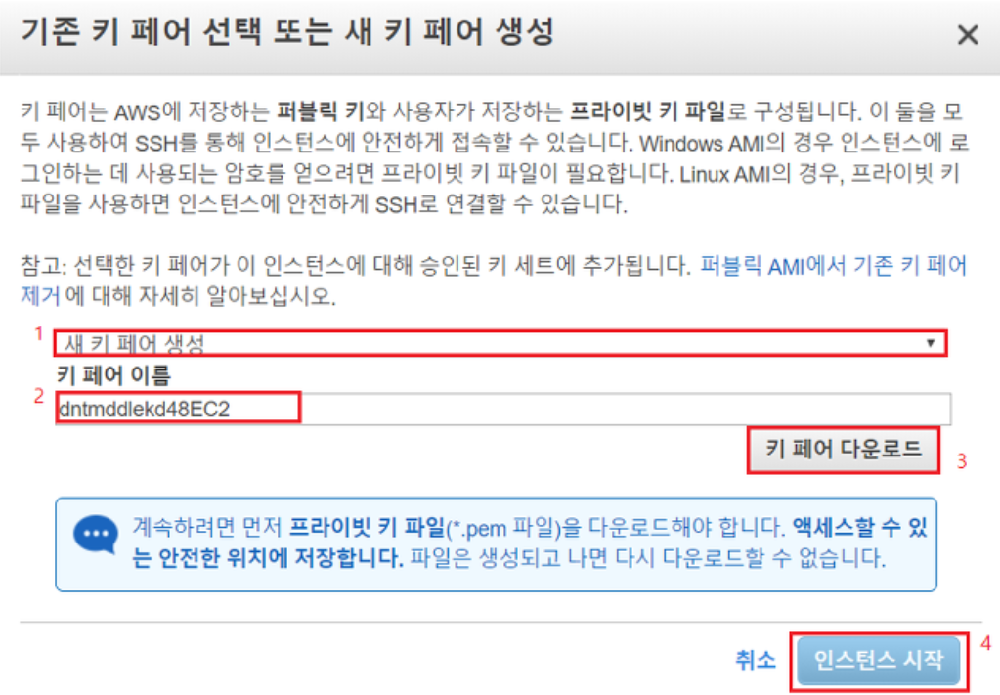
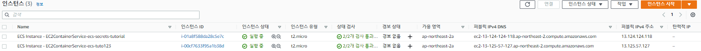

## 🎈 EC2 인스턴스 생성하기

EC2 서비스에서 생성한 가상 서버를 인스턴스라 합니다.

서버를 켜고 끄는것은 인스턴스를 실행하고 종료한다는 의미와 같습니다.

1. 인스턴스 시작



우측 상단에 region을 서울로 선택하고, "인스턴스 시작" 버튼을 클릭합니다.
아래의 각 단계마다 "?"아이콘 또는 링크에 자세한 공식문서 설명이 있으므로, 공식문서를 꼭 참고하시길 바랍니다.

2. AMI 선택



보시는 이미지들은 AWS에서 제공하는 이미지들입니다.

AMI는 서버에 필요한 운영체제와 여러 소프트웨어들이 적절히 구성된 상태로 제공되는 템플릿으로서, 이미지를 통해 인스턴스를 쉽게 만들 수 있습니다.

여기서는 "Amazon Linux 2 AMI (HVM), SSD Volume Type" 인스턴스를 선택합니다.

Amazon Linux 2는 차세대 Amazon Linux 운영 체제로, 현대식 애플리케이션 환경에 Linux 커뮤니티의 최신 향상 기능과 함께 장기적인 지원을 제공한다고 합니다.

3. 인스턴스 유형 선택



사용목적에 따라 CPU, 메모리 등을 선택하여 인스턴스를 생성할 수 있습니다.

저는 프리티어를 사용할 것이므로 프리티어에 체크 후, 다음으로 넘어갑니다.

4. 인스턴스 세부 정보 구성



세부 구성을 설정합니다.

모두 기본값으로 설정해도 무방합니다.

5. 스토리지 추가



인스턴스의 스토리지를 설정합니다.

Root 장치는 꼭 있어야 합니다.

또한 볼륨 유형에 따라 비용의 차이가 있는데, 여기서는 기본 값인 범용 SSD를 선택합니다. 

모두 기본값으로 설정하고 넘어가도 무방합니다.

6. 태그 추가



고유의 메타데이터를 태그의 형태로 각 리소스에 배정하면 인스턴스, 이미지 및 기타 EC2 리소스를 쉽게 관리할 수 있는 태그를 설정합니다.

굳이 설정하지 않고 넘어가도 무방합니다.

7. 보안 그룹 구성



인스턴스에 대한 트래픽을 제어하는 방화벽을 설정합니다.

인스턴스는 가상머신이므로 터미널을 통해 접속해야 하기 때문에, SSH 22번 포트만 기본값으로 작성되어있는 상태입니다.


추가적으로 방화벽 오픈이 필요하다면 입력해주시면 됩니다.

웹 서버로 활용되면 HTTP(80) / HTTPS(443) 정도 추가해줘도 좋을것 같습니다.

8. 인스턴스 시작 검토

적용 사항을 확인하고 "시작"버튼을 클릭합니다. 

9. 키 페어 선택/생성



키 페어(key pair)는 SSH 터미널로 인스턴스에 접근할 때 꼭 필요한 파일입니다.

외부에 노출되어서도 안되며, 잃어버려서도 안되기 때문에 개인이 꼭!! 잘 보관하고 있어야 합니다.

키 쌍을 다운받고 "인스턴스 시작"을 눌러서 인스턴스를 시작합니다.

10. 인스턴스 확인



이와 같이 "실행중" 상태가 됩니다. 

## 🌭마무리
이상으로 EC2 인스턴스를 생성하는 방법에 대해 알아보았습니다.

출처: https://victorydntmd.tistory.com/61

```toc

```
