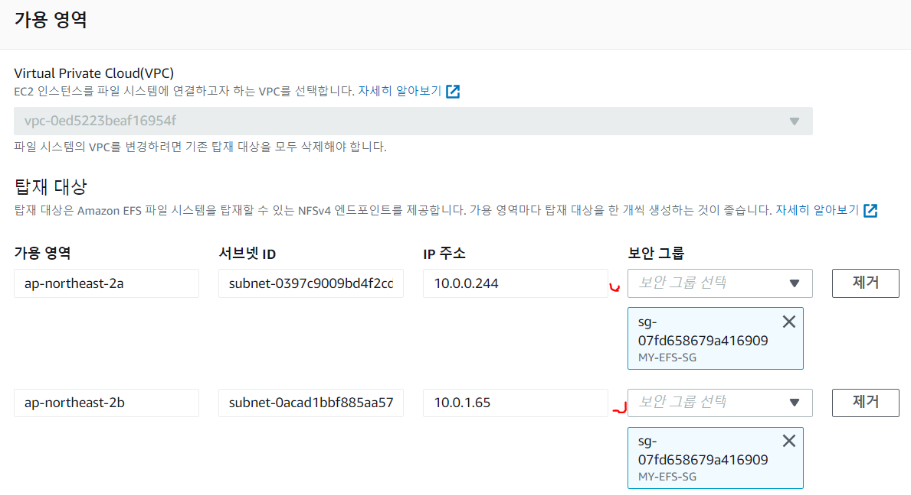

## 🎈 EFS 실습
AWS EFS를 생성하여 EC2에 마운트하여 파일이 공유되는지 확인해 보자.

### 🎆 EFS 생성하기
 
EFS 콘솔 접속 -> 파일 시스템 생성 클릭

이름 : my-efs

마운트할 EC2 인스턴스와 같은 VPC 선택

> 나는 이전에 ec2 인스턴스를 2개 생성해 놨다.


my-efs 클릭하여 세부 정보 보기

생성된 efs 의 전용 보안그룹이 필요하다.

새로운 보안 그룹을 생성해준다.


> vpc는 나의 ec2와 같은 vpc로 잡아주면 된다

다시 내가 생성한 efs 파일시스템 세부정보 보기를 클릭후

네트워크 탭에서 관리 버튼 글릭후 보안 그룹을 내가 생성한 그룹으로 바꿔준다.




 

### 🎇 EFS 파일 시스템 - 마운트 방법(재부팅 하면 마운트 해제됨)

생성한 파일 시스템을 선택한 후에


연결 버튼을 클릭한다.


연결 버튼을 누르면 인스턴스에 탑재하는 명령어가 나온다.

나의 경우에는 EFS 탑재 헬퍼를 사용해 마운트를 진행한다.


이제 탑재를 진핼할 EC2에 접속한다.

탑재 헬퍼를 사용하려면 amazon-efs-utils 패키지를 설치해야 합니다.

```
//설치명령어
sudo yum install -y amazon-efs-utils
```

mkdir /data 명령어를 이용해 data 폴더를 마운트 지점으로 하겠습니다.

해당 폴더로 이동한뒤 위에서 복사한 탑재 헬퍼를 이용한 마운트 명령어를 붙여넣기 합니다.


또다른 EC2 인스턴스에서도 같은 과정을 진행합니다.

2번째 인스턴스에서는 탑재지점을 efs로 지정했습니다.

2번째 인스턴스에 탑재된 efs 경로에 테스트용 파일을 하나 생성해준다.


2번째 인스턴스에 만든 파일이 1번째 인스턴스 한테도 공유된걸 확인할수 있다.


### ✨ EFS 파일 시스템 - 자동 마운트 방법(재부팅해도 마운트 유지)

1. 편집기를 통해 /etc/fstab 파일을 열어준다.
```
sudo vi /etc/fstab
```

2. 자동 탑재 명령어를 이용해, /data를 마운트 지점으로 해서 명령어를 입력합니다.

```
file-system-id:/ 'efs-mount-point' efs _netdev,tls 0 0
```

* _netdev 옵션은 네트워크에 연결 후 마운트하라는 옵션입니다. 이렇게 해야 시스템 시작 시 문제 없이 해당 네트워크 경로로 자동 마운트 됩니다.

_netdev이 빠진 경우 EC2 인스턴스가 응답을 중지합니다.

## 🧨 마무리

이렇게 해서, EFS 파일 시스테 생성 및 마운트를 해봤다.

로컬에서 해당 인스턴스에 접근하여 EFS에 파일을 올리는 방법은 무엇이 있을까?

해당 부분을 좀더 공부해 봐야겠다.

```toc 

```
