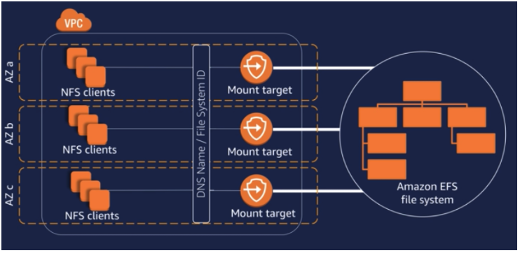

## 🎈 AWS Elastic File System 란? 
AWS EFS는 파일 방식으로 데이터를 저장하는 AWS의 대표 fully-managed file storage 서비스이다. 

파일 스토리지는 일반적으로 OS에서 이용되는 파일 시스템에 사용되는 비교적 친숙한 방식의 스토리지이다. 

AWS EFS가 갖는 주요 특징들을 알아보자.

### EFS 의 특징 
 
<h3>계층적 구조</h3>

파일 스토리지는 block 혹은 object 방식의 스토리지와 달리, 폴더와 파일로 구성된 계층적 구조를 갖는다.

<h3>공유 가능</h3>

AWS EFS는 SAN 방식으로 구현된 AWS EBS와 다르게, NFS(Network File System)를 기반으로 여러 EC2 인스턴스가 동일한 파일 시스템을 공유할 수 있다. AWS EFS는 기본적으로 수 천 여개의 concurrent NFS connection을 지원한다.

<h3>유연한 확장</h3>

Elastic 이라는 이름처럼, AWS EFS는 파일이 추가/삭제됨에 따라 스토리지의 용량이 탄력적으로 증가/감소하게 된다. 이러한 특징은 적절한 용량과 IOPS 등을 예측하기 힘든 공유 파일 스토리지를 운영의 번거로움을 크게 줄여줄 뿐만 아니라 비용을 최소화할 수 있다는 장점이 있다.

<h3>다양한 성능 옵션</h3>

Throughtput, IOPS 등과 같이 디스크 성능과 관련된 다양한 옵션을 제공한다. 사용자는 어플리케이션의 요구에 맞춘 최적의 file storage를 구성할 수 있다. 주요 옵션으로 General Purpose와 Max I/O 모드를 지원한다. General Purpose모드와 Max I/O 모드는 각각 low-latency와 high throughput & high IOPS에 최적화 되어있다. 따라서, latency-sensitive한 어플리케이션의 경우 General Purpose, Large-scale and data-heavy 어플리케이션은 Max I/O가 좋은 선택지가 될 수 있다.

<h3>고가용성</h3>

AWS EFS는 서로 다른 AZ에 데이터를 복제하는 방식으로 높은 데이터의 안정성과 가용성을 보장한다.

<h3>보안 정책</h3>

AWS EFS는 VPC security group과 network ACL을 기반으로 네트워크 정책을 구성할 수 있다. 추가적으로, IAM을 통한 권한 제어가 가능하다. AWS EFS를 마운트한 이후에는 일반적인 파일 시스템과 동일하게 POSIX permission 설정을 지원한다.

### Architecture



<h3>NFS client</h3>

NFS server에 해당하는 AWS EFS를 마운트하여 사용하는 EC2 인스턴스에 해당한다. NFS client는 mount point를 통해 AWS EFS에 접근할 수 있다. 그림 상에서는 모든 AZ에서 AWS EFS를 사용할 수 있는 것으로 표현되었으나, 실제로는 storage class에 따라서 AWS EFS에 접근할 수 있는 AZ의 수가 제한될 수 있다.

<h3>Mount target</h3>

NFS client가 AWS EFS를 마운트하기 위해 필요한 NFSv4 endpoint로 IP 주소와 DNS를 제공한다. Standard storage class를 사용하는 경우, 각 AZ마다 1개의 mount taget을 생성할 수 있다. One Zone storage class를 사용하는 경우, AWS EFS가 위치한 AZ에만 제한적으로 1개의 mount point를 생성할 수 있다.


<h3>DNS name/ File System ID</h3>

NFS client가 편리하게 AWS EFS에 접근하기 위해 제공되는 DNS 서비스이다.

## 🧨 마무리

이렇게 위와 같은 특징을 가지고 있는 efs를 사용하는 간단한 실습도 진행해 보자.


```toc

```
