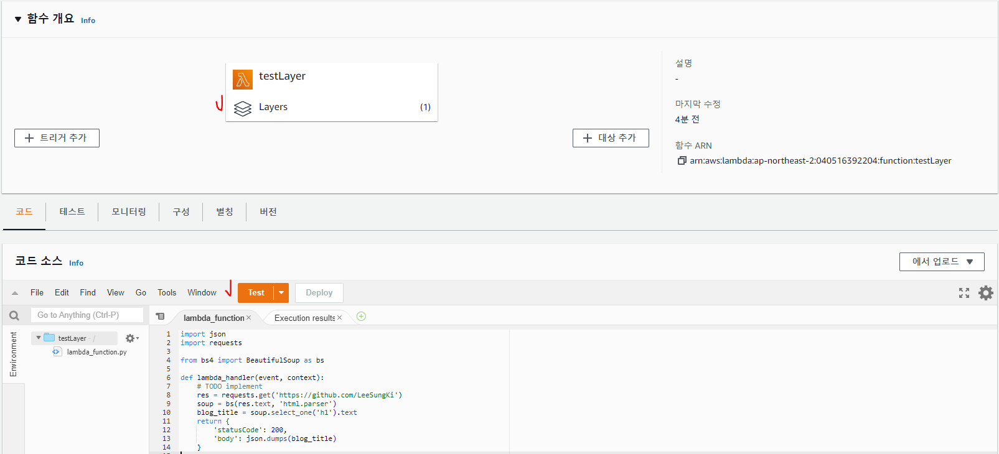

## 🎈 Lambda Layers의 핵심?

**“Lambda에 코드 만들어 올릴 때 매번 패키지(pip 패키지 등) 세트 만들어 올리는거 귀찮았지? 같은 Dependency 가지는 함수라면 코드만 따로 빼고 의존성 패키지는 Layers라는 곳으로 빼서 사용해!”**

즉, 굉장히 편리해진 요소가 추가된 것이죠. 그렇다면 Layers는 어떻게 동작할까요?

> ✅ 람다 사용을 위해 간단한 예제를 통한 실습을 해보자.

## 🍕튜토리얼

### Lambda Layers는 어떻게 사용하나요?

<h3>Lambda 함수로 만들 코드 작성하기</h3>

아주아주 간단하고 심플한 크롤링 코드를 Lambda에 올려 사용한다고 가정해봅시다. 해당 코드는 requests와 bs4라는 모듈을 사용합니다.
이 블로그를 긁어 h1태그 하나의 글자를 가져와봅시다.

```py
import json
import requests

from bs4 import BeautifulSoup as bs

def lambda_handler(event, context):
    # TODO implement
    res = requests.get('https://github.com/LeeSungKi')
    soup = bs(res.text, 'html.parser')
    blog_title = soup.select_one('h1').text
    return {
        'statusCode': 200,
        'body': json.dumps(blog_title)
    }
```
하지만 아무런 준비 없이 AWS Lambda 콘솔에서 위 코드를 저장하고 실행하면 아래와 같은 No module named 'requests' 에러가 납니다.

```
Response:
{
  "errorMessage": "Unable to import module 'lambda_function'"
}

...

Unable to import module 'lambda_function': No module named 'requests'
```

위 에러 메시지는 requests라는 모듈을 찾을 수 없다는 파이썬 에러입니다. 당연히 설치되어있지 않기 때문에 에러가 발생합니다. Lambda Layers를 이용해 이 이슈를 해결해봅시다.


<h3>크롤링 의존 패키지들 Lambda Layers로 만들기</h3>

이제 AWS Lambda Console을 켜 줍시다. Lambda 서비스 항목 중 “계층” 혹은 Layers를 누르고 “계층 생성”을 눌러줍시다.


아래와 같이 새로운 Lambda Layer를 생성하는 창이 뜹니다.


이제 requests와 bs4가 들어있는 zip 압축파일을 업로드해야 하는데요, 크롤링을 위한 패키지가 아래 Github Repo에 준비되어 있습니다. 아래 Direct Download 링크를 통해 pack.zip파일을 받아 업로드 해주세요.

> Github Repo: https://github.com/LeeSungKi/OpenSearchApp/blob/main/pack.zip 
- requests + bs4 + lxml + requests_aws4auth 

그리고 Runtime으로 python3.7/python3.8를 선택해 줍시다. (여러분이 Layer를 만들때는 해당 Layer가 사용될 환경을 모두 선택해주세요.)

업로드가 성공하면 아래와 같이 새로운 Lambda Layer가 생성됩니다. 참고로 각각의 Layer는 버전별로 수정이 불가능하고 만약 수정이 필요하다면 zip파일을 다시 올리고 새로운 리비전이 생성됩니다.


<h3>Lambda Function 생성 + Layers 붙이기</h3>

내가 만들어놓은 testLayer 라는 람다에 layers를 추가해 보겠다.

생성한 람다에 들어가면 아래에 계층이라는 부분에 Add A Layer 클릭한다.


아래와 같이 내가 만든 계층을 추가해 준다.


아래와 같이 Layers가 추가된걸 확인 할수 있다.



이제 Test 버튼을 눌러보자

아래처럼 에러없이 크롤링 되는것을 알수 있다.


파이썬은 기본적으로 현재 폴더, 그리고 실행하는 파이썬이 참고하는 PYTHON PATH들을 참고해 여러 패키지와 라이브러리를 import합니다.
Lambda Layers가 압축 해제된 /opt폴더는 해당 PATH에 들어있지 않아 import할 때 Python이 탐색하는 대상에 포함되지 않습니다.
대신, 우리가 방금 다운받은 패키지지 안의 python 폴더가 /opt/python에 압축이 해제되고 해당 폴더는 PYTHONPATH 환경변수 내에 포함되게 됩니다.


### 🌭마무리
이번 글에서는 굉장히 가벼운 패키지들만 사용했지만

AWS Lambda의 ‘250MB’ 크기 제약은 여전히 “한 함수의 소스코드 크기 + Layers 크기 합”으로 되어있기 때문에 Layer를 쪼개더라도 총 합이 ‘250MB’로 걸린다는 점은 아쉽습니다. 

다만 일상적인 수정이 필요한 경우, 그리고 Proof of concept 같은 상황에서 Lambda 환경을 테스트하기 위해서는 이 글에서 소개한 AWS Lambda Layers를 적극 활용해 보는 것이 좋을 것 같습니다.


<br>
<br>

```toc

```
