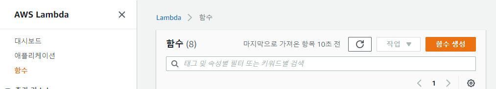
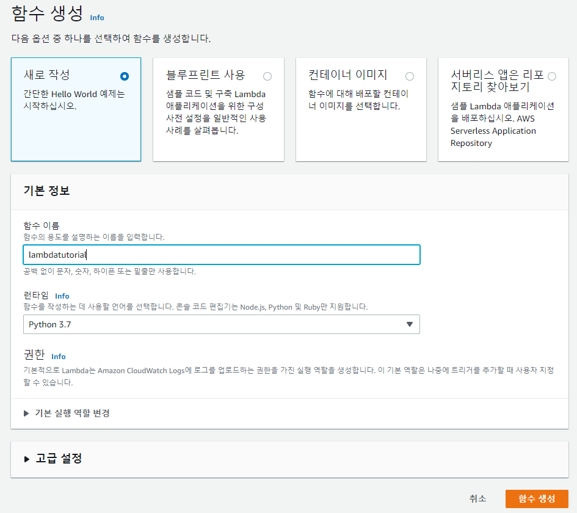
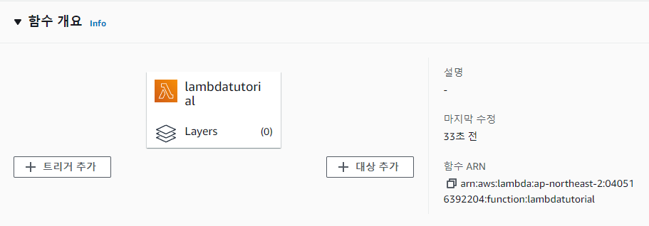
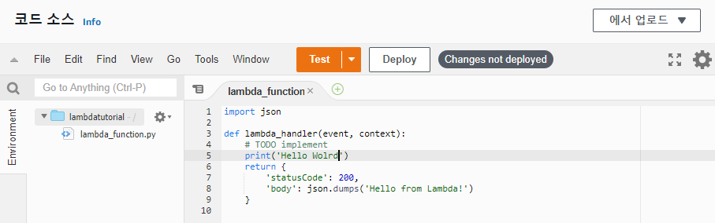
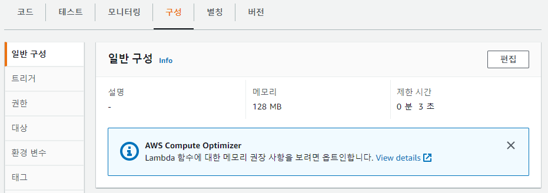
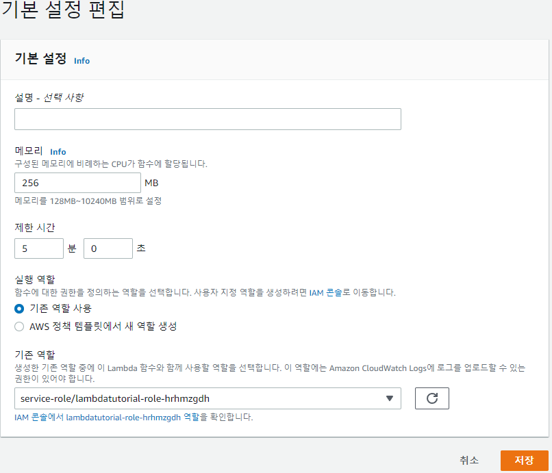
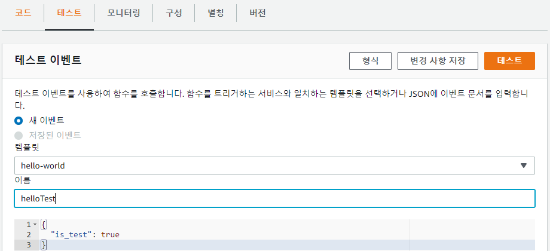
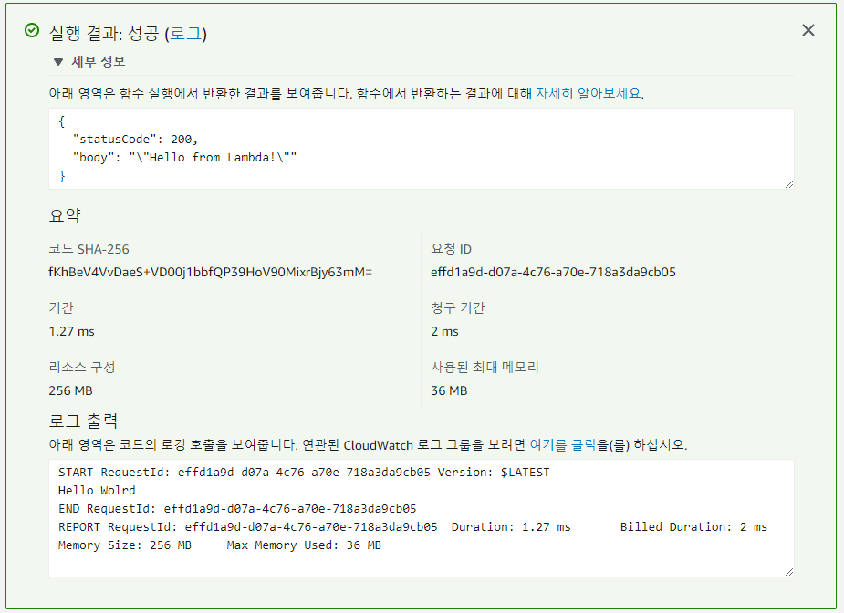

## 🎈 람다(Lambda) 만들기
**python을 이용하여 ‘hello world’를 출력하는 람다 함수를 만들어보자.**

> ✅ 람다 사용을 위해 간단한 예제를 통한 실습을 해보자.

### 🍕튜토리얼
1. AWS Lambda로 들어간다.

2. 오른쪽 상단에 함수 생성 버튼을 누른다.



3. 만들고자 하는 람다 함수 이름과 사용 언어를 선택한 후 함수 생성 버튼을 누른다.



함수 이름은 lambdatutorial, 사용 언어는 python 3.7로 선택했다.



4. 코드 인라인에 원하는 코드를 추가한다.



lambdatutorial 함수에 hello world 출력문을 추가해주었다.

>✅ 핸들러<br>
>람다 함수에게 어디서부터 코드를 실행해! 라고      알려주는 부분이다.

5. 아래에 있는 기본 설정에서 실행에 필요한 메모리와 시간을 설정후 저장 버튼을 누른다.





*메모리는 256MB, 실행 시간은 최대 5분으로 설정했다.

6. 원하는 대로 람다 함수를 잘 만들었는지 확인해보자 코드 탭에서 Deploy 버튼클릭 


7. 테스트 탭에서 테스트 이벤트를 만들어서 해당 람다 함수를 실행시킬 수 있다.



테스트 버튼을 누른다

8. 실행 결과의 세부 정보를 확인 할수있다.



로그에 Hello Wolrd가 출력된 것을 볼 수 있다. 잘 만들었다!

### 🌭마무리
AWS lambda에 코드를 올리는 방법은 3가지이다.
- 인라인 코드
- zip파일을 업로드
- 아마존 S3에서 파일 업로드
<br>
<br>

```toc

```
