## ✅ 개요
AWS 의 OpenSearch를 사용하여 간단한 Serverless 검색 애플리케이션을 생성해보자

Amazon API Gateway로 사용자를 OpenSearch API 및 AWS Lambda의 하위 집합으로 제한하여 API Gateway에서 OpenSearch Service로 보내는 요청에 서명하도록 구현 하겠다.

> Aws OpenSearch(Elasticsearch) 관련 포스팅은 [여기](https://leesungki.github.io/gatsby-aws-history-of-opensearch-tuto)를 참고하자

## 🧀 1단계: 샘플 데이터 인덱싱

사전 조건은 OpenSearch Service 도메인입니다.
[이전 포스팅](https://leesungki.github.io/gatsby-aws-history-of-opensearch-tuto/)을 참고하여 도메인은 만들어져 있다는 가정하에 진행 합니다.

[sample-movies.zip](https://github.com/LeeSungKi/OpenSearchApp/blob/main/sample-movies.zip)을 다운로드하여 압축을 해제하고 _bulk API를 사용해 5,000개 문서를 movies 인덱스에 추가합니다.

```
POST https://search-my-domain.us-west-1.es.amazonaws.com/_bulk //나의 오픈서치 도메인

//sample-movies.zip파일
{ "index": { "_index": "movies", "_type": "movie", "_id": "tt1979320" } }
{"directors":["Ron Howard"],"release_date":"2013-09-02T00:00:00Z","rating":8.3,"genres":["Action","Biography","Drama","Sport"],"image_url":"http://ia.media-imdb.com/images/M/MV5BMTQyMDE0MTY0OV5BMl5BanBnXkFtZTcwMjI2OTI0OQ@@._V1_SX400_.jpg","plot":"A re-creation of the merciless 1970s rivalry between Formula One rivals James Hunt and Niki Lauda.","title":"Rush","rank":2,"running_time_secs":7380,"actors":["Daniel Brühl","Chris Hemsworth","Olivia Wilde"],"year":2013,"id":"tt1979320","type":"add"}
{ "index": { "_index": "movies", "_type": "movie", "_id": "tt1951264" } }
{"directors":["Francis Lawrence"],"release_date":"2013-11-11T00:00:00Z","genres":["Action","Adventure","Sci-Fi","Thriller"],"image_url":"http://ia.media-imdb.com/images/M/MV5BMTAyMjQ3OTAxMzNeQTJeQWpwZ15BbWU4MDU0NzA1MzAx._V1_SX400_.jpg","plot":"Katniss Everdeen and Peeta Mellark become targets of the Capitol after their victory in the 74th Hunger Games sparks a rebellion in the Districts of Panem.","title":"The Hunger Games: Catching Fire","rank":4,"running_time_secs":8760,"actors":["Jennifer Lawrence","Josh Hutcherson","Liam Hemsworth"],"year":2013,"id":"tt1951264","type":"add"}
...       
```

<br>
키바나 콘솔 에서 데이터 확인
<br>
<br>

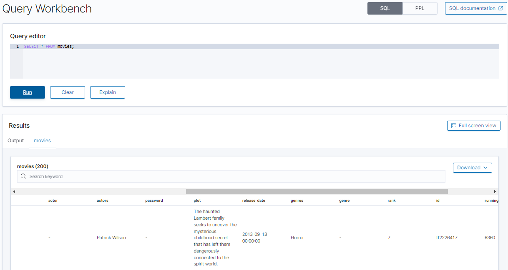


## 🥨 2단계: API Gateway에서 API 생성

API Gateway를 사용하면 보다 제한된 API를 생성하고 OpenSearch _search API와의 상호 작용을 간소화할 수 있습니다. API Gateway를 사용하면 Amazon Cognito 인증 및 요청 조절 같은 보안 기능을 활성화할 수도 있습니다. API를 생성하고 배포하려면 다음 단계를 수행합니다.

### API 생성 및 구성

API Gateway 콘솔을 사용하여 API를 생성하려면

1. API Gateway 내에서 API 생성(Create API)을 선택합니다.

<br>

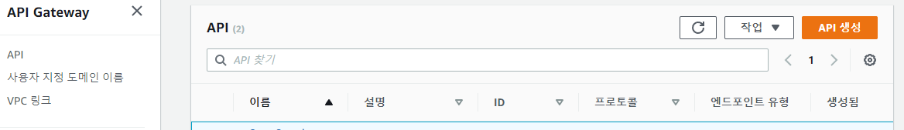
<br>

2. REST API(비공개 아님)를 찾고 구축(Build)를 선택합니다.
<br>

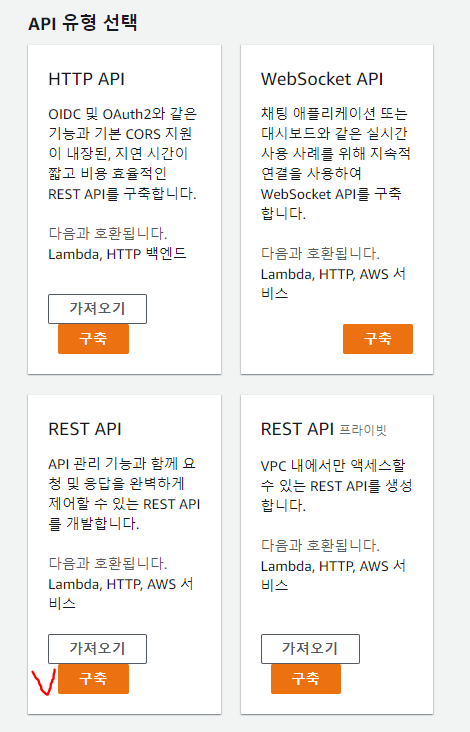
<br>

3. 다음 필드를 구성합니다.
<br>

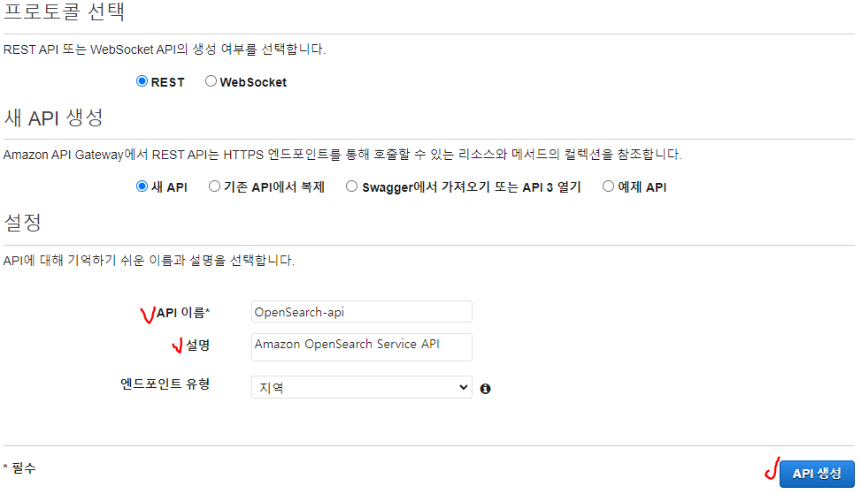

    - API 이름: OpenSearch-api
    - 설명: Amazon OpenSearch Service API
    - 엔드포인트 유형: 리전별
<br>

4. API 생성(Create API)을 선택합니다.
<br>

5. 작업(Actions) 및 메서드 생성(Create Method)을 선택합니다.
<br>

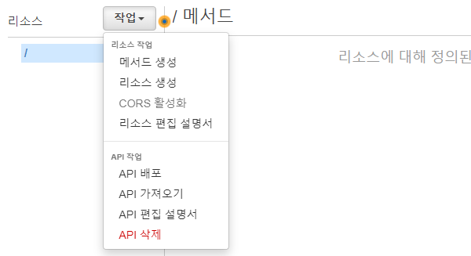
<br>

6. 드롭다운에서 GET을 선택하고 확인 표시를 클릭하여 확인합니다.
<br>

7. 다음 설정을 구성한 다음 저장(Save)을 선택합니다.
<br>

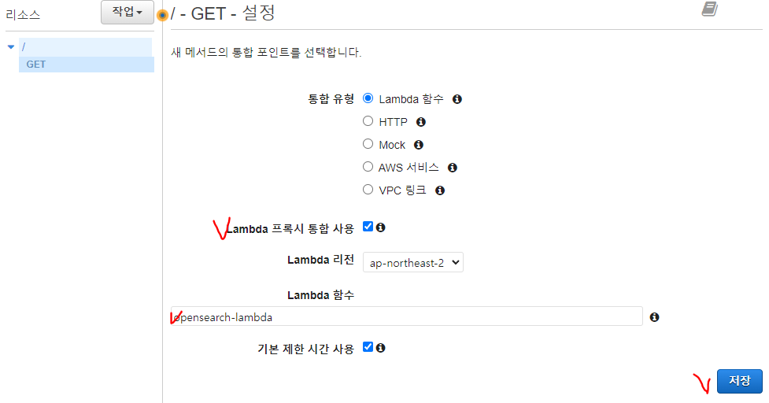
|설정|값|
|------|---|
|통합 유형|Lambda 함수|
|Lambda 프록시 통합 사용|예|
|Lambda 리전|ap-northeast-2|
|Lambda 함수|opensearch-lambda|
|기본 제한 시간 사용||예|

<br>	

### 메서드 요청 구성

메서드 요청(Method Request)을 선택하고 다음 설정을 구성합니다.
<br>

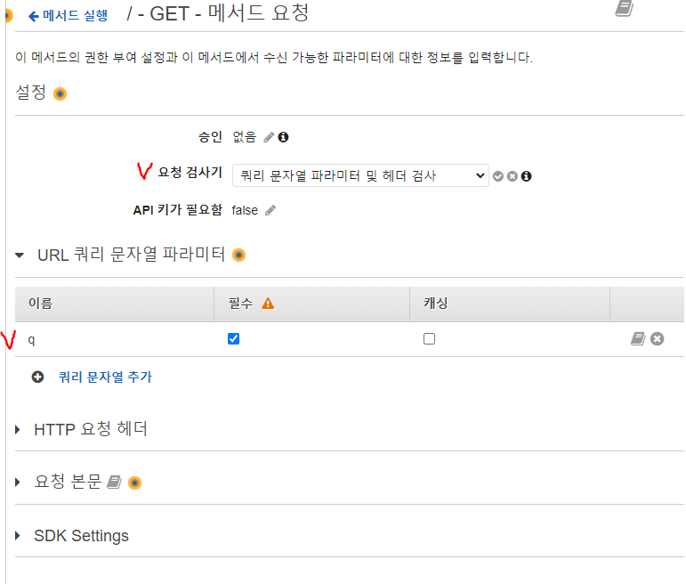

|설정|값|
|-|-|
|승인|NONE|
|요청 검사기|쿼리 문자열 파라미터 및 헤더 검사|
|필수 API 키|false|

<br>

URL 쿼리 문자열 파라미터
<br>

|설정|값|
|-|-|
|이름|q|
|필수|예|

### API 배포 및 단계 구성

API Gateway 콘솔에서 배포를 생성하고 새 단계 또는 기존 단계에 연결하여 API를 배포할 수 있습니다.
<br>

1. 작업(Actions) 및 API 배포(Deploy API)를 선택합니다.
<br>

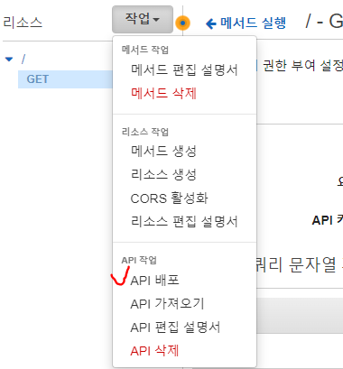
<br>

2. 배포 단계(Deployment stage)에서 새 단계(New Stage)를 클릭하고 단계 이름을 opensearch-api-test로 지정합니다.
<br>

3. 배포(Deploy)를 선택합니다.
<br>

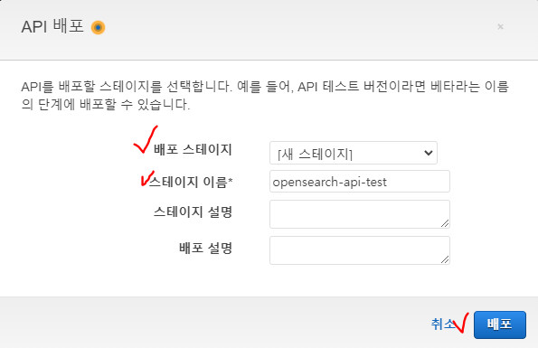
<br>

4. 단계 편집기에서 다음 설정을 구성한 다음 변경 내용 저장(Save Changes)을 선택합니다.
<br>

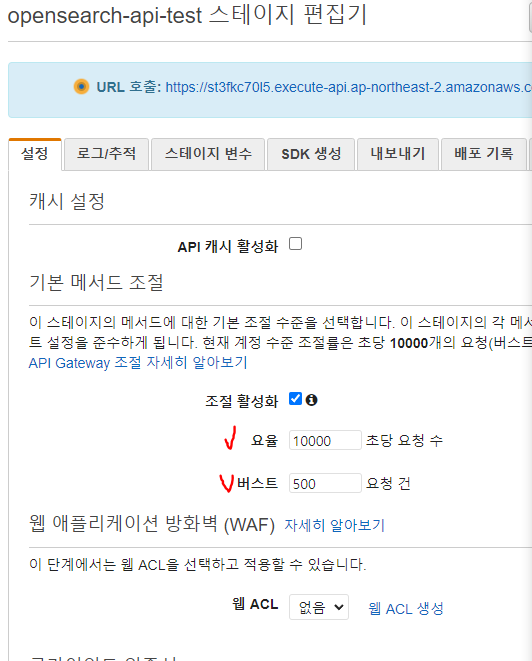
|설정|	값|
|-|-| 
|조절 활성화|예|
|요율|1000|
|버스트|500|

<br>
이러한 설정은 엔드포인트 루트에 대한 GET 요청 (https://some-id.execute-api.ap-northeast-2.amazonaws.com/search-es-api-test) 메서드 하나뿐인 API를 구성합니다.

이 요청에는 파라미터 하나(q), 즉 검색할 쿼리 문자열이 필요합니다. 

메서드를 호출하면 요청이 Lambda로 전송되어 opensearch-lambda 함수가 실행됩니다.


## 🍔 3단계: Lambda 함수 생성 및 배포
API Gateway에서 API를 생성한 후 요청을 전달하는 Lambda 함수를 만듭니다.

### Lambda 함수 생성

API Gateway가 요청을 다음 Python 3.8 Lambda 함수로 전달합니다, 그러면 이 함수가 OpenSearch Service를 쿼리하고 결과를 반환합니다. 이 함수의 이름을 opensearch-lambda로 지정합니다.

```py
import boto3
import json
import requests
from requests_aws4auth import AWS4Auth

region = 'ap-northeast-2' # For example
service = 'opensearchservice'
credentials = boto3.Session().get_credentials()
awsauth = AWS4Auth(credentials.access_key, credentials.secret_key, region, service, session_token=credentials.token)

host = '' # 자신의 OpenSearch domain endpoint
index = 'movies'
url = host + '/' + index + '/_search'

# Lambda execution starts here
def lambda_handler(event, context):

    # Put the user query into the query DSL for more accurate search results.
    # Note that certain fields are boosted (^).
    query = {
        "size": 25,
        "query": {
            "multi_match": {
                "query": event['queryStringParameters']['q'],
                "fields": ["title^4", "plot^2", "actors", "directors"]
            }
        }
    }

    # Elasticsearch 6.x requires an explicit Content-Type header
    headers = { "Content-Type": "application/json" }

    # Make the signed HTTP request
    r = requests.get(url, auth=awsauth, headers=headers, data=json.dumps(query))

    # Create the response and add some extra content to support CORS
    response = {
        "statusCode": 200,
        "headers": {
            "Access-Control-Allow-Origin": '*'
        },
        "isBase64Encoded": False
    }

    # Add the search results to the response
    response['body'] = r.text
    return response
```

이 샘플 함수는 외부 라이브러리를 사용하므로 코드가 작동하려면 배포 패키지를 생성하고 Lambda에 업로드해야 합니다.

Lambda 함수 및 배포 패키지를 만드는 방법에 대한 자세한 내용은 [Lambda Layers 사용하기](https://leesungki.github.io/gatsby-aws-study-lambda-import-tutorial)를 참고 하세요.


### 핸들러 수정
핸들러는 이벤트를 처리하는 함수 코드의 메서드입니다. Lambda 함수가 있는 배포 패키지의 파일 이름에 따라 핸들러 이름을 변경해야 합니다. 
예를 들어, 파일 이름이 function.py인 경우 핸들러 이름을 function.lambda_handler로 변경합니다.

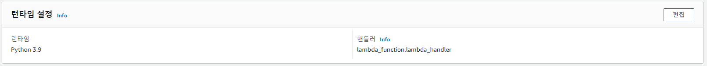

### 트리거 구성

트리거 추가(Add trigger)를 선택하고 함수를 호출하는 HTTP 엔드포인트를 생성합니다. 트리거 구성은 다음과 같아야 합니다.
 
 |트리거|API|배포 단계|보안|
 |------|---|--------|----|
|API Gateway|OpenSearch-api|OpenSearch-api-test|열기|

아래처럼 추가 된다.


## 🥞 4단계: 도메인 액세스 정책 수정

OpenSearch Service 도메인에서 Lambda 함수가 movies 인덱스에 GET 요청을 수행할 수 있도록 허용해야 합니다. 다음 정책은 opensearch-lambda-role(Lambda를 통해 생성됨)에 movies 인덱스에 대한 액세스를 제공합니다.

```json
{
  "Version": "2012-10-17",
  "Statement": [
    {
      "Effect": "Allow",
      "Principal": {
        "AWS": "arn:aws:iam::123456789012:role/service-role/opensearch-lambda-role-1abcdefg" //예시
      },
      "Action": "es:ESHttpGet",
      "Resource": "arn:aws:es:us-west-1:123456789012:domain/domain-name/movies/_search" //예시
    }
  ]
}
```

> Lambda가 자동으로 생성하는 역할의 정확한 이름을 얻으려면 AWS Identity and Access Management(IAM) 콘솔로 이동아혀 역할(Roles)을 클릭하고 “lambda”를 검색합니다.

## 🥗 5단계: 웹 애플리케이션 테스트

웹 애플리케이션을 테스트하려면

1. [sample-site.zip](https://github.com/LeeSungKi/OpenSearchApp/blob/main/sample-site.zip)을 다운로드하고 압축을 해제하여 자주 사용하는 텍스트 편집기에서 scripts/search.js를 엽니다.

2. apigatewayendpoint 변수를 업데이트하여 API Gateway 엔드포인트를 가리키도록 합니다. 엔드포인트의 형식은 https://some-id.execute-api.ap-northeast-2.amazonaws.com/opensearch-api-test입니다.

3. index.html을 열고 thor, house 등 몇 가지 단어를 검색해 봅니다.

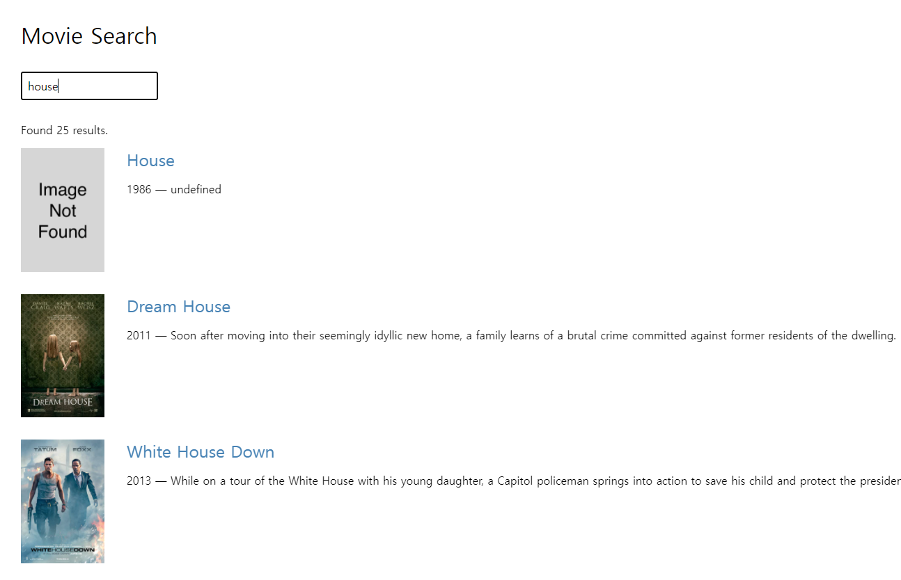


## 🌭마무리
이렇게 오픈서치를 활용하여 Serverless 애플리케이션을 만들어 보았다.

간단한거 같지만 aws 서비스에 대한 어느정도의 이해도가 필요하다 생각한다.

이전 게시글들을 읽어보면 충분히 따라올수 있는 부분이라 생각한다.

<br>
<br>

```toc

```
