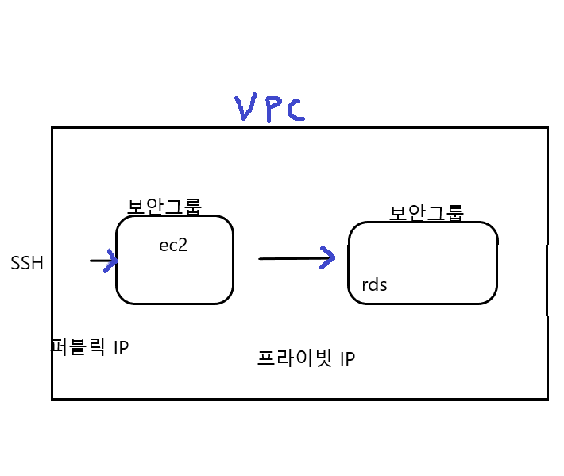
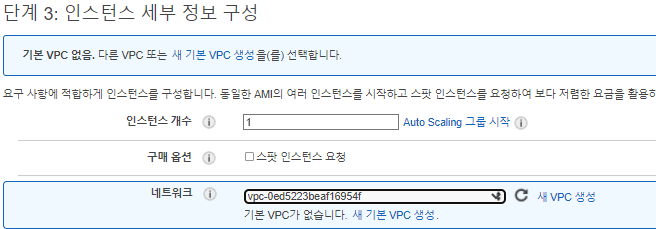
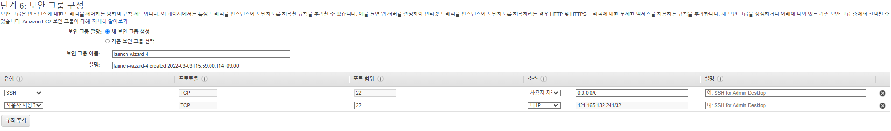
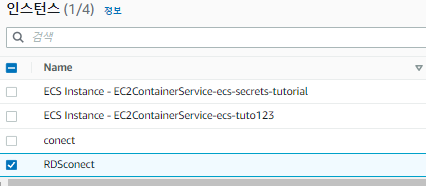
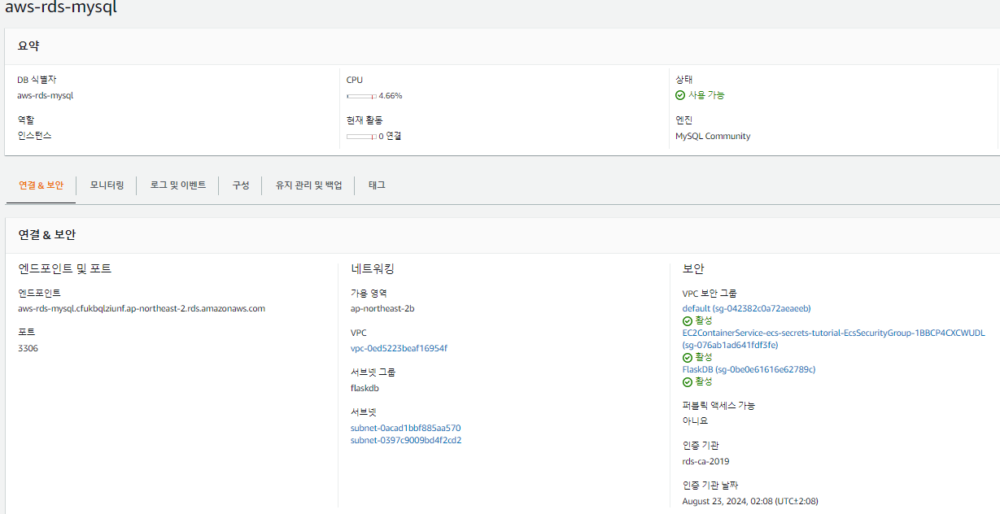
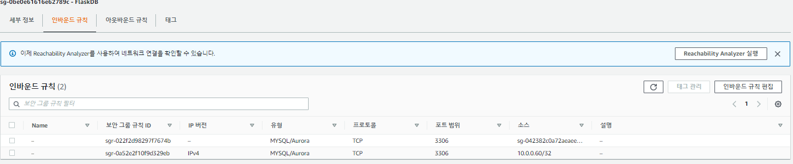

## ✅ 개요
RDS를 생성하여 사용할때 외부에서의 접근을 허용하면 보안상의 약점이 생긴다.

이를 방지하기 위해 외부에서의 접근을 제한하는데 

그렇다면 개발자가 어떻게 RDS에 접근을 할수 있을까? 

방법은 EC2를 통한 접근이다.

이번 시간에는 비공개 RDS를 생성하여 EC2에서 접근하는 방법을 알아보자.
<br>

### 🔒 RDS 를 외부에 노출 시키지 않는 이유 
가장 큰 문제는 보안이다.

DB에 모든 정보들이 담겨져 있는 공간인데, 이것이 외부 네트워크에 노출이 되어 있으면 보안에 상당히 취약할 것.

그래서 VPC안에 있는 EC2를 통해서만 접속하게 하는것 이다.

또한 애플리케이션 서버 또한 안전하게 RDS에 접속할 수 있다는 장점이 있다.



위의 그림과 같이 SSH를 통해 EC2에 접속하고, EC2에서만 RDS로 접속할 수 있게 네트워크 구성을 한다 [참고](https://aws.amazon.com/ko/premiumsupport/knowledge-center/rds-connect-ec2-bastion-host/)

### 🦄 EC2 인스턴스 시작 및 구성

1. EC2 인스턴스 생성
일단 기본적으로 인스턴스를 생성 해야한다.


> 🎈 RDS [생성방법](https://leesungki.github.io/gatsby-aws-study-aws-rds-conection-mySQL/)

> 👓 EC2 [생성방법](https://leesungki.github.io/gatsby-aws-study-ec2-tuto/)

생성 중에 Network(네트워크)]에서 RDS DB 인스턴스가 사용하는 VPC를 선택합니다.



나의 경우 위와같은 VPC를 사용한다.

보안 그룹 구성 에서 아래와 같이 

- Type(유형): 사용자 지정 TCP 규칙
- Protocol(프로토콜): TCP
- 포트 범위: 22
- Source(소스): 로컬 시스템의 IP 주소를 입력합니다. 기본적으로 소스 IP 주소는 모두에게 개방되어 있습니다. 하지만 로컬 퍼블릭 IP 주소에 대해서만 허용하도록 액세스를 제한할 수 있습니다.



그후 인스턴스 생성을 완료해 줍니다.
나의 경우 아래처럼 생성하였다.


2. RDS DB 인스턴스의 보안 그룹 구성

Amazon RDS 콘솔을 열고
RDS DB 인스턴스의 이름을 선택합니다.

나는 미리 private한 RDS를 생성해놨다.

연결 및 보안 탭을 선택



보안 섹션에서 VPC 보안 그룹 아래의 링크를 선택 (나는 FlaskDB를 선택했다.)

보안 그룹을 선택하고 작업을 선택한 다음 인바운드 규칙 편집을 선택합니다.

규칙 추가를 선택하고 다음을 입력합니다.

- Type(유형): 사용자 지정 TCP 규칙
- Protocol(프로토콜): TCP
- Port Range(포트 범위): RDS DB 인스턴스의 포트를 입력합니다.
- Source(소스): EC2 인스턴스의 프라이빗 IP 주소를 입력합니다.

저장 클릭.

다하면 아래처럼 내가 추가한 규칙이 보입니다.



## 🎨 마무리
이렇게 보안을 강화하기 위해 EC2를 통해 RDS 에 접근 할수있게 구성을 해줬다.

그럼 개발자가 개발시에 비공개 RDS에 접근하려면 어떻게 해야할까?

다음에는 그에대한 포스팅을 해볼 예정이다.

<br>
<br>

```toc

```
