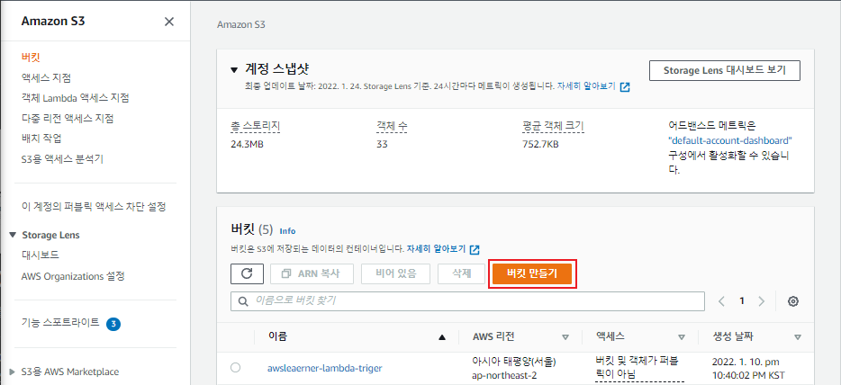
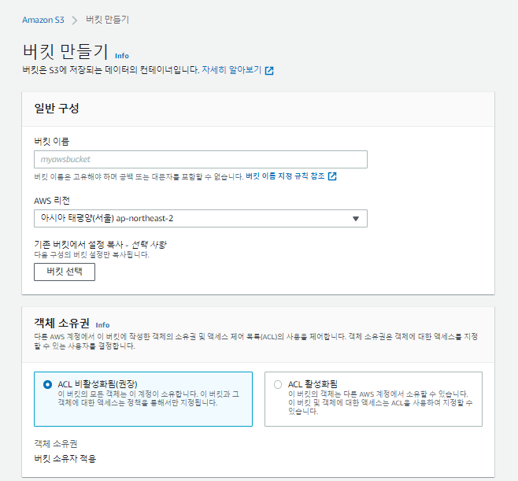
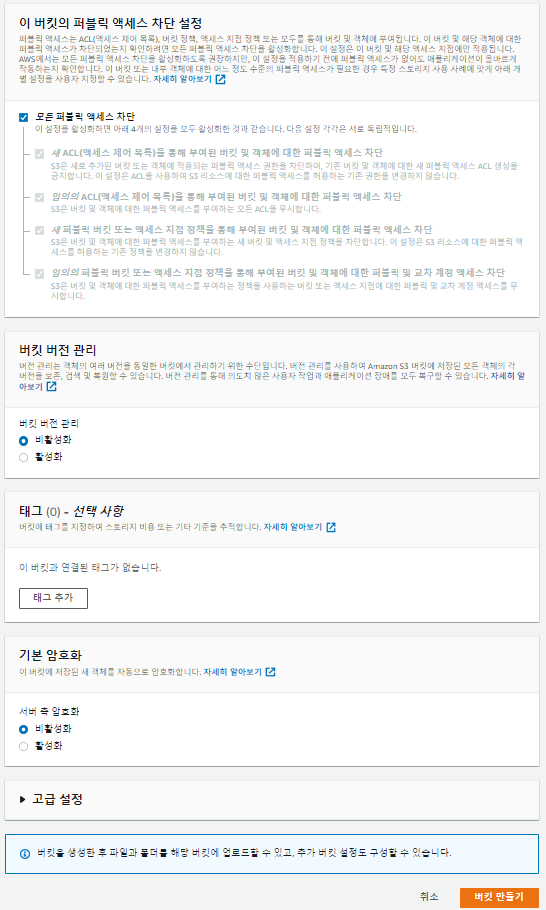
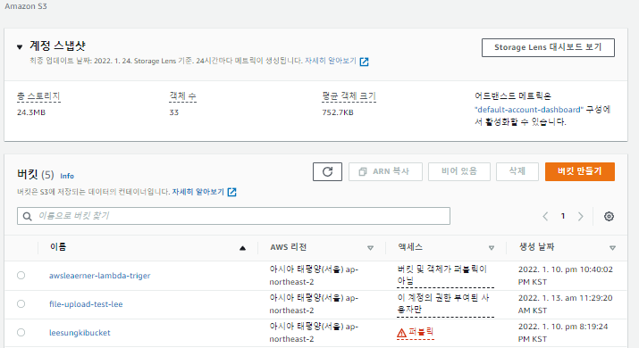
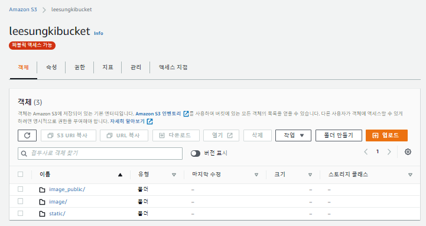

## 🎈 목적
`aws 에서 사용하는 s3 버킷 생성`

## 🗑 Bucket 생성하기

## 1️⃣ 
AWS console 로그인을 하고 [s3 서비스](https://console.aws.amazon.com/s3/home?region=ap-northeast-2)에 접근합니다.

버킷 만들기 클릭!




## 2️⃣ 
버킷 이름, 리전 등을 지정해줍니다.



아래의 다른 정책들은 건드리지 않고 일단 버킷 만들기 클릭!



## 3️⃣

저는 아래와 같이 `leesungkibucket` 이라는 이름으로 생성 하였습니다.



해당 버킷을 클릭하여 들어가 보면 저장 되어있는 객체들을 확인할수 있습니다.



저는 현재 폴더 만들기를 통하여 폴더를 만들어 놓은 모습입니다.

이로써 기본적인 버킷생성은 완료 하였습니다.

```toc

```
