## 👀 사용 계기

프로젝트 진행 중 외부 api 연동 과제 진행 중에 private한 s3 스토리지에서 득정 도메인의 접근을 허용하는 방식이 필요하게 되었다.

> ❗TMI❗ : 네이버 ocr 기능을 사용 중 s3에 저장되어 있는 이미지 파일을 읽어 와야 하는데 보안 특성상
> s3 버킷을 public 하게 사용할 수가 없었고 그로 인해 naver api의 접근이 불가능했다..😅
> 문제 해결을 위해 aws s3 문서를 읽는 중 버킷의 정책을 변경하여 특정 도메인의 접근을 가능하게 하는
> 방법을 찾았고 나의 삽질을 기록한다..😂

## 🗑 HTTP Referer란?
`HTTP는 헤더값으로 웹 브라우저에서 생성하는 데이터`

예를들어 http://naver.com 웹사이트에서 접근시에 해당 Resource로 보내는 HTTP 헤더의 Referer값은 http://naver.com 입니다. 
S3에서는 이 Referer값을 판단해 파일을 보여줄지 말지 제한할 수 있습니다.

## ✅ Bucket 생성하기

테스트를 위한 버킷을 생성해준다.<br>

s3 버킷 생성에 대한 자료는 여기에서 참고 바랍니다. 👉[Bucket 생성](https://leesungki.github.io/gatsby-aws-study-s3-makeBucket/)

<br>

## ♻ 정책 편집

<h4>생성한 버킷의 권한탭 클릭한다.
<br>
<br>

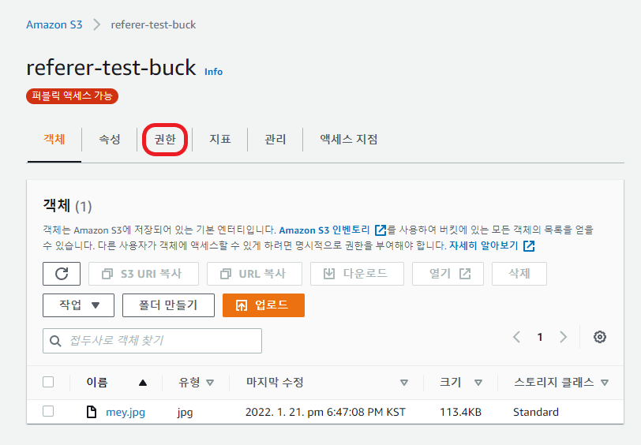

<h4>해당 버킷이 가지고 있는 권한 정보 에서 퍼블릭 액세스 차단 편집 버튼 클릭한다.

<br>
<br>

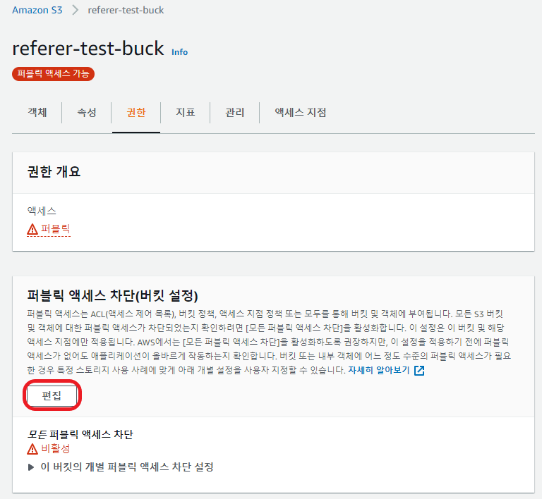
<br>
<h4>새 퍼블릭 버킷 또는 액세스 지점 정책을 통해 부여된 버킷 및 객체에 대한 퍼블릭 액세스 차단 체크 후 변경 사항 저장
<br>
<br>

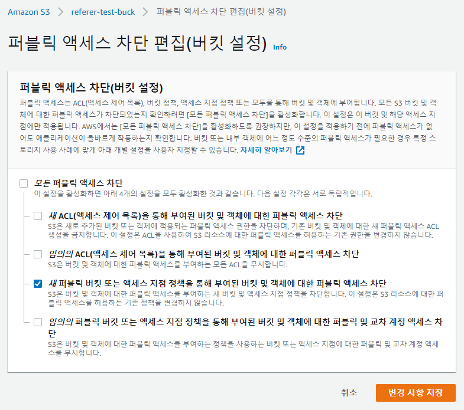
<br>
<br>

권한 탭으로 돌아가 버킷 정책 편집 버튼을 클릭한다.

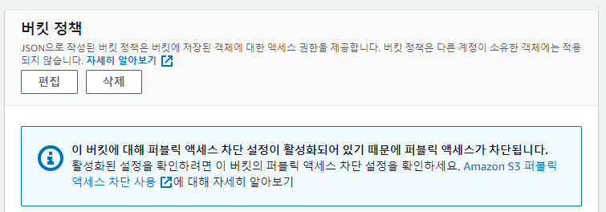

정책 생성기 버튼을 클릭하면 자동으로 정책을 생성해주는 웹 페이지로 이동한다.
<br>

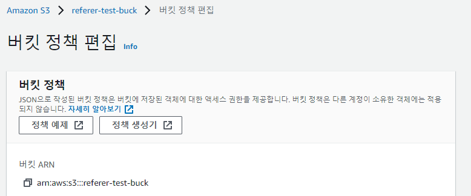

<br>

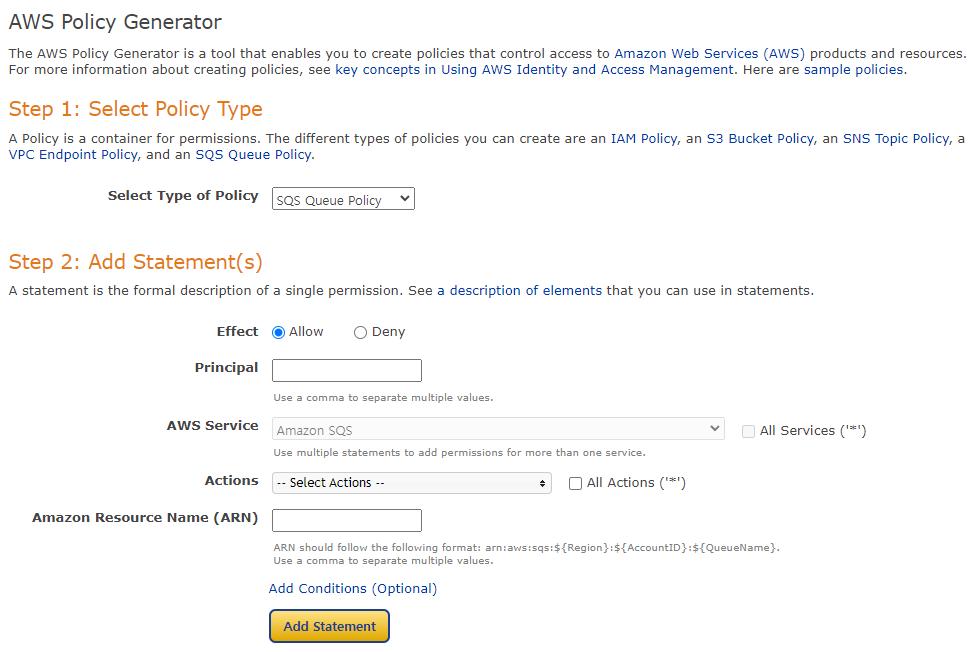

- Select Type of Policy : S3 Bucket Policy 
- Effect : Allow
- Principal : *
- AWS Service : Amazon SQS
- Actions : GetObject
- Amazon Resource Name (ARN) : "버킷 ARN"/* `ex) arn:aws:s3:::referer-test-buck/*`

<h4>Add Conditions (Optional) 클릭
<br>
<br>

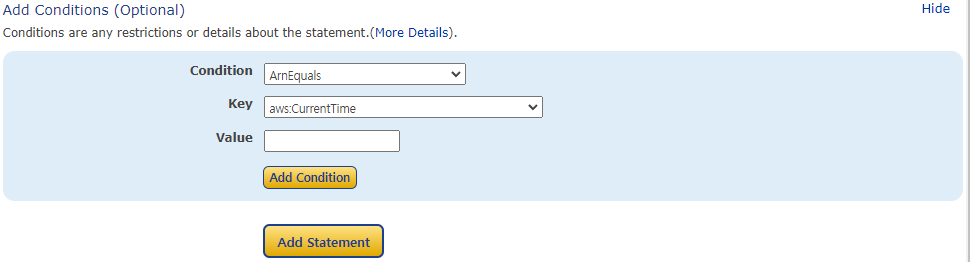

- Condition : StringLike
- Key : aws:Referer
- Value : 접근 허용할 도메인(http referer)/* `ex)http://clovaocr-api-kr.ncloud.com/external/v1/*`
<br>
<br>
<h4>입력후 Add Condition 클릭 하면 Condition 추가된다 그후
Add Statement 클릭 하면 아래와 같이 정책이 생성된다.
<br>
<br>

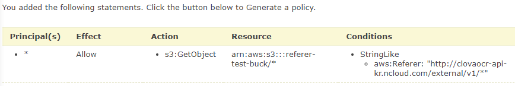

<br>
<br>
<h4>마지막 으로 Generate Policy 버튼을 클릭하면 위에서 지정한 정책이 json 형태로 생성되는 것을 확인할수 있다.
<br>
<br>

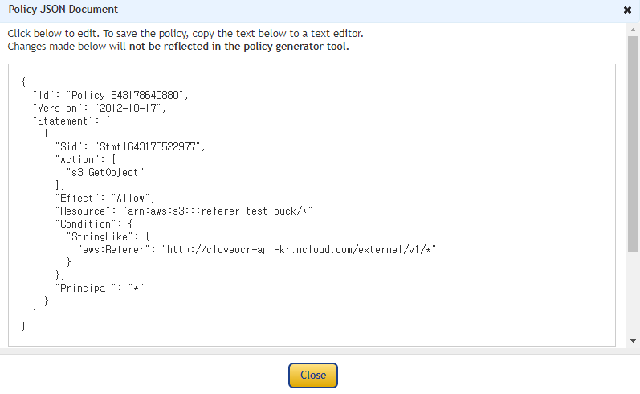

<br>
<br>
<h4>해당 값을 복사하여 버킷 정책 편집 창에 넣어주고 변경 사항 저장 클릭
<br>
<br>

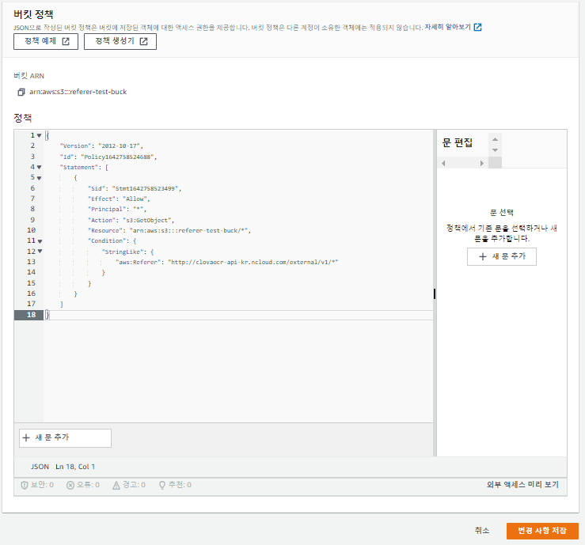

<br>
<br>
<h4>이제 정책이 정상 반영되었는지 확인해보자. 버킷에 이미지 파일을 하나 업로드 한다음.
<br>
<br>

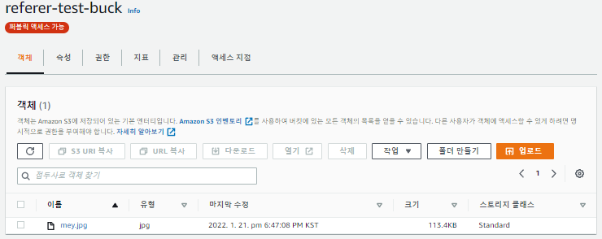

<h4>객체를 클릭하여 들어가 보면 객체 URL을 확인할수 있다.
<br>
<br>

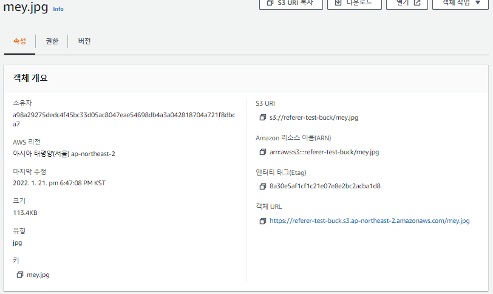
<br>
<br>
클릭을 해보면 아래와 같이 Access Denied가 뜨는걸 확인 할수있다.

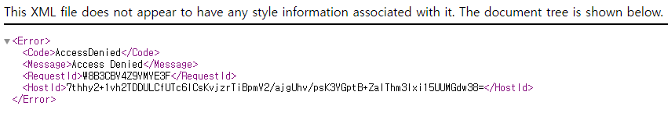
<br>
<br>
그렇다 우리가 지정한 referer 로 접근한게 아니기 때문이다.

그렇다면 어떻게 확인 할수 있을까? 간단하게 postman을 활용하여 테스트를 진행해보자.

GET 방식으로 객체 URL 을 넣어주고 Headers 에 우리가 지정한 Referer을 넣고 호출해보면
이미지가 정상적으로 뜨는것을 확인할수 있다.
<br>
<br>

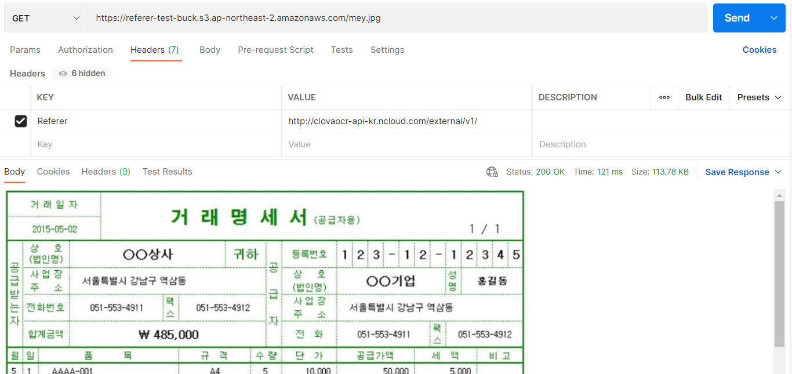
<br>
<br>
<br>
<br>
<br>
<br>

```toc

```
