## 🔒 AWS Secrets Manager 생성 튜토리얼
<br>

### 🍕민감성 데이터 저장 방식(ex token,accesskey,secretkey...)

1. AWS 콘솔에서 Secrets Manager 콘솔 접근
<br>

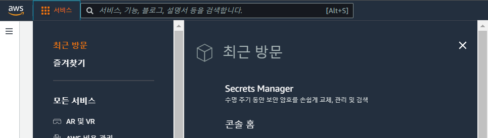

2. 새 보안 암호 저장 클릭
<br>

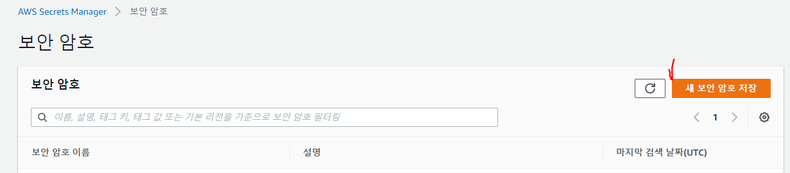

3. 다른 유형의 보안 암호 체크 키/값 정의 후 다음 클릭
<br>

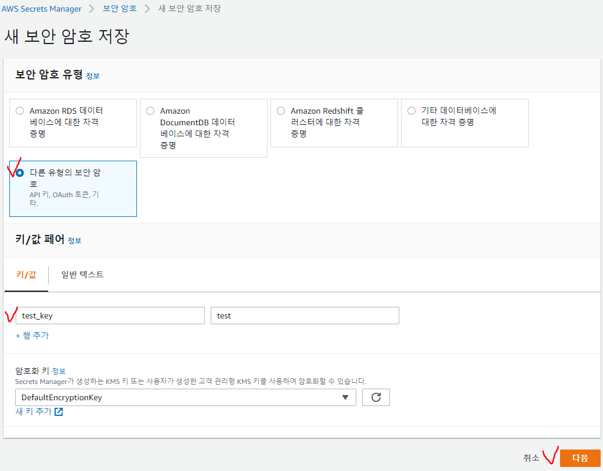

4. 보안 암호 이름 지정 후 다음 클릭
<br>

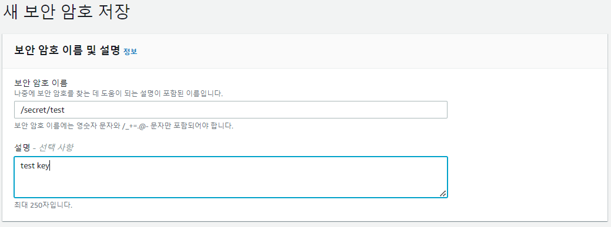

5. 여기에서는 자동 교체는 정의 안하므로 기본으로 지정 다음 클릭
<br>

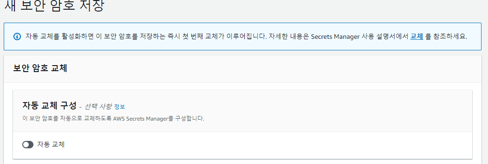

6. 검토 확인후 저장 클릭
<br>

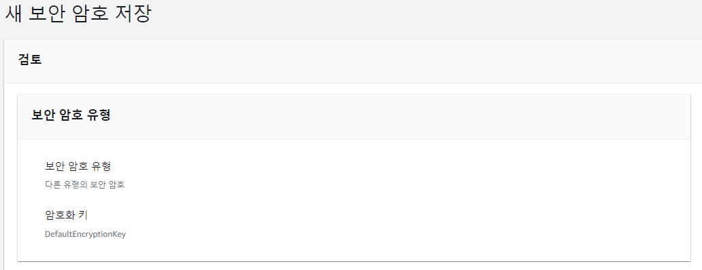

7. 생성된 보안 암호 이름을 확인 할수 있다
<br>

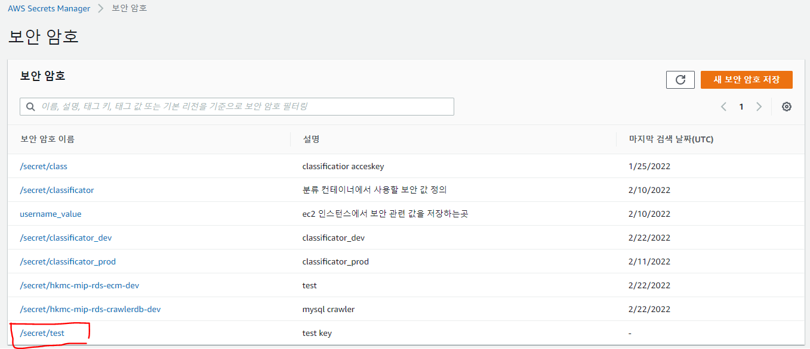


### 🍕RDS 데이터 베이스에 대한 자격증명 방식

1. AWS 콘솔에서 Secrets Manager 콘솔 접근
<br>


2. 새 보안 암호 저장 클릭
<br>


3. Amazon RDS 데이터 베이스에 대한 자격증명 체크 RDS(생성시 지정한) 사용자 이름과 암호 기재 DB 인스턴스 체크
<br>

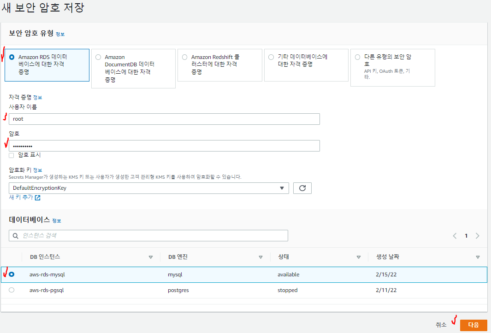

4. 보안 암호 이름 지정 후 다음 클릭
<br>

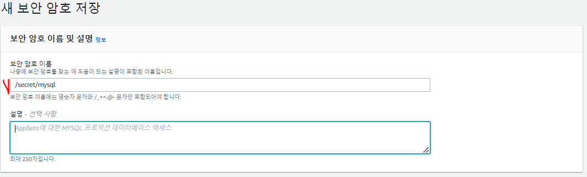

5. 여기에서는 자동 교체는 정의 안하므로 기본으로 지정 다음 클릭
<br>


6. 검토 확인후 저장 클릭
<br>

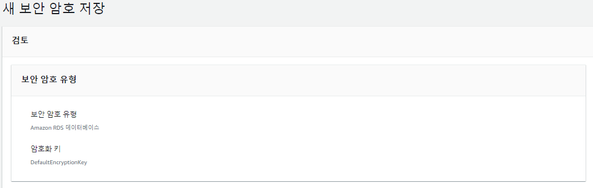

7. 생성된 보안 암호 이름을 확인 할수 있다
<br>

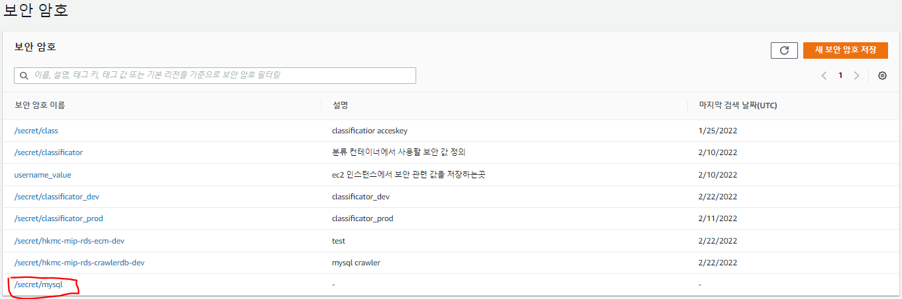


## 🌭마무리
위와 같은 특성과 기능을 제공하므로 Secrets Manager를 사용하여 aws의 접근에 관한 민감성 데이터를 손쉽게 관리가 가능하다.
<br>
<br>

```toc

```
