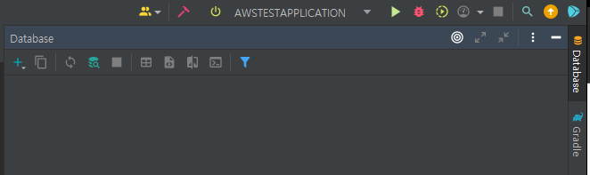
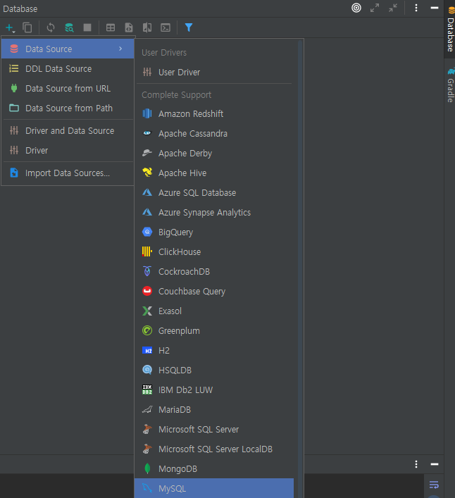
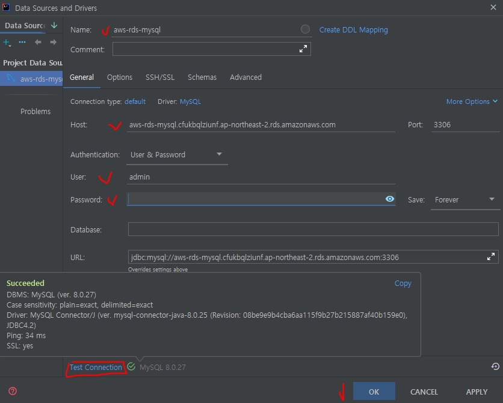
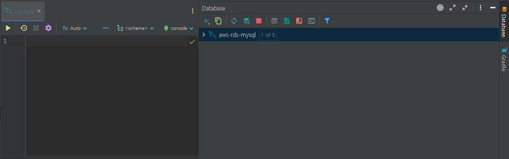

## ✅ aws RDS(MY SQL) 연결하기
<br>

### 📌datasource 사용

1. intellj 오른쪽 상단에 datasource 탭 클릭



2. 좌측 + 버튼 클릭후 data source에서  mySQL 선택 



3. data source 정보를 넣고 test connection 클릭

- name:사용자지정
- Host:생성한 RDS의 엔드포인트
- Port:생성한 RDS의 Port
- User:생성한 RDS의 User
- Password:생성한 RDS의 Password



테스트가 성공적으로 이루어 졌으면 OK 버튼 클릭

4. 쿼리 콘솔 확인
정상적으로 다했으면 아래와 같이 쿼리를 작성할수 있는 콘솔이 열린다.



## 🌭마무리
위의 기능을 활용하여 aws rds에 쉽게 접근하여 쿼리작성이 가능하다.

<br>
<br>

```toc

```
