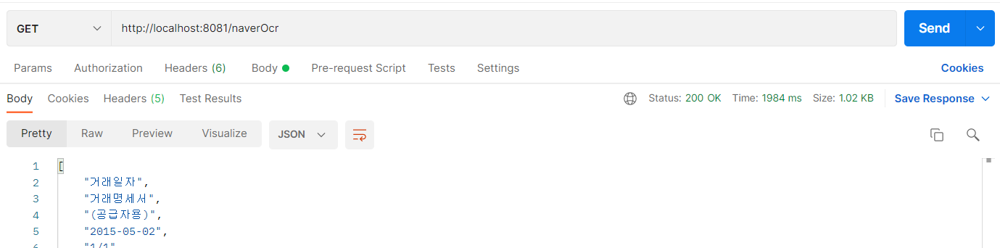

## 개요

이전 포스팅에서 naver crova ocr 에대해 다뤘었다. [참고](https://leesungki.github.io/gatsby-naverOCR-study/)

해당 글을 보면 이미 나는 naver ocr api를 생성했고

요번 글에서는 springboot 에서 해당 api를 사용하는 방법을 포스팅 하겠다.

### 📌 multipart/form-data 사용

호출 방식은 두가지로 나뉜다 하지만 나는 로컬에 저장된 이미지 파일을 사용 할꺼라서 form-data 방식으로 호출한다.

> 🎀 다른 방식은 해당 문서 [참고](https://api.ncloud-docs.com/docs/ai-application-service-ocr-ocr)

프로젝트 구조

```
controller
    ㄴCheckController
infra
    ㄴnaver
        ㄴocr
            ㄴNaverOcrApi
utill
    ㄴJsonUtill           
```
- CheckController
- NaverOcrApi
- JsonUtill : 데이터 가공을위함 필수 X

Json 관련 의존성은 기재 안하겠다 본인이 가공할거면 편한걸 사용하면 된다.

NaverOcrApi

```java
/**
 * Naver OCR API Service (네이버 ocr api 호출)
 */
public class NaverOcrApi {
    /**
     * 네이버 ocr api 호출한다
     * @param {string} type 호출 메서드 타입
     * @param {string} filePath 파일 경로
     * @param {string} naver_secretKey 네이버 시크릿키 값
     * @param {string} ext 확장자
     * @returns {List} 추출 text list
     */
    public static List<String> callApi(String type, String filePath, String naver_secretKey, String ext) {
        String apiURL = "자신이 생성한 APIGW URL";
        String secretKey = naver_secretKey;
        String imageFile = filePath;
        List<String> parseData = null;

        try {
            URL url = new URL(apiURL);
            HttpURLConnection con = (HttpURLConnection)url.openConnection();
            con.setUseCaches(false);
            con.setDoInput(true);
            con.setDoOutput(true);
            con.setReadTimeout(30000);
            con.setRequestMethod(type);
            String boundary = "----" + UUID.randomUUID().toString().replaceAll("-", "");
            con.setRequestProperty("Content-Type", "multipart/form-data; boundary=" + boundary);
            con.setRequestProperty("X-OCR-SECRET", secretKey);

            JSONObject json = new JSONObject();
            json.put("version", "V2");
            json.put("requestId", UUID.randomUUID().toString());
            json.put("timestamp", System.currentTimeMillis());
            JSONObject image = new JSONObject();
            image.put("format", ext);
            image.put("name", "demo");
            JSONArray images = new JSONArray();
            images.add(image);
            json.put("images", images);
            String postParams = json.toString();

            con.connect();
            DataOutputStream wr = new DataOutputStream(con.getOutputStream());
            long start = System.currentTimeMillis();
            File file = new File(imageFile);
            writeMultiPart(wr, postParams, file, boundary);
            wr.close();

            int responseCode = con.getResponseCode();
            BufferedReader br;
            if (responseCode == 200) {
                br = new BufferedReader(new InputStreamReader(con.getInputStream()));
            } else {
                br = new BufferedReader(new InputStreamReader(con.getErrorStream()));
            }
            String inputLine;
            StringBuffer response = new StringBuffer();
            while ((inputLine = br.readLine()) != null) {
                response.append(inputLine);
            }
            br.close();

            parseData = jsonparse(response);

        } catch (Exception e) {
            System.out.println(e);
        }
        return parseData;
    }
    /**
     * writeMultiPart
     * @param {OutputStream} out 데이터를 출력
     * @param {string} jsonMessage 요청 params
     * @param {File} file 요청 파일
     * @param {String} boundary 경계
     */
    private static void writeMultiPart(OutputStream out, String jsonMessage, File file, String boundary) throws
            IOException {
        StringBuilder sb = new StringBuilder();
        sb.append("--").append(boundary).append("\r\n");
        sb.append("Content-Disposition:form-data; name=\"message\"\r\n\r\n");
        sb.append(jsonMessage);
        sb.append("\r\n");

        out.write(sb.toString().getBytes("UTF-8"));
        out.flush();

        if (file != null && file.isFile()) {
            out.write(("--" + boundary + "\r\n").getBytes("UTF-8"));
            StringBuilder fileString = new StringBuilder();
            fileString
                    .append("Content-Disposition:form-data; name=\"file\"; filename=");
            fileString.append("\"" + file.getName() + "\"\r\n");
            fileString.append("Content-Type: application/octet-stream\r\n\r\n");
            out.write(fileString.toString().getBytes("UTF-8"));
            out.flush();

            try (FileInputStream fis = new FileInputStream(file)) {
                byte[] buffer = new byte[8192];
                int count;
                while ((count = fis.read(buffer)) != -1) {
                    out.write(buffer, 0, count);
                }
                out.write("\r\n".getBytes());
            }

            out.write(("--" + boundary + "--\r\n").getBytes("UTF-8"));
        }
        out.flush();
    }
    /**
     * 데이터 가공
     * @param {StringBuffer} response 응답값
     * @returns {List} result text list
     */
    private static List<String> jsonparse(StringBuffer response) throws ParseException {
        //json 파싱
        JSONParser jp = new JSONParser();
        JSONObject jobj = (JSONObject) jp.parse(response.toString());
        //images 배열 obj 화
        JSONArray JSONArrayPerson = (JSONArray)jobj.get("images");
        JSONObject JSONObjImage = (JSONObject)JSONArrayPerson.get(0);
        JSONArray s = (JSONArray) JSONObjImage.get("fields");
        //
        List<Map<String, Object>> m = JsonUtill.getListMapFromJsonArray(s);
        List<String> result = new ArrayList<>();
        for (Map<String, Object> as : m) {
            result.add((String) as.get("inferText"));
        }
        return result;
    }
}
```

JsonUtill

```java
public class JsonUtill {
    /**
     * JSONObject => Map<String, String>
     * @param {JSONObject} jsonObject
     * @returns {Map} map
     */
    @SuppressWarnings("unchecked")
    public static Map<String, Object> getMapFromJsonObject(JSONObject jsonObject) {
        Map<String, Object> map = null;
        try {
            map = new ObjectMapper().readValue(jsonObject.toJSONString(), Map.class);

        } catch (JsonParseException e) {
            e.printStackTrace();
        } catch (JsonMappingException e) {
            e.printStackTrace();
        } catch (IOException e) {
            e.printStackTrace();
        }
        return map;
    }
    /**
     * JSONArray => List<Map<String, String>>
     * @param {jsonArray} jsonArray
     * @returns {List} list
     */
    public static List<Map<String, Object>> getListMapFromJsonArray(JSONArray jsonArray) {

        List<Map<String, Object>> list = new ArrayList<Map<String, Object>>();

        if (jsonArray != null) {

            int jsonSize = jsonArray.size();

            for (int i = 0; i < jsonSize; i++) {

                Map<String, Object> map = getMapFromJsonObject((JSONObject)jsonArray.get(i));
                list.add(map);

            }
        }
        return list;
    }
}
```

CheckController

```java
@RestController
public class CheckController {
     @GetMapping("/naverOcr")
    public ResponseEntity ocr() throws  IOException{
        String fileName = "mey.jpg";
        File file = ResourceUtils.getFile("classpath:static/image/test/"+fileName);

        List<String> result = NaverOcrApi.callApi("POST", file.getPath(), "자신의 네이버 시크릿 키", "jpg");
        return new ResponseEntity(result, HttpStatus.OK);
    }
}
```

### 🏆 Postman 호출



이렇게 내가 원하는 이미지의 텍스트를 추출 할수가 있다.


## 🌭마무리
생각보다 문서도 잘되어있고... 내가 굳이 따로 글을 쓸필요가 있을까 싶을정도 이지만...

그래도 나중에 내가 다시 사용할때 어떻게 사용했는지 알기위해 이 글을 쓴다..

외부 api 사용은 정말 해당 api를 제공하는 제공측의 문서의 퀄리티에 따라서 사용 난이도가 변하는거 같다..

그런 부분에서 네이버는 역시 대기업이구나 라는걸 다시한번 느꼈다..

<br>
<br>

```toc

```
