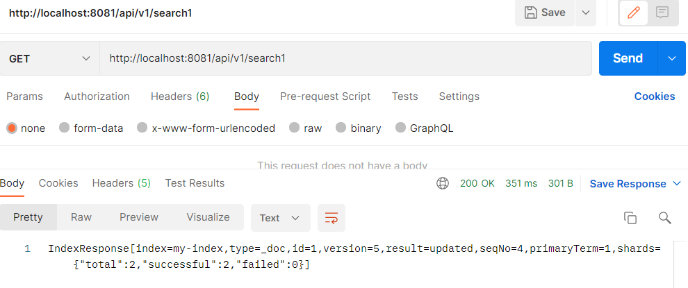

## ✅ 개요
AWS 의 OpenSearch에 접근하여 데이터를 생성해보자.

> Aws OpenSearch(Elasticsearch) 관련 포스팅은 [여기](https://leesungki.github.io/gatsby-aws-history-of-opensearch-tuto)를 참고하자

### AWS OpenSearch 연동

기본 프로젝트 구조
```
infra
    ㄴaws
        ㄴAWSRequestSigningApacheInterceptor
controller
    ㄴDataCheckController        
```


1. 의존성 추가
```
dependencies {    
    implementation group: 'org.opensearch.client', name: 'opensearch-rest-high-level-client', version: '1.2.4'
}
```
2. AWSRequestSigningApacheInterceptor 추가

```java
/**
 * An {@link HttpRequestInterceptor} that signs requests using any AWS {@link Signer}
 * and {@link AWSCredentialsProvider}.
 */
public class AWSRequestSigningApacheInterceptor implements HttpRequestInterceptor {
    /**
     * The service that we're connecting to. Technically not necessary.
     * Could be used by a future Signer, though.
     */
    private final String service;

    /**
     * The particular signer implementation.
     */
    private final Signer signer;

    /**
     * The source of AWS credentials for signing.
     */
    private final AWSCredentialsProvider awsCredentialsProvider;

    /**
     *
     * @param service service that we're connecting to
     * @param signer particular signer implementation
     * @param awsCredentialsProvider source of AWS credentials for signing
     */
    public AWSRequestSigningApacheInterceptor(final String service,
                                              final Signer signer,
                                              final AWSCredentialsProvider awsCredentialsProvider) {
        this.service = service;
        this.signer = signer;
        this.awsCredentialsProvider = awsCredentialsProvider;
    }
    /**
     * {@inheritDoc}
     */
    @Override
    public void process(final HttpRequest request, final HttpContext context)
            throws HttpException, IOException {
        URIBuilder uriBuilder;
        try {
            uriBuilder = new URIBuilder(request.getRequestLine().getUri());
        } catch (URISyntaxException e) {
            throw new IOException("Invalid URI" , e);
        }

        // Copy Apache HttpRequest to AWS DefaultRequest
        DefaultRequest<?> signableRequest = new DefaultRequest<>(service);

        HttpHost host = (HttpHost) context.getAttribute(HTTP_TARGET_HOST);
        if (host != null) {
            signableRequest.setEndpoint(URI.create(host.toURI()));
        }
        final HttpMethodName httpMethod =
                HttpMethodName.fromValue(request.getRequestLine().getMethod());
        signableRequest.setHttpMethod(httpMethod);
        try {
            signableRequest.setResourcePath(uriBuilder.build().getRawPath());
        } catch (URISyntaxException e) {
            throw new IOException("Invalid URI" , e);
        }

        if (request instanceof HttpEntityEnclosingRequest) {
            HttpEntityEnclosingRequest httpEntityEnclosingRequest =
                    (HttpEntityEnclosingRequest) request;
            if (httpEntityEnclosingRequest.getEntity() == null) {
                signableRequest.setContent(new ByteArrayInputStream(new byte[0]));
            } else {
                signableRequest.setContent(httpEntityEnclosingRequest.getEntity().getContent());
            }
        }
        signableRequest.setParameters(nvpToMapParams(uriBuilder.getQueryParams()));
        signableRequest.setHeaders(headerArrayToMap(request.getAllHeaders()));

        // Sign it
        signer.sign(signableRequest, awsCredentialsProvider.getCredentials());

        // Now copy everything back
        request.setHeaders(mapToHeaderArray(signableRequest.getHeaders()));
        if (request instanceof HttpEntityEnclosingRequest) {
            HttpEntityEnclosingRequest httpEntityEnclosingRequest =
                    (HttpEntityEnclosingRequest) request;
            if (httpEntityEnclosingRequest.getEntity() != null) {
                BasicHttpEntity basicHttpEntity = new BasicHttpEntity();
                basicHttpEntity.setContent(signableRequest.getContent());
                httpEntityEnclosingRequest.setEntity(basicHttpEntity);
            }
        }
    }
    /**
     *
     * @param params list of HTTP query params as NameValuePairs
     * @return a multimap of HTTP query params
     */
    private static Map<String, List<String>> nvpToMapParams(final List<NameValuePair> params) {
        Map<String, List<String>> parameterMap = new TreeMap<>(String.CASE_INSENSITIVE_ORDER);
        for (NameValuePair nvp : params) {
            List<String> argsList =
                    parameterMap.computeIfAbsent(nvp.getName(), k -> new ArrayList<>());
            argsList.add(nvp.getValue());
        }
        return parameterMap;
    }
    /**
     * @param headers modeled Header objects
     * @return a Map of header entries
     */
    private static Map<String, String> headerArrayToMap(final Header[] headers) {
        Map<String, String> headersMap = new TreeMap<>(String.CASE_INSENSITIVE_ORDER);
        for (Header header : headers) {
            if (!skipHeader(header)) {
                headersMap.put(header.getName(), header.getValue());
            }
        }
        return headersMap;
    }
    /**
     * @param header header line to check
     * @return true if the given header should be excluded when signing
     */
    private static boolean skipHeader(final Header header) {
        return ("content-length".equalsIgnoreCase(header.getName())
                && "0".equals(header.getValue())) // Strip Content-Length: 0
                || "host".equalsIgnoreCase(header.getName()); // Host comes from endpoint
    }
    /**
     * @param mapHeaders Map of header entries
     * @return modeled Header objects
     */
    private static Header[] mapToHeaderArray(final Map<String, String> mapHeaders) {
        Header[] headers = new Header[mapHeaders.size()];
        int i = 0;
        for (Map.Entry<String, String> headerEntry : mapHeaders.entrySet()) {
            headers[i++] = new BasicHeader(headerEntry.getKey(), headerEntry.getValue());
        }
        return headers;
    }
}
```

[참고](https://github.com/amazon-archives/aws-request-signing-apache-interceptor)

3. DataCheckController
```java
@Slf4j
@RestController
@RequestMapping("/api/v1")
public class DataCheckController {
    /**
     * aws 가용 지역
     */
    @Value("${cloud.aws.region.static}")
    private String region;//ap-northeast-2 서울리전

    @GetMapping(value = "/search1")
    public String search1() throws IOException {
        log.info("------------------------------------->search1");
        RestHighLevelClient searchClient = searchClient();

        // Create the document as a hash map
        Map<String, Object> document = new HashMap<>();
        document.put("title", "Walk the Line");
        document.put("director", "James Mangold");
        document.put("year", "2005");
        log.info("------------------------------------->Map");

        // Form the indexing request, send it, and print the response
        IndexRequest request = new IndexRequest("my-index", "_doc", "1").source(document);
        IndexResponse response = searchClient.index(request, RequestOptions.DEFAULT);
        System.out.println("response=========>"+response.toString());
        System.out.println("response Result=========>"+response.getIndex());
        return response.toString();

    }
    private static String serviceName = "es";
    private static String host = "";// e.g. https://search-mydomain.us-west-1.es.amazonaws.com 앤드포인트

    static final AWSCredentialsProvider credentialsProvider = new DefaultAWSCredentialsProviderChain();
    private RestHighLevelClient searchClient() {
        log.info("------------------------------------->RestHighLevelClient");
        AWS4Signer signer = new AWS4Signer();
        signer.setServiceName(serviceName);
        signer.setRegionName(region);
        HttpRequestInterceptor interceptor = new AWSRequestSigningApacheInterceptor(serviceName, signer, credentialsProvider);
        return new RestHighLevelClient(RestClient.builder(HttpHost.create(host)).setHttpClientConfigCallback(hacb -> hacb.addInterceptorLast(interceptor)));
    }   
}
```

4. 포스트맨 호출
 


5. 키바나 확인


## 🌭마무리
위와 같이 springboot에서 OpenSearch(Elasticsearch)에 인덱스를 생성해주었고 확인까지 할수 있었다.

다음에는 OpenSearch(Elasticsearch)에 있는 데이터를 검색을 해보자.

<br>
<br>

```toc

```
