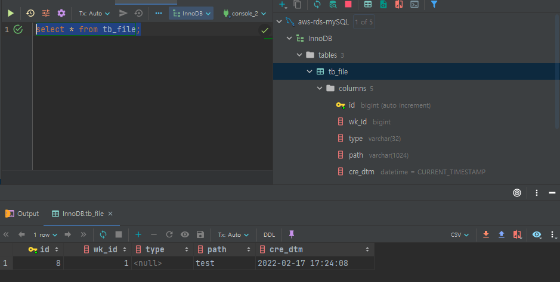
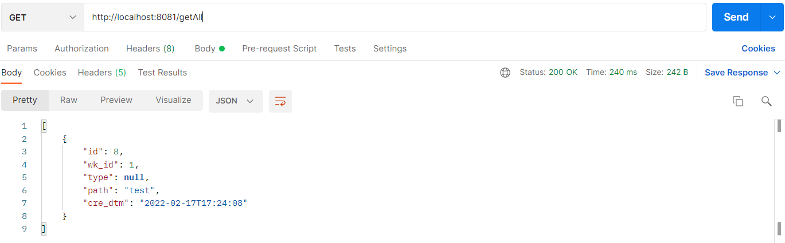

## ✅ 개요
AWS 의 SecretsManager의 RDS 정보를 받아 AWS RDS에 접근하여 데이터를 가져와보자
<br>

### 🔑SecretsManager 사용

생성한 보안암호에 AWS RDS의 정보들이 있다.
나는 미리 생성해 놨다.
> 🦄 SecretsManager 생성방법은 [링크](https://leesungki.github.io/gatsby-aws-study-secretsManager-tutorial/)를 참고해주세요!

### AWS RDS 연동

1. 의존성 추가
```
dependencies {    
    implementation group: 'mysql', name: 'mysql-connector-java', version: '8.0.27'
    implementation 'org.springframework.boot:spring-boot-starter-data-jpa'
    implementation group: 'com.amazonaws.secretsmanager', name: 'aws-secretsmanager-jdbc', version: '1.0.6'
}
```

<!-- 시크릿 매니저가 생성 되었다면 이제 해당 값을 가져오는 로직이 필요하다.
나는 SecretManagerBuild class를 이용하여 진행하였다.
> 🦄 SecretsManager 값 받아오기 [링크](https://leesungki.github.io/gatsby-springboot-study-secretsManager/#secretmanagerbuild-class-%EC%82%AC%EC%9A%A9)를 참고해주세요! -->

2. application.yml 파일에 datasource 정의


```yml
spring:
  datasource:
    url: jdbc-secretsmanager:mysql://aws-rds-mysql.cfukbqlziunf.ap-northeast-2.rds.amazonaws.com:3306/InnoDB
    username: /secret/hkmc-mip-rds-crawlerdb-dev
    driver-class-name: com.amazonaws.secretsmanager.sql.AWSSecretsManagerMySQLDriver
```

3. RDS 데이터 확인(IntelliJ)\
DB 툴을 사용해서 확인도 가능하지만 나는 인텔리제이를 사용하므로 인텔리제이로 연동후 데이블과 데이터를 넣어줬다.

> 🦄 IntelliJ에서 RDS 연동 [링크](https://leesungki.github.io/gatsby-springboot-study-intellij)를 참고해주세요!

아래와 같이 테이블에 더미 데이터를 넣어줬다.



4. 엔티티 생성

적당한 경로에 tb_file 테이블의 데이터를 가져오기 위한 엔티티와 리포지토리 를 만들어줬다.

```java
@Entity
@Getter
@Table(name = "tb_file")
@NoArgsConstructor
public class TbFile {

	@Id
	@GeneratedValue(strategy = GenerationType.IDENTITY)
	private int id;

	private int wk_id;
	private String type;
	private String path;
	private LocalDateTime cre_dtm = LocalDateTime.now();

	@Builder
	public TbFile(int wk_id, String type, String path) {
		this.wk_id = wk_id;
		this.type = type;
		this.path = path;
	}
}
```
```java
@Repository
public interface TbFileRepository extends JpaRepository<TbFile, Integer>{
}
```


5. 컨트롤러 생성

정상적으로 값을 가져오는지 확인하기 위한 컨트롤러 생성한다.

```java
@RestController
public class CheckController {
    @Autowired
    private TbFileRepository tbFileRepository;
    
    @GetMapping("/secrets-check2")
    public ResponseEntity getAll(){
        List<TbFile> result = tbFileRepository.findAll();
        return new ResponseEntity<>(result, HttpStatus.OK);
    }
}
```

6. 포스트맨 호출
정상적으로 호출이 완료되는지 테스트한다.




## 🌭마무리
위와 같이 aws-secretsmanager-jdbc를 사용하여 application.yml 파일에 직접 secretsmanager 값을 가져와 datasource를 만들어 연동이 가능하다.
하지만 RDS를 두 개를 연동해서 사용해야 하는 경우도 있기 때문에 이왕이면 config를 활용하여 연동해서 사용하는 게 좋을 거 같다.
다음에는 ssh 터널링을 통한 다중 RDS 연동에 대해 다뤄볼 예정이다.

<br>
<br>

```toc

```
