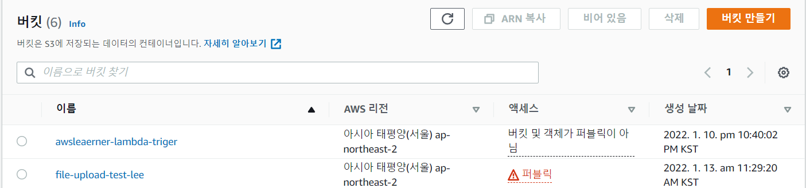
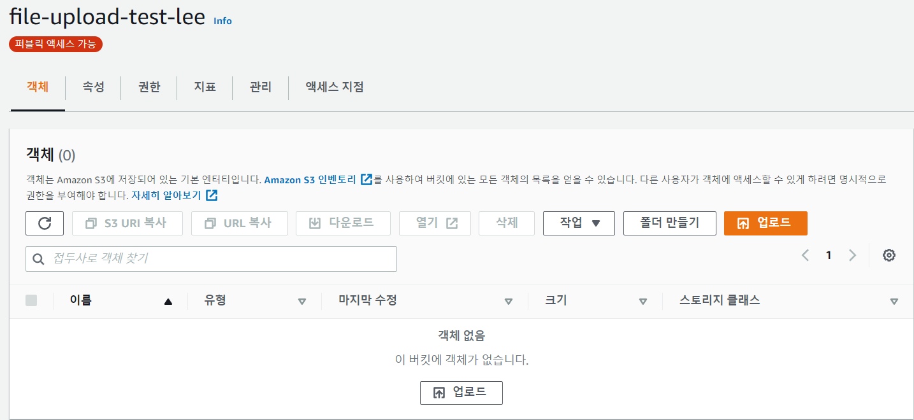
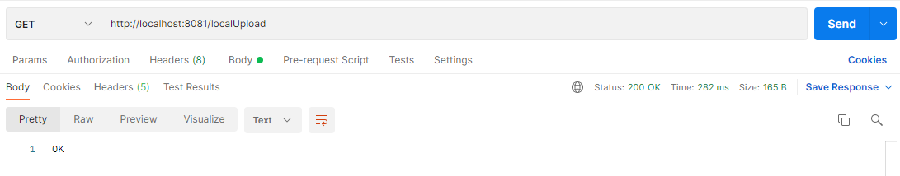
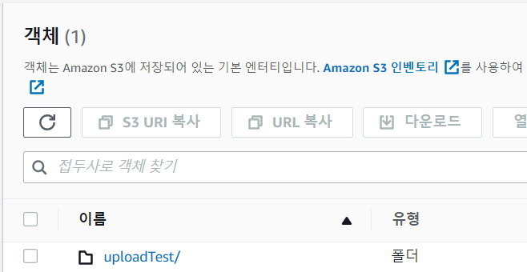
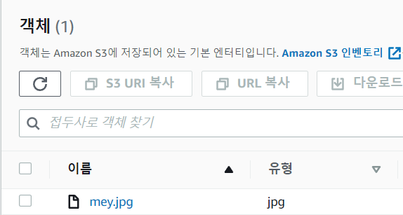
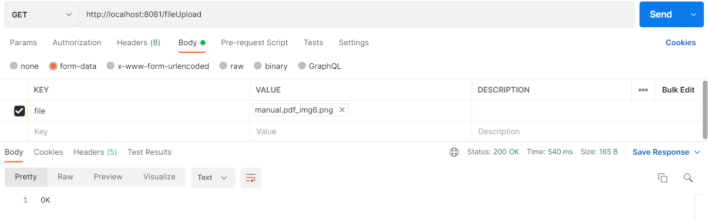
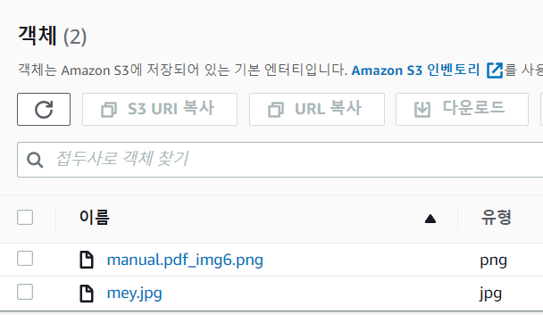
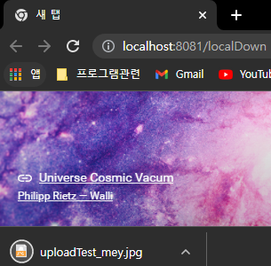

## 👀 개요

이전 포스팅에서 S3에 대해서 간단하게 다뤘었다. 

요번에는 S3에 파일을 올리는 과정을 포스팅하려 한다.

> ❗ S3에 대해서는 이전 포스팅 참고 [S3란?](https://leesungki.github.io/gatsby-aws-study-s3/)

> 🦺 S3 버킷 생성에 대해서는 이전 포스팅 참고 [S3 버킷 생성](https://leesungki.github.io/gatsby-aws-study-s3/)

## 🗑 S3 파일 업로드

1. 버킷 생성 

일단 나는 아래 그림처럼 file-upload-test-lee라는 명칭으로 퍼블릭한 버킷을 하나 생성했다.


해당 버킷을 클릭하여 들어가면 아무런 객체도 없는 상태이다.

 
그리고 iam 권한에 사용자에게 S3 FullAccess 권한을 부여해야 합니다. (이것이 있어야 S3에 파일 업로드를 할 수 있습니다.) 

일단 aws 상에서의 작업은 이 정도만 해주면 된다. 

이제 실제 애플리케이션에서 aws s3 서비스를 구현해 보자.

2. AmazonS3ClientBuilder 를 사용한 업로드 구현

의존성 추가

```
implementation group: 'org.springframework.cloud', name: 'spring-cloud-starter-aws', version: '2.2.5.RELEASE'
```
프로젝트 구조
```
common
    ㄴconfig
        ㄴAmazonS3Config
controller
    ㄴCheckController
aws
    ㄴAwsSecret
    ㄴSecretManagerBuild
service
    ㄴS3Service   
resources
    ㄴapplication.yml
    ㄴstatic.image.test
        ㄴmey.jpg      
```

- AmazonS3Config 
- CheckController
- AwsSecret
- SecretManagerBuild
- S3Service
- application
- mey.jpg: 로컬 테스트용 이미지파일을 넣어줬다.

먼저 나는 s3에 접근하기 위해 필요한 사용자의 정보를 secretmanager를 통해 받아올 것이기 때문에 위와 같이 구조를 만들어 주었다. 

해당 부분에 대해서는 이전 포스팅을 참고 하자. 

[참고](https://leesungki.github.io/gatsby-springboot-study-secretsManager/)

application.yml

```yml
secret:
  name:
    #_dev arn
    key: #시크릿 매니저 arn
    crawler: #시크릿 매니저 arn
    ecm: #시크릿 매니저 arn
cloud:
  aws:
    region:
      static: ap-northeast-2
    stack:
      auto: false
    s3:
      bucket: file-upload-test-lee
```

application.yml 에 aws 관련 정보를 기재해 준다.


AmazonS3Config

```java
@Slf4j
@Configuration
public class AmazonS3Config {
    /**
     * aws 가용 지역
     */
    @Value("${cloud.aws.region.static}")
    private String region;
    /**
     * secretmanager key arn
     */
    @Value("${secret.name.key}")
    private String secretName;
    /**
     * s3 접근을 위한 위한 사용자 bean
     */
    @Bean
    public AmazonS3Client amazonS3Client() {
        log.info("------------------------------------->AmazonS3Client");
        AwsSecret secretKeys = SecretManagerBuild.getSecret(secretName,region);
        String accessKey = secretKeys.getAws_ac_key();
        String secretKey = secretKeys.getAws_se_key();

        BasicAWSCredentials awsCreds = new BasicAWSCredentials(accessKey, secretKey);
        return (AmazonS3Client) AmazonS3ClientBuilder.standard()
                .withRegion(region)
                .withCredentials(new AWSStaticCredentialsProvider(awsCreds))
                .build();
    }
}
```
AmazonS3ClientBuilder 를통해 접근 정보를 만들어 준다.

S3Service

```java
@Slf4j
@RequiredArgsConstructor
@Component
public class S3Service {
    /**
     * s3 접근 정보
     */
    private final AmazonS3Client amazonS3Client;
    /**
     * S3 버킷 명
     */
    @Value("${cloud.aws.s3.bucket}")
    public String bucket;
    /**
     * 객체 url을 읽어온다
     * @param {string} bucket 버킷명
     * @param {string} fileName 파일명
     * @returns {string} imageUrl 이미지 url
     */
    public String read(String fileName) {
        String imageUrl = amazonS3Client.getUrl(bucket, fileName).toString();
        return imageUrl;
    }
    /**
     * S3 파일 업로드를 위한 경로 재정의
     * @param {File} uploadFile 업로드할 파일
     * @param {string} dirName 경로명
     * @returns {string} uploadImageUrl
     */
    public String uploadMultipart(MultipartFile multipartFile, String dirName) throws IOException {
        File uploadFile = convert(multipartFile)  // 파일 변환할 수 없으면 에러
                .orElseThrow(() -> new IllegalArgumentException("error: MultipartFile -> File convert fail"));

        return upload(uploadFile, dirName);
    }
    /**
     * S3 파일 업로드를 위한 경로 재정의
     * @param {File} uploadFile 업로드할 파일
     * @param {string} dirName 경로명
     * @returns {string} uploadImageUrl
     */
    public String upload(File uploadFile, String dirName) {
        String fileName = dirName + "/" + uploadFile.getName();
        String uploadImageUrl = putS3(uploadFile, fileName);
        removeNewFile(uploadFile);
        return uploadImageUrl;
    }
    /**
     * S3 업로드
     * @param {File} uploadFile 업로드할 파일
     * @param {string} fileName 파일명
     * @returns {string} awsS3UrlName 업로드된 url
     */
    private String putS3(File uploadFile, String fileName) {
        amazonS3Client.putObject(new PutObjectRequest(bucket, fileName, uploadFile).withCannedAcl(CannedAccessControlList.PublicRead));
        String awsS3UrlName = amazonS3Client.getUrl(bucket, fileName).toString();
        return awsS3UrlName;
    }
    /**
     * S3 다운로드
     * @param {string} fileName 파일명
     * @returns {S3Object} obj 객체
     */
    public ResponseEntity<byte[]> download(String storedFileName) throws IOException{
        S3Object o = amazonS3Client.getObject(new GetObjectRequest(bucket, storedFileName));
        S3ObjectInputStream objectInputStream = o.getObjectContent();
        byte[] bytes = IOUtils.toByteArray(objectInputStream);
        String fileName = URLEncoder.encode(storedFileName, "UTF-8").replaceAll("\\+", "%20");
        HttpHeaders httpHeaders = new HttpHeaders();
        httpHeaders.setContentType(MediaType.APPLICATION_OCTET_STREAM);
        httpHeaders.setContentLength(bytes.length);
        httpHeaders.setContentDispositionFormData("attachment", fileName);

        return new ResponseEntity<>(bytes, httpHeaders, HttpStatus.OK);
    }

    // 로컬에 저장된 이미지 지우기
    private void removeNewFile(File targetFile) {
        if (targetFile.delete()) {
            log.info("File delete success");
            return;
        }
        log.info("File delete fail");
    }
    // 로컬에 파일 업로드 하기
    private Optional<File> convert(MultipartFile file) throws IOException {
        File convertFile = new File(System.getProperty("user.dir") + "/" + file.getOriginalFilename());
        if (convertFile.createNewFile()) { // 바로 위에서 지정한 경로에 File이 생성됨 (경로가 잘못되었다면 생성 불가능)
            try (FileOutputStream fos = new FileOutputStream(convertFile)) { // FileOutputStream 데이터를 파일에 바이트 스트림으로 저장하기 위함
                fos.write(file.getBytes());
            }
            return Optional.of(convertFile);
        }

        return Optional.empty();
    }
}
```

S3에 접근 후 내가 필요한 작업들을 정의해준다.

CheckController

```java
@RestController
public class CheckController {
    @Autowired
    private S3Service s3Service;
    //multipartfile 업로드시
    @GetMapping("/fileUpload")
    public String check(@RequestParam("file") MultipartFile file){
        try {
            s3Service.uploadMultipart(file,"uploadTest");
        } catch (IOException e) {
            e.printStackTrace();
        }
        return "OK";
    }
    //서버에 저장되어 있는 파일 업로드시
    @GetMapping("/localUpload")
    public String fileUpload(){
        try {
            String fileName = "mey.jpg";
            File file = ResourceUtils.getFile("classpath:static/image/test/"+fileName);
            s3Service.upload(file,"uploadTest");
        } catch (FileNotFoundException e) {
            e.printStackTrace();
        }
        return "OK";
    }
    //S3에 저장된 파일 다운로드
    @GetMapping("/localDown")
    public ResponseEntity<byte[]> fileDownload() throws  IOException{
        return s3Service.download("uploadTest/mey.jpg");
    }
}
```
나는 두 가지 방식을 테스트하려 한다 

첫 번째 resources 영역에 내가 미리 넣어둔 이미지 파일을 업로드하는 방식 

두 번째 포스트 맨으로 multipartfile을 보내 업로드하는 방식 

사실 둘 다 로컬에 한번 저장하는 과정이 필요하다 s3 service를 보면 더 자세히 알 수 있다.

4. 포스트 맨을 통한 테스트

먼저 첫 번째 방식을 테스트해보자 아래와 같이 요청을 했을 때



내가 생성한 버킷에 설정한 폴더명이 생기고 클릭해보면 로컬에 넣어놨던 파일이 저장되어 있다.





두 번째 방식도 테스트를 해보자 

아래와 같이 파일을 넣어서 요청해 보면



같은 버킷의 폴더에 아래와 같이 내가 보낸 파일이 업로드된 걸 볼 수 있다.


 
5. S3 객체 다운로드 테스트 

브라우저 창을 하나 열고 다운로드 테스트를 해보자 

아래처럼 내가 방금 업로드한 파일이 잘 다운로드되는 걸 확인할 수 있다.



## 🌭마무리
이처럼 간단하게 springboot를 사용하여 s3에 접근 후 파일 업로드 다운로드를 구현해 보았다. 

굉장히 간단한 예제이므로 공식문서 등을 참고하여 좀 더 여러 방식으로 사용이 가능하다 생각된다.

```toc

```
