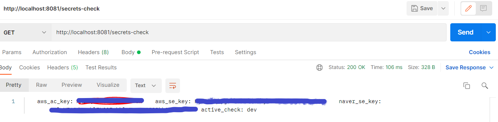
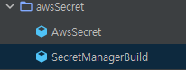
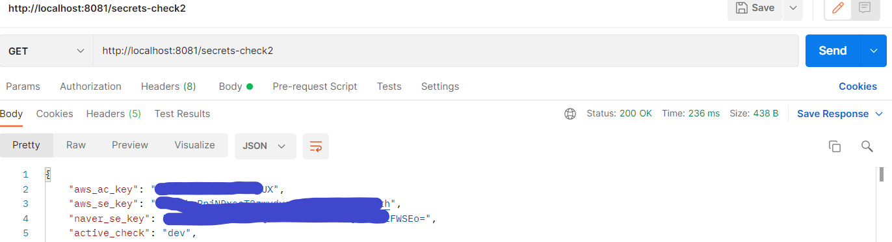

## ✅ Spring Boot 연결하기
<br>

### 📌bootstrap.yml 사용

1. 의존성 추가
```
dependencies {     
    implementation 'org.springframework.cloud:spring-cloud-starter-bootstrap:3.0.3'     
    implementation 'org.springframework.cloud:spring-cloud-starter-aws-secrets-manager-config:2.2.6.RELEASE' 
 }
```

2. 프로젝트 상단에 bootstrap.yml파일을 추가해주고, 아래와 같이 설정

```yml
aws:
    secretsmanager:
        name: classificator_dev #시크릿 매니저에 설정된 보안 암호 이름
cloud:
    aws:
        region:
            static: ap-northeast-2
```
나의 경우 보안 암호 이름이 /secret/classificator_dev 이다 앞의 /secret는 해당 보안값이 들어가는 prefix 라고 보면된다.
따라서 **/secret/**뒤의 값을 넣어주면 된다.

3. 시크릿 값 확인
아래처럼 간편하게 확인 하기위해 컨트롤러를 하나 생성해 주었다.
```java
@RestController
@RequestMapping("/secrets-check")
public class CheckController {
    @Value("${aws_ac_key}")
    private String aws_ac_key;
    @Value("${aws_se_key}")
    private String aws_se_key;
    @Value("${naver_se_key}")
    private String naver_se_key;
    @Value("${active_check}")
    private String active_check;

    @GetMapping
    public String healthCheck(){

        return "\t"+"aws_ac_key: "+aws_ac_key+"\t"+"aws_se_key: "+aws_se_key+"\t"+"naver_se_key: "+naver_se_key+"\t"+"active_check: "+active_check;
    }
}
```
4. 포스트맨 호출
정상적으로 값을 가져오는지 확인한다.



시크릿 매니저에 저장한 값들을 확인할수 있다.

위와같은 방식은 확실히 간편하고 편하다 하지만 aws 에서 secrets manager를 사용하다보면 rds의 연결 정보라던가 여러 값들을 가져와야하는 경우가 또생긴다.
그렇기땜에 secrets manager값들을 공통으로 받아서 처리할수 있는 부분이 있다면 더편하다.

### 📌SecretManagerBuild class 사용

1. 디렉토리 구성



2. AwsSecret class
시크릿 벨류 매핑
```java
@Getter
@Setter
public class AwsSecret {
    private String aws_ac_key;
    private String aws_se_key;
    private String naver_se_key;
    private String active_check;
    private String username;
    private String password;
    private String host;
    private String engine;
    private String port;
    private String dbInstanceIdentifier;
}
```

3. SecretManagerBuild class
시크릿매니저 접근후 값을 받아온다. secretName 에는 보안암호 arn 넣어준다 region은 지역(ap-northeast-2)
```java
public class SecretManagerBuild {
    public static AwsSecret getSecret(String secretName, String region){
        final Gson gson = new Gson();
        AWSSecretsManager client  = AWSSecretsManagerClientBuilder.standard()
                .withRegion(region)
                .build();

        String secret, decodedBinarySecret;
        GetSecretValueRequest getSecretValueRequest = new GetSecretValueRequest()
                .withSecretId(secretName);
        GetSecretValueResult getSecretValueResult = null;
        try {
            getSecretValueResult = client.getSecretValue(getSecretValueRequest);
        } catch (Exception e) {
            throw e;
        }
        if (getSecretValueResult.getSecretString() != null) {
            secret = getSecretValueResult.getSecretString();
            return gson.fromJson(secret, AwsSecret.class);
        }
        return null;
    }
}
```

4. secretCheck controller

```java
@RestController
public class CheckController {
    @GetMapping("/secrets-check2")
    public ResponseEntity secretCheck(){
        AwsSecret secretValue = SecretManagerBuild.getSecret(
                "arn:aws:secretsmanager:ap-northeast-2:040516392204:secret:/secret/classificator_dev-j623rv",
                "ap-northeast-2");

        return new ResponseEntity<>(secretValue, HttpStatus.OK);
    }
}
```

5. 포스트맨 호출
아래와같이 값이 잘 오는걸 확인할수 있다.




## 🌭마무리
위와 기능을 활용하여 Secrets Manager를 사용하여 aws의 서비스를 사용하자.

<br>
<br>

```toc

```
