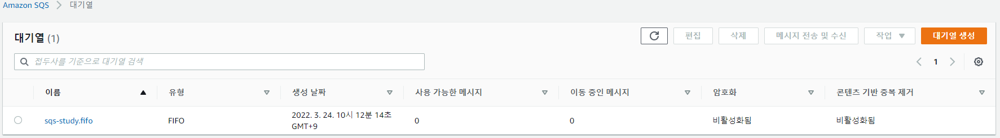
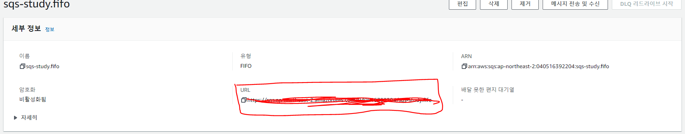
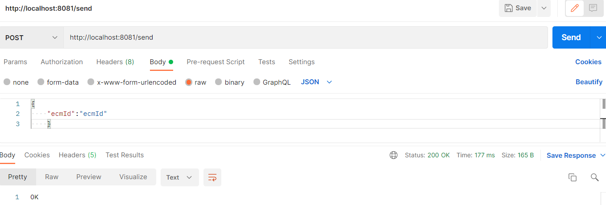
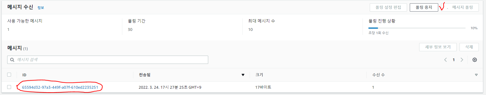
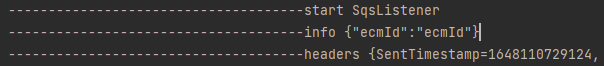

## 👀 개요

이전 포스팅에서 SQS에 대해서 간단하게 다뤘었다. 

요번에는 SQS를 SPRING BOOT 에서 사용하는 방법을 실습해 보겠다.

> ❗ SQS에 대해서는 이전 포스팅 참고 [SQS란?](https://leesungki.github.io/gatsby-aws-study-sqs/)

> 🦺 SQS 대기열 생성 큐 수신,송신에 대해서는 이전 포스팅 참고 [SQS 사용법](https://leesungki.github.io/gatsby-aws-study-sqs-tuto/)

## 📖 실습

### 💼 대기열 생성 

일단 나는 아래 그림처럼 SQS 대기열을 생성했다.


해당 대기열 클릭하여 들어가면 세부정보의 url을 확인 할수있다.
나중에 사용하기 위해 기억해두자

 
### 🖋 필수 설정하기

의존성 추가

```
implementation group: 'org.springframework.cloud', name: 'spring-cloud-starter-aws', version: '2.2.1.RELEASE'
implementation group: 'org.springframework.cloud', name: 'spring-cloud-aws-messaging', version: '2.2.3.RELEASE'
implementation group: 'org.springframework.boot', name: 'spring-boot-starter-validation', version: '2.5.6'//나중에 메세지 유효성 검사를 위함
```
프로젝트 구조
```
controller
    L MainController
config
    L AmazonSqsConfig
aws
    L AmazonSQSSender
    L AmazonSQSSenderImpl
dto
    L EcmDto    
```

application.yml

```yml
cloud:
  aws:
    credentials:
      access-key: xxxxxx
      secret-key: xxxxxx
    region:
      static: ap-northeast-2 # AWS SQS의 리전정보
    stack:
      auto: false
    sqs:
      queue:
        name: MyQueue.fifo	# AWS에서 생성한 Queue 이름
        url: https://sqs.ap-northeast-2.amazonaws.com/xxxx/MyQueue.fifo # 생성한 SQS 큐 url
```

application.yml 에 aws 관련 정보를 기재해 준다.


### 🖊 SQS Configuration 클래스 생성

- application.yml에 있는 access-key, secret-key 값을 가지고 AWSCredentialsProvider 빈 생성
- Message 송신에 사용되는 AmazonSQS 빈 생성 시 해당 credentials 정보와 region 정보 설정
- Message 수신시 사용되는 Listener 관련 설정

```java
@Slf4j
@Configuration
public class AmazonSqsConfig {

	 @Value("${cloud.aws.credentials.access-key}")
    private String accessKey;

    @Value("${cloud.aws.credentials.secret-key}")
    private String secretKey;

    @Value("${cloud.aws.region.static}")
    private String region;
    /**
     * sqs 접근을 위한 위한 사용자 bean
     */
    @Primary
	@Bean
    public AmazonSQSAsync amazonSQSAws() {
        BasicAWSCredentials awsCreds = new BasicAWSCredentials(accessKey, secretKey);
        return AmazonSQSAsyncClientBuilder.standard()
                .withRegion(region)
                .withCredentials(new AWSStaticCredentialsProvider(awsCreds))
                .build();
    }	
}
```
AmazonSQSAsyncClientBuilder 를통해 접근 정보를 만들어 준다.

### 🖌 메세지 Dto 생성
```java
@Getter
@Setter
@JsonIgnoreProperties(ignoreUnknown = true)
public class EcmDto {
	@NotEmpty(message = "ecmId값이 빈값입니다.")
	private String ecmId;
}
```

자신이 메세지를 보낼방식으로 작성하면 된다.

### 📤 메세지 전달 서비스 생성

```java
public interface AmazonSQSSenderImpl {
    SendMessageResult sendMessage(EcmDto message) throws JsonProcessingException;
}
```

```java
@RequiredArgsConstructor
@Component
public class AmazonSQSSender implements AmazonSQSSenderImpl {
    @Value("${cloud.aws.sqs.queue.url}")
    private String url;

    private final ObjectMapper objectMapper;
    private final AmazonSQS amazonSQS;

    @Override
    public SendMessageResult sendMessage(EcmDto msg) throws JsonProcessingException {
        SendMessageRequest sendMessageRequest = new SendMessageRequest(url,
                objectMapper.writeValueAsString(msg))
                .withMessageGroupId("sqs-test")
                .withMessageDeduplicationId(UUID.randomUUID().toString());
        return amazonSQS.sendMessage(sendMessageRequest);
    }
}
```

SQS에 메세지 보내는 로직을 정의한다.

### 📫 테스트용 Controller 생성

```java
@Slf4j
@RequiredArgsConstructor
@RestController
public class MainController {

    private final AmazonSQSSenderImpl amazonSQSSender;

    @PostMapping("/send")
    public String send(@RequestBody EcmDto message) throws JsonProcessingException {
        amazonSQSSender.sendMessage(message);
        return "OK";
    }
}
```

### 📈 포스트 맨을 통한 메세지 송신 테스트

아래와 같이 요청한다.



sqs 콘솔에서 메세지 폴링해보면 내가 보낸 메세지가 있는걸 확인 할수 있다.

 
### 📥 메세지 수신 Listener 생성 

```java

@Slf4j
@Component
@RequiredArgsConstructor
public class AwsSqsListener {

	@SqsListener(value = "${cloud.aws.sqs.queue.name}", deletionPolicy = SqsMessageDeletionPolicy.NEVER)
	public void listen(@Payload String info, @Headers Map<String, String> headers, Acknowledgment ack) {
		log.info("-------------------------------------start SqsListener");
		log.info("-------------------------------------info {}", info);
		log.info("-------------------------------------headers {}", headers);
        //수신후 삭제처리
		ack.acknowledge();
	}

}
```
메세지 리스너 작성을 해준다.

### 📉 포스트 맨을 통한 메세지 수신 테스트

아래와 같이 다시 요청한다.
  


아래처럼 내가 방금 보낸 메세지를 확인할 수 있다.




## 📢 마무리

이처럼 springboot에서 sqs에 접근 후 메세지를 보내고 받는기능을 구현해 보았다. 

같은 vpc내의 컨테이너끼리 메세지를 주고받기 굉장히 편한 기능같다.

실제로 내가 진행한 프로젝트에서도 컨테이너간 간단한 메세지 전송에 사용되었다.

```toc

```
