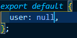

## 🎋 개요

이번에 개발 환경을 VUE 3 로  구성했던 경험을 포스팅할 예정

### 환경 구성

1. VUE CLI 
VUE 개발을 쉽게해주는 번들러 나는 WEB PACK 설정 BABEL 설정 같은걸 알아서 해준다 설치를 해준다.
> vue cli 공식문서 [참고](https://cli.vuejs.org/)

나는 vue3study_2 라는 폴더에 설치했다.
vue create vue3_project_set
vue3_project_set 로 프로젝트 생성


vue3 로 진행할꺼기 때문에 해당 옵션 선택

vuex 와 vue-router 도 추가해준다.
```
vue add vuex
vue add router //history mode 는 y로 해준다.
```
마지막으로 나는 vuetify를 사용할꺼기때문에 추가해준다.
```
vue add vuetify // 옵션은 V3 로해준다 
```
이제 eslint + pretter 설정을좀 해줘야한다.

vscode 에 elint 와 pretter 설정은 구글에 잘나와있다.

저장시에 자동으로 포멧해주는 설정만 setting.json에 기입해주면된다.

그리고 cli 로 프로젝트 생성시에 위의 모든것들을 옵션으로 할수있다.    


바로 위처럼 수동으로 선택해주면


스페이스바를 눌러 내가원하는 플러그인을 설치할수있다.
개인적으로 너무편한기능이였다
vue 버전과 eslint+prettier 설정등 여러 설정을 수동으로 할수있다.

다 추가한 package.json 파일이다.


잘 추가된것을 알수있다.

서버를 실행해보자
npm run serve


잘 실행된걸 알수있다.

이제 우리가 개발하면서 코드 규약을 정해 자동으로 검사해주고 수정해주는 eslint+prettier를 설정해볼거다.

사실 기본적으로 해주는것들을 잘사용해도 괜찮지만 간단한것만좀 추가해볼 예정이다.

package.json에 보면 eslint 와 prettier에 관한 설정이있다.


rules에 규약을 정할수있다.
나는 "쌍따옴표를" => '홀따옴표로 자동으로 검사변경해줄예정이다'


이렇게 설정해주었다.

그리고 vue의 환경변수 파일과 build 명령어를 나눠줘보자
보통 개발할때 local,dev,prod 이렇게 3가지의 환경이 많아
3가지로 나눠볼생각이다.

root 디렉토리에 .env.local  , .env.development , env.production 이렇게 3개의 파일을 만들어주자.

env.local은 로컬환경에서 사용할 환경변수를 정의해주자


나는 이렇게 두개를 추가했다 로컬에서 백앤드 api로 요청할 주소와 빌드된 환경을 알기위해 mode 도추가했다.

그리고 package.json 파일의 빌드 명령어도 수정해보자.


나는이처럼 로컬에서의 환경 빌드되는 것들과 개발 운영을 나눠서 해놨고

lint명령어는 자동으로 규약에맞게 수정해주는 명령어지만 이미자동으로 설정을 해놨기에 쓸일이 없을듯싶다.

이렇게 기본적인 개발환경셋팅은 했지만 추가적으로 vue에서 프로젝트가 build될때 번들링을 기본적으로 prefech로 해주는데 

이렇게하면 플젝이 커질수록 초기 로딩이 느려진다.

그렇기에 vue.config.js에 그부분을 false로해주자.


vue.config.js 에는 웹팩과 서버설정등을 할수있다.
하는김에 서버설정도 좀 바꿔줬다 

마지막으로 서버를 실행해보자
npm run local

여기까지 정상적으로 되었다면 완료.
이제 
vuex, vue-router, axios 의 구성을 좀 바꿔줄예정

vue-router 부터 보자 
나중에 라우터가 많아지면 정의가 불편하기때문에 모듈로 나눠줄예정이다.

그리고 views 의 컴포넌트로 폴더로 관리할예정이다.
```
router
	ㄴmodules
		ㄴlogin.router.js
	ㄴindex.js
views
	ㄴmain
		ㄴMain.vue
	ㄴlogin
		ㄴLogin.vue
```		

router > index.js


router > login.router.js


이렇게 모듈에 로그인 라우터를 따로만들어 index.js에 구조할당해서 관리한다.

이번에는 store 를 관리하기 편하게 바꿔보자.
```
store
	ㄴmodules
		ㄴlogin
			ㄴindex.js
			ㄴlogins.actions.js
			ㄴlogins.mutations.js
			ㄴlogins.getters.js
			ㄴlogins.state.js
		ㄴmain
			ㄴ.....
```            
일단 구조는 이렇다

store > modules > login > index.js


store > modules > login > actions.js


store > modules > login >mutations.js


store > modules > login > state.js


store > modules > login > getters.js


store >index.js


views>login>login.vue


결과


로그인 컴포넌트에서 입력한 test 를 액션을통해 뮤테이션을거쳐 스테이트에 넣어준다.

그후 로그인 컴포넌트에서는 스테이트에저장된 값을 가져온다 지금은 옵션api로 코딩했지만 추후 composion api 로변경예정

이렇게 기본적으로 스토어도 모듈화시켜서 사용하면 편하다.

이렇게 라우터와 스토어를 나눴고 이제 액션에서 api를 호출하는것을 해볼생각이다 axios를 사용할예정인데 백앤드를 먼저 간단하게 json server 로 구성할생각이다.

프로젝트와 같은 레벨에 json-server 폴더를 만들었다.

json-server 사용법은 인터넷에 잘나와있다. [참고](https://redux-advanced.vlpt.us/3/01.html)

공식: https://github.com/typicode/json-server

json-server 폴더 하위에 db.json파일을 만들어서 리턴 데이터를 정의했다.


json-server 를 실행하고 기본실행시 포트는 3000 번이다.

postman으로 요청을 날려 확인해봤다.

이렇게 유저정보를 넣었고 이제 Axios를 설치해보자
```
npm i axios
```
package.json에 추가된다.

나는 모든 api요청은 services 폴더에서 관리할 예정이다.

services 하위에 api.common.js 를생성한다.

services > api.common.js

process.env.VUE_APP_API 는 환경변수이다

env.local 파일에 요청주소를 맞춰주자


현재 json-server의 요청 주소를넣어주고

api.common.js 를 작성


services > login>login.service.js


store>modules>login>login.actions.js


store>modules>login>login.mutations.js


store>modules>login>login.state.js



이렇게 액션에서 해당 서비스를 호출하여 받은값을 뮤테이션하여 스테이트에 저장하는 로직을 작성한다.

마지막으로 Login.vue 컴포넌트도 변경한다.


화면을보자


아이디값을 입력하여 전송한다. id:1


개발자 툴에서 network탭에서 호출이 정상적으로 되었는지 확인해보자


이렇게 json-server를 이용하여 간단하게 axios까지 구현해봤다.

이제 로그인 을 했을때에 main으로가고 유저 정보가 없을때에는 login페이지로 가게끔 라우터를 바꿔보자

일단 path가 라우터에 명시된게 아닐경우 무조건 '/'메인으로 가게끔 추가하자
router>index.js


이제 라우터에 지정된 path가 아닌경우 무조건 main으로 리다이렉트한다.

이제조금 복잡해진다
나는 로그인할때 jwt토큰을 발급받아 localstorege에 저장해서 토큰의 여부로 사용자가 정상 로그인한걸 확인할것이다.

일단 라우터가 실행되기전에 로그인이 필요한 페이지인지 확인후 로그인여부를 확인한다 (토큰여부) 

그후 로그인 필요한페이지 접근시 로그인여부가 true면 라우터가 진행되고 false면 로그인페이지로 리다이렉트 시킨다.

router > index.js
```js
import jwtUtil from '@/shared/utils/token-util';//토큰이 을 로컬스토리지에 set해주거나 get하는 로직을 임포트

//라우터가 실행되기전에 실행한다 
router.beforeEach((to, from, next) => { 
  //로그인 안한경우에만오는 페이지 login.router 해당 
  const onlyWhenNotLoggedIn = to.matched.some( 
    (record) => record.meta.onlyWhenNotLoggedIn 
  ); 
  //로그인여부 
  const loggedIn = isValidAccessToken(); 
  //로그인 필요한 페이지 접근 시 
  if (to.matched.some((record) => !!record.meta.auth)) { 
    //토근존재여부 판단 
    if (!loggedIn) { 
      next({ 
        path: '/login', 
        params: { nextUrl: to.fullPath }, 
      }); 
    } else { 
      next(); 
    } 
  } 
  //로그인 필요없는페이지 접근 
  else if (to.matched.some((record) => !record.meta.auth)) { 
    //로그인 되어 있는데 다시 로긍니 페이지로 이동한다면 
    if (loggedIn && onlyWhenNotLoggedIn) { 
      next({ 
        name: 'main', 
      }); 
    } else { 
      next(); 
    } 
  } 
}); 
//토큰생성 여부 판단 
function isValidAccessToken() { 
  //로컬스토리지에 저장된 토큰가져온다. 
  const accessToken = localStorage.getItem('accessToken'); 
  if ( 
    !accessToken || 
    accessToken === 'null' || 
    accessToken === 'undefined' || 
    !jwtUtil.isValidJwt(accessToken) //유효성검사 
  ) { 
    return false; 
  } 
  return true; 
}
```

shared > utils > token-util.js
```js
const tokenUtil = { 
  //로컬스토리지에 토큰 셋팅해준다 
  setItem: async function (key, val) { 
    return Promise.resolve().then(function () { 
      localStorage.setItem(key, val); 
    }); 
  }, 
  //로컬스토리지에 토큰 갸져온다 
  getItem: async function (key) { 
    return Promise.resolve().then(function () { 
      return localStorage.getItem(key); 
    }); 
  }, 
  //로컬스토리지에 토큰 제거 
  removeItem: async function (key) { 
    return Promise.resolve().then(function () { 
      localStorage.removeItem(key); 
    }); 
  }, 
  //토큰 유효성검사 
  isValidJwt(jwt) { 
    if (!jwt || jwt.split('.').length < 3) { 
      return false; 
    } 
    const data = JSON.parse(atob(jwt.split('.')[1])); 
    const exp = new Date(data.exp * 1000); 
    const now = new Date(); 
    return now < exp; 
  }, 
  invalidateJwt() { 
    this.removeItem('vuex'); 
    this.removeItem('accessToken'); 
    this.removeItem('username'); 
  }, 
  invalidateJwtAndReload() { 
    this.removeItem('vuex'); 
    this.removeItem('accessToken'); 
    this.removeItem('username'); 
    location.reload(); 
  }, 
}; 
export default tokenUtil;
```

jwt토큰관련해서는 공식문서를 참고하는게 필요하다

기본적으로 유효기간이있고 해당유효기간이 만료하면 다시로그인을 하는 방식으로 보통 많이 구성한다.

jwt토큰은 백앤드에서 발급해주는 식이지만 현재 백앤드서버는 구성안하여서 약식으로 하겠다.

중요한흐름은 로그인시 토큰을 발급 => 로컬스토리지에저장=> 페이지 이동시마다 토큰유무를 파악 => 없는경우 로그인페이지로 리다이렉트
해당 흐름이다.

이제 로그인 컴포넌트를 조금 수정해보자

views > login > Login.vue

```html
<template> 
  <div> 
    Login Page 
    <ul class="lof"> 
      <li> 
        <input 
          class="ids" 
          v-model="loginForm.username" 
          ref="inputUsername" 
          placeholder="아이디 입력" 
          outlined 
        /> 
      </li> 
    </ul> 
    <div class="log_foot"> 
      <v-btn @click.prevent="handleSubmit"> Login </v-btn> //버튼클릭시 로그인 함수실행 
    </div> 
  </div> 
</template> 
<script> 
import { mapActions, mapState } from 'vuex'; 
export default { 
  name: 'Login', 
  data() { 
    return { 
      loginForm: { 
        username: null, 
        password: null, 
      }, 
    }; 
  }, 
  mounted() { 
    this.$refs.inputUsername.focus(); 
  }, 
  methods: { 
    ...mapActions('login', ['LOGIN_TEST']), 
    handleSubmit() {
//로그인 액션 실행 
      this.LOGIN_TEST(this.loginForm).then(() => { 
        if (localStorage.getItem('accessToken')) {
//accessToken 있을시에 main으로 라우팅해준다 
          this.$router.push({ name: 'main', params: {} }); 
        } else { 
//accessToken 없을시에 login으로 라우팅해준다          
          this.$router.push({ name: 'login', params: {} }); 
        } 
      }); 
    }, 
  }, 
}; 
</script> 
<style></style>
```

store > modules > login > login.actions.js

```js
//로그인에서 사용할 service 추가 
import loginService from '@/services/login/login.service.js'; 
//로그인시 토큰 및 로컬스토리지 비워주기위해
import tokenUtil from '@/shared/utils/token-util'; 
export const LOGIN_TEST = ({ commit }, data) => { 
  //JWT and localstorege 비워준다 
  tokenUtil.invalidateJwt(); 
  //액션에서 api 요청예정 
  return loginService 
    .login(data.username) 
    .then((res) => { 
      const user = res.data; 
      console.log(user); 
      localStorage.setItem('username', user.username); 
      localStorage.setItem('accessToken', user.accessToken); 
      commit('SET_USER', user); 
    }) 
    .catch((err) => { 
      console.log(err); 
    }); 
};
```

로그인시에 accessToken과 username을 로컬스토리지에 저장해준다.

해당데이터 기준으로 사용자의 로그인 여부를 판단한다.

처음 메인 진입에 accessToken이 없으므로 login 페이지로 리다이렉드된다.


로그인을 정상적으로 할때 아래와같이 메인으로 라우팅되며 로컬스토리지에 저장된 데이터도 확인이 가능하다.


자 이제 여기까지 대략 jwt토큰을 백앤드에서 받는다는 가정으로 구현해봤다.

모든라우팅이 이루어지기 전에 로컬스토리지의 accessToken여부를 판단하고 없다면 로그인페이지로 리다이렉트 시켰고 

이제 모든 api 요청을 할때도 accessToken의 유효성을 판단해줘야한다.

services > api.common.js
```js
import tokenUtill from '@/shared/utils/token-util'; 

//api 요청에 실행 로직 추가 
Api.interceptors.request.use(async function (config) { 
  //토큰가져옴 
  const acToken = tokenUtill.getItem('accessToken'); 
  if (acToken) { 
    config.headers['Authorization'] = `Bearer ${acToken}`; 
  } 
  return config; 
});
//api 응답에 실행 
Api.interceptors.response.use( 
  function (response) { 
    return response; 
  }, 
  function (error) { 
    const errorResponse = error?.response; 
    const errorStatus = errorResponse?.status; 
    
    if (!!errorStatus === 401 || errorStatus === 403) { 
      tokenUtill.invalidateJwtAndReload(); 
    } 
    return error; 
  } 
);
export default Api;
```

이렇게 axios 의 요청이 실행되기전 accessToken 이있는경우 요청 헤더에 토큰을 담고 요청을 진행한다.

없는경우 헤더에 토큰을 못담기때문에 서버에서 에러를 보내준다. 이부분은 서버에 구현이 필요하지만 있다는 가정하에 진행한다.

에러를 받았을때의 로직도 추가한다.

에러상태가 401 또는 403 일때 로컬스토리지에 데이터를 비워주고 현재페이지 리로드한다. 

그럼 토큰이없기때문에 메인으로 자동 리다이렉드 된다.

사실이기능은 서버랑 같이 구현되어야하는 부분이여서 아직 확인하기가 좀 힘들다.

**`보통 api호출시 데이터를 받아오는데 진행사항 표현하는 로더기능도 이쪽에 추가한다.`**

이번에는 vuex의 데이터를 로컬스토리지에 저장하여 사용하게 해주는 플러그인을 사용해보자.

vuex store 의 데이터는 새로고침시 사라진다 dom에 뿌려지기때문 

하지만 우리는 계속해서 데이터를 사용하고 싶은 경우가있다

이때문에 나온 플러그인이라고 생각하자 먼저 로그인을하고난후 로그인 정보를 getters로 받아와서 뿌려준 메인화면이다.


이렇게 로그인한 유저의 정보가 보인다.

하지만 새로 고침시에 이렇게 유저의 정보가 사라지는걸 알수있다.


이를 해결하기 위해 라이브러리 추가

```
npm install --save vuex-persistedstate
```

vuex-persistedstate 4.x (for Vuex 4 and Vue 3) 공식 문서 참고 

store > index.js

```js
import { createStore } from "vuex"; 
import createPersistedState from "vuex-persistedstate"; 
const store = createStore({ 
  // ... 
  plugins: [createPersistedState()], 
});
```
다시 로그인을 해보자


이렇게 로컬 스토리지에 추가된것이 보인다 이제 새로고침을 해도 유저의 정보는 로컬 스토리지에 있기때문에 사라지지 않는다.

추가적으로 내가 사용하는 eslint + prettier 설정이다.

```js
"rules": { 
      "no-console":"off", 
      "no-unused-vars": "off", 
      
      "prettier/prettier": [ 
        "error", 
        { 
        "semi": false, //세미콜론사용안함 
        "tabWidth": 2, //탭간격 
        "arrowParens": "avoid", //화살표함수사용시 단일값 () 안씀 
        "singleQuote": true, //""=>'' 로바꿈 
        "htmlWhitespaceSensitivity": "ignore", 
        "trailingComma": "none", //마지막 , 안씀 
        "endOfLine": "auto" 
        } 
      ] 
    }
```

이정도이다 나중에 더 추가 할수도 있다.

이제 로그아웃을 만들어주자 비교적 간단하다
views > main > main.vue
```html
<v-col class="mb-4"> 
        <v-btn 
          @click="logout" 
          class="font-weight-bold" 
          style="background-color: #42b983" 
        > 
          Log-out 
        </v-btn> 
      </v-col>//버튼추가해줬다
<script>
    //약식
export default {
methods: { 
    ...mapActions('login', ['LOGOUT']), 
    logout() { 
      console.log('로그아웃') 
      this.LOGOUT()//클릭시 로그아웃 액션호출 
    } 
  }
}  
</script>
```

store > modules> login > login.actions.js
```js
export const LOGOUT = () => { 
  tokenUtil.invalidateJwtAndReload()//로컬스토리지 비워주고 화면 리로드한다. 
}
```

이렇게 로그아웃도 완료되었다.

이제 뷰에서 많이 사용하는 mixin 을 설정할꺼다 전역으로 공통적으로 사용하는기능을 넣고 빼서 사용한다.

공식문서 참고 https://v3.vuejs.org/guide/mixins.html#option-merging 일단 파일을 만들어준다.

shared > mixins > global-mixin.js
```js
export default { 
  //methods 
  methods: { 
    //배열의 길이 
    isListLength(list) { 
      return list.length 
    } 
  } 
}
```
간단하게 배열의 길이를 구해주는 메서드 작성
main.js 에 믹스인 추가
```js
import globalMixin from '@/shared/mixins/global-mixin'
app.mixin(globalMixin)
```
일전에 만든 List.vue 컴포넌트에서 게시들의 갯수를 가져와보자
```html
<table class="mx-auto"> 
            <thead> 
              <tr> 
                <th>번호</th> 
                <th>제목</th> 
                <th>list length</th> 
              </tr> 
            </thead> 
            <tbody> 
              <tr v-for="item in list" :key="item.id"> 
                <td>{{ item.id }}</td> 
                <td> 
                  <a @click="detail(item)"> 
                    {{ item.title }} 
                  </a> 
                </td> 
                <td>{{ isListLength(list) }}</td>//믹스인사용 
              </tr> 
            </tbody> 
          </table>
```

이런식으로 {{}} 콧수염 태그안에 사용한다.


위와 같이 작동한다.

이와같이 vue cli 4를 이용한 vue 프로젝트 설정을 끝냈다.

근데 진짜 짜증 나는건 vuetify3 이 정식 릴리즈 버전도아니고 알파버전이라 지원되는 컴포넌트도 적고 vue3에 아직 사용을 불가능했다.

하....그래서 고민하고 찾다가 알아낸...대망의 quasar (퀘이사)

위의 내용을그대로 진행하되 vuetify 를 quasar 로대체해서 진행을 해보겠다.

일단 기존 프로젝트 생성은 같다

```
vue create vue3_project_quasar
//생성해주고 기존과같이 옵션적용
```


```
vue add quasar //quasar로 갈아타기
```
여기에서 옵션이 중요 퀘이사는 자체적인 cli를 제공하는데 (안써봄) 

나는 이미 vue cli를 사용하기 땜에 퀘이사를 설치할때 수동으로  가져오는 방식으로 해야 라우터가 정상 작동한다.


저 첫번째 옵션 꼭 no 해준다.

그렇게 퀘이사가 설치되면 vue.config.js, quasar-user-optios.js 파일이생성된다 그리고 styles 폴더도 

vue.config.js 이거야 뭐 익숙하다 웹펙,서버설정,바벨,퀘이사등 cli에서 주관하는 설정파일 여기에 퀘이사 사용 코드가 자동으로 등록되어있다.

이제 문제는 quasar-user-optios.js 이다 퀘이사에서 제공하는 플러그인을 정의해놓는곳 트리쉐이킹에 용의한거아닐까? 하는 생각...

마지막으로 styles 폴더에는 scss 관련 정의 내가처음 옵션에서 사용한다고해서 생성 된듯하다 근데 이건 나중에 생각하자

그렇게 서버를실행해보자

그러면 vuetify 가 아닌 quasar를 사용해서 구성이 가능해진다.


## 🎪 마무리
프론트 영역은 확실히 트랜드에 민감해서 그런지 새로나오고 없어지는 라이브러리 들이 굉장히 많고

기존에 사용하던 것들도 업데이트가 빠르게 되는편이라 항상 잘보고 사용해야 한듯싶다.

사실 vuetify던 quasar던 어떤걸 사용해도 크게 개발상에 문제가 느껴지지는 않지만

난 개인적으로 vuetify가 더 사용하기 편했고 vue3에 맞게 업데이트가 된다면 vuetify를 계속 사용하지 싶다...

요번 포스팅은 과거에 내가 프로젝트때 정리를 대충했던걸 옮겨놓은 거라(그땐 블로그를 안했으니..)

너무 두서없고 양조절도 못했다 나중에 시간이 된다면 vue 관련 포스팅을 좀더 할예정이다.
<br>
<br>


```toc

```
