## ✨ 개요
내가 진행 했던 프로젝트 에서 네이버 클라우드 플렛폼에서 지원하는 OCR API를 사용하여 이미지의 텍스트를 추출하는 작업을 담당 했었고

해당 작업을 정리하기 위해 포스팅을 하려 한다.

## 👓 OCR?
OCR(Optical character recognition, 광학 문자 인식)은 이미지(사진) 속 글자 위치를 찾고 어떤 글자인지 자동으로 알아내는 기술입니다. 

OCR은 다양한 형태의 글자를 이해하기 위해 독자적인 글자 영역 검출 및 인식 기술을 보유하고 있습니다. 

또한 손쉽게 템플릿을 만들고 원하는 영역을 지정한 뒤, 필요한 글자만 빠르게 추출하는 기능을 제공합니다.

### 📷 Naver CLOVA OCR ?
CLOVA OCR 서비스는 네이버의 AI 기술을 활용하여 주요 비즈니스 활용에 최적화된 고성능 OCR 인식 모델을 적용하였습니다. 

문자 인식이 제공되는 언어는 한국어, 영어, 일본어이며, 필기체 인식은 한국어와 일본어가 지원됩니다.

CLOVA OCR은 문서 레이아웃 분석 및 글자를 읽는 순서 방향을 추정하여 둥글게 곡선으로 배열되거나 기울어진 문자, 필기체 인식 등 고성능 AI 모델바탕으로 높은 수준의 정확도를 제공합니다. 

OCR분야 가장 권위있는 글로벌 챌린지ICDAR2019 4개 분야에서 1위, CVPR 및 ICCV 국제학회 논문 선정 등 독보적기술력이 집약된 CLOVA OCR을 네이버 클라우드 플랫폼을 통해 손쉽게 이용할 수 있습니다

> 🎫 네이버 에서 제공하는 기능에 대한 부분은 공식 문서를 참고하자. [출처](https://www.ncloud.com/product/aiService/ocr)

#### 🎏 CLOVA OCR 사용 가이드 

1. CLOVA OCR 사용하기

[콘솔](https://console.ncloud.com/dashboard)에 접속 후 아래의 단계를 거쳐 쉽게 서비스를 이용할 수 있습니다.

- Step 1. 서비스 이용 신청 및 약관 동의
- Step 2. 도메인 생성
- Step 3. 템플릿 생성
- Step 4. 테스트 및 분석
- Step 5. 컴포넌트
- Step 6. 설정
- Step 7. 배포 관리

Step 1. 서비스 이용 신청 및 약관 동의

CLOVA OCR 서비스를 이용하기 위해서는 이용 신청 및 약관 동의가 필요합니다.

> [바로가기](https://www.ncloud.com/product/aiService/ocr) 해당 페이지 접속후 이용 신청하기 클릭

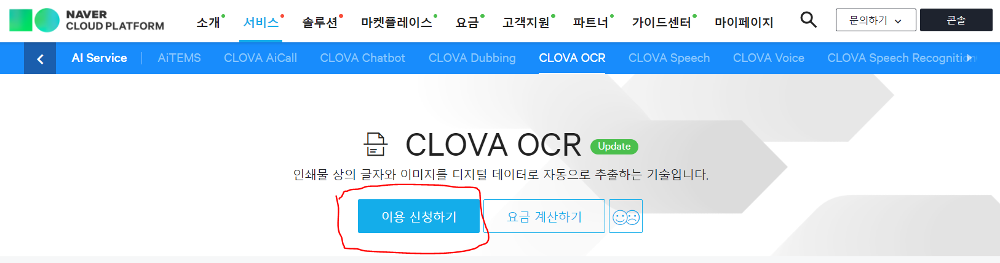

[상품 이용신청] 버튼을 클릭하여 약관에 동의한 후 다음 단계로 이동합니다.

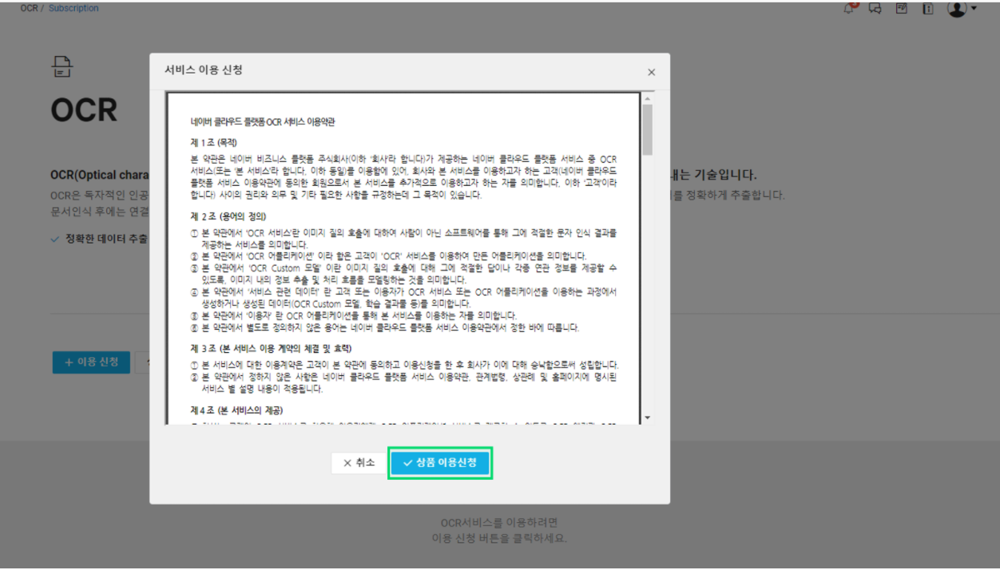


Step 2. 도메인 생성

본격적으로 CLOVA OCR 서비스를 제작하기 위해 도메인을 생성합니다.

콘솔에서 Domain 클릭후 도메인 생성 클릭

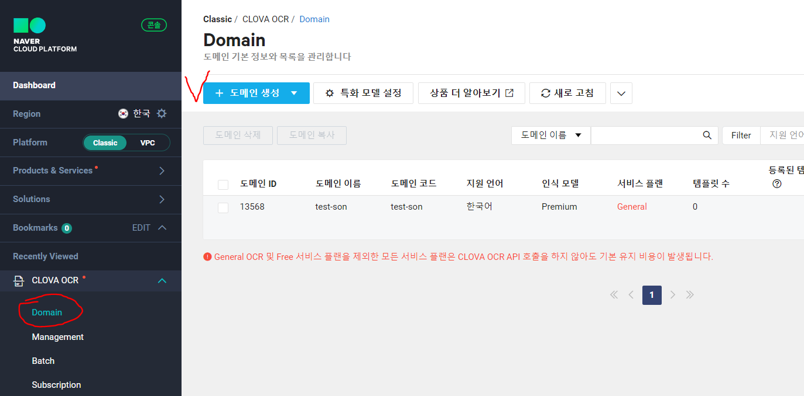

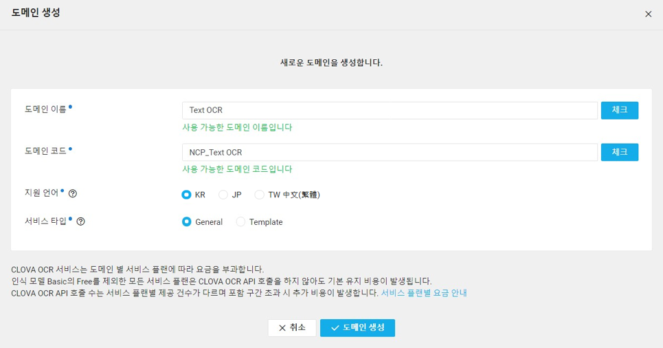

도메인 생성이 완료되면 도메인 목록을 확인할 수 있습니다. 텍스트 추출만 가능한 General 도메인은 'Text OCR'(API Gateway 연동), 'Demo'(Table 자동 추출 제공) 버튼이 동작 메뉴에 나타나고 Template 도메인의 경우 '템플릿 빌더' 실행 버튼이 노출됩니다.

선택한 도메인의 동작 메뉴에서 템플릿 빌더 버튼을 클릭하면 도메인 정보를 확인할 수 있고 새로운 창에서 OCR 빌더가 실행됩니다.

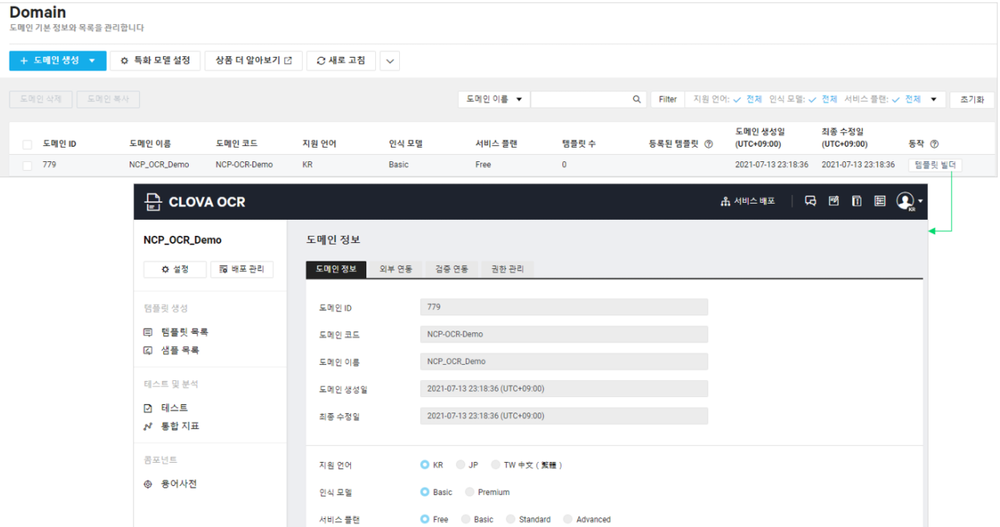

동작 메뉴에서 Text OCR 버튼을 클릭하면, 템플릿 설정 없이 전체 텍스트만 추출 가능한 General OCR 연동 설정 pop-up 창이 노출되고 Custom API Gateway 설정을 통해 자동 연동이 가능합니다.

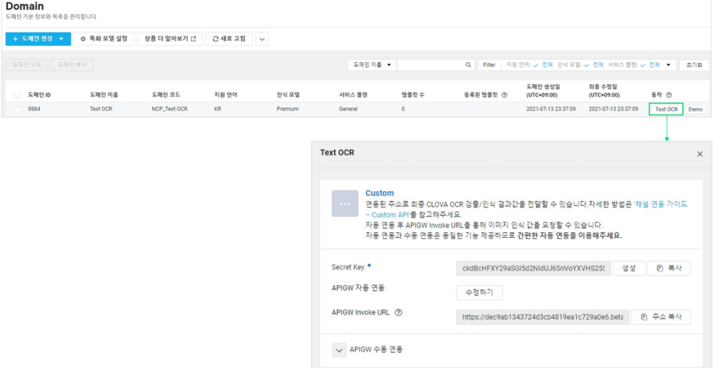

Custom API Gateway 연동

- Text OCR 버튼 클릭 시 외부 주소와 연동 설정이 가능한 창이 노출됩니다.
- OCR Invoke URL은 외부 연동 Endpoint에 입력할 OCR API 주소를 의미합니다.
- API Gateway 이용 신청이 되어 있는 경우, 자동 연동 (Interlock) 버튼을 클릭해 손쉽게 자동 연동할 수 있습니다.

자세한 내용은 공식 가이드 문서 [참고](https://guide.ncloud-docs.com/docs/ocr-ocr-1-1)

위의 내용은 간략한 가이드 이다 꼭 공식 가이드 문서를 참고하자

나는 도메인을 생성해준 다음 자동 APIGW 연동을 해주었다.

그렇게 해주면 아래와 같이 생성된 Secret Key를 통해 APIGW Invoke URL을 호출하면 사용할 수 있습니다.

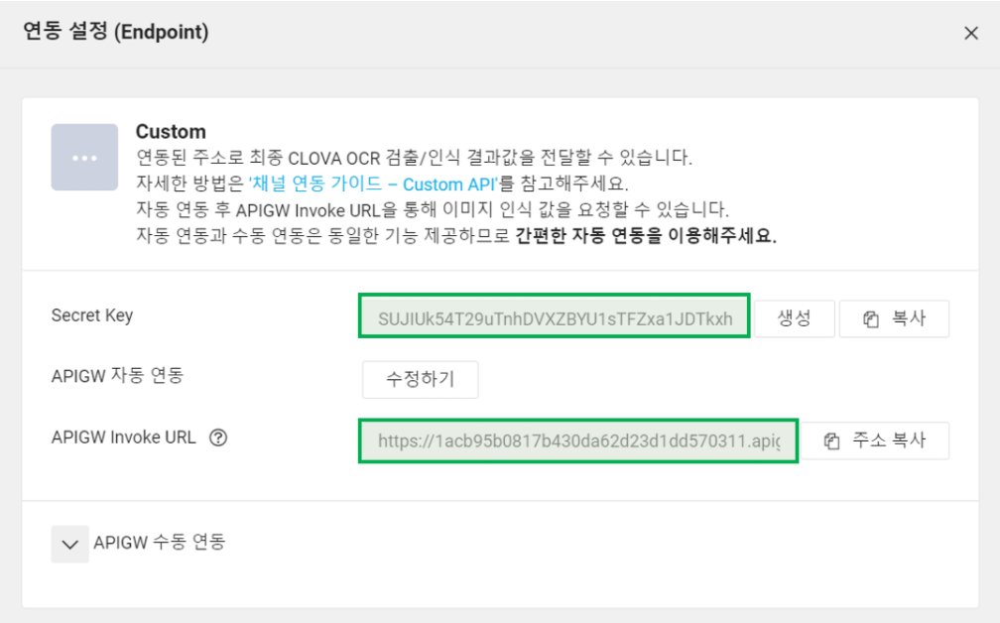

#### 🎨 CLOVA OCR API  호출 가이드
 
CLOVA OCR API 호출 방법

Step 1. API 환경 설정하기

OCR 빌더에서 만든 도메인은 고유한 InvokeURL이 있습니다.

이 InvokeURL은 안전한 서비스를 위해 외부 서비스에 바로 공개되지 않습니다. 그리고 보안 및 서비스 처리 수준을 높이기 위해서 API Gateway 상품에 연동하여 사용하도록 설계되어 있습니다.

Step 2. 자동으로 API Gateway 연동하기

API Gateway와 연동하는 방법에는 자동과 수동이 있으며, 자동연동 기능을 선택하시면 몇 번의 클릭으로 쉽게 API Gateway 연동을 완료하실 수 있습니다.

이 단계에서는 Secret Key 와 OCR Invoke URL을 생성합니다.

- Text OCR 사용하기

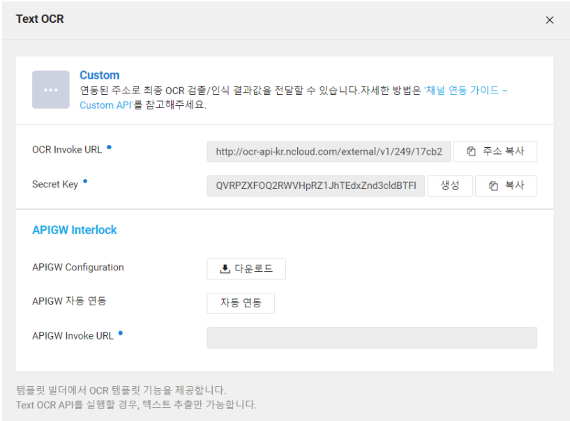

- Secret Key를 생성합니다.
- APIGW 자동연동 버튼을 클릭합니다.
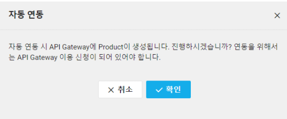
API Gateway 서비스의 이용 신청이 되어 있지 않다면, 먼저 신청을 완료해야 합니다.
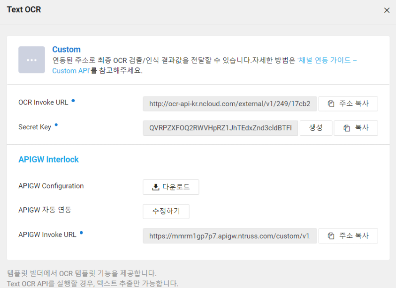

APIGW 연동이 완료되었습니다.

중요한 정보인 Secret Key 와 OCR Invoke URL 값을 복사해 놓습니다.

- Secret Key : {X-OCR-SECRET}
- OCR Invoke URL : {OCR Invoke URL}

Step 3. API Gateway 생성 URL 확인하기

콘솔에서 API Gateway 상품으로 이동합니다.

My Products에 OCR_CUSTOM_API_KR 이라는 Product가 생성되어 있습니다.

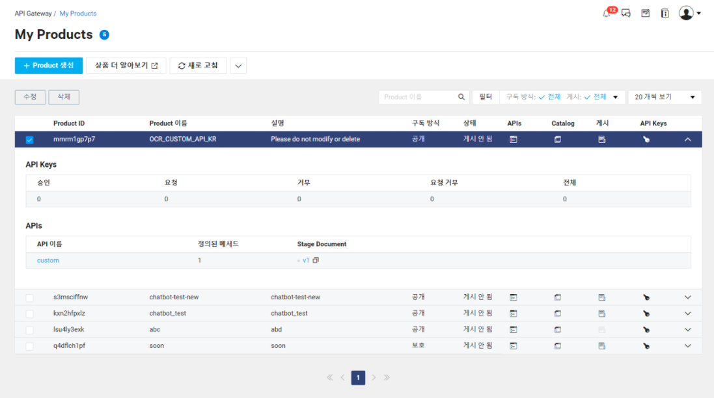

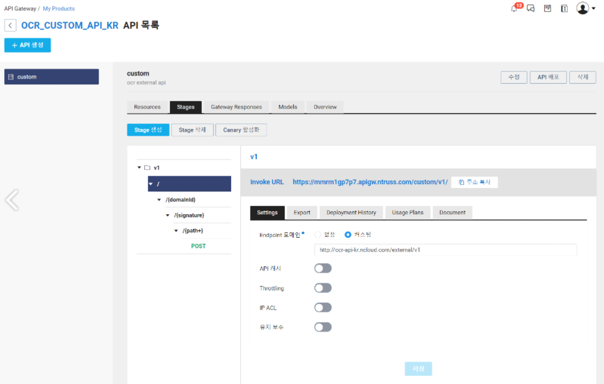

여기까지 정상적으로 표시되었다면, API 호출 준비가 완료되었습니다.

Step 4. Postman으로 API 호출해 보기 (TEXT OCR)

Text OCR API를 실행할 경우 업로드 된 이미지의 텍스트 추출이 가능합니다.

Postman에서 새로운 API를 생성하고 호출방식을 POST로 설정합니다.

Invoke URL 주소에 OCR에서 생성한 API Gateway의 InvokeURL을 입력합니다.

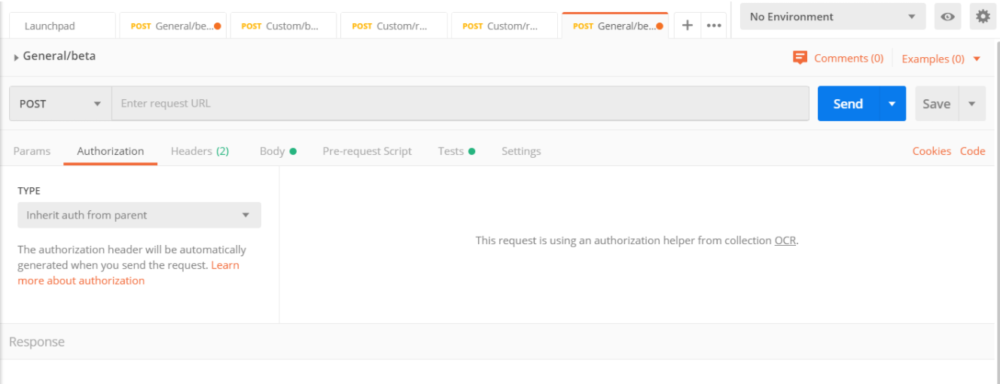

Header 항목에 아래와 같이 X-OCR-SECRET 정보를 입력합니다.
 
Content-Type : application/json

X-OCR-SECRET : {X-OCR-SECRET }

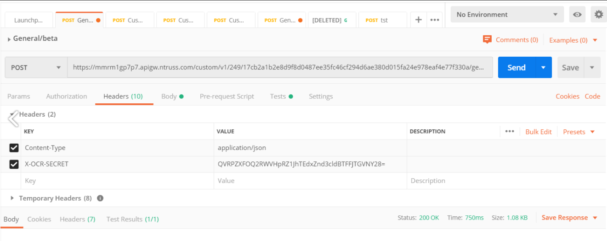

TEXT OCR 호출 BODY는 이미지 인식 요청 BODY 의 형식으로 넣습니다.

자세한 이미지 인식 요청 형식은 API 참조서를 확인해주세요

Request Body:
```json
{
    "images": [
      {
        "format": "png",
        "name": "medium",
        "data": null,
        "url": "https://kr.object.ncloudstorage.com/ocr-img/OCR_ko(1)REAN_ko(1).png"
      }
    ],
    "lang": "ko",
    "requestId": "string",
    "resultType": "string",
    "timestamp": {{$timestamp}},
    "version": "V1"
}
```

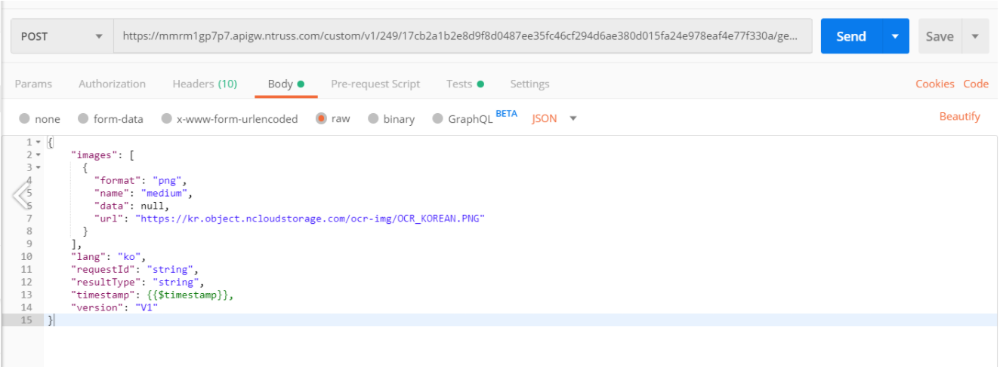

SEND 버튼을 눌러서 응답을 확인합니다.

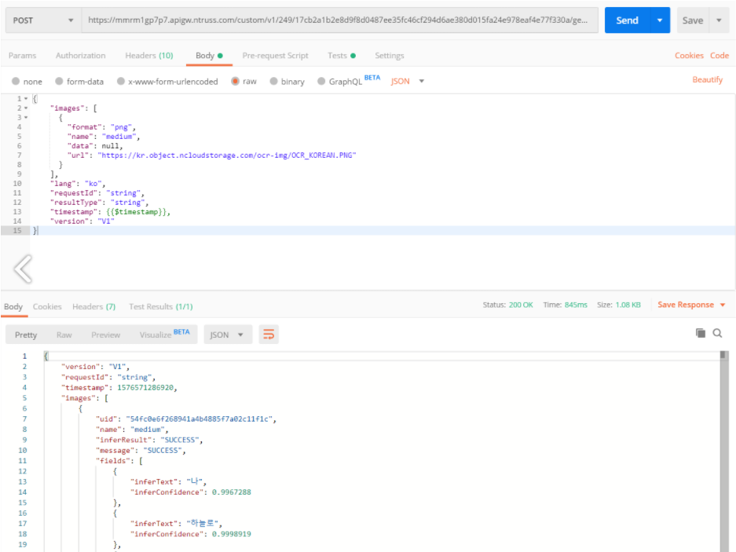

OCR 요청 방식은 [여기](https://api.ncloud-docs.com/docs/ai-application-service-ocr-ocr)에서 확인

## 🎍 마무리
기본적인 OCR 사용 방법을 기재해 보았다.

사실 가이드 문서에 이미 잘정리되어 있는 내용이라서 딱히 내가 추가적으로 기재할필요가 없다고 생각하나

이다음 포스팅에서는 스프링 부트에서 해당 OCR API 연동 및 사용 방법을 기록 하기 위해 간략히 OCR 가이드 방법을 기록 하였다.

<br>
<br>


```toc

```
