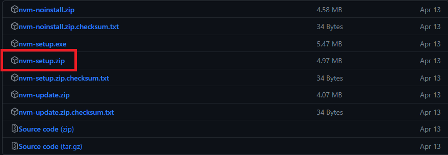

## 개요
프로젝트를 import 받고 실행시키는데 npm 에러가 계속 나를 못살게 굴었다.
<br>
그래서 필자는 어떤 에러인지 확인을 하고 패키지 버전에 문제가 있다는 것을 알았다.
<br>
버전끼리 호환이 안되는 경우도 있다고 들어서 버전을 자유롭게 바꿀 수 있는 것이 "nvm"이였다.
<br>
이를 통해 문제를 해결하였고 이제 어떤 프로젝트던 버전을 맞추어 편리하게 사용할 수 있게 되었다.

이제 설치하는 방법에 대해서 알아보자.

## ▶️ nvm 설치하기
🎆[nvm 설치경로 클릭](https://github.com/coreybutler/nvm-windows/releases)
<br>


### 📌NVM 설치 및 설치확인

1. 위의 링크를 클릭하여 nvm-setup.zip 파일을 다운로드한다.
<br>
   (스크롤을 아래로 내리면 아래와 같은 화면이 나온다.)



2. 다운로드를 받고, 압축을 해제하면 해당 경로 폴더에 nvm-setup.exe 파일이 나온다.
<br>
해당 exe 파일을 실행시켜 설치하도록하자.


3. 설치가 완료되면 Window Powershell 을 실행시켜 아래와 같은 명령어를 입력한다.
```
nvm -v
```
해당 결과가 아래와 같이 출력되면 성공이다.
<br>
<span style="color:red">
※ 참고로 Windows PowerShell 은 관리자 권한으로 실행시켜주자. 
</span>


### 📌 NVM 사용하기
1. NVM 설치된 node 리스트 확인
```
nvm ls
```

2. 원하는 node 버전을 입력하여 해당 버전 다운로드 및 삭제
   (예시 : 16버전)
<br>
입력을 하면 16버전중 최신버전이 설치가 된다.(굳이 하위 버전넘버까지 기입할 필요 없음)
```
nvm install 16
```
```
nvm uninstall 16.20.0(version name)
```

3. nvm에서 특정버전 node를 활성화 시키기 (예시 : 16버전)
```
nvm use 16.20.0
```

4. Default 버전 설정
<br>
여러개의 버전이 있다는 가정하에 어떤 버전을 기본으로 사용할 것인가를 정한다.
<br>
기본 버전을 설정한 뒤 위에 적어둔 'nvm ls' 명령어로 현재 기본 버전을 알 수 있다.
```
nvm alias default v16.20.0
```


## 🌭마무리
npm install로 컴파일 에러 및 충돌에러로 인하여 고생했는데 위의 방법을 알고나니 한결 수월해졌다.
위의 기능을 제외한 나머지 기능도 많이 필요로 하게 된다면 정리할 생각이다.
<br><br>
[참조 블로그](https://jang8584.tistory.com/295)

<br>
<br>

```toc

```
