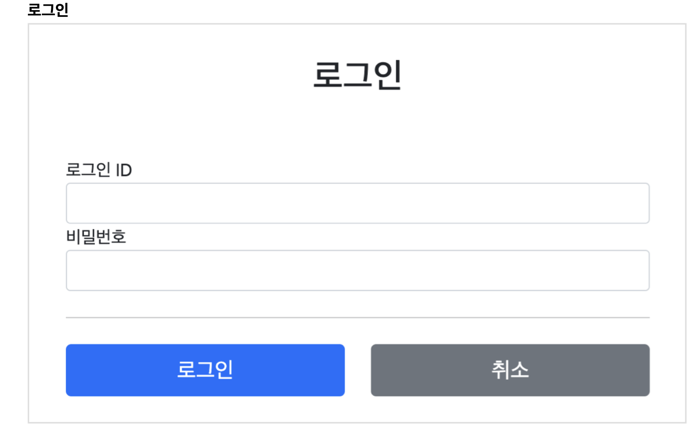

## 🎈 로그인 기능 

  - 이전에 만들었던 코드를 베이스로 하여 로그인 기능을 개발 해 보겠다. 우선은 로그인 ID, 비밀번호를 입력하는 부분에 집중해보자!
  - (추후에 쿠키와 세션을 사용하여 단점을 하나씩 잡아가는 방식으로 진행하겠다.)

  
  - 요구사항을 한번 더 확인하고 기능구현에 들어가보자.

```java
//LoginService.java
  @Service
  @RequiredArgsConstructor
  public class LoginService {
      private final MemberRepository memberRepository;
      /**
      *@return null이면 로그인 실패
      */
      public Member login(String loginId, String password) {
        return memberRepository.findByLoginId(loginId)
                  .filter(m -> m.getPassword().equals(password))
                  .orElse(null);
          }
      }
```
- 위의 코드를 살펴보면 로그인의 핵심 비즈니스 로직은 회원을 조회한 다음에 파라미터로 넘어온 `password`와 비교해서 같으면 회원을 반환하고 만약 다르다면, `null`을 리턴시킨다.
- `filter`의 기능을 사용하여 비밀번호를 비교하였다. MemberRepository의 `findByLoginId()`메소드를 확인해보면,
```java
public Optional<Member> findByLoginId(String loginId) {
      return findAll().stream()
            .filter(m -> m.getLoginId().equals(loginId))
            .findFirst();
    }
```
- 와 같이`Optional`객체에 맴버를 감싸 반환한다. 이 Optional객체는 이러한 필터기능을 제공한다(자바8이상)
=====

## 🌵 LoginForm & Controller / View
1. LoginForm
  ```java
    @Data
    public class LoginForm {
      @NotEmpty
      private String loginId;
      @NotEmpty
      private String password;
    }
  ```
2. LoginController.java
  ```java
  @Slf4j
  @Controller
  @RequiredArgsConstructor
  public class LoginController {
      private final LoginService loginService;
      @GetMapping("/login")
      public String loginForm(@ModelAttribute("loginForm") LoginForm form) {
          return "login/loginForm";
      }
      @PostMapping("/login")
      public String login(@Valid @ModelAttribute LoginForm form, BindingResult bindingResult) {
        if (bindingResult.hasErrors()) {
          return "login/loginForm";
        }
        Member loginMember = loginService.login(form.getLoginId(),form.getPassword());
        log.info("login? {}", loginMember);
          if (loginMember == null) {
            bindingResult.reject("loginFail","아이디 또는 비밀번호가 맞지 않습니다.");
            return "login/loginForm";
          }
        //로그인 성공 처리 TODO return "redirect:/"; 
      }
  }
  ```
  - 로그인 컨트롤러는 로그인 서비스를 호출하여 로그인에 성공하면, 홈 화면으로 이동시키고, 로그인에 실패하면 `bindingResult.reject()`를 사용하여 글로벌 오류`ObjectError`를 생성한다.
  - 그리고 정보를 다시 입력하도록 로그인 폼을 뷰 템플릿으로 사용한다.
=====

3. 로그인 폼 뷰 템플릿(html)
```html
<!DOCTYPE HTML>
  <html xmlns:th="http://www.thymeleaf.org">
  <head>
      <meta charset="utf-8">
      <link th:href="@{/css/bootstrap.min.css}"
            href="../css/bootstrap.min.css" rel="stylesheet">
      <style>
          .container {
              max-width: 560px;
          }
          .field-error {
              border-color: #dc3545;
              color: #dc3545;
          }
      </style>
  </head>
<body>
  <div class="container">
    <div class="py-5 text-center">
      <h2>로그인</h2>
    </div>
    <form action="item.html" th:action th:object="${loginForm}" method="post">
      <div th:if="${#fields.hasGlobalErrors()}">
        <p class="field-error" th:each="err : ${#fields.globalErrors()}" th:text="${err}">전체 오류 메시지</p>
      </div>
      <div>
        <label for="loginId">로그인 ID</label>
        <input type="text" id="loginId" th:field="*{loginId}" class="form-control" th:errorclass="field-error">
        <div class="field-error" th:errors="*{loginId}" />
      </div>
      <div>
        <label for="password">비밀번호</label>
        <input type="password" id="password" th:field="*{password}" class="form-control" th:errorclass="field-error">
        <div class="field-error" th:errors="*{password}" />
      </div>
        <hr class="my-4">
        <div class="row">
          <div class="col">
            <button class="w-100 btn btn-primary btn-lg" type="submit">로그인</button>
          </div>
          <div class="col">
            <button class="w-100 btn btn-secondary btn-lg" onclick="location.href='items.html'" th:onclick="|location.href='@{/}'|" type="button">취소</button>
          </div>
        </div>
      </form>
    </div> <!-- /container -->
  </body>
</html>
```
  - 로그인 폼 뷰 템플릿에는 특별한 코드는 없다. 다만 `th:errorclass="filed-error"`를 넣어줌으로써 `loginId, password`가 틀리면 글로벌 오류를 나타나게 처리했다.
===
### 실행
  - 실행 결과를 보면, 로그인이 성공할때 홈화면으로 이동이 되며, 로그인에 실패 시 "아이디 또는 비밀번호가 맞지 않습니다."라는 경고 문구와 함께 로그인 폼이 나타나게 된다.
  - 로그인 컨트롤러에서 `bindingResult.reject("loginFail","아이디 또는 비밀번호가 맞지 않습니다.");`를 넣었기 때문이다.
  - 그러나 아직 로그인이 되고 홈화면으로 이동을 하면 로그인한 고객의 이름이 보여야 한다는 요구사항을 만족하지 못하였다.
  - 그렇기 때문에 로그인의 상태를 유지하면서, 로그인에 성공한 사용자는 홈화면에 접근 시 고객의 이름을 보여주려면 어떻게 해야할지 생각해보자.

## 🌚 로그인 처리하기 (쿠키 버전)
  - 이제 드디어 이녀석의 등장이 필요해졌다. 쿠키이다. 이 녀석의 기본 개념을 알고 있으리라 생각하고 넘어가겠다. 만약, 쿠키의 개념이 부족한 경우 "김영한"님의 "모든 개발자를 위한 HTTP 기본 지식 강의"를 참고하면 좋을 듯하다.
  - 자 그렇다면, 이제 이녀석(쿠키)를 사용하여 로그인,로그아웃 기능을 구현해 보도록 하겠다.

### 로그인 상태 유지하기
  - 로그인의 상태를 어떻게 유지 할 수 있을까? 라는 생각해본다면, 여러가지 방법이 있을것이다.
  - 쿼리 파라미터를 계속 유지하면서 보내는 것은 매우 어렵고 번거로운 작업이 아닐 수 없다.(컨트롤러에서 addAttribute로 사용자의 정보를 계속 날려야 한다면 정말 골치 아픈 일이다.) 그래서 이제는 쿠키를 사용하여 해결해 보도록 하자.

### 쿠키
  - 서버에서 로그인에 성공하면 HTTP 응답에 쿠키를 담아, 브라우저에 전달한다. 그러면 브라우저에서는 앞으로 해당 쿠키를 지속적으로 보내고 있는 상태가 된다.
  - 이해가 쉽게 그림으로 확인 해 보자!

### 쿠키 생성
  
  - 위의 사진을 보면 웹 브라우저에서 POST요청이 왔다. 그럼 서버는 해당 요청을 받아 회원의 아이디와 비밀번호를 검색하여 회원 저장소(Repository)에서 회원의 정보를 달라는 요청을 보낸다.
  - 이후 회원 저장소에서 반환되어 나오는 정보를 다시 서버에 전달해주고, 전달 받은 정보에는 200의 상태코드와 쿠키에 셋팅해놓은 정보를 담아 보내주게된다.
  - 쿠키 저장소에 해당 정보를 저장시키며 다시 웹브라우저까지 돌아가게 된다.

### 클라이언트 쿠키 전달 1
  
  - 이번엔 웹브라우저(클라이언트)에서 Get요청이 왔다. 그러나 이때 자세히 보면 쿠키 저장소에 저장된 동일한 정보가 같이 실려 요청이 오는것을 볼 수 있다.
  - 이 과정이 궁금하다면 해당 로직을 실행시키고 크롬 브라우저에서 개발자모드로 들어가 확인해보길 바란다.

### 클라이언트 쿠키 전달 2
  
  - 위의 사진과 같이 모~~~든 클라이언트의 요청에 쿠키의 정보가 자동으로 포함이 되어 요청마다 지속적으로 쿠키가 자동으로 실려 나가는것을 볼 수 있다.

### 영속쿠키와 세션쿠키
  * 영속 쿠키 : 만료 날짜를 입력하면 해당 날짜까지 유지
  * 세션 쿠키 : 만료 날짜를 입력하지 않으면, 브라우저 종료시 까지만 유지(디폴트)

  - 우리에게 필요한것은 세션쿠키이다. 우리는 브라우저가 종료될때, 로그아웃이 되길 기대하기 때문이다.
  - 그렇다면 로그인 성공시 세션 쿠키를 생성하도록 하는 로직이 필요하다. 이 작업은 이후 포스팅에 기재하도록 하겠다.

**to be continue...(세션 쿠키 사용)**