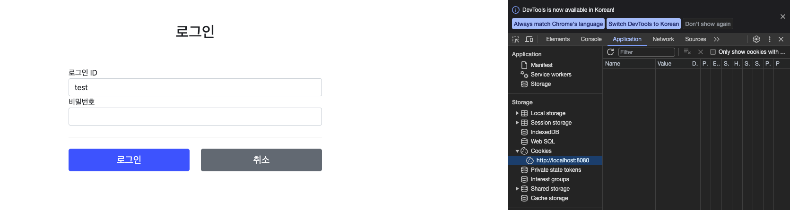

## 🎈 로그인 성공 시 세션 쿠키 생성

- 지난 시간에 이어 로그인에 필요한 세션 쿠키를 생성해 보도록 하자.

```java
@PostMapping("/login")
  public String login(@Valid @ModelAttribute LoginForm form, BindingResult
  bindingResult, HttpServletResponse response) {
    if (bindingResult.hasErrors()) {
      return "login/loginForm";
    }
    Member loginMember = loginService.login(form.getLoginId(),
    form.getPassword());
    log.info("login? {}", loginMember);
    if (loginMember == null) {
      bindingResult.reject("loginFail","아이디 또는 비밀번호가 맞지 않습니다.");
      return "login/loginForm";
    }
    //로그인 성공 처리
    //쿠키에 시간 정보를 주지 않으면 세션 쿠키(브라우저 종료시 모두 종료)
    Cookie idCookie = new Cookie("memberId",String.valueOf(loginMember.getId()));
    response.addCookie(idCookie);
    return "redirect:/";
}
```

- 여기서 우리가 집중하여 볼것은 쿠키 생성 로직이다.

### 쿠키 생성 로직

```java
Cookie idCookie = new Cookie("memberId",String.valueOf(loginMember.getId()));
response.addCookie(idCookie);
```

- # 로그인에 성공시 쿠키를 생성하고 `HttpServletResponse`에 담는다.
- # 쿠키의 이름은 `memberId`이고, 값은 회원의 `id`를 담아둔다.
- # 웹 브라우저는 종료 전까지 회원의 값(id)를 서버에 지속적으로 보내줄것이다.

### 실행

- 크롬 브라우저를 통해 HTTP 응답 헤더에 쿠키가 추가된 것을 확인할 수 있다.
  

## 🌵 홈화면 로그인처리

1. HomeController

```java
@Slf4j
@Controller
@RequiredArgsConstructor
public class HomeController {
    private final MemberRepository memberRepository;

    //    @GetMapping("/") *주의 기존거 주석처리 안하면 컴파일에러
    public String home() {
      return "home";
    }
    @GetMapping("/")
    public String homeLogin(@CookieValue(name = "memberId", required = false) Long memberId, Model model) {
      if (memberId == null) {
        return "home";
      }
      //로그인
      Member loginMember = memberRepository.findById(memberId);
      if (loginMember == null) {
        return "home";
      }
      model.addAttribute("member", loginMember);
      return "loginHome";
    }
}
```

- 기존 `home()`메소드의 있는 `GetMapping`어노테이션은 꼭 주석처리를 하자.
- `@CookieValue`를 사용하면 편리하게 쿠키를 조회 할 수 있다.
- 로그인 하지 않은 사용자도 홈에 접근할 수 있기 때문에 `required=false`로 해주어야 한다.

### 로직 분석

- 로그인 쿠키(memberId)가 없는 사용자는 home()으로 보내며, 추가로 로그인 쿠키가 있어도 회원이 없다면, home으로 보낸다.
- 로그인 쿠키(memberId)가 있는 사용자는 로그인 사용자 전용 홈 화면인 `loginHome`으로 보낸다. 추가적으로 홈화면에 회원 관련 정보도 출력해 주어야 하기 때문에 member데이터도 모델에 담아서 전달한다.

2. home.html - 로그인 사용자 전용

```html
<!DOCTYPE html>
<html xmlns:th="http://www.thymeleaf.org">
  <head>
    <meta charset="utf-8" />
    <link th:href="@{/css/bootstrap.min.css}" href="../css/bootstrap.min.css" rel="stylesheet" />
  </head>
  <body>
    <div class="container" style="max-width: 600px">
      <div class="py-5 text-center">
        <h2>홈 화면</h2>
      </div>
      <h4 class="mb-3" th:text="|로그인:${member.name}|">로그인 사용자 이름</h4>
      <hr class="my-4" />
      <div class="row">
        <div class="col">
          <button
            class="w-100 btn btn-secondary btn-lg"
            type="button"
            th:onclick="|location.href='@{/items}'|"
          >
            상품 관리
          </button>
        </div>
        <div class="col">
          <form th:action="@{/logout}" method="post">
            <button class="w-100 btn btn-dark btn-lg" type="submit">로그아웃</button>
          </form>
        </div>
      </div>
      <hr class="my-4" />
    </div>
    <!-- /container -->
  </body>
</html>
```

- `th:text="|로그인:${member.name}|"`는 로그인에 성공한 사용자의 이름을 출력하게끔 셋팅해놓았다.
- 상품관리 그리고 로그아웃 버튼을 노출시키게 되어있다.

### 실행

- 로그인에 성공하면 사용자 이름이 출력되고, 상품 관리 그리고 로그아웃 버튼을 확인 할 수 있다.
- 로그인에 성공 시 세션 쿠키를 확인해 보자. 세션 쿠키는 브라우저를 닫기 전까지 지속적으로 유지가 되며, 웹 브라우저에서 서버에 요청시 `memberId`라는 쿠키의 정보를 계속 보내준다.

## 🌈 로그아웃 기능 만들기

- 이번에는 로그아웃 기능을 만들어 보자! 다음과 같은 방법으로 진행할예정이다.
  1. 세션 쿠키라는 녀석은 웹 브라우저 종료시 로그아웃이 가능하다.
  2. 혹은 서버에서 해당 쿠키의 종료 날짜를 0으로 지정을 해주면 된다. (즉, 로그아웃 버튼을 클릭시 해당 로직이 실행되게 만들어주면 된다.)

```java
//LoginContoller에 logout기능을 추가해보자.
@PostMapping("/logout")
  public String logout(HttpServletResponse response) {
      expireCookie(response, "memberId");
      return "redirect:/";
  }
  private void expireCookie(HttpServletResponse response, String cookieName) {
      Cookie cookie = new Cookie(cookieName, null);
      cookie.setMaxAge(0);
      response.addCookie(cookie);
}
```

- ### 위의 컨트롤러 코드에서 눈여겨 볼 것은 `exprieCookie()`메소드다. `cookieName`인자값을 전달받고 쿠키를 생성함과 동시에`setMaxAge()`메소드에 0이라는 숫자를 적어주었다.
- 이렇게 생성 후 시간을 지정해주면 쿠키의 시간이 0이므로 웹 브라우저에서는 _쿠키가 삭제_ 된다.

## 🌂 쿠키의 보안 문제

- 위와 같은 코드로만 로직을 구성하면 너무나 큰 단점이 있다. 그것은 바로 보안 문제이다.
- 쿠키에 직접적으로 `memberId=1, ...10`이런식으로 구성이 되어있다면 누구나 손쉽게 데이터를 임의로 조작하여 정보를 빼내어 악용할 가능성이 있다.

### 보안 문제

    * 쿠키 값은 임의로 변경 할 수 있다.
      - 클라이언트가 쿠키를 강제로 변경하면 다른 사용자가 된다.
      - 예를들어 크롬창에서 쿠키에 직접값을 입력하면 다른사용자가 되는것을 볼 수 있다 `개발자 모드 -> Application -> Cookie`에서 `memberId=1 => memberId=2` 이런식으로 말이다.
    * 쿠키에 보관된 정보는 훔칠 수 있다.
      - 만약 쿠키에 개인정보나, 신용카드 정보가 있다?라고 생각하면 아찔하다.
      - 이 정보가 웹브라우저에 그대로 노출이 되고, 보관되어 있는 상태인데 네트워크 요청시마다 계~~속 클라이언트에서 서버로 전달된다.
      - 쿠키의 정보가 나의 로컬PC에서 털리는 일도 일어날 수 있고, 네트워크 전송중 특정 구간에서도 털리는 일이 일어난다.
    * 만약 해커가 나쁜맘을 먹고 쿠키를 훔친다면 ?
      - 해커가 쿠키를 훔치고 그 쿠키의 정보를 가지고 훔쳐간다면 그 쿠키로 악의적인 요청을 계속 시도할것이다. ex) 신용카드 도용 -> 온라인 결재

### 대안 방법

    * 쿠키에 중요한 값을 노출하지 않고, 사용자 별로 예측이 불가능한 임의의 토큰(랜덤한 값)을 노출시키고, 서버에서는 토큰과 사용자의 id를 매핑하여 인식하게 해주고, 토큰은 서버가 관리하게끔 설계를 하는것이다.
    * 토큰은 해커가 임의의 값을 넣어도 찾을 수 없도록 예측이 불가능해야 한다.
    * 만에하나 해커가 토큰을 털어간다 가정해도, 시간이 지나면 사용이 불가능 하도록 서버에서 해당 토큰의 만료 시간을 짧게(30분정도로) 유지시킨다. 혹은 해킹이 의심되는 경우 서버에서 해당 토큰을 강제로 제거하게 하면 해결이 가능할 것이다.

## 🎄 앞으로 할 일

- 보안 문제와 대안 방법은 전부 나와있다. 이제 해당 로직을 수행할 서비스만 설계를 하면 보안 문제는 해결이 될것이다.
- 그렇다면 목표를 다시 한번 확인해 보고 추후 진행 될 방법을 알아 보도록 하자.

### 로그인 처리하기 - 세션동작방식

    * 목표
      - 앞서 쿠키에 중요한 정보를 보관하는 방법은 여러가지의 보안적인 문제,이슈가 있었다. 이 문제를 해결하려면 결국 중요한 정보는 서버가 들고있고, 저장역시 서버에 해야한다는것이다.
      - 또한 클라이언트와 서버는 예측이 불가한 임의의 식별자 값으로 서로 커넥팅이 가능해야 한다는 뜻이다.
      - 이렇게 서버에 중요한 정보를 보관하고 연결을 유지하는 방법은 세션이라 한다.

**to be continue...(세션 동작 방식)**
