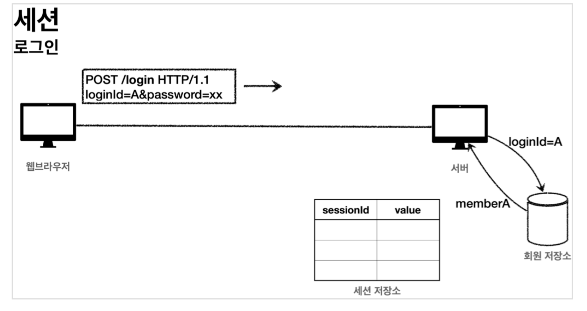
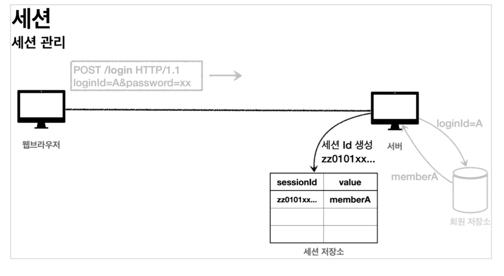
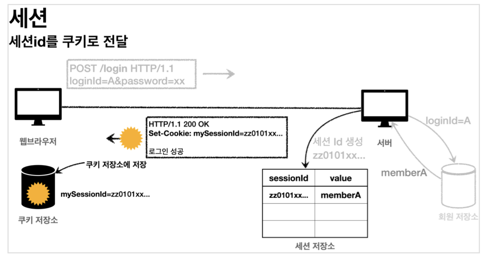
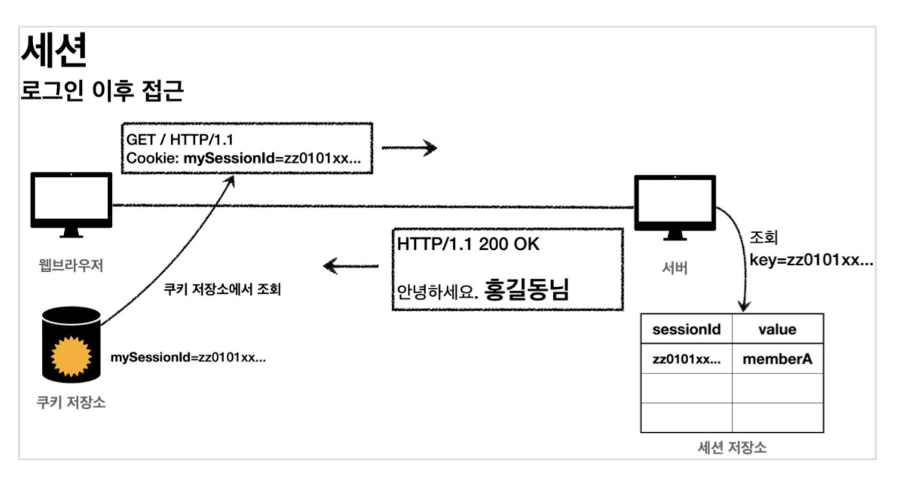

## 🎈 세션 동작 방식으로 로그인 처리하기!

- 지난 시간에는 쿠키로 처리할때 나타나는 치명적인 단점을 살펴보았고, 해결 방안에 대해 알아보았다
- 이어 해결 방안을 구현해 어플리케이션의 보안 문제를 해결 해 보자!

### 목표

- 앞서 쿠키에 중요한 정보를 보관하는 방법에는 여러가지의 보안 이슈가 발생했었다.
- 이 문제를 해결하려면 결국 중요한 정보를 모두 서버에 저장 해야 한다. 그리고 클라이언트와 서버는 추정 불가능한 임의의 식별자 값으로 연결 해야 한다.
- 이렇게 서버에 중요한 정보를 보관하고 연결을 유지하는 방법을 세션 이라 한다.

### 세션 동작 방식

- 세션을 어떻게 개발할지 먼저 개념을 이해해보자.

1. 로그인
   

- 사용자가 `loginId`,`password` 정보를 전달하면, 서버에서 해당 사용자가 맞는지 확인을 한다.

2. 세션 생성
   

   - 세션 ID를 생성하는데, 추정 불가능 해야하는 값이여야만 한다.
   - 그래서 사용하는것이 **`UUID`**이다. 해당객체는 절대 겹치지 않는 임의의 값을 만들어주는 객체로, 쿠키에 해당옵션을 주기에 아주 적당하다.
   - ex) `Cookie: mySessionId=zz0101xx-bab9-4b92-9b32-dadb280f4b61`
   - 생성된 세션 ID와 세션이 보관할 값`memberA`을 서버의 세션 저장소에 보관한다.

3. 세션 ID를 응답 쿠키로 전달한다.
   

   - **클라이언트와 서버는 결국 쿠키로 연결이 되어야 한다.**
   - 클라이언트는 쿠키 저장소에 `mySessionId`쿠키를 보관한다.
     _*여기서 중요한 포인트!*_
     - 회원과 관련된 정보는 전혀 클라이언트에 전달되게 하면 안된다는 것이다.
     - 오직 추정 불가능한 세션ID(UUID로 변환된 임의의 값)만 쿠키를 통해 클라이언트에게 전달되게 한다.

4. 클라이언트의 세션ID를 쿠키에 전달
   

   - 클라이언트는 요청 시 항상 `mySessionId`라는 쿠키를 전달한다.
   - 서버에서는 클라이언트가 전달한 `mySessionId`쿠키의 정보로 세션 저장소를 조회해서, 로그인 시 보관한 세션의 정보를 사용한다.

### 정리

    * 세션을 사용하여 서버에서 중요한 정보를 관리하게 처리 하였다. 덕분에 다음과 같은 보안 문제들을 해결 할 수 있었다.
      1. 쿠키의 값을 변조 가능 -> 예측 불가한 복잡한 세션ID를 사용.
      2. 쿠키에 보관하는 정보는 클라이언트 해킹 시 털릴 가능성이 있다 -> 세션ID가 털리더라도 여기에는 중요한 정보가 없다.
      3. 쿠키 탈취 이후 악용 -> 해커가 만약 토큰을 털어가도, 시간이 지나면 사용 할 수 없도록 세션에서 세션의 만료시간을 짧게 유지한다. 또는 해킹이 의심되는 경우 서버에서 해당 세션을 강제로 제거하면 된다.

## 🌈 로그인 처리 - 세션 직접 만들기

- 이번에는 세션을 직접 개발해서 적용해 볼것이다.
- 세션 관리는 크게 다음 3가지의 기능을 제공하면 된다.

  1. 세션 생성

  - sessionId생성(임의의 추정 불가능한 랜덤 값)
  - 세션 저장소에 sessionId와 보관할 값을 저장
  - sessionId로 응답 쿠키를 생성해서 클라이언트에 전달.

  2. 세션 조회

  - 클라이언트가 요청한 sessionId 쿠키의 값으로, 세션 저장소에 보관한 값을 조회한다.

  3. 세션 만료(30분)

  - 클라이언트가 요청한 sessionId 쿠키의 값으로, 세션 저장소에 보관된 sessionId와 값을 제거한다.

### SessionManager-세션관리

```java
//web package에 해당 파일을 생성
  @Component
  public class SessionManager {

    public static final String SESSION_COOKIE_NAME = "mySessionId";
    private Map<String, Object> sessionStore = new ConcurrentHashMap<>();
    /**
    * 세션 생성
    */
    public void createSession(Object value, HttpServletResponse response) {

      //세션 id를 생성하고, 값을 세션에 저장
      String sessionId = UUID.randomUUID().toString();
      sessionStore.put(sessionId, value);

      //쿠키 생성
      Cookie mySessionCookie = new Cookie(SESSION_COOKIE_NAME, sessionId);
      response.addCookie(mySessionCookie);
    }

    /**
    * 세션 조회
    */
    public Object getSession(HttpServletRequest request) {
      Cookie sessionCookie = findCookie(request, SESSION_COOKIE_NAME);
      if (sessionCookie == null) {
        return null;
      }
      return sessionStore.get(sessionCookie.getValue());
    }
    /**
    * 세션 만료
    */
    public void expire(HttpServletRequest request) {
      Cookie sessionCookie = findCookie(request, SESSION_COOKIE_NAME);
        if (sessionCookie != null) {
          sessionStore.remove(sessionCookie.getValue());
        }
    }

    private Cookie findCookie(HttpServletRequest request, String cookieName) {
      if (request.getCookies() == null) {
        return null;
      }
      return Arrays.stream(request.getCookies())
                  .filter(cookie -> cookie.getName().equals(cookieName))
                  .findAny()
                  .orElse(null);
    }
  }

```

- 해당 로직은 쿠키를 사용할때와 상당히 비슷한 맥락을 띄고 있어 그렇게 어렵지 않게 이해할 수 있을것이다. 설명을 조금 추가 해 보자면
- `@Componet`:로 스프링빈에 자동 등록시킨다.
- `ConcurrentHashMap`: `HashMap`은 동시 요청에 안전하지 않다. 동시 요청에 안전한 `ConcurrentHashMap`을 사용했다.

- 자 그럼 이제 구성한 로직을 테스트를 해보자. 막상 구현해 놓은걸 테스트하는 작업은 상당히 중요하다..!

### SessionManagerTest

```java
class SessionManagerTest {
      SessionManager sessionManager = new SessionManager();
  @Test
  void sessionTest() {
    //세션 생성
    MockHttpServletResponse response = new MockHttpServletResponse();
    Member member = new Member();
    sessionManager.createSession(member, response);

    //요청에 응답 쿠키 저장
    MockHttpServletRequest request = new MockHttpServletRequest();
    request.setCookies(response.getCookies());

    //세션 조회
    Object result = sessionManager.getSession(request);
    assertThat(result).isEqualTo(member);

    //세션 만료
    sessionManager.expire(request);
    Object expired = sessionManager.getSession(request);
    assertThat(expired).isNull();
  }
}
```

- 테스트 로직은 간단하게 구성하자. 여기서는 `HttpServletRequest`나 `HttpServletResponse` 객체를 직접 사용 할 수 없기 때문에(인터페이스),테스트 목적으로 사용할 가짜`MockHttpServlertRequest`,`MockHttpServlertResponse`를 사용하였다.
- 테스트의 결과는 모두 정상적으로 초록색의 체크문양을 확인 할 수 있을 것이다. **세션을 직접 만든것을 축하한다.**
- 이제 테스트도 성공했고, 직접 만든 세션을 적용하는 일만 남았다.

## 🌚 로그인 처리하기 - 직접 만든 세션 적용

  - 지금까지 개발한 세션 관리 기능을 실제 웹 애플리케이션에 적용하여 본다.

  ### LoginController-version2

      ```java

        //기존의 login메소드의 mapping은 주석처리!
        @PostMapping("/login")
        public String loginV2(@Valid @ModelAttribute LoginForm form, BindingResult
                              bindingResult, HttpServletResponse response) {
          if (bindingResult.hasErrors()) {
            return "login/loginForm";
          }

          Member loginMember = loginService.login(form.getLoginId(),form.getPassword());
          log.info("login? {}", loginMember);
          if (loginMember == null) {
            bindingResult.reject("loginFail","아이디 또는 비밀번호가 맞지 않습니다.");
            return "login/loginForm";
          }

          //로그인 성공 처리
          //세션 관리자를 통해 세션을 생성하고, 회원 데이터 보관 sessionManager.createSession(loginMember, response);
          return "redirect:/";
        }
        //기존의 로그아웃메소드의 매핑도 주석처리!
        @PostMapping("/logout")
        public String logoutV2(HttpServletRequest request) {
          sessionManager.expire(request);
          return "redirect:/";
        }

      ```
      - `private final SessionManager`우리가 만들었던 로직을 주입시킨다.
      - `sessionManager.createSession(loginMeber, response);`로그인 성공 시 세션을 등록한다. 세션에 `loginMember`를 저장해두고, 쿠키도 함께 발행시키는 로직이다.

      - 로그아웃 시 해당 세션의 정보를 제거한다.
      - 로그인과 로그아웃을 만들었으니, 이제 컨트롤러에 입혀주도록 하자.

  ### HomeController-homeLoginV2

    ```java
      @GetMapping("/")
      public String homeLoginV2(HttpServletRequest request, Model model) {

        //세션 관리자에 저장된 회원 정보 조회
        Member member = (Member)sessionManager.getSession(request); 
        if (member == null) {
          return "home";
        }
        //로그인
        model.addAttribute("member", member); 
        return "loginHome";
      }

    ```

**to be continue...(세션 동작 방식)**
