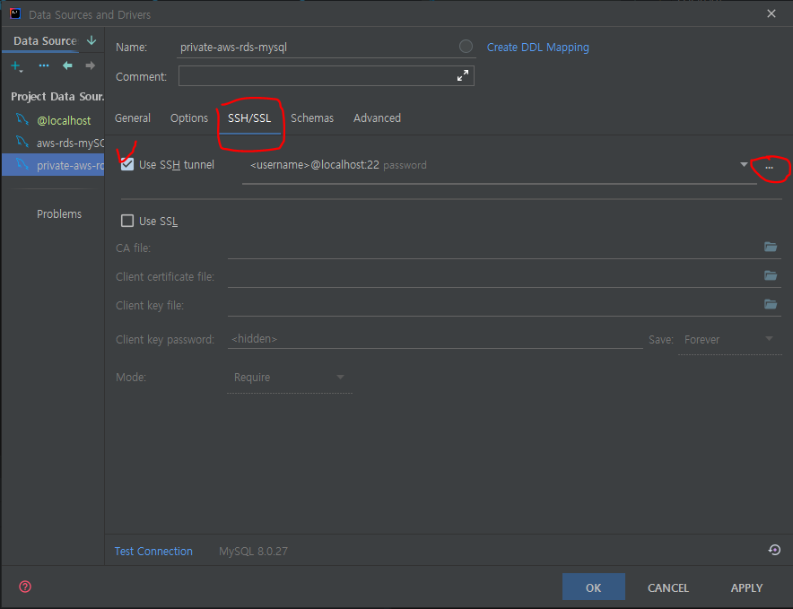
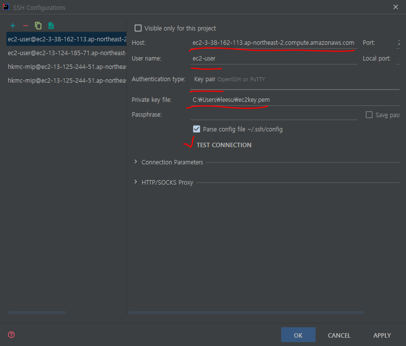
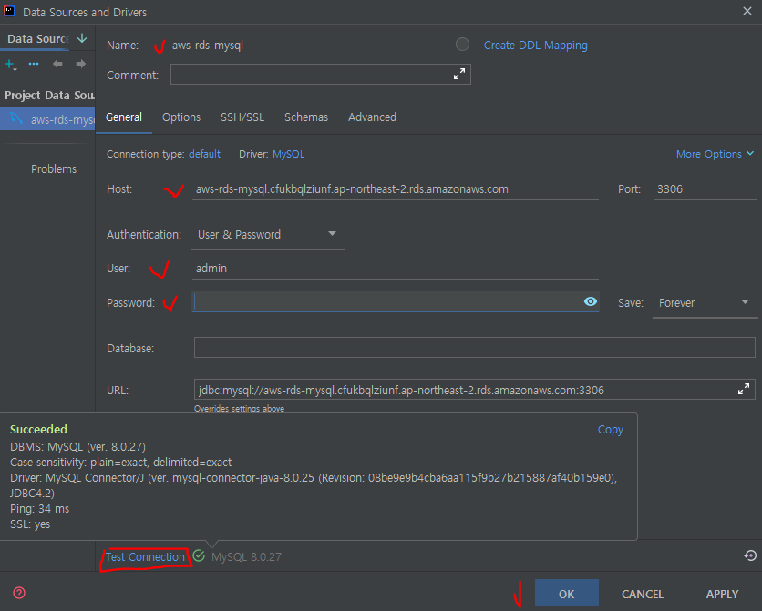
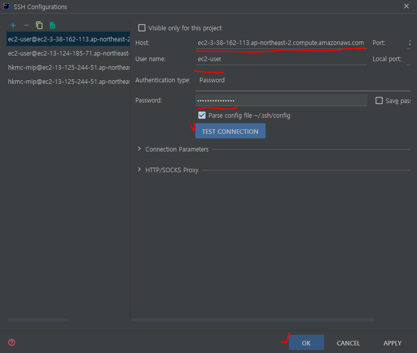

## 개요
이전에 보안 강화를 위해 비공개 RDS를 만들어 EC2를 통한 접속구성을 했었다.

> 🎆[이전 포스팅](https://leesungki.github.io/gatsby-aws-study-rds-private/)

그럼 IntelliJ에서 ssh 터널링을 통해 해당 rds에 어떻게 접근 할수 있을까?

## ✅ aws RDS(MY SQL) SSH 터널링 연결하기

<br>

### 📌datasource 사용 (key파일 활용)

1. intellj 오른쪽 상단에 datasource 탭 클릭


2. 좌측 + 버튼 클릭후 data source에서  mySQL 선택 


3. SSH/SSL 탭 클릭후 Use SSH tunnel 체크 우측 ... 클릭



4. 아래 그림처럼 필요한 정보를 넣어준후 TEST CONNECTION 클릭



HOST: ec2 퍼블릭 ip 
USER NAME: ec2-user(리눅스기본 유저명)
PRIVATE KEY FILE: key file 경로
터널링이 무사히 된다면 

5. data source 정보를 넣고 test connection 클릭

- name:사용자지정
- Host:생성한 RDS의 엔드포인트
- Port:생성한 RDS의 Port
- User:생성한 RDS의 User
- Password:생성한 RDS의 Password



테스트가 성공적으로 이루어 졌으면 OK 버튼 클릭

6. 쿼리 콘솔 확인
정상적으로 다했으면 아래와 같이 쿼리를 작성할수 있는 콘솔이 열린다.


### 📌datasource 사용 (패스워드 활용)
AWS ec2 서버에는 password로 ssh접근이 안되도록 되어 있다. 

아래 파일을 수정하여 접근이 되도록 해보자.

1. ec2인스턴스에 접근하여 비밀번호 설정

- 사용자 계정에 비밀번호를 지정해준다.
```
sudo passwd ec2-user
```

- ssh_config 변경해준다.
```
sudo vi /etc/ssh/sshd_config
```
- PasswordAuthentication을 yes로 변경
```
PasswordAuthentication yes
```
- 인스턴스 재기동
```
sudo service sshd restart
```

2. SSH/SSL 탭 클릭후 Use SSH tunnel 체크 우측 ... 클릭


3. 아래 그림처럼 필요한 정보를 넣어준후 TEST CONNECTION 클릭



HOST: ec2 퍼블릭 ip 
USER NAME: ec2-user(리눅스기본 유저명)
Password: 접속 암호
터널링이 무사히 된다면 

5. data source 정보를 넣고 test connection 클릭

- name:사용자지정
- Host:생성한 RDS의 엔드포인트
- Port:생성한 RDS의 Port
- User:생성한 RDS의 User
- Password:생성한 RDS의 Password


테스트가 성공적으로 이루어 졌으면 OK 버튼 클릭

6. 쿼리 콘솔 확인
정상적으로 다했으면 아래와 같이 쿼리를 작성할수 있는 콘솔이 열린다.


## 🌭마무리
위와 같이 aws에서 비공개로 생성된 rds에 접근하는 방법을 알아보았다 다음에는 개발시 소스상에서 ssh 터널링을 통해 rds접근하여 데이터를 가져오는걸 포스팅 할예정이다.

<br>
<br>

```toc

```
