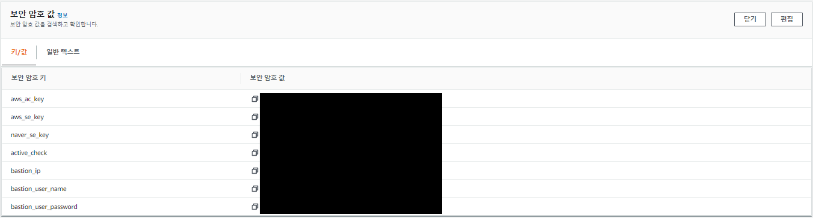
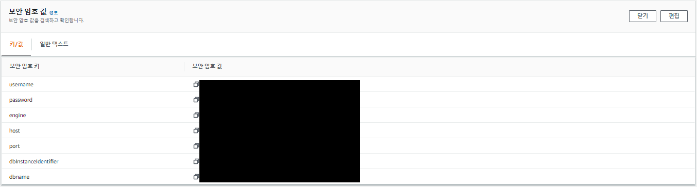
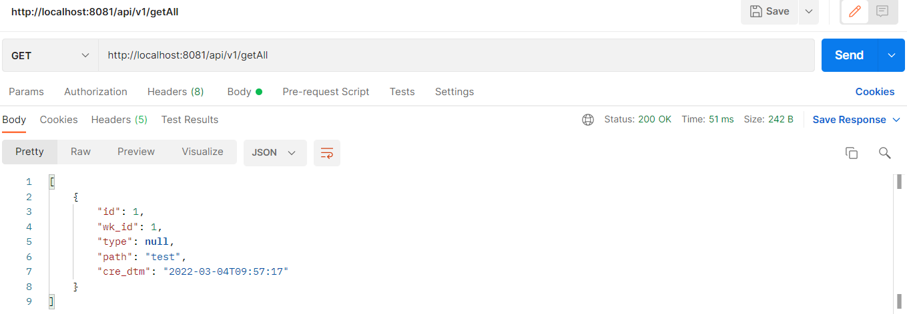
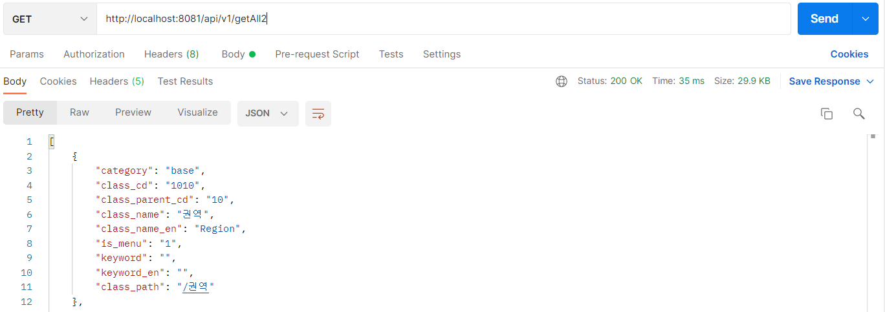

## ✅ 개요
AWS 의 SecretsManager의 RDS 정보를 받아 두개의 AWS RDS에 접근하여 데이터를 가져와보자
<br>

### 🔑 RDS 생성
먼저 AWS 에 RDS 를 2개 생성해야 한다.
나는 미리 생성해 놨다.
> 🦄 mySQL RDS 생성방법은 [링크](https://leesungki.github.io/gatsby-aws-study-aws-rds-conection-mySQL/)를 참고해주세요!

> 🦄 postegreSQL RDS 생성방법은 [링크](https://leesungki.github.io/gatsby-aws-study-aws-rds-conection-postgreSQL/)를 참고해주세요!

> ✨ 비공개 RDS 접근 방법은 [링크](https://leesungki.github.io/gatsby-aws-study-rds-private/)를 참고해주세요!

### 🔑 SecretsManager 사용

생성한 보안암호에 AWS RDS의 정보들이 있다. 

두개를 생성해야 한다.

나는 미리 생성해 놨다.
> 🦄 SecretsManager 생성방법은 [링크](https://leesungki.github.io/gatsby-aws-study-secretsManager-tutorial/#rds-데이터-베이스에-대한-자격증명-방식)를 참고해주세요!

### 🎁 AWS RDS 연동

1. 의존성 추가
```
dependencies {    
    implementation group: 'org.postgresql', name: 'postgresql', version: '42.3.1'
    implementation group: 'mysql', name: 'mysql-connector-java', version: '8.0.27'
    implementation 'org.springframework.boot:spring-boot-starter-data-jpa'
    implementation group: 'com.jcraft', name: 'jsch', version: '0.1.55'
    implementation 'org.springframework.cloud:spring-cloud-starter-aws-secrets-manager-config:2.2.6.RELEASE'
}
```
jsch 는 private한 RDS에 접근하기위해 터널링시에 필요한 의존성이므로 추가해 주었다 밑에서 자세하게 다룰예정 일단은 추가해준다.

시크릿 매니저가 생성 되었다면 이제 해당 값을 가져오는 로직이 필요하다.
나는 SecretManagerBuild class를 이용하여 진행하였다.
> 🦄 SecretsManager 값 받아오기 [링크](https://leesungki.github.io/gatsby-springboot-study-secretsManager/#secretmanagerbuild-class-%EC%82%AC%EC%9A%A9)를 참고해주세요!

2. 프로젝트 목록
```
common
    ㄴconfig
        ㄴDBmySQLconfig
        ㄴDBpostgreSQLconfig
controller
    ㄴDataCheckController        
entity
    ㄴclassify
        ㄴTbFile
        ㄴTbFileRepository
    ㄴecm
        ㄴUdTblClassTemp
        ㄴUdTblClassTempRepository            
infra
    ㄴaws
        ㄴAwsSecret
        ㄴSecretManagerBuild
        ㄴSSHConnection
resources
    ㄴapplication.yml
```

- DBmySQLconfig: mysql 연동을 위한 config
- DBpostgreSQLconfig: postgresql 연동을 위한 config
- AwsSecret: secretsmanager mapping
- SecretManagerBuild: build secretsmanager value 
- SSHConnection: rds 외부 접근시 터널링 처리
- ㄴDataCheckController: 데이터 확인 컨트롤러
- TbFile: mysql entity
- TbFileRepository: mysql repo
- UdTblClassTemp: postgre entity
- UdTblClassTempRepository: postgresql repo
- application.yml: 환경변수 등등

대략 이런식으로 구성을 하였다.

위의 링크를 참고하면 secretManger값을 받는 부분은 이해할수 있다.
엔티티나 레파지토리 같은 부분도 따로 설명하지 않겠다.
요번 시간 중요한 부분은 ssh터널링과 다중db 연동을 포커스하며 작성하겠다.

3. 소스 구성

application.yml
```yml
secret:
  name:
    #secretsmanager 에서 받아올 값의 arn
    key: arn:aws:secretsmanager:ap-northeast-2:040516392204:secret:/secret/classificator_dev-j623rv
    crawler: arn:aws:secretsmanager:ap-northeast-2:040516392204:secret:/secret/hkmc-mip-rds-crawlerdb-dev-z0wy9H
    ecm: arn:aws:secretsmanager:ap-northeast-2:040516392204:secret:/secret/hkmc-mip-rds-ecm-dev-rR2mgX
cloud:
  aws:
    #가용지역
    region:
      static: ap-northeast-2
    stack:
      auto: false
```

위의 arn으로 시크릿 매니저에 저장되어 있는 db정보와 내가 필요한 값들을 SecretManagerBuild를 통해 받을 것이다.

AwsSecret
```java
@Getter
@Setter
public class AwsSecret {
    private String aws_ac_key;//엑세스키
    private String aws_se_key;//시크릿키
    private String naver_se_key;//네이버시크릿키 필수x
    private String active_check;//환경체크용 필수x
    private String bastion_ip;//ec2의 퍼블릭 ip
    private String bastion_user_name;//ec2 로그인시 필요 유저명
    private String bastion_user_password;//ec2 로그인시 필요 비밀번호
    
    //db정보
    private String username;
    private String password;
    private String host;
    private String engine;
    private String port;
    private String dbInstanceIdentifier;
    private String dbname;
}
```
시크릿 매니저에 저장해놓은 값들을 get,set해주기 위함
보면 bastion_ip,bastion_user_name,bastion_user_password 이값들은 private한 rds 에 접근하기 위해 ec2를 통해 ssh터널링을 해야하는데 해당 ec2에 터널링하기 위한 정보들을 넣어놨다.

 

db정보는 기본적으로 시크릿매니저를 생성할때 연결하면 저장되는 정보 + dbname을 추가해 주었다.



SecretManagerBuild

```java
public class SecretManagerBuild {
    public static AwsSecret getSecret(String secretName, String region){
        final Gson gson = new Gson();
        AWSSecretsManager client  = AWSSecretsManagerClientBuilder.standard()
                .withRegion(region)
                .build();

        String secret, decodedBinarySecret;
        GetSecretValueRequest getSecretValueRequest = new GetSecretValueRequest()
                .withSecretId(secretName);
        GetSecretValueResult getSecretValueResult = null;
        try {
            getSecretValueResult = client.getSecretValue(getSecretValueRequest);
        } catch (Exception e) {
            throw e;
        }
        if (getSecretValueResult.getSecretString() != null) {
            secret = getSecretValueResult.getSecretString();
            return gson.fromJson(secret, AwsSecret.class);
        }
        return null;
    }
}
```
이전 포스팅을 참고하면 이해가 쉬울것이다.

이렇게 내가 필요한 비밀보안 값들은 받아올수 있게 되었다

나는 mySQL,postgreSQL 두개의 DB를 사용할 예정이다.

두개의 DB datasource를 각각 configration으로 작성할 예정이다.

먼저 postgreSQL에 접근할수 있게 config를 만들자

DBecmConfig
```java
@Slf4j
@Configuration
@PropertySource({ "classpath:application.yml" })
@EnableJpaRepositories(
    basePackages = "com.example.ecrtest.entity.ecm",
    entityManagerFactoryRef = "ecmEntityManager",
    transactionManagerRef = "ecmTransactionManager"
)
public class DBecmConfig {
    @Value("${cloud.aws.region.static}")
    private String region;
    @Value("${secret.name.ecm}")
    private String secretNameEcm;
    @Value("${secret.name.key}")
    private String secretName;
    /**
     * 멀티 데이터 소스 사용하기 위한 엔티티 매니저 bean
     */
	@Bean
	public LocalContainerEntityManagerFactoryBean ecmEntityManager() {
       LocalContainerEntityManagerFactoryBean em = new LocalContainerEntityManagerFactoryBean();
		em.setDataSource(ecmDataSource());
		em.setPackagesToScan(new String[] {"com.example.ecrtest.entity.ecm"});
		HibernateJpaVendorAdapter va = new HibernateJpaVendorAdapter();
		em.setJpaVendorAdapter(va);

        return em;
	}
    /**
     * data source 생성 bean
     */
    @Primary
    @Bean
    public DataSource ecmDataSource() {
        try {
            log.info("------------------------------------->Ecm Data Source");
            AwsSecret dbCredentials = SecretManagerBuild.getSecret(secretNameEcm,region);
            AwsSecret secretKeys = SecretManagerBuild.getSecret(secretName,region);
            DataSourceBuilder dataSourceBuilder = DataSourceBuilder.create();
            dataSourceBuilder.driverClassName("org.postgresql.Driver");
            dataSourceBuilder.url("jdbc:postgresql://"+ dbCredentials.getHost() +":"+ dbCredentials.getPort() +"/"+"postgres");
            dataSourceBuilder.username(dbCredentials.getUsername());
            dataSourceBuilder.password(dbCredentials.getPassword());
            return dataSourceBuilder.build();
            } catch (Exception e) {
            e.printStackTrace();
        }

        return null;
    }
    /**
     * db 트렌젝션 관리 bean
     */
    @Primary
    @Bean
    public PlatformTransactionManager ecmTransactionManager() {

        JpaTransactionManager transactionManager
          = new JpaTransactionManager();
        transactionManager.setEntityManagerFactory(
          ecmEntityManager().getObject());
        return transactionManager;
    }
}
```
<br>

그런데 문제가있다 mySQL은 private한 RDS이므로 접근시 EC2에 SSH 터널링을 통해 접근해야한다.

먼전 ssh터널링을 위해 sshconnection을 작성해주자

SSHConnection
```java
@Slf4j
public class SSHConnection {
    private final static int port = 22;
    private Session session;

    public SSHConnection(int lport, int rport, String host, String remoteHost, String user, String password) {
        try {
            log.info("--------------------------------------------------->SSHConnection");
            JSch jSch = new JSch();
            session = jSch.getSession(user, remoteHost, port);
            session.setPassword(password);
            Properties config = new Properties();
            config.put("StrictHostKeyChecking", "no");
            session.setConfig(config);
            session.connect();
            session.setPortForwardingL(lport, host, rport);
            log.info("--------------------------------------------------->connect");
        }catch (Exception e){
            e.printStackTrace();
        }
    }
}
```
이렇게 작성해줬다. 이제 mySQL에 터널링을 통해 접근후 datasource를 만들어주는 config를 작성하자

DBcrawlerConfig
```java
@Slf4j
@Configuration
@PropertySource({ "classpath:application.yml" })
@EnableJpaRepositories(
    basePackages = "com.example.ecrtest.entity.classify",
    entityManagerFactoryRef = "crawlerEntityManager",
    transactionManagerRef = "crawlerTransactionManager"
)
public class DBcrawlerConfig {
    @Value("${cloud.aws.region.static}")
    private String region;
    @Value("${secret.name.crawler}")
    private String secretNameCrawler;
    @Value("${secret.name.key}")
    private String secretName;
    @Autowired
	private Environment env;
    /**
     * sshConnection
     */
    private SSHConnection sshConnector;
    @Primary
	@Bean
	public LocalContainerEntityManagerFactoryBean crawlerEntityManager() {
        LocalContainerEntityManagerFactoryBean em = new LocalContainerEntityManagerFactoryBean();
		em.setDataSource(crawlerDataSource());
		em.setPackagesToScan(new String[] {"com.example.ecrtest.entity.classify"});
		HibernateJpaVendorAdapter va = new HibernateJpaVendorAdapter();
		em.setJpaVendorAdapter(va);

        return em;
	}
    /**
     * data source 생성 bean
     */
	@Primary
    @Bean
    public DataSource crawlerDataSource() {

        try {
            log.info("------------------------------------->crawler Data Source");
            AwsSecret dbCredentials = SecretManagerBuild.getSecret(secretNameCrawler,region);
            AwsSecret secretKeys = SecretManagerBuild.getSecret(secretName,region);
            log.info("------------------------------------->dbCredentials"+dbCredentials.getDbname());
                DataSourceBuilder dataSourceBuilder = DataSourceBuilder.create();
                dataSourceBuilder.driverClassName("com.mysql.cj.jdbc.Driver");
                if (env.getActiveProfiles()[0].equals("local")){
                    int lport = 11336;
                    int rport = Integer.parseInt(dbCredentials.getPort());
                    sshConnector = new SSHConnection(lport,rport,
                            dbCredentials.getHost(),
                            secretKeys.getBastion_ip(),
                            secretKeys.getBastion_user_name(),
                            secretKeys.getBastion_user_password()
                    );
                    dataSourceBuilder.url("jdbc:mysql://localhost:"+lport+"/"+dbCredentials.getDbname());
                }else {
                    dataSourceBuilder.url("jdbc:mysql://"+ dbCredentials.getHost() +":"+ dbCredentials.getPort() +"/"+dbCredentials.getDbname());
                }
                dataSourceBuilder.username(dbCredentials.getUsername());
                dataSourceBuilder.password(dbCredentials.getPassword());
                return dataSourceBuilder.build();
        } catch (Exception e) {
            e.printStackTrace();
        }

        return null;
    }
    /**
     * db 트렌젝션 관리 bean
     */
	@Primary
    @Bean
    public PlatformTransactionManager crawlerTransactionManager() {

        JpaTransactionManager transactionManager
          = new JpaTransactionManager();
        transactionManager.setEntityManagerFactory(
          crawlerEntityManager().getObject());
        return transactionManager;
    }
}
```
DBecmConfig와 다른부분은 sshconnection을 사용한 접근이라는 것이다 나는 local환경일때만 ssh터널링을 하도록 분기처리를 하였는데

이유는 간단하다 실질적으로 컨테이너가 올라가면 인스턴스에 올라가기때문에 그때는 ssh 터널링을 통한 접근이 필요가 없어지기 때문에 로컬에서 개발할때만 ssh 터널링이 필요해 분기해 준것이다.

이제 entity와 repository를 작성해주자

TbFile
```java
@Entity
@Getter
@Table(name = "tb_file")
@NoArgsConstructor
public class TbFile {
	@Id
	@GeneratedValue(strategy = GenerationType.IDENTITY)
	@Column(name = "id", nullable = false, columnDefinition = "bigint COMMENT '파일 id'")
	private long id;
	@Column(name = "wk_id", nullable = false, columnDefinition = "bigint COMMENT '작업 id'")
	private long wk_id;
	@Column(name = "type", nullable = false, columnDefinition = "VARCHAR(32) COMMENT '파일 type'")
	private String type;
	@Column(name = "path", nullable = false, columnDefinition = "VARCHAR(1024) COMMENT '파일경로'")
	private String path;
	@Column(name = "cre_dtm", nullable = false, columnDefinition = "datetime COMMENT '생성일'")
	private LocalDateTime cre_dtm = LocalDateTime.now();
	@Builder
	public TbFile(long wk_id, String type, String path) {
		this.wk_id = wk_id;
		this.type = type;
		this.path = path;
	}
	
}
```

TbFileRepository
```java
@Repository
public interface TbFileRepository extends JpaRepository<TbFile, Integer>{	
}
```

UdTblClassTemp
```java
@Getter
@NoArgsConstructor
@Entity
@Table(name = "ud_tbl_class_temp")
public class UdTblClassTemp {
	private String category;
	@Id
	private String class_cd;
	private String class_parent_cd;
	private String class_name;
	private String class_name_en;
	private String is_menu;
	private String keyword;
	private String keyword_en;
	private String class_path;
	@Builder
	public UdTblClassTemp(String category, String class_cd, String class_parent_cd, String class_name,
			String class_name_en, String is_menu, String keyword, String keyword_en, String class_path) {
		super();
		this.category = category;
		this.class_cd = class_cd;
		this.class_parent_cd = class_parent_cd;
		this.class_name = class_name;
		this.class_name_en = class_name_en;
		this.is_menu = is_menu;
		this.keyword = keyword;
		this.keyword_en = keyword_en;
		this.class_path = class_path;
	}
	
}
```
UdTblClassTempRepository
```java
@Repository
public interface UdTblClassTempRepository extends JpaRepository<UdTblClassTemp, String>{
}
```
이부분은 자세히 설명안해도 알것이라 생각하고 넘어간다.

이제 데이터를 잘가져 오는지 확인하기 위해 간단한 controller를 만들어준다

DataCheckController
```java
@RestController
@RequestMapping("/api/v1")
public class DataCheckController {
    @Autowired
    private TbFileRepository tbFileRepository;
    @Autowired
    private UdTblClassTempRepository udTblClassTempRepository;
    @GetMapping("/helthCheck")
    public String helthCheck(){
        return "OK";
    }
    @GetMapping("/getAll")
    public ResponseEntity getAll(){
        List<TbFile> List = new ArrayList<>();
        List = tbFileRepository.findAll();
        return new ResponseEntity<>(List, HttpStatus.OK);
    }
    @GetMapping("/getAll2")
    public ResponseEntity getAll2(){
        List<UdTblClassTemp> List = new ArrayList<>();
        List = udTblClassTempRepository.findAll();
        return new ResponseEntity<>(List, HttpStatus.OK);
    }
}
```
mySQL DB data check


postgreSQL DB data check


이렇게 다중 RDS 접근과 SSH터널링을 통한 접근 두가지를 알아 보았다.

## 🌭마무리
별거 아닌거 같지만 AWS 를 사용하다 보면 참 많은 난관을 처하게 된다 아무래도 내가 인프라적 지식도 적어서 그런게 아닌가싶다..

요번에 프로젝트에서 운이좋게? AWS 연동쪽작업을 다맡게 되어서 참 많은걸 해본거같다.

이글이 누군간의 삽질을 줄여주길...

<br>
<br>

```toc

```
